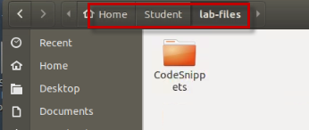
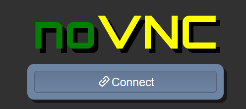

# Liberty: Getting Started

## Setup the Liberty environment

In the initial setup of Liberty, you will install Liberty using the
**Archive** method. Then, you will create your first Liberty server,
start it, and deploy a simple Java EE application to the server to test
the Liberty server runtime.

You will use am Ubuntu Linux VM that has been prepared for the Liberty
labs and includes the following:

  - The **Liberty** package has been downloaded to
    **/home/ibmdemo/Downloads** directory

  - The **IBM JDK** has been downloaded to **/home/ibmdemo/Downloads**
    directory

  - The required Operating System libraries have been installed.

<table>
<tbody>
<tr class="odd">
<td></td>
<td>
<strong>Information:</strong>

The Liberty image contains WebSphere Developer Tools for Eclipse.

The VMWare image contains the “wdt” folder that contains the WebSphere Developer Tools that is used for the lab.
</td>
</tr>
</tbody>
</table>

**TIP:** To reduce typing or copy & past of commands, you can find the
related code snippets or commands in the VMWare image in the directory:

    /home/ibmdemo/Student/lab-files/CodeSnippets/Bootcamp_Lab1_setup_CodeSnippets.txt

   

## Accessing the lab environment

If you are doing this lab as part of an instructor led workshop (virtual or face to face), an environment has already been provisioned for you. The instructor will provide the details for accessing the lab environment.

Otherwise, you will need to reserve an environment for the lab. You can obtain one here. Follow the on-screen instructions for the “**Reserve now**” option.

<https://techzone.ibm.com/my/reservations/create/63877af037f8a600183c737b>

 The lab environment contains one (1) Linux VM, named **Workstation**.

  
    
  The Ubuntu Linux **Workstation** VM has the following software installed for the lab:
  
  - Application Project with Liberty
  - Maven 3.6.0 

   
  
1.  Access the lab environment from your web browser. 
    
     A `Published Service` is configured to provide access to the **Workstation** VM through the noVNC interface for the lab environment.
    
    a. When the demo environment is provisioned, click on the **environment tile** to open its details view. 

    b. Click on the **Published Service** link which will display a **Directory listing**  
    
    c. Click on the **"vnc.html"** link to open the lab environment through the **noVNC** interface. 
    
    
    
    d. Click the **Connect** button 
    
      

    e. Enter the password as:  **passw0rd**. Then click the **Send Credentials** button to access the lab environment. 

    > Note: That is a numeric zero in passw0rd  

      

2. Login with **ibmdemo** ID.
    
    a.  Click on the “**ibmdemo**” icon on the Ubuntu screen.

      

    b. When prompted for the password for “**ibmdemo**” user, enter
    “**passw0rd**” as the password:

    Password: **passw0rd** (lowercase with a zero instead of the o)
 
      

     
	
3.  Once you access the **Student VM** through the published service, you will see the Desktop, which contains all the programs that you will be using (browsers, terminal, etc.)

   

## Tips for working in the lab environment     

1. You can resize the viewable area using the **noVNC Settings** options to resize the virtual desktop to fit your screen.

    a. From the environemnt VM, click on the **twisty** on the noNC control pane to open the menu.  

    

    b. To increase the visible area, click on `Settings > Scaling Mode` and set the value to `Remote Resizing`
      
     

2.  You can copy / paste text from the lab guide into the lab environment using the clipboard in the noVNC viewer. 
   
    a. Copy the text from the lab guide that you want to paste into the lab environment
    
    b. Click the **Clipboard** icon and **paste** the text into the noVNC clipboard

    
    
    c. Paste the text into the VM, such as to a terminal window, browser window, etc. 

    d. Click on the **clipboard** icon again to close the clipboard

    > **NOTE:** Sometimes pasting into a Terminal window in the VM does not work consistently. 
    
    > In this case you might try again, or open another Terminal Window and try again, or  paste the text into a **Text Editor** in the VM, and then paste it into the Terminal window in the VM. 

3. An alternative to using the noVNC Copy / Paste option, you may consider opening the lab guide in a web browser inside of the VM. Using this method, you can easily copy / paste text from the lab guide without having to use the noVNC clipboard. 

     

<table>
<tbody>
<tr class="odd">
<td></td>
<td>
<strong>Important:</strong>

<strong>Click CANCEL</strong>…. If, at any time during the lab, you get a pop-up asking to install updated software onto the Ubuntu VM.

The one we experience is an update available for VS Code.

<strong>CLICK CANCEL!</strong>

</td>
</tr>
</tbody>
</table>

## Extract the extended Liberty vPoT image

Locate the script on the desktop and double-click on it to **run in
terminal**

 

Wait until the image has been extracted. Once completed, press **Enter**
to continue:

The Liberty vPOT contents are extracted to
**/home/ibmdemo/Student/WLP_21.0.0.3**, and is referred as
{**LAB_HOME**} throughout the labs.

<table>
<tbody>
<tr class="odd">
<td></td>
<td>
<strong>Information:</strong>

If you need to reset the image at some point of time, make sure that all programs are stopped and run the script again.

This will clean-up the directory <strong>/home/ibmdemo/Student/WLP_*</strong> and extract the image again.
</td>
</tr>
</tbody>
</table>

## Install WebSphere Liberty

For your convenience, Liberty has already been installed into the
directory **/home/ibmdemo/Student/WLP_21.0.0.3/wlp**.

However, in this section, you will install a new instance of Liberty to
learn how easy and fast it is to install Liberty, using the **archive installation** method.

Liberty can be installed via IBM Installation Manager, but the more
convenient way is to use an Archive Install.

The related packages can be downloaded from Passport Advantage, but the
most recent versions are only available on the IBM Support pages. There
are separate packages available for the Liberty edition and for the IBM
Java SDK. Liberty for Developers downloads and documentation is located
here:

<https://www.ibm.com/support/pages/node/6250961#asset/>

In this section we will use these two packages, which are **Java JDK
v8** and **Liberty ND** edition.

  - IBM Java SDK for WebSphere: ibm-java-sdk-8.0-6.26-linux-x86\_64.tgz

  - IBM WebSphere Liberty ND Archive Install: wlp-nd-all-21.0.0.3.jar

To install Liberty using the Archive method, perform the following
steps:

1.  Open a Terminal window by clicking on the appropriate icon:

    

2.  Navigate to the “Student” directory:

        cd /home/ibmdemo/Student

3.  Create a temporary directory and navigate to that directory

        mkdir temp

        cd temp

4.  Extract the IBM Java SDK to the ~/Student/temp/directory. This will
    extract the JDK to the directory **ibm-java-x86_64-80**

        tar -zxvf '/home/ibmdemo/Downloads/ibm-java-sdk-8.0-6.26-linux-x86_64.tgz'

5.  Extract the WebSphere Liberty ND package to the **~/Student/temp** directory.

     The Liberty Archive is a Java “jar” file. To extract the archive, use
 the java -jar command.

        ibm-java-x86_64-80/bin/java -jar '/home/ibmdemo/Downloads/wlp-nd-all-21.0.0.3.jar' --acceptLicense . 

    - The **--acceptLicense** option is included to automatically accept
    the license, without having additional prompts.

    - The **dot** at the end of the command means to extract the archive
    to the current directory.

    - The Liberty archive is extracted, and Liberty is now installed in
    the **wlp** subdirectory.

 

6.  List the two directories that were created via the extraction of the
    Java JDK and Liberty ND

        ls

    

    - Liberty is now installed the **wlp** directory.

    - IBK JDK is now installed in the **ibm-java-x86_64-80** directory

7.  Set the **JAVA_HOME** path to tell Liberty to use the Java SDK that
    you just extracted

        export JAVA_HOME=~/Student/temp/ibm-java-x86_64-80/jre/ 

8.  Display the product information for Liberty
    
    a.  Display the Liberty product edition and version

        wlp/bin/productInfo version

    The output should indicate the Liberty Edition is **ND**, and the
 product version should match the Liberty Archive that is used in the
 lab.
 
    Liberty fixpacks are delivered on a four-week continues delivery
 interval.

    - The Version indicates the YEAR and MONTH of the Liberty fixpack
    installed.

    - 21.0.0.3 is the 3rd fixpack in 2021

    

    b. Display the list of installed features

        wlp/bin/productInfo featureInfo

    The output should look similar to the illustration below, which
 includes all of the Liberty ND features. The screen shot is only a
 partial list of installed features of Liberty ND.  
   
    

    c.  **You have just installed Liberty in the temp directory using the
    archive install method**.

    It’s that simple to install Liberty. Creating and working with a new
 Liberty server is equally simple. You will do that in the next
 sections of the lab.
 
    There are more than 200 features installed via the Liberty ND package.
  By default, you would start with a much more light-weight package. If
 you are interested to see which features belong to which Liberty
 Edition, please look here:
 
    <https://www.ibm.com/docs/en/was-liberty/nd?topic=management-liberty-features>

<table>
<tbody>
<tr class="odd">
<td></td>
<td>
<strong>Information:</strong>

As mentioned before, Liberty has already been installed into the directory <strong>/home/ibmdemo/Student/WLP_21.0.0.3*/wlp.</strong>

We will <strong>NOT</strong> use the Liberty installed in the <strong>temp</strong> <strong>directory</strong> in the next sections of the lab. You can ignore the temp directory.
</td>
</tr>
</tbody>
</table>

9. **Close** the Terminal window.

## INFORMATION ONLY – Open Liberty

How does Open Liberty fit into the Liberty family of editions?

Open Liberty is the lightweight open source server runtime that can be
ideal for building Java microservices and cloud-native apps.

Open Liberty provides a proven open source foundation for the WebSphere
Liberty portfolio. All of the editions of Liberty are built on top of
the same code base from Open Liberty.

  - Liberty Core offers supported Web Profile

  - Liberty Base offers supported Full Profile

  - Liberty ND offers supported Full Profile and clustering / workload
    management capabilities

All 3 commercial editions provide additional capabilities:

  - Programming model extensions

  - Production quality of service extensions

  - Security extensions

***And IBM’s full support***

### INFORMATION ONLY – Open Liberty Downloads, Docker, and Devops 

How do you get Open Liberty?

Open Liberty can be obtained via zip file downloads, or through Maven,
Gradle, and Docker.

Visit <https://openliberty.io/downloads/> to find the latest Open
Liberty releases and builds.

Open Liberty Zip File Download packages are available here:
<https://openliberty.io/downloads/#runtime_releases>

Below are examples of getting Open Liberty using Maven, Gradle, and
Docker.

## Create test server

1. Open a Terminal window by clicking on the appropriate icon:

    

2.  Navigate to the Liberty runtime installation directory
    {LAB_HOME}/wlp/bin

        cd /home/ibmdemo/Student/WLP_21.0.0.3/wlp

3. Run the following command to **create** a new server named “**myServer**”

        bin/server create myServer

    

    The server command supports actions for starting, stopping, creating,
packaging, and dumping a Liberty server.

    The server create command creates a new Liberty server with the name
specified.

    **Additional detail on the server command can be found here:**
    
    <https://www.ibm.com/docs/en/was-liberty/base?topic=line-server-command-options>

4. The new server is created in the following directory:

    /home/ibmdemo/Student/WLP_21.0.0.3/wlp/usr/servers/myServer

    

5. The **server.xml** file is the complete default server
    configuration. Open an editor to view the server configuration file.
    Ensure you are in the correct directory before opening the
    server.xml file.

        cd /home/ibmdemo/Student/WLP_21.0.0.3/wlp

        gedit usr/servers/myServer/server.xml

    
 
    The server.xml defines a minimal configuration needed to start a
 Liberty server.
 
    In this example, it includes only the JSP feature, and defines the
 HTTP and HTTPS endpoints that the server is listening for incoming
 HTTP(S) requests.

6. **Close** the gedit editor.

7. Start the server instance using the **server start** command:

        bin/server start myServer

    

    This runs the server in the background and the output is written to
files in the {LAB_HOME}/wlp/usr/servers/myServer/logs directory.

    > Alternatively, to start the server in the foreground (so the console
messages are seen in the command window) you can use the command
“**bin/server run myServer**”

8. View the Liberty server’s **messages.log** file to see the server
    startup messages

        cat usr/servers/myServer/logs/messages.log

    The server is started when the message “T**he myServer server is ready
to run a smarter planet”** is displayed in the messages.log file.

    

9. Stop the server with the **server stop** command:

        bin/server stop myServer

    

10. Having verified the Liberty installation, you can delete the test
    server “**myServer**” simply be removing its directory.
    
    Delete the server by deleting the
    {LAB_HOME}/wlp/usr/servers/myServer directory.

        rm -rf usr/servers/myServer

    You now have a Liberty runtime environment that is ready to create
 servers to run applications.

     

### Short recap of what you just did

In the previous step, you deleted a Liberty server configuration. You
 did NOT delete the Liberty installation and its binaries.
 
This is an important concept of Liberty. The Liberty Runtime binaries
 are separate from the Liberty Server configurations.

  - Liberty was installed in \~/Student/WLP_21.0.0.3**/wlp**

  - By default, the Liberty Server configurations are in
    ~/Student/WLP_21.0.0.3**/wlp/usr/**

The Server configuration directory can be located anywhere, including
 outside of the default location of /wlp/usr.
 
The Server configuration location can be over-ridden using the Liberty
 bult-in variable **“${wlp.user.dir}”.**
 
In fact, this concept is instrumental in Liberty providing zero
 migration for unchanged apps while keeping current with Liberty
 Fixpacks, as illustrated below.

- Just install a new Liberty Fixpack (Archive install)

- Update the WLP_USER_DIR variable to point to your existing server
    configurations location.

    

## Test the WebSphere Developer Tools (WDT)

You can manage Liberty from the command line and edit the server
configuration files using your favorite editor.

However, the WebSphere Developer Tools (WDT) provide a great
configuration editor, server controls and application publishing, as
well as many other time-saving utilities. In this section, you will
explore using WDT with Liberty.

Normally, you would first download and install Eclipse, followed by the
installation of WDT Eclipse plugin.

For this lab, we have bundled everything into a single zip file. The
directory {LAB_HOME}/wdt contains a prebuilt and expanded WDT.

<table>
<tbody>
<tr class="odd">
<td></td>
<td>
<strong>Information:</strong>

Upon first startup, it may take Eclipse up to a minute to start as it initializes.
</td>
</tr>
</tbody>
</table>

1. Launch Eclipse

    a. Use the **File Explorer** to navigate to the directory:

    > Home > Student > WLP_21.0.0.3 > wdt > eclipse

    b. Double-click on the **eclipse** executable to start Eclipse.

    

    c. When the Eclipse launcher prompts you to select a workspace, enter the
following directory. Then click the **Launch** button.

        /home/ibmdemo/Student/WLP_21.0.0.3/workspace

    

    d. Close the **welcome page** by clicking on the **‘X**’ icon.

    

## Create Liberty Server in WDT

Previously in the lab, you used the command line to create and start a
Liberty server.

Developers often work in an integrated development environments such as
Eclipse, VS Code, or Intelij, to name a few, to enhance their
productivity.

IBM WebSphere Developer Tools for Eclipse enhances developer
productivity by providing a lightweight set of tools that you can use to
develop, assemble, and deploy Java EE, OSGi and mobile applications to
WebSphere Application Server traditional and Liberty.

In this section, you will use the WebSphere Developer Tools with the
Eclipse IDE to work with Liberty.

First, create a Liberty server using the integrated tools.

1.  At the bottom of the Eclipse workbench, open the **Servers** view by
    clicking the **Servers** tab.

2.  Right-click within the windows of the **Servers view** and select
    **New > Server**  
      
    

3.  Under the **server type** list, expand **IBM** and select the
    **Liberty Server** type.  
      
    

4.  Use the default eclipse server name as supplied (**localhost**).
    
    a.  Click **Next**.

    This creates the liberty server object in eclipse, and the **Liberty
 Runtime Environment** page is displayed.

5.  Now eclipse needs to associate the ‘**localhost’** server with a
     server configuration in a Liberty runtime (the runtime that you
     installed previously in the lab).
    
    a.  In the **Path** field under the “**Choose an existing
        installation**” section, type or browse for the directory where
        you installed the Liberty runtime environment shown below:

        /home/ibmdemo/Student/WLP_21.0.0.3/wlp

    

    b.  Click **Next**. to continue

6.  To create the server configuration in the runtime, replace in the
    **Server name** field with **labServer**. Then click **Finish**.

    

7.  The new server will appear in the Servers view. You can expand the
    server to show a quick view of the configuration.

    

8.  Open the server configuration editor by double-clicking on **Server
    Configuration (server.xml):**

    

9.  The Server configuration view is displayed. The default view is
    “**Design**” mode, which provides an intuitive server
    configuration editor UI.
    
    a.  Click on the “**Design**” view tab if it is not already
        selected.

    

    b.  You can click on the Source” view tab to edit the server.xml source
    directly.

    

## Cleanup

1. **Close** the **server.xml** editor

2. **Exi**t Eclipse by selecting using the **File > Exit** from the
    Eclipse main menu.

3. Close any open **Terminal** windows

**=== END OF LAB ===**
