# Discover Liberty


In this lab, you will explore the Liberty server configuration, installing applications onto Liberty, updating the server
configurations, and updating an application.

As you explore Liberty, you will first use the WebSphere Developer Tools
for Eclipse. Then, you will explore Liberty using the command line.
Finally, you will be introduced to mode advanced configurations using
jvm.options, bootstrap.properties, Liberty built-in variables, and
logging and tracing.

|                                         |                                                                                                                                      |
| --------------------------------------- | ------------------------------------------------------------------------------------------------------------------------------------ |
|  | **TIP:** Liberty is pre-installed on the VM environment provided. **{LAB\_HOME}** refers to: **/home/ibmdemo/Student/WLP\_21.0.0.3** |

**TIP:** To reduce typing or copy & past of commands, you can find the
related code snippets or commands in the VMWare image in the directory:

**/home/ibmdemo/Student/lab-files/CodeSnippets/Bootcamp\_Lab2\_discover\_CodeSnippets.txt**


  <br/>

## Accessing the lab environment

If you are doing this lab as part of an instructor led workshop (virtual or face to face), an environment has already been provisioned for you. The instructor will provide the details for accessing the lab environment.

Otherwise, you will need to reserve an environment for the lab. You can obtain one here. Follow the on-screen instructions for the “**Reserve now**” option.

<https://techzone.ibm.com/my/reservations/create/60da2c20e2cb7a001f656575>

 The lab environment contains one (1) Linux VM, named **Workstation**.

  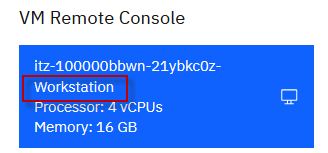
    
  The Ubuntu Linux **Workstation** VM has the following software installed for the lab:
  
  - Application Project with Liberty
  - Maven 3.6.0 


1.  Access the lab environment from your web browser. 
    
    A Published Service is configured to provide access to the **Workstation** VM through the noVNC interface for the lab environment.

    a.  When the environment is provisioned, right-mouse click on the **Published Service** link and open the URL in a new private or incognito browser window, as described below:  
    
    - If using **Google Chrome** browser, select **"Open link in incognito window"** from the context menu. 

      
    
    - If using **Firefox** browser, select **"Open link in new private window"** from the context menu. 

      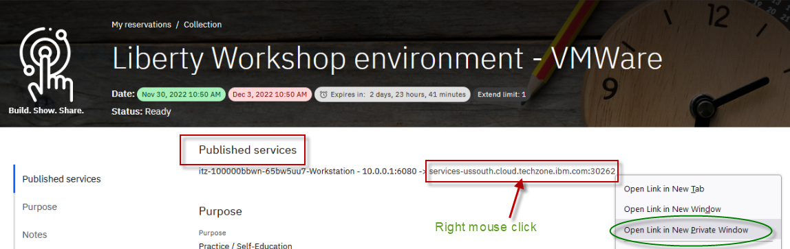

    b. Click on the **"vnc.html"** link to open the lab environment through the **noVNC** interface. 

      

 
    c. Click the **Connect** button 
    
      

    d. Enter the password as:  **passw0rd**. Then click the **Send Credentials** button to access the lab environment. 

    > Note: That is a numeric zero in passw0rd  

      

2. Login with **ibmdemo** ID.
    
    a.  Click on the “**ibmdemo**” icon on the Ubuntu screen.

      

    b. When prompted for the password for “**ibmdemo**” user, enter
    “**passw0rd**” as the password:

    Password: **passw0rd** (lowercase with a zero instead of the o)
 
      

    <br/>
	
3.  Once you access the **Student VM** through the published service, you will see the Desktop, which contains all the programs that you will be using (browsers, terminal, etc.)

  <br/>


## Tips for working the in lab environment     

1.  You can use your Browsers **zoom in** and **zoom out** options to resize the virtual desktop to fit your screen.

    The examples below are using Firefox and Chrome browsers. 

    - Firefox example: 
    
    

    - Chrome example: 
      
     


2.  You can copy / paste text from the lab guide into the lab environment using the clipboard in the noVNC viewer. 
   
    a. Copy the text from the lab guide that you want to paste into the lab environment
    
    b. Click the **Clipboard** icon and **paste** the text into the noVNC clipboard

    
    
    c. Paste the tect into the VM, such as to a terminal window, browser window, etc. 

    d. Click on the **clipboard** icon agian to close the clipboard

    > **NOTE:** Sometimes pasting into a Terminal window in the VM does not work consistently. In this case you might try again, or paste the text into a **Text Editor** in the VM, and then paste it into the Terminal window in the VM. 

3. An alternative to using the noVNC Copy / Paste option, you may considr openeing the lab guide in a web browser inside of the VM. Using this method, you can easily copy / paste text from the lab guide wihout having to use the noVNC clipboard. 


    <br>


<table>
<tbody>
<tr class="odd">
<td></td>
<td><p><strong>Important:</strong></p>
<p><strong>Click CANCEL</strong>…. If, at any time during the lab, you get a pop-up asking to install updated software onto the Ubuntu VM.</p>
<p>The one we experience is an update available for VS Code.</p>
<p><strong>CLICK CANCEL!</strong></p>
<p>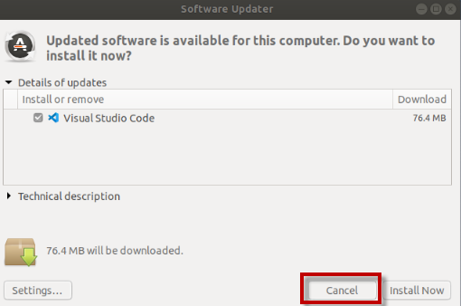</p></td>
</tr>
</tbody>
</table>

#  Explore Liberty via WDT

> **Note**: proceed directly to section 3 if you only want to use the
command line.

## Setup Liberty for the lab

1.  Copy the Liberty server configuration, used in this lab, to the
    Liberty usr/servers directory.
    
    a.  Open a new Terminal window
    
    b.  Run the script to setup the Liberty server configuration used in
        this lab.

        /home/ibmdemo/Student/labs/lab2/lab2-setup.sh

    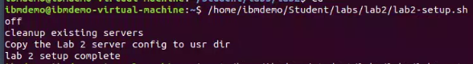

## Ensure eclipse is started and you are in the correct workspace 

1.  If Eclipse is not already started, start it now
    
    a.  Use the **File Explorer** to navigate to the directory
        
        Home > Student > WLP_21.0.0.3 > wdt > eclipse
    
    b.  Double-click on the **eclipse** executable to start Eclipse.
        
    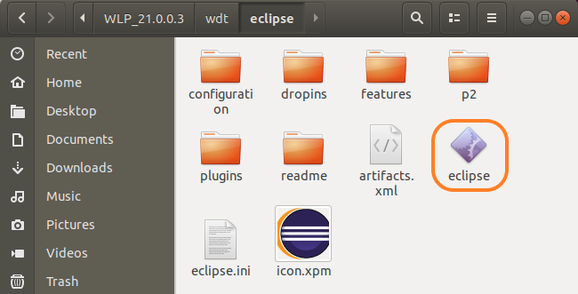
    
    c.  When the Eclipse launcher prompts you to select a workspace, enter the following directory. Then click the **Launch** button.

        /home/ibmdemo/Student/labs/lab2/workspace 

    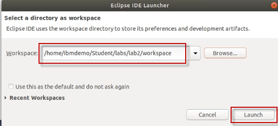

    <br/>

## Exploring the Liberty Server

1.  Start the server in eclipse.
    
    a.  From the **Servers** view, select your **labServer** instance and click the **Start the server** button (). 
    
    Alternatively, you can also right-click the server name and choose the **Start** option from the context menu.
    
    b.  Switch to the **Console** view if necessary. Look at the
        messages to see how fast your server starts!
        
    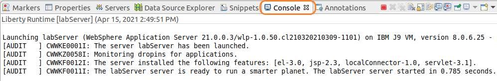
        
### Explore using the WDT to make changes to the lab server configuration

<!-- end list -->

1.  Open the Lab Server configuration using the WDT server configuration
    editor
    
    a.  In the **Servers** view, double-click on your **labServer** server to open the server **Overview**.
        
    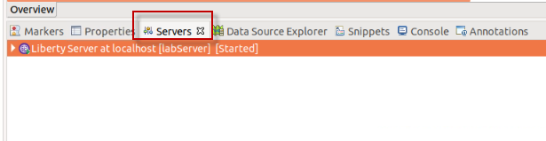
    
    b.  Expand the **Publishing** section and notice that the server
        is set to automatically detect and publish changes. Keep this
        default setting.
        
    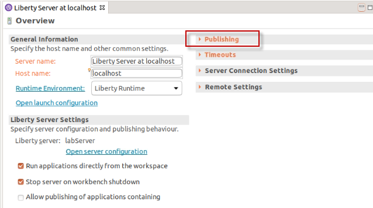
        
    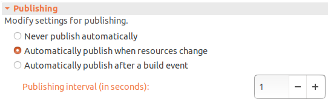

2.  In this exercise, you will be deploying a simple servlet
    application, so try enabling the servlet feature on this server.
    
    a.  On the **Overview** page, locate the **Liberty Server
         Settings** section
    
    b.  Click the **Open server configuration** link to open the
         **server.xml** editor.
        
    > **Note: To better see the content in Eclipse,** you may need to         resize the Eclipse views, or increase the size of the Eclipse         desktop app
        
    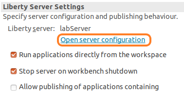
    
    c.  If the **Source** view of the **server.xml** file is
         displayed, switch to the **Design** view in the server
         configuration editor, by clicking on the **"Design”** tab in the
         editor pane
    
    d.  Start by providing a meaningful description for your server,
         such as “Liberty server for labs”.
        
    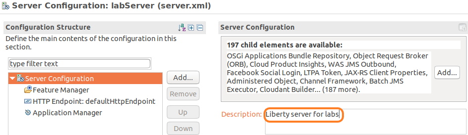
    
    e.  To add a feature, such as servlet-4.0, go back in the
        **Configuration Structure** area, and exand it, if necessary,
        and note the **Feature Manager configuration entry.**
        
    > In this lab, the Feature Manager has already been added to the
        configuration
    
    f.  Review the Feature Manager settings by clicking on the
        “**Feature Manager**” to view the list of features already
        configured.
        
    > Notice that the **jsp-2.3** and the **loalConnector-1.0**
        features have already been added to the server configuration.
    
    g.  Click the **Add** button to add a new feature “servlet-4.0”
        
    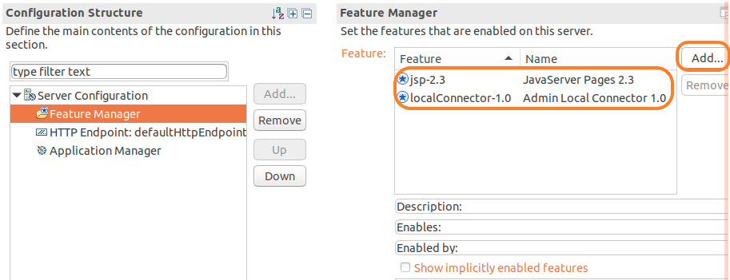
    
    h.  In the pop-up, type **servlet** to filter to servlet related
        features. Then select **servlet-4.0.** Click **OK**
        
    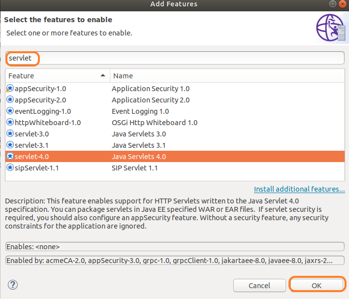
    
    i.  In the **server.xml** editor, switch to the **Source** tab at
        the bottom to see the XML source for this configuration file.
        You will see that a new **featureManager** element has been
        updated to contain the **servlet-4.0** feature.
        
    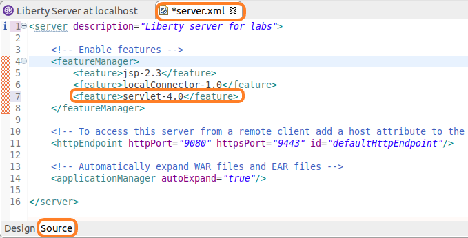
    
    j. Now you have a server that is configured to use the
        **servlet-4.0** feature.
    
    k. Click the **Save** button () to
        save your changes (or use CTRL+S)

<table>
<tbody>
<tr class="odd">
<td></td>
<td><p><strong>TIP:</strong></p>
<p>The Sample1 application is a Java Enterprise application that includes a simple <strong>Java Servlet class</strong>. For the Liberty Server to run the Sample1 application, the servlet feature must be configured in the server.xml file.</p></td>
</tr>
</tbody>
</table>

3.  Switch to the **Console** view, located at the bottom of the
     workbench and review the latest messages. These messages are
     showing that your Liberty server automatically detected the
     configuration update, processed the feature that you enabled, and
     is now listening for incoming requests.
    
    You will notice that the server configuration was automatically
    updated, and the feature update was completed very quickly. In this
    example, it was less than one second.
    
    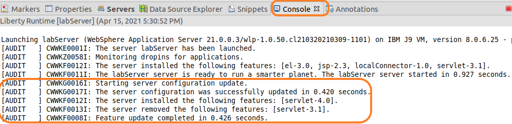

4.  **Close** the server.xml in the editor pane.

5.  **Close** the **Liberty Server Overview** page in Eclipse
    
    Now you are ready to start working with a sample application that
    uses the Servlet feature.

    <br/>

## Deploying a sample application to Liberty
    
### Import a sample application into Eclipse 

1.  A simple servlet WAR file has been provided for this exercise;
    import it into your workbench.
    
    a.  In Eclipse, go to **File > Import**. 
        
    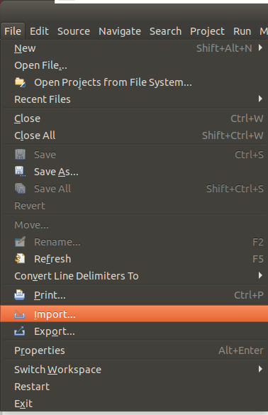 
    

    b. Expand the **Web** section, then select **WAR file**. Click **Next**.

    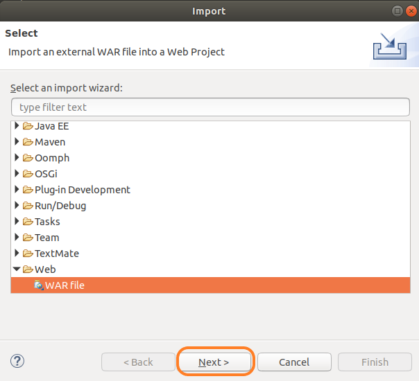

    c.  In the **WAR file** field, select **Browse**. Navigate to:

        /home/ibmdemo/Student/WLP_21.0.0.3/labs/gettingStarted/1_discover_20190416/Sample1.war

    d.  Click **Open**.

    e.  Ensure the **Target runtime** is set to **Liberty** **Runtime**

    f.  **Unselect “Add project to an EAR”**

    g.  Click **Finish**
    
    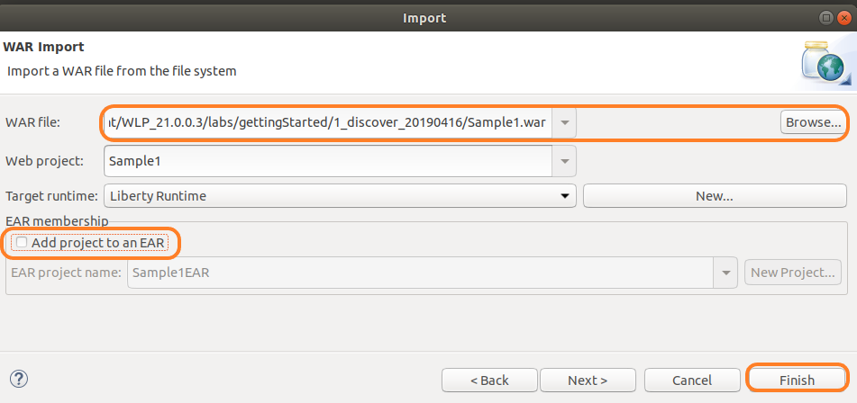

    h.  If prompted to open the web perspective, click **Open Perspective**.
    
    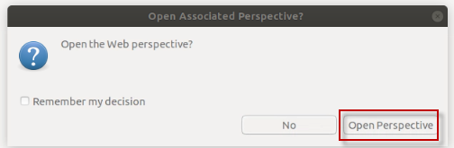


2. Now you have a **Sample1** web project in your workspace. Expand
   it in the **Enterprise Explorer** view to see the different
   components of the project.
    
    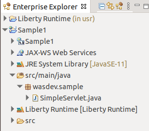

3.  **Start** the sample application.
    
    a.  In the **Enterprise Explorer** pane, navigate to the
         **SimpleServlet.java** as shown below.
        
        Sample1 > src/main/java > wasdev.sample > SimpleServlet.java
    
    b.  Right-click on **SimpleServlet.java**.
    
    c.  From the context menu, select **Run As \> Run on Server**.
        
    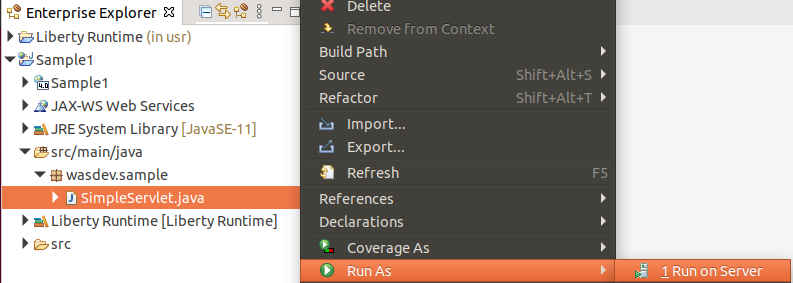
    
    d.  In the **Run On Server** dialog:

    - Verify that **Choose an existing server** is chosen.

    - Under **localhost**, select the **Liberty Server** that you defined
    earlier. The server should be listed in **Started** state.

    - Click **Finish**.
    
    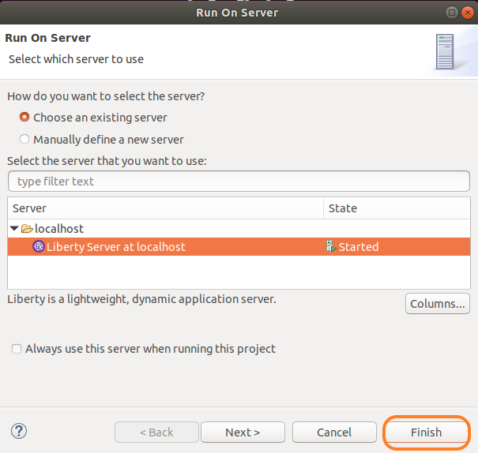
    
    e.  After a moment, your application will be installed and
         started. See the **Console** pane for the corresponding
         messages.
        
    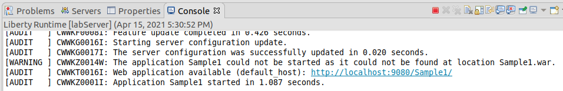


4.  In the main panel of the workbench, a browser opened, pointing to
    
    <http://localhost:9080/Sample1/SimpleServlet>.
    
    a.  If you receive a 404 the first time, try to refresh the
         browser once the application is completely deployed and
         started.
    
    b.  At this point, you should see the rendered HTML content
         generated by the simple servlet.
        
    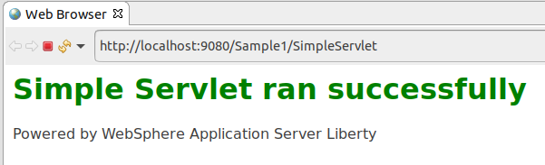

In this section of the lab, you explored how to use the WebSphere
Developer Tools (WDT) to start a Liberty Server, modify the server
configuration, import a simple Java EE WAR module, and deploy the
application to the server from with the development environment.

In the next section, you will explore using WDT to make changes to the
application code, and have it hot deployed to the Liberty server, in
your development environment, to illustrate a simple, yet robust
development experience for Java developers using WDT and Liberty.

  <br/>

### Modify the application to see how changes are automatically picked up in the running server.

1.  Open the servlet java source code.
    
    a.  In the **Enterprise Explorer** panel, expand the **Sample1**
         project, then go to:
        
        Sample1 > src/main/java > wasdev.sample
    
    b.  Double-click the **SimpleServlet**.java source file to open
         the Java editor for the servlet.
        
    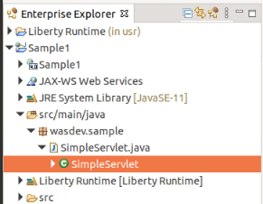
    
       
    c.  This is the **SimpleServlet.java** source code
        
    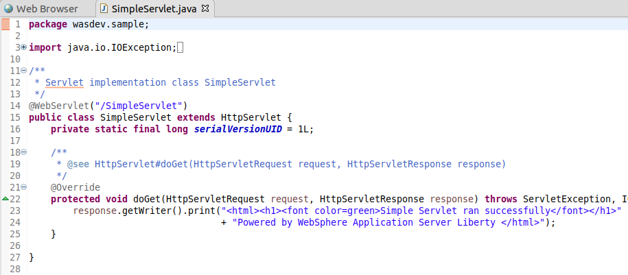


2.  Examine the doGet() method in the SimpleServlet.java code
    
    a.  This is a very simple servlet with a **doGet()** method that
         sends out an HTML snippet string as a response. Your
         **doGet()** method will look similar to this (some of the HTML
         tags might be a little different – that is ok).
        
    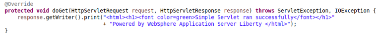

10. Modify the application and publish the change.
    
    a.  In the **doGet()** method, Locate the **\<h1\>** heading
         element of the HTML string, and notice that it contains a
         **font tag** to set the color to “**green**”.
    
    b.  Modify this string by changing the text green to **purple**,
         so your font tag will look read **\<font color=purple\>**.
        
    ```html
    	response.getWriter().print(
			"<html><h1><font color=purple>Simple Servlet ran successfully</font></html>"
			+ "<html>Powered by WebSphere Application Server Liberty</html>");
    ```


    c.  Save your changes to the Java source file by either clicking
         the **Save** button () or using
         **CTRL+S**.

4. Recall that your server configuration is setup to automatically
     detect and **publish** application changes immediately. By saving
     the changes to your Java source file, you automatically triggered
     an application update on the server.
    
    a.   To see this, go to the **Console** view at the bottom of the
         workbench. The application update started almost immediately
         after you saved the change to the application, and the update
         completed in seconds.
        
    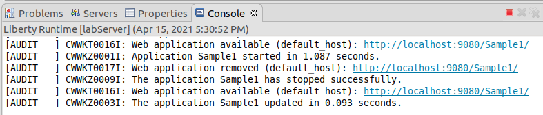

5. Access the updated application.
    
    a.  Refresh the **browser** in your workbench to see the
         application change. The title should now be rendered in purple
         text.
        
    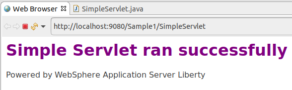

6. Optionally continue to play around with application modifications
     and see how quickly those changes are available in the deployed
     application. Maybe put in some additional text to display on the
     page, or add extra HTML tags to see formatting changes (you could
     add a title tag to set the text displayed in the browser title
     bar, for example, **\<head\>\<title\>Liberty
     Server\</title\>\</head\>**).
    
    The key is that this **<span class="underline">edit / publish /
    debug cycle is very simple and fast\!</span>**
    
    <br/>

### Modify the server HTTP(s) ports to see that Liberty Serer configuration changes are also automatially picked up in the running server
        
With Liberty, server configuration changes are monitored, and
dynamically updated in the running instance of the server. In
this section, you will make some updates to the Liberty
server.xml file and observe the dynamic server updates
capability in Liberty.


1.  Open the server configuration editor.
    
    a.  In the **Servers** view, double-click on the labServer
        **Server Configuration** server to open the configuration
         server.xml editor.
        
    
    
    b.  Ensure you are in the Design mode by selecting the **Design**
         tab on the Server Configuration editor.


2. Select the **Web Application: Sample1** item in the **Server
     Configuration** and look at its configuration details. From here,
     you can set basic application parameters, including the context
     root for the application, and to automatically start the
     application.
    
    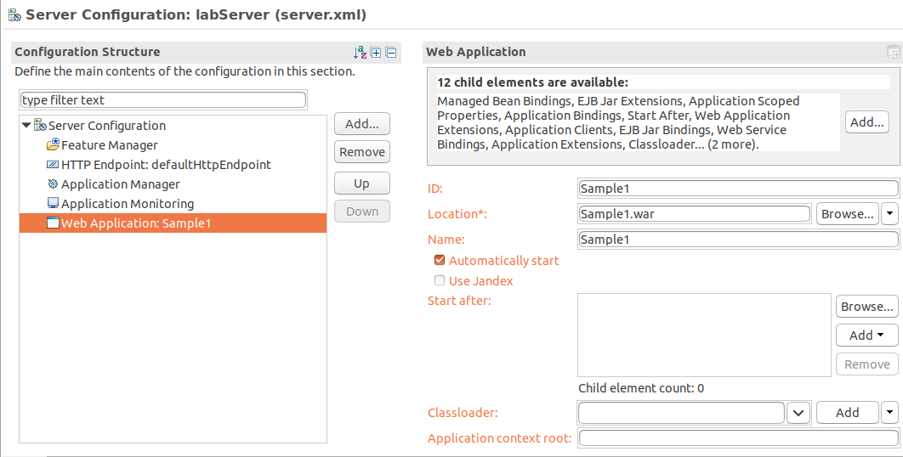

3. Select the **Application Monitoring** item in the **Server
     Configuration** and look at its configuration details. You can see
     that the monitor polls for changes every **500ms** using an
     **mbean** trigger.
    
    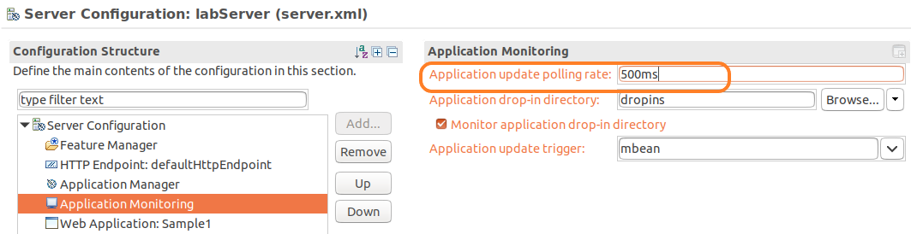

4. Select the **Feature Manager** item to see the features that are
     configured on your server. You added the **servlet-4.0** feature
     because you knew that you were going to be running a servlet
     application. But the development tools automatically added the
     **localConnector-1.0.** feature to your server to support
     notifications and application updates. 
     
     In fact, you would not have
     needed to add the servlet feature to your server at the beginning
     at all. The tools would have automatically enabled that feature,
     based on the content of the application.
    
    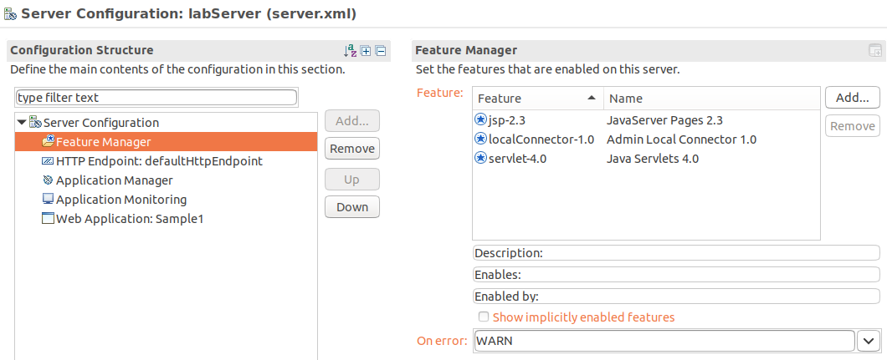

5. Change the HTTP port.
    
    Using the default HTTP port (9080) is an easy way to quickly bring
    up an application, but it is common to want to use a different port.
    This is an easy thing to change.
    
    a.  In the **Configuration Structure** area, select **Server
         Configuration**, then select **HTTP Endpoint**
        
    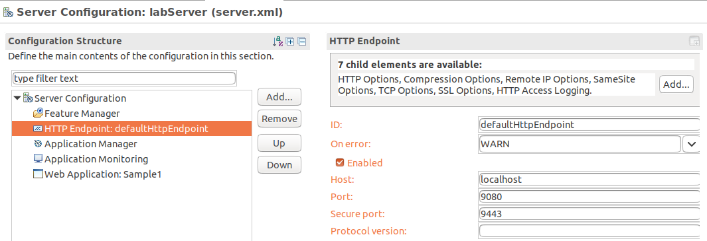
    
    b.  In the **HTTP Endpoint Details** area, Change the HTTP Port to
         **9085**.
        
    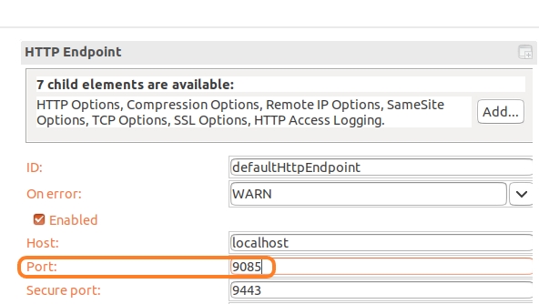
    
    c.  **Save** your changes to the server configuration (CTRL+S).

6. You can review your full server configuration in the
     **server.xml** source file. Back in the server configuration
     editor, switch to the **Source** tab at the bottom to view the
     full XML source for your server configuration.

    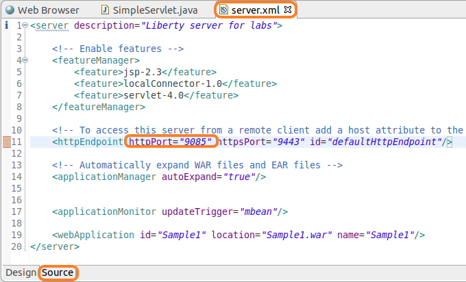

7. After you saved your configuration changes, the configuration of
    > your running server was automatically updated. The **Console**
    > pane will show that the Sample1 servlet is now available on port
    > 9085.
    
    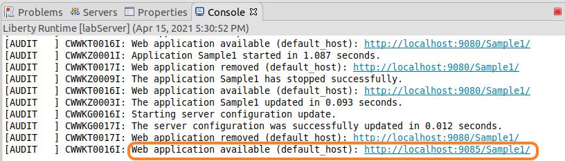

8. Now, you can access your sample application using the new port. In
     the browser in your workbench, change the port from **9080** to
     **9085** and refresh the application.
    
    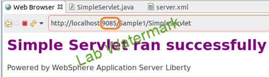
    
    <br/>

## Add INFO logging output to console
        
WebSphere Traditional and Liberty provide the ability to set the         logging level to any of the supported log levels defined in the         documentation: <https://www.ibm.com/docs/en/was-liberty/base?topic=liberty-logging-trace>
        
**AUDIT** logging enables logging of “Significant event affecting server state or resources”
        
**INFO** logging enables of “General information outlining overall task progress”
        
By default, the Liberty Server has the console log level set to AUDIT. 

In this section, you will change the level of log messages written to the console from AUDIT to INFO, which will result in additional logging messages.
        
You will perform this activity in the server.xml file using the UI. It is also possible to set default logging options in the bootstrap.properties file. 

If the logging options are set in the bootstrap.properties file, the logging options will take effect very early in server startup, so it may be useful for debugging server initialization problems.


1.  Open the server configuration editor.
    
    a.  In the **Servers** view, double-click on the labServer
         **Server Configuration** server to open the configuration
         server.xml editor.
        
    
    
    b.   Ensure you are in the Design mode by selecting the **Design**
         tab on the Server Configuration editor.

2.  Add the **Logging** configuration option to the server
    
    a.  Under the **Configuration Structure** section, Click on
         **Server Configuration.** And, then click the **Add button.**
        
    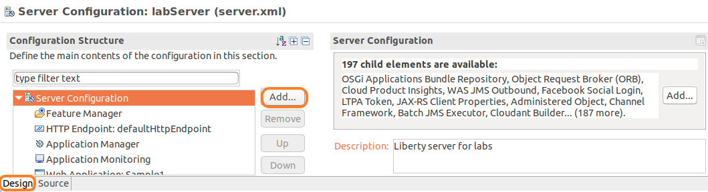
    
    b.  Type **logging** in the “Context: Server Configuration” field
         to narrow the list of configuration options displayed
        
    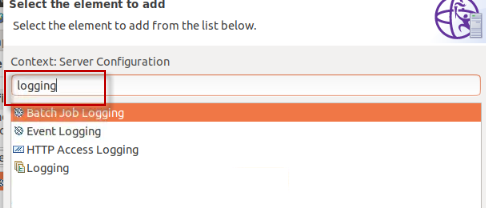

    c. On the **Add Element** dialog, select **Logging**, And, then click
     the **OK** button
    
    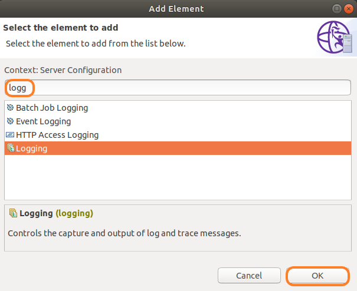

    d.  The logging page displays the properties for the logging
     configuration, such as the name of the log files, the maximum size
     of log files, and the maximum number of log files to retain.
    
    Additional configuration information is displayed regarding tracing.
    Notice that the **Console Log Level** is set to **AUDIT** by
    default.
    
    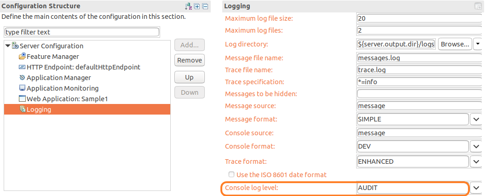


3.  Change the Console log level to **INFO** using the pull-down menu.
    
    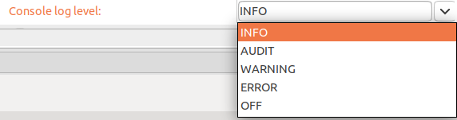

    a. Switch to the **Source** view for the server.xml file to see the
     configuration changes added to server.xml.
    
    ```html
    <logging consoleLogLevel="INFO"></logging>
    ```

    b.  **Save** the configuration file.
    
    The changes you made are dynamic and take effect immediately.
    
    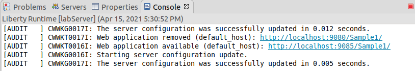
    
    <br/>
    
## Update trace specification
        
By default, the Liberty Server trace specification is set to **\*=info=enabled**. This is the same for Traditional WebSphere         Application Server (WAS).
        
Updating the trace specification for debugging is easily performed using the server configuration editor. You can specify the trace specification in the UI, or copy / paste the trace specification directly into the server.xml file. 

In this section, you will specify a trace specification using the configuration editor. And, then, you will look at the result in the server.xml source file


1.  Open the server configuration editor, if it is not already opened.
    
    a.  In the **Servers** view, double-click on the labServer
         **Server Configuration** server to open the configuration
         server.xml editor.
        
    
    
    b.  Ensure you are in the Design mode by selecting the **Design**
         tab on the Server Configuration editor.


2. Update the **Trace Specification** under the **logging**
    configuration.
    
    a.  Click on **Logging** under the Server Configuration section.
         This displays the logging and trace details.
    
    b.   Update the **Trace Specification** field with the following
         trace string:
    
        webcontainer=all=enabled:*=info=enabled
             
    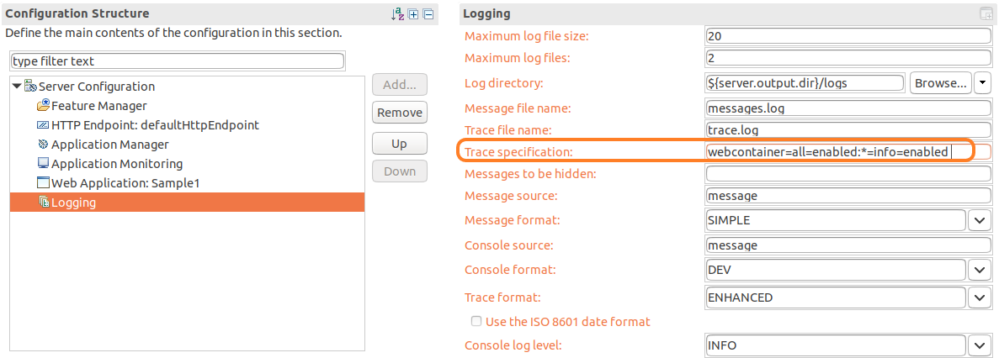
    
    c.  Switch to the **Source** tab on the configuration editor and
         view the logging configuration. :
        
        <logging consoleLogLevel="INFO" traceSpecification="webcontainer=all=enabled:*=info=enabled"></logging>       

    
    d.  **Save** the configuration changes.
    
    e.   Check the console view to veriify the trace specification was updated
        
    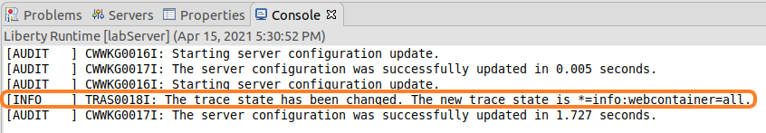

3. Verify that the **trace.log** file contains trace data.
    
    a. Navigate to the server logs directory.
        
        Home > Student > WLP_21.0.0.3 > wlp > usr > servers > labServer > logs
        
    The **trace.log** file has been created and contains content.
        
    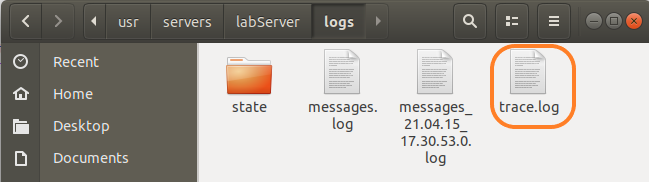
    
    b.  Double click on the **trace.log** file to view it in the text
         editor.

4. You can also view the trace file in Eclipse. In the **Enterprise
    Explorer** view, expand the **Liberty** **Runtime** project, and its
    subdirectories, and you will find the **trace.log** file on the logs
    directory.
    
    a.  Refresh the Liberty Runtime project so that the trace.log file
         will be visible in the view since it was created outside of
         the eclipse IDE. **Right mouse click** on the **Liberty
         Runtime** project, and select **Refresh** from the context menu
        
    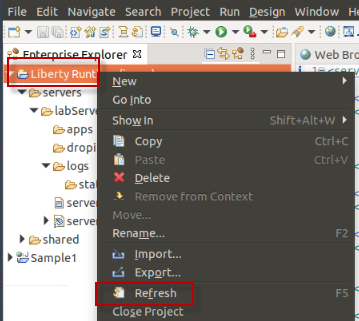
    
    b.  Navigate to **Liberty Runtime > servers > labServer > logs**
    
    c.  The trace.log file is viewable from inside of the IDE
        
    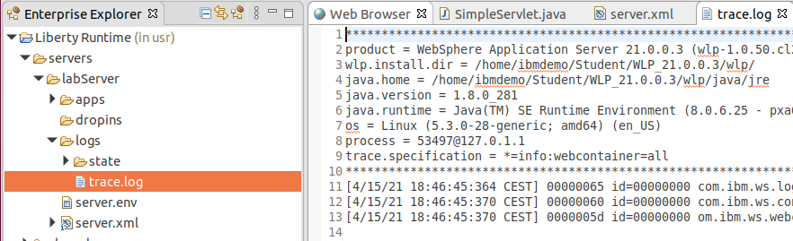

5. **Very importantly, reset the trace specification back to the
     default value.**
    
    a.  Switch to the **Source** tab on the configuration editor and
         update the logging configuration to: 

        <logging consoleLogLevel="AUDIT" traceSpecification="*=info=enabled "></logging>
        
    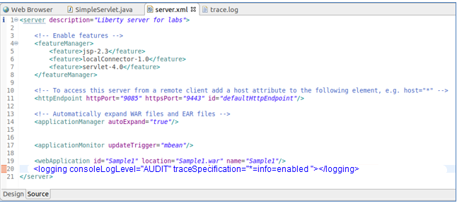
    
    b.  **Save** the configuration.

    <br/>    
      
## Customizing Liberty JVM Options

The generic JVM arguments are used to configure and adjust how the JVM
executes.

In this section of the lab, you will explore the JVM Options file. A
common JVM option configuration is to set the minimum and maximum size
of the JVM heap, based on the application runtime requirements.

The WebSphere Application Server Liberty is pre-configured with minimal
settings defined. The following steps will direct you how to define
custom generic JVM arguments such as heap settings for a Liberty server.

1.  First, create the jvm.options file, using the WebSPhere Developer
    tools
    
    a.  In the Eclipse **Servers** view, right-click on the Liberty
         Server.
    
    b.  Select from the context menu

        New > Server Environment File > jvm.options > in
         ${server.config.dir}
        
    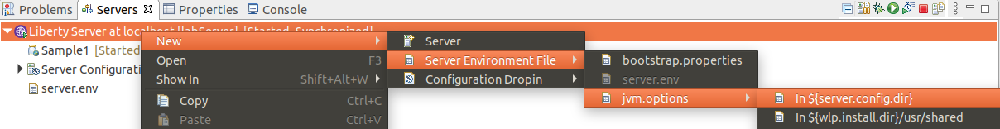  
    
    This will create a **jvm.options** file in the server’s        configuration directory with the most commonly-used options         available in comments:  
          
    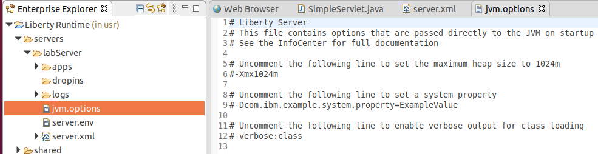


2. If necessary, double click to open the file in the eclipse text editor

3. Enter the following two lines in the **jvm.options** file to set the
    minimum and maximum heap size for the labServer server. 
    
    The following options will set the min / max JVM heap size to 25 MB and
    500 MB respectively.

        -Xms25m
        -Xmx500m

4. **Save** the file. Ctrl + S

5. **Restart** the server to enable changes
    
    

6. **STOP** the server
    
    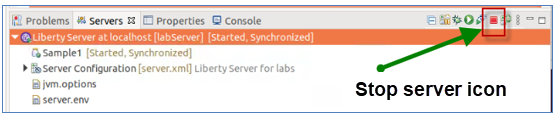

7. **Exit** Eclipse
    
    This concludes the customization portion of the lab. In the next
    sections, you will be introduced to the Liberty configuration using
    the command line.


    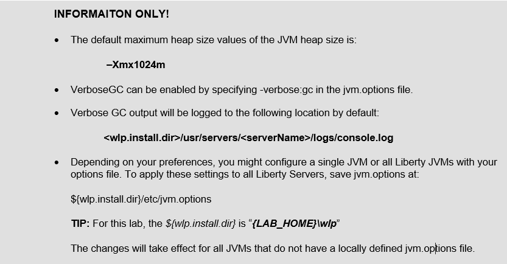


# Explore Liberty via command line

In the previous section of the lab, you used the WebSphere Developer
Tools in the Eclipse IDE to deploy an application and work with the
Liberty configuration.

Creating servers, starting, and stopping servers, deploying
applications, and overriding the server configuration can also be
accomplished from the command line. In this section of the lab, you will
experience how to work with Liberty from command line.

## Create, start, and configure a new Liberty server

1.  Navigate to the Liberty directory
    
    a.   Open a Terminal window and change to the Liberty installation
         directory

        cd /home/ibmdemo/Student/WLP\_21.0.0.3/wlp

2.  Create a new Liberty server named “myServer”. The “bin” directory
     contains the Liberty commands.
    
    a.  Use the **server** command with the “create” option to create
         a new server named “myServer”. The server is created in a
        matter of seconds.

        bin/server create myServer

3.  Start the Liberty server, using the “start” option on the
     **server** command. The server is started in a matter of seconds.

        bin/server start myServer

4. Modify the server configuration to add the **servlet-3.1** feature
     that will be by the sample application you will deploy in a
     subsequent step.
    
    a. Open an editor to edit the **server.xml** file for the server
       named “myServer”.

        gedit /home/ibmdemo/Student/WLP_21.0.0.3/wlp/usr/servers/myServer/server.xml

    b  Under the feature manager, replace existing featured with
     servlet-3.1 feature:
    
    ```xml
    <featureManager>
       <feature>servlet-3.1</feature>
    </featureManager>
    ```
   
    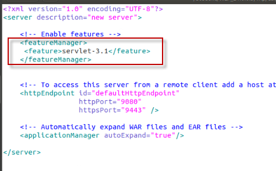

    c.  **Save** the changes

    d.  **Close** the editor


5. Look at the tail of
    {LAB_HOME}/wlp/usr/servers/myServer/logs/messages.log
    
    You should see messages about feature updates. The messages.log file
    is the main log file for Liberty, and by default, is located in the
    **logs** directory under the server configuration

        tail /home/ibmdemo/Student/WLP_21.0.0.3/wlp/usr/servers/myServer/logs/messages.log

    **For example:**

    ```
    [4/16/19 14:29:29:276 CDT] 00000037
    com.ibm.ws.kernel.feature.internal.FeatureManager CWWKF0007I: Feature
    update started.

    [4/16/19 14:29:29:400 CDT] 00000035
    com.ibm.ws.config.xml.internal.ConfigRefresher CWWKG0017I: The server
    configuration was successfully updated in 0.240 seconds.
    ```

    Now you are ready to start working with a sample application that uses
the Servlet feature.

    <br/>


## Deploying a sample application to Liberty

In the first part of this lab, you used the WebSphere Developer Tools in
the Eclipse IDE to deploy an application and work with the Liberty
configuration.

In this section of the lab, you will deploy an application to Liberty
using two different techniques.

First, you will simply copy the application WAR module into the Liberty
“**dropins**” directory. The dropins directory is monitored by
Liberty. As deployable units (WAR, EAR, JAR) are added to the directory,
Liberty automatically deploys and starts the application on the Liberty
server.

As the deployable units are removed from the dropins folder, the
applications are stopped and removed from the running Liberty server.

Now, give it a try.

### Deploy an application to dropins directory

### 

<table>
<tbody>
<tr class="odd">
<td></td>
<td><p><strong>Information:</strong></p>
<p>The <strong>dropins</strong> directory can be used for applications that do not require extra configuration, such as security role mapping</p></td>
</tr>
</tbody>
</table>

1.  First, use the “**tail -f”** “command to view the Liberty server’s
     **messages.log** file to see the messages that are generated once
     the application war file is copied to the “dropins” folder for
     your server.
    
    a.  Open a new Terminal window
    
    b.  Use the **tail -f** command to view the messages.log file.

        tail -f /home/ibmdemo/Student/WLP_21.0.0.3/wlp/usr/servers/myServer/logs/messages.log

2.  The easiest way to deploy an application to Liberty is to copy it to
    the server’s **dropins** directory.
    
    The **Sample1.war** is provided for you in the lab. It is the same
    application that was deployed using the Eclipse IDE in the first
    part of the lab.
    
    a.  Return to the Terminal Window that is at the directory:
         ~/Student/WLP_21.0.0.3/wlp
    
    b.  Copy the provided **Sample1.war** application to the dropins
         folder of your “myServer” server.

        cp /home/ibmdemo/Student/WLP_21.0.0.3/labs/gettingStarted/1_discover_*/Sample1.war /home/ibmdemo/Student/WLP_21.0.0.3/wlp/usr/servers/myServer/dropins

3. Check the server’s **messages.log** to ensure that application
     deployment has taken place. You will see messages showing the
     Sample1 application being started.
    
    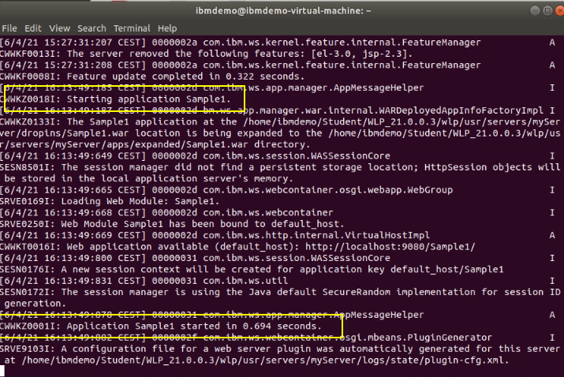

4. Check the application is running by opening a browser at:
    
    <http://localhost:9080/Sample1/SimpleServlet>
    
    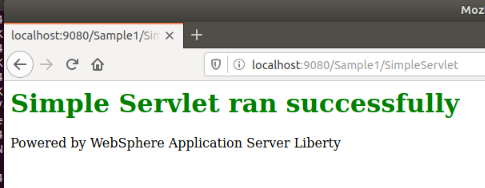

5. Delete the Sample1.war file from the **dropins** directory, then
    check that it’s no longer accessible from the browser.

        rm /home/ibmdemo/Student/WLP_21.0.0.3/wlp/usr/servers/myServer/dropins/Sample1.war

    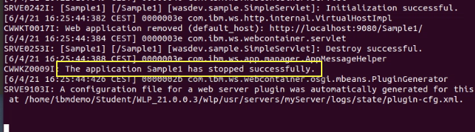

    <http://localhost:9080/Sample1/SimpleServlet>

    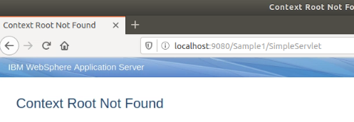

    <br/>

### Deploy the application by adding it to the server.xml file

While the **dropins** directory can be used for applications that do not
require extra configuration, deploying the application by adding it to
the server.xml file provides the freedom to configure the Liberty server
based on the application configuration requirements.

In this section, you will deploy the Sample1 application by adding it to
the server.xml fie.

In this case, you must put the application in one of the following
locations:

  - ${server.config.dir}/apps (that is,
    *server\_directory*/user/servers/*server\_name*/apps)

  - ${shared.app.dir} (that is,
    *liberty\_install\_location*/usr/shared/apps)

    <br/>

1.  Copy the Sample1.war file to the ${server.config.dir}/apps
     directory.

        cp /home/ibmdemo/Student/WLP_21.0.0.3/labs/gettingStarted/1_discover_*/Sample1.war /home/ibmdemo/Student/WLP_21.0.0.3/wlp/usr/servers/myServer/apps

2.  Add the Sample1.war application configuration to the server.xml
     file.
    
    a. Use **gedit** to edit the **server.xml** and add the Sample1.war
         to the configuration, which points to the “apps” directory, by
        default.

        gedit /home/ibmdemo/Student/WLP_21.0.0.3/wlp/usr/servers/myServer/server.xml

    b.  Add the following line to the server,xml file, as illustrated
     below:

    ```html
    <webApplication id="Sample1" location="Sample1.war" name="Sample1" />
    ```

    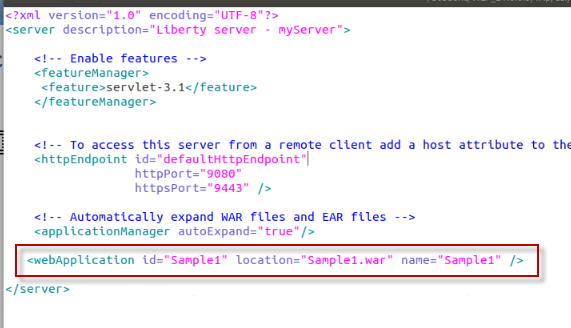

    c.  **Save and CLOSE the server.xml file**


3.  Check the server’s **messages.log** that the application is
     started.
    
    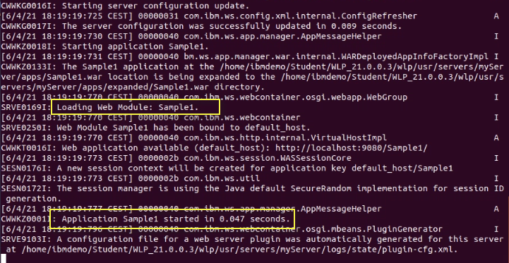

4.  Check the application is running by opening a browser at:

     <http://localhost:9080/Sample1/SimpleServlet>
    
    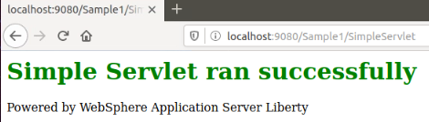
    
    <br/>

## Add INFO logging output to console
        
By default, the Liberty Server has the console log level set to         AUDIT. 

In this section, you will change the level of log messages written to the console from AUDIT to INFO.
        
You will perform this activity by modifying **server.xml** file         using an editor. It is also possible to set default logging options in the bootstrap.properties file. If the logging options are set in the bootstrap.properties file, the logging options will take effect very early in server startup, so it may be useful for debugging server initialization problems.


1.  Edit **server.xml** and add the logging configuration:
    
    a.  Open the server.xml with the editor

        gedit /home/ibmdemo/Student/WLP_21.0.0.3/wlp/usr/servers/myServer/server.xml

    b  Add the following line to the server.xml file to update the
     logging level from AUDIT to INFO.
    
    ```html
    <logging consoleLogLevel="INFO"/>
    ```
        
    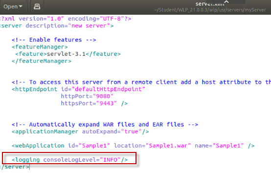


    c.  **Save** the changes, and check messages.log that the
     configuration change was updated.

    d.  From the terminal window where “**tail -f**” command is running,
     verify the server configuration was updated.
    
    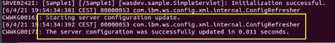

    <br/>

## Update trace specification
    
By default, the Liberty Server trace specification is set to
*=info=enabled. This is the same for Traditional WebSphere Application Server.
    
Updating the trace specification for debugging is easily performed by updating server.xml.

1.  Update the logging stanza to include a trace specification for
    tracing the webcontainer.
    
    a. Use gedit to edit **server.xml** and **update** the logging
       stanza to:

    ```html
    <logging consoleLogLevel="INFO" traceSpecification="webcontainer=all=enabled:*=info=enabled" />
    ```

    b.  **Save** the server.xml file:
    
    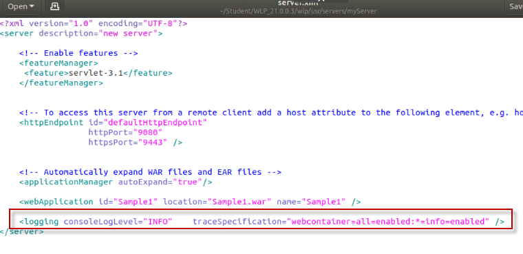

    c.  Verify the messages.lof file logged the updtaed trace specfication
    
    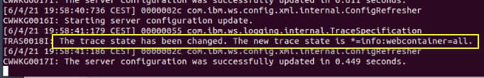


2. Use **CTRL-C** to **Stop** the “**tail -f**” command that is
     running in the terminal window.

3. Verify that the trace file contains trace data. The trace file is
    located at:

        cat /home/ibmdemo/Student/WLP_21.0.0.3/wlp/usr/servers/myServer/logs/trace.log

4. **Very important: avoid excessive tracing by reverting the trace
    specification back to :**

    ```html
    <logging consoleLogLevel="INFO"/>
    ```

    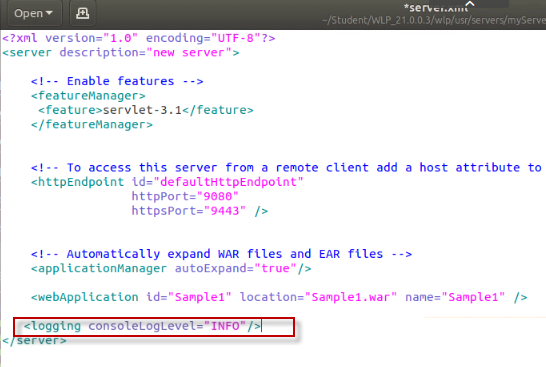

5. **Save** the changes to the server.xml file.

6. **Close the editor**
    
    <br/>

## Customizing Liberty JVM Options

The generic JVM arguments are used to configure and adjust how the JVM
executes.

The WebSphere Application Server Liberty is pre-configured with minimal
settings defined. The following steps will direct you how to define
custom generic JVM arguments such as heap settings for a Liberty server.

1.  Create a **jvm.options** file that affects all servers
    
    a.  Change directory to {LAB_HOME}/wlp/usr/servers/myServer

        cd /home/ibmdemo/Student/WLP_21.0.0.3/wlp/usr/servers/myServer

    b.  Create a new file named **jvm.options** in the “myServer”
    directory

        gedit jvm.options

    c.  Add the following lines to set the minimum and maximum heap size.
     
     The following options will set the min / max JVM heap size to 25
    MB and 500 MB respectively.

        -Xms25m
        -Xmx500m
 
    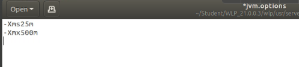

2. **Save** and **close** the jvm.options file

3. **Restart** the server for the changes to take affect

        cd /home/ibmdemo/Student/WLP_21.0.0.3/wlp

        bin/server stop myServer
        
        bin/server start myServer

    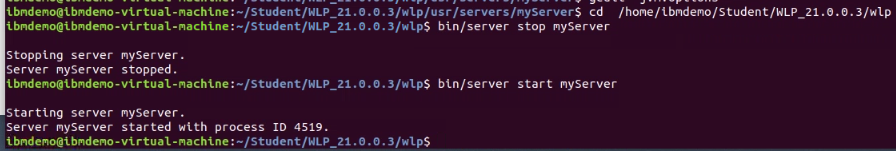

4. **Stop** the server

        cd /home/ibmdemo/Student/WLP_21.0.0.3/wlp

        bin/server stop myServer

This concludes the customization portion of the lab using command line.
In the next sections, you will be introduced to the Liberty
configuration files for customizing the server initialization and
environment settings.

  <br/>

# Introducing Liberty Environment Variable Configuration

You can customize the Liberty environment using certain specific
variables to support the placement of product binaries and shared
resources.

The Liberty environment variables are specified using **server.env**
file.

You can use **server.env** file at the installation and server levels to
specify environment variables such as JAVA_HOME, WLP_USER_DIR and
WLP_OUTPUT_DIR.

<table>
<tbody>
<tr class="odd">
<td></td>
<td><p><strong>Important:</strong></p>
<p><strong>NOTE:</strong> You will <strong>NOT</strong> modify the default environment configuration in this lab.</p>
<p>Review the information in this section to become familiar with the environment variables that are available for customizing the Liberty environment.</p></td>
</tr>
</tbody>
</table>

The following Liberty specific variables can be used to customize the
Liberty environment:

  - **${wlp.install.dir}**

    This configuration variable has an inferred location. The installation
 directory is always set to the parent of the directory containing the
 launch script or the parent of the /lib directory containing the
 target jar files.
 
    > **TIP:** For this lab, the *${wlp.install.dir}* is
    > ““**{LAB\_HOME}/wlp**”

  - **WLP_USER_DIR**

    This environment variable can be used to specify an alternate location
 for the ${wlp.install.dir}/usr. This variable can only be an absolute
 path. If this is specified, the runtime environment looks for shared
 resources and server definition in the specified directory.
 
     The ${server.config.dir} is equivalent to
 ${wlp.user.dir}/servers/serverName and can be set to a different
 location when running a server (to use configuration files from a> location outside wlp.user.dir).
  
    > **TIP:** For this lab, the ${server.config.dir} is depending on the
    > used server either “**{LAB\_HOME}/wlp*/usr/servers/labServer***” or
    > “**{LAB\_HOME}/wlp*/usr/servers/myServer***”.

  - **WLP_OUTPUT_DIR**

    This environment variable can be used to specify an alternate location
 for server generated output such as logs, the workarea directory and
 generated files. This variable can only be an absolute path.
 
    If this environment variable is specified, ${server.output.dir} is set
 to the equivalent of WLP_OUTPUT_DIR/serverName. If not specified,
 the ${server.output.dir} is the same as ${server.config.dir} .
 
    > **TIP:** For this lab, the ${server.output.dir} is
    > **{LAB\_HOME}/wlp*/usr/servers/labServer***” or
    > “**{LAB\_HOME}/wlp*/usr/servers/myServer***”, which is the same as
    > ${server.config.dir}.

    <br/>


# Introducing Liberty bootstrap.properties

In this section of the lab, you will gain an understanding of how and
when bootstrap properties are required during environment
initialization.

<table>
<tbody>
<tr class="odd">
<td></td>
<td><p><strong>Important:</strong></p>
<p><strong>NOTE:</strong> You will <strong>NOT</strong> modify the default environment configuration in this lab.</p>
<p>This information is provided in the lab for your reference. .</p></td>
</tr>
</tbody>
</table>

Bootstrap properties are used to initialize the runtime environment for
a particular server. Generally, they are attributes that affect the
configuration and initialization of the runtime.

Bootstrap properties are set in a text file named
**bootstrap.properties**. This file should be located in the server
directory alongside the configuration root file server.xml.

By default, the server directory is **usr/servers/*server\_name***.

The **bootstrap.properties** file contains two types of properties:

  - A small, predefined set of initialization properties.

  - Any custom properties you choose to define which you can then use as
    variables in other configuration files (that is, server.xml and
    included files).

You can create the bootstrap.properties through any file creation
mechanism, or by using the same method shown above for creation of the
jvm.options file in eclipse. You can edit the bootstrap.properties file
using a text editor, or using the editor that is part of the Liberty
developer tools.

Changes to the bootstrap.properties file are applied when the server is
restarted.

**TIP:**

> As an example, the logging service can be controlled through the server
configuration (server.xml) file. Occasionally you need to set logging
properties so they can take effect before the server configuration files
are processed.

> In this case you set them in the bootstrap.properties file instead of
the server configuration.

> You do not usually need to do this to get logging from your own code,
which is loaded after server configuration processing, but you might
need to do this to analyze problems in early server start or
configuration processing.

**=== END OF LAB ===**
