# Operational Modernization

## Table of Contents

- [Operational Modernization](#operational-modernization)
  - [Table of Contents](#table-of-contents)
  - [Introduction](#introduction)
  - [Accessing the environment](#accessing-the-environment)
  - [Tips for working the in lab environment](#tips-for-working-the-in-lab-environment)
  - [Analysis (Hands-on)](#analysis-hands-on)
    - [Clone the GitHub repo for this workshop](#clone-the-github-repo-for-this-workshop)
    - [Let's get started using TA to analyze the existing Customer Order Services application:](#lets-get-started-using-ta-to-analyze-the-existing-customer-order-services-application)
  - [Build (Hands-on)](#build-hands-on)
    - [Build image (Hands-on)](#build-image-hands-on)
  - [Deploy without operator](#deploy-without-operator)
    - [Deploy application without operator (Hands-on)](#deploy-application-without-operator-hands-on)
  - [Access the application without operator (Hands-on)](#access-the-application-without-operator-hands-on)
    - [Review the application workload flow without operator (Hands-on)](#review-the-application-workload-flow-without-operator-hands-on)
    - [View the resources in the project that contains the DB2 database used by the application](#view-the-resources-in-the-project-that-contains-the-db2-database-used-by-the-application)
  - [Remove your deployment (standard deployment without operator) (Hands-on)](#remove-your-deployment-standard-deployment-without-operator-hands-on)
  - [Alternate Deployment Via Runtime Component Operator](#alternate-deployment-via-runtime-component-operator)
    - [Deploy application (via Runtime Component Operator) (Hands-on)](#deploy-application-via-runtime-component-operator-hands-on)
  - [Access the application (via Runtime Component Operator) (Hands-on)](#access-the-application-via-runtime-component-operator-hands-on)
    - [Review the application workload flow with Runtime Component Operator (Hands-on)](#review-the-application-workload-flow-with-runtime-component-operator-hands-on)
      - [Review the resources in the project openshift-operators](#review-the-resources-in-the-project-openshift-operators)
    - [View the resources in the project apps-was](#view-the-resources-in-the-project-apps-was)
  - [Cleanup (the deployment with Runtime Component Operator) (Hands-on)](#cleanup-the-deployment-with-runtime-component-operator-hands-on)
  - [Summary](#summary)

<a name="introduction"></a>
## Introduction

**Operational modernization** gives an operations team the opportunity to embrace modern operations best practices without putting change requirements on the development team. 
Modernizing from WebSphere Network Deployment (ND) to the **traditional WebSphere Application Server Base V9 runtime** in a container allows the application to be moved to the cloud without code changes.

The scaling, routing, clustering, high availability and continuous availability functionality that WebSphere ND was required for previously can be provided by the container runtime and allows the operations team to run cloud-native and older applications in the same environment with the same standardized logging, monitoring and security frameworks.

While traditional WebSphere isn’t a ‘built for the cloud’ runtime like WebSphere Liberty, it can still be run in a container and will receive the benefits of the consistency and reliability of containers as well as helping to improve DevOps and speed to market.

**This type of modernization shouldn't require any code changes** and can be driven by the operations team. **This path gets the application in to a container with the least amount of effort but doesn't modernize the application or the runtime.**

As organizations modernize to cloud platforms, new technologies and methodologies will be used for build, deployment and management of applications. While this modernization will be focused on cloud-native (built for the cloud) applications, using the traditional WebSphere container will allow common technologies and methodologies to be used regardless of the runtime.

The diagram below shows the high level decision flow where IBM Cloud Transformation Advisor is used to analyze existing assets and a decision is made to not make code changes to the application and use the traditional WebSphere container as the target runtime.


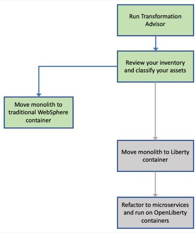


In this lab, we'll use **Customer Order Services** application as an example. In order to modernize, the application will go through **analysis**, **build** and **deploy** phases. 

Click [here](extras/application.md) and get to know the application, its architecture and components.

<a name="Login_VM"> </a>

## Accessing the environment

If you are doing this lab as part of an instructor led workshop (virtual or face to face), an environment has already been provisioned for you. The instructor will provide the details for accessing the lab environment.

Otherwise, you will need to reserve an environment for the lab. You can obtain one here. Follow the on-screen instructions for the “**Reserve now**” option.

<https://techzone.ibm.com/my/reservations/create/6387aa80eb61a800183d69d3>

The lab environment contains six (6) Linux VMs. 


 A Published Service is configured to provide access to the **Desktop** VM through the noVNC interface for the lab environment.

<br/>

1.  Access the lab environment from your web browser. 
     
    a.  When the demo environment is provisioned, right-mouse click on the **Published Service** link and open the URL in a new private or incognito browser window, as described below:  
    
    - If using **Google Chrome** browser, select **"Open link in incognito window"** from the context menu. 

      
    
    - If using **Firefox** browser, select **"Open link in new private window"** from the context menu. 

      

    b. Click on the **"vnc.html"** link to open the lab environment through the **noVNC** interface. 

      

 
    c. Click the **Connect** button 
    
      

    d. Enter the password as:  **passw0rd**. Then click the **Send Credentials** button to access the lab environment. 

    > Note: That is a numeric zero in passw0rd  

      

	 
	 <br>
	 
2.  Login to the desktop VM using the credetials below: 

    The login credentials for the **Desktop”** VM is:
 
     - User ID: **ibmuser**

     - Password: **engageibm**
	 
	 <br>
 
     
	 
	 <br>

## Tips for working in the lab environment     

1.  You can use your Browsers **zoom in** and **zoom out** options to resize the virtual desktop to fit your screen.

    The examples below are using Firefox and Chrome browsers. 

    - Firefox example: 
    
    

    - Chrome example: 
      
     


2.  You can copy / paste text from the lab guide into the lab environment using the clipboard in the noVNC viewer. 
   
    a. Copy the text from the lab guide that you want to paste into the lab environment
    
    b. Click the **Clipboard** icon and **paste** the text into the noVNC clipboard

    
    
    c. Paste the text into the VM, such as to a terminal window, browser window, etc. 

    d. Click on the **clipboard** icon again to close the clipboard

    > **NOTE:** Sometimes pasting into a Terminal window in the VM does not work consistently. In this case you might try again, or paste the text into a **Text Editor** in the VM, and then paste it into the Terminal window in the VM. 

3. An alternative to using the noVNC Copy / Paste option, you may consider opening the lab guide in a web browser inside of the VM. Using this method, you can easily copy / paste text from the lab guide without having to use the noVNC clipboard. 


    <br>

      
	

<a name="analysis"></a>

## Analysis (Hands-on)


### Clone the GitHub repo for this workshop 
	
1. If you have not yet cloned the GitHub repo with the lab artifacts, run the following command on your terminal:
    
        git clone https://github.com/IBMTechSales/openshift-workshop-was.git
	

### Let's get started using TA to analyze the existing Customer Order Services application:

**IBM Cloud Transformation Advisor (TA)** can be used to analyze the Customer Order Service Application running in the WebSphere ND environment. The Transformation Advisor helps you to analyze your on-premises workloads for modernization. It determines the complexity of your applications, estimates a development cost to perform the move to the cloud, and recommends the best target environment. 


1. Open a **Firefox** browser window from within the VM. 
    
	

	 <br/>

2. Click on the **openshift console** bookmark in the top left and log in with the **htpasswd** option.

    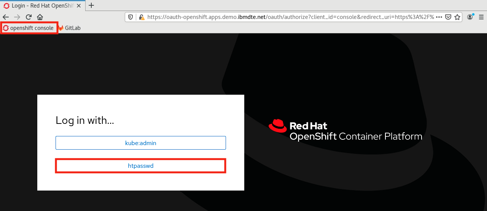

	 <br/>

3. Log in to the OpenShift account using the following credentials:
    - Username: **ibmadmin**
    - Password: **engageibm**

    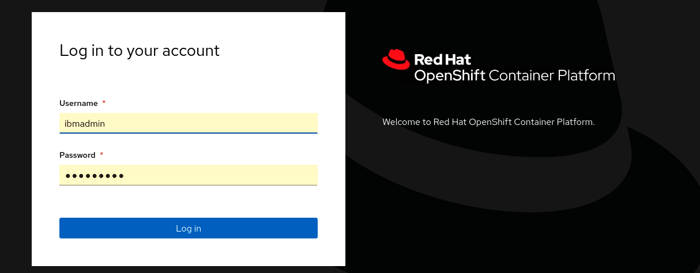

	 <br/>

4. From the Red Hat OpenShift Container Platform console, go to the **Networking** tab and click on **Routes**. 

     **Note:** Ensure that you are in the **ta** project by using the project drop down and click on the Location URL next to **ta-ui-route**.

    

	 <br/>

   **Note:** You may be prompted to re-authenticate using your OpenShift credentials. If so use **htpasswd** login with username: **ibmadmin** and password: **engageibm** 

5. This will open the Transformation Advisor user interface. Click **Create new** under **Workspaces** to create a new workspace. 

    

	 <br/>

6. Name it **OperationalModernization** and click **Next**. 

    
    
    You'll be asked to create a new `collection` to store the data collected from the **Customer Order Services** application. Name the new collection **CustomerOrderServices**. Click **Create**. 
    
    

	 <br/>

    To provide application assessment data and receive recommendations, you would typically download and execute the **Data Collector** against an existing WebSphere environment. The output from the data collector is a `zip file` containing the application and configuration metadata gathered from the WebSphere Server, and is the input to the IBM Transformation Advsor tool. 

	However, for this lab, the data collection archive has already been created for you and the resulting data is located in the cloned Github repo directory on the VM: 
	```
	/home/ibmuser/openshift-workshop-was/labs/Openshift/OperationalModernization/resources/datacollection.zip
    ```

    <br/>

7. Click the **Upload** button, as we already have the data collectin archive to upload.
   
     
    
     <br/> 
	
8. Upload the results of the data collection **/home/ibmuser/openshift-workshop-was/labs/Openshift/OperationalModernization/resources/datacollection.zip** file to IBM Cloud Transformation Advisor.
    
    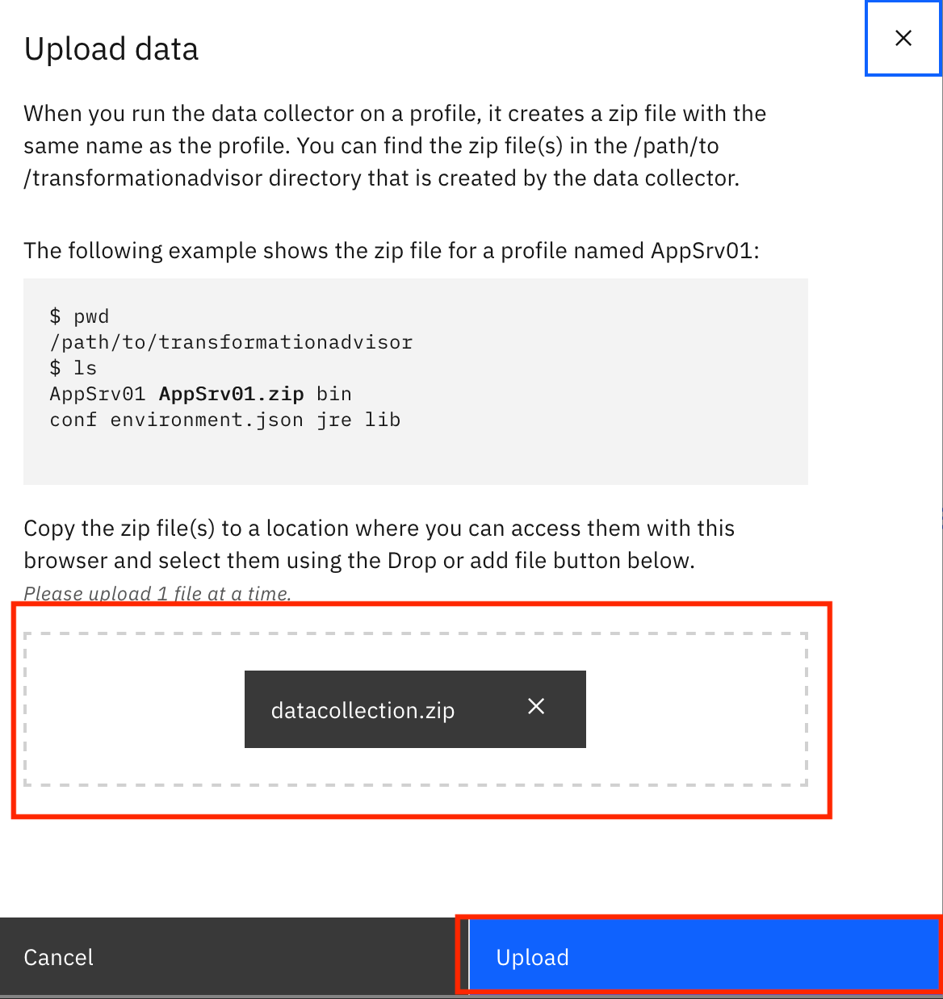

     <br/> 

9. When the upload is complete, you will see a list of applications analyzed from the source environment. At the top of the page, you can see the **source environment** and the **target environment** settings.  

    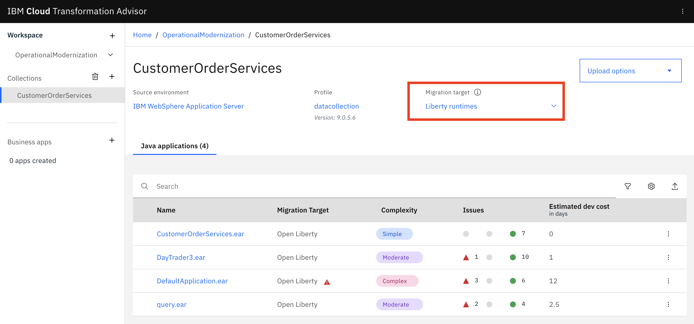
    
	<br/>
	
10. Under the **Migration target** field, click the down arrow and select **Compatible runtimes**. This will show you an entry for each application for each compatible destination runtime you can migrate it to.
    
    


11. Click the **CustomerOrderServicesApp.ear** application with the **WebSphere traditional** migration target to open the **Application details page**. 

    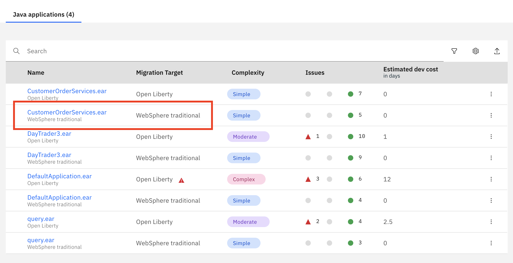
    
	<br/>
	
12. Look over the migration analysis. 

    From the migration analysis data, you can: 
	
	  - view a summary of the complexity of migrating this application to this target
	  - see detailed information about issues
	  - view additional reports about the application. 
	
    <br/>
	
	In summary, **no code changes are required to move this application to the traditional WebSphere Base v9 runtime**, so it is a good candidate to proceed with the operational modernization.

    

    <br/>

13. Click on **View migration plan** in the top right corner of the page. 
    
    
    
    This page will help you assemble an archive containing:
	
      - your **application's source or binary files** (you upload these here or specify Maven coordinates to download them)
      - any required **drivers** or **libraries** (you upload these here or specify Maven coordinates to download them)
      - the **wsadmin scripts** needed to configure your application and its resources (generated by Transformation Advisor and automatically included)
      - the **deployment artifacts** needed to create the container image and deploy the application to OCP (generated by Transformation Advisor and automatically included)

    <br/>

    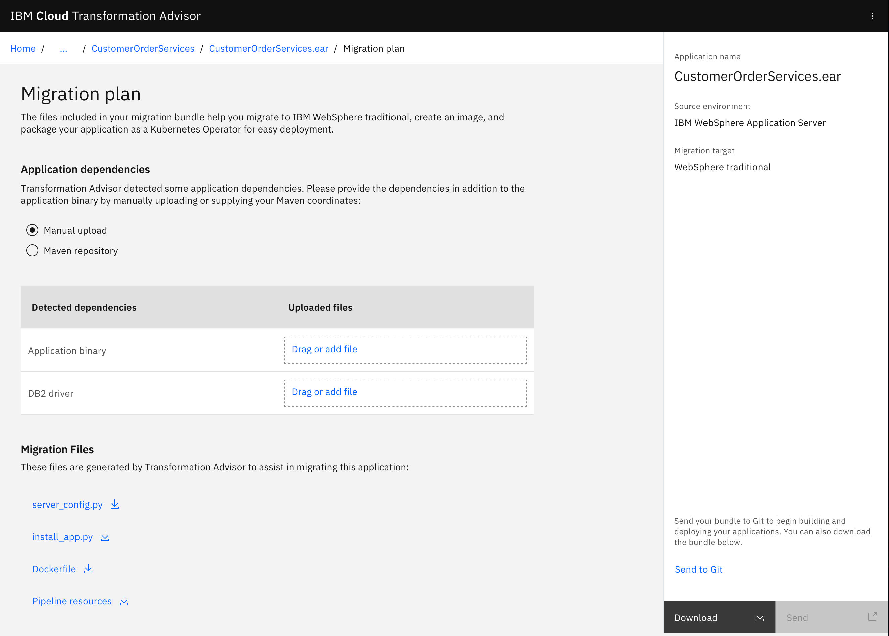

**NOTE:** These artifacts have already been provided for you as part of the lab files, so you don't need to download the migration plan. However, you can do so if you wish to look around at the files. These files can also be sent to a Git repository by Transformation Advisor.

**Optional:** For a more detailed walkthrough of the Transformation Advisor process, you may **Read** through [this document](extras/WAS-analyze.md). 
```
Please note that the lab environment DOES NOT have WebSphere installed. 

Therefore, you cannot actually perform the steps to scan the WebShere server 
as described in the "this document" link shown above. 

That additonal resource is provided as additional context for how 
IBM Transformation Advisor tool is used to scan WebSphere servers and collect the migration data.
```

<a name="build"></a>
## Build (Hands-on)

In this section, you'll learn how to build a Docker image for Customer Order Services application running on traditional WebSphere Base v9.

Building this image could take around ~8 minutes. So, let's kick that process off before explaining what you did. The image should be built by the time you complete this section.

1. Open a new terminal window from the VM desktop.

    

    <br/>

2. Login to OpenShift CLI with the `oc login` command from the web terminal. When prompted for the username and password, enter the following login credentials:
    - Username: **ibmadmin**
    - Password: **engageibm**
    
      

    <br/>

    <!--
    3. If you have not yet cloned the GitHub repo with the lab artifacts, run the following command on your terminal:
        ```
        git clone https://github.com/IBMTechSales/openshift-workshop-was
        ```
    -->	

3. Change directory to where this lab is located, from the cloned Github repo. 
    ```
    cd /home/ibmuser/openshift-workshop-was/labs/Openshift/OperationalModernization

    ls
    ```

4. Run the following command to create a new project named `apps-was` in OpenShift. 
   
     ```
     oc new-project apps-was
     ```

     Example output:
     ```
     Now using project "apps-was" on server "https://api.demo.ibmdte.net:6443".
     . . .
     ```
     


### Build image (Hands-on)

1. Run the following command to start building the image. Make sure to copy the entire command, including the `"."` at the end (which indicates current directory). 
     ```
     docker build --tag default-route-openshift-image-registry.apps.demo.ibmdte.net/apps-was/cos-was .
     ```

2. You should see the following message if the image was successfully built. Please wait if it's still building.
     ```
     Successfully built aa6babbb5ce9
     Successfully tagged default-route-openshift-image-registry.apps.demo.ibmdte.net/apps-was/cos-was:latest
     ```

3. Review the **docker build** command that you just executed:
     ```
     ### docker build --tag default-route-openshift-image-registry.apps.demo.ibmdte.net/apps-was/cos-was .
     ```

     - It instructs docker to **build the image** following the instructions in the `Dockerfile` in current directory (indicated by the `"."` at the end).
     - A specific name to tag the built image is also specified after `--tag`
     - The value `default-route-openshift-image-registry.apps.demo.ibmdte.net` in the tag is the default address of the internal image registry provided by OpenShift. 
     - `Image registry` is a content server that can store and serve container images. 
     - The registry is accessible within the cluster via its exposed `Service`. 
     - The format of a Service address: _name_._namespace_._svc_. 
     - In this case, the image registry is named `image-registry` and it's in namespace `openshift-image-registry`.
     - Later when we `push` the image to OpenShift's internal image registry, we'll refer to the image by the same values.

     <br/>


4. Validate that the Docker image with name **cos-was** has been created by the "docker build" command that you executed in the previous step:
   ```
   docker images | grep '\<cos-was\>\|websphere'
   ```

     - Notice that the base image, websphere-traditional, is also listed. It was pulled as the first step of building application image.
     
         **Example output:**
       ```
       REPOSITORY                                                             TAG                 IMAGE ID            CREATED             SIZE
       default-route-openshift-image-registry.apps.demo.ibmdte.net/apps-was/cos-was      latest              9394150a5a15        10 minutes ago      2.05GB
       
       ibmcom/websphere-traditional                                           latest              898f9fd79b36        12 minutes ago      1.86GB
       ```

     - Note that `docker images` only lists those images that are cached locally.
     - The name of the image also contains the `host name` where the image is hosted. 
     - If there is no host name, the image is hosted on docker hub. For example, the image `ibmcom/websphere-traditional` has no host name. It is hosted on docker hub.
     - The image we just built, `default-route-openshift-image-registry.apps.demo.ibmdte.net/apps-was/cos-was`, has host name `default-route-openshift-image-registry.apps.demo.ibmdte.net`. It is to be hosted in the Openshift image registry for your lab cluster.
     - If you change an image, or build a new image, the changes are only available locally. You must `push` the image to propagate the changes to the remote registry.

     <br/>

5. Let's push the image you just built to your OpenShift cluster's built-in image registry. 
   
     **a.** First, login to the image registry by running the following command in the terminal. 
   
     **Note:** A session token is obtained from the value of another command `oc whoami -t` and used as the password to login.

     ```
     docker login -u $(oc whoami) -p $(oc whoami -t) default-route-openshift-image-registry.apps.demo.ibmdte.net
     ```

     **Example output:**
    
	 ```
     WARNING! Using --password via the CLI is insecure. Use --password-stdin.
     WARNING! Your password will be stored unencrypted in /root/.docker/config.json.
     Configure a credential helper to remove this warning. See
     https://docs.docker.com/engine/reference/commandline/login/#credentials-store

     Login Succeeded 
     ```
	 
     **b.** Now, push the image into OpenShift cluster's internal image registry, which will take 1-2 minutes:
     ```
     docker push default-route-openshift-image-registry.apps.demo.ibmdte.net/apps-was/cos-was
     ```

     **Example output:** 
     
	 ```
     Using default tag: latest
     The push refers to repository [default-route-openshift-image-registry.apps.demo.ibmdte.net/apps-was/cos-was]
     470e7d3b0bec: Pushed 
     c38e61da8211: Pushed 
     2a72e88fe5eb: Pushed 
     334c79ff1b2e: Pushed 
     ccf8ea26529f: Pushed 
     af0f17433f77: Pushed 
     4254aef2aa12: Pushed 
     855301ffdcce: Pushed 
     ea252e2474a5: Pushed 
     68a4c9686496: Pushed 
     87ecb86bc8e5: Pushed 
     066b59214d49: Pushed 
     211f972e9c63: Pushed 
     b93eee2b1ddb: Pushed 
     a6ab5ae423d9: Pushed 
     3f785cf0a0ae: Pushed 
     latest: digest: sha256:4f4e8ae82fa22c83febc4f884b5026d01815fc704df6196431db8ed7a7def6a0 size: 3672
     ```

6. Verify that the image is in the image registry. The following command will get the images in the registry. Filter through the results to get only the image you pushed. Run the following command:

     ```
     oc get images | grep apps-was/cos-was
     ```

     - The application image you just pushed should be listed. The hash of the image is stored alongside (indicated by the SHA-256 value).
     
	 <br/>
	 
    **Example output:**
    
 	  ```
       image-registry.openshift-image-registry.svc:5000/apps-was/cos-was@sha256:bc072d3b78ae6adcd843af75552965e5ed863bcce4fc3f1bc5d194570bc16953
    ```


7. OpenShift uses `ImageStream` to provide an abstraction for referencing container images from within the cluster. When an image is pushed to registry, an _ImageStream_ is created automatically, if one doesn't already exist. Run the following command to see the _ImageStream_ that's created:
   ```
   oc get imagestreams -n apps-was
   ```

     **Example output:**
     ```
     NAME      IMAGE REPOSITORY                                                              TAGS      UPDATED           
     cos-was   default-route-openshift-image-registry.apps.demo.ibmdte.net/apps-was/cos-was  latest    2 minutes ago         
     ```

     - You can also use the OpenShift console (UI) to see the _ImageStream_:
         - From the panel on left-side, click on **Builds** > **Image Streams**. 
         - Then select `apps-was` from the **Project** drop-down menu. 
         - Click on `cos-was` from the list. 

         <br/>

        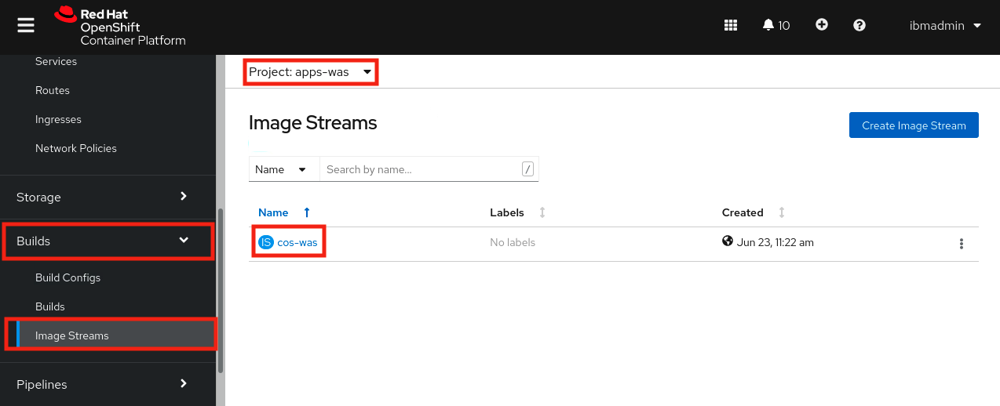

         - Scroll down to the bottom to see the image that you pushed.

         <br/>

         

<a name="deploy"></a>

## Deploy without operator 

The following steps will deploy the modernized Customer Order Services application in a traditional WebSphere Base container to a RedHat OpenShift cluster.

Customer Order Services application uses DB2 as its database. 
You can connect to an on-prem database that already exists or migrate the database to cloud. 
Since migrating the database is not the focus of this particular workshop and to save time, the database needed by the application is already configured in the OpenShift cluster you are using.


### Deploy application without operator (Hands-on)

1. Run the following command to deploy the resources (*.yaml files) in the `deploy` directory:
   ```
   oc apply -f deploy
   ```
   Output:
   ```
   deployment.apps/cos-was created
   route.route.openshift.io/cos-was created
   secret/authdata created
   service/cos-was created 
   ```

2. Let's review what we just did. 
   
     - The directory `deploy` contains the following yaml files:
         - `Deployment.yaml`:  the specification for creating a Kubernetes deployment
         - `Service.yaml`: the specification to expose the deployment as a cluster-wide Kubernetes service.
         - `Route.yaml`: the specification to expose the service as a route visible outside of the cluster.
         - `Secret.yaml`: the specification that the `properties based configuration` properties file used to configure database user/password when the container starts.

         <br/>

     **The `Deployment.yaml` looks like:**

     ```yaml
     apiVersion: apps/v1
     kind: Deployment
     metadata:
       name: cos-was
       namespace: apps-was
     spec:
       selector:
         matchLabels:
           app: cos-was
       replicas: 1
       template:
         metadata:
           labels:
             app: cos-was
         spec:
           containers:
           - name: cos-was
             image: image-registry.openshift-image-registry.svc:5000/apps-was/cos-was
             ports:
               - containerPort: 9080
             livenessProbe:
               httpGet:
                 path: /CustomerOrderServicesWeb/index.html
                 port: 9080
               periodSeconds: 30
               failureThreshold: 6
               initialDelaySeconds: 90
             readinessProbe:
               httpGet:
                 path: /CustomerOrderServicesWeb/index.html
                 port: 9080
               periodSeconds: 10
               failureThreshold: 3
             volumeMounts:
             - mountPath: /etc/websphere
               name: authdata
               readOnly: true
           volumes:
           - name: authdata
             secret:
                 secretName: authdata
     ```

     **Note the following about the deployment yaml**
	 
     - The `liveness probe` is used to tell Kubernetes when the application is live. Due to the size of the traditional WAS image, the initialDelaySeconds attribute has been set to 90 seconds to give the container time to start.
     - The `readiness probe` is used to tell Kubernetes whether the application is ready to serve requests. 
     - You may store property file based configuration files such as `configmaps` and `secrets`, and bind their contents into the `/etc/websphere` directory. 
     - When the container starts, the server startup script will apply all the property files found in the `/etc/websphere` directory to reconfigure the server.
     - For our example, the `volumeMounts` and `volumes` are used to bind the contents of the secret `authdata` into the directory `/etc/websphere` during container startup. 
     - After it is bound, it will appear as the file `/etc/websphere/authdata.properties`. 
        - For **volumeMounts:**
            - The mountPath, `/etc/websphere`, specifies the directory where the files are bound.
            - the name, `authdata`, specifies the name of the volume
       - For **volumes:**
            - the secretName specifies the name of the secret whose contents are to be bound.

       <br/> 
 
     **The `Secret.yaml` looks like:**

     ```yaml
     apiVersion: v1
     kind: Secret
     metadata:
       name: authdata
       namespace: apps-was
     type: Opaque
     stringData:
       authdata.props: |-
         #
         # Configuration properties file for cells/DefaultCell01|security.xml#JAASAuthData_1597094577206#
         # Extracted on Tue Aug 11 15:30:36 UTC 2020
         #

         #
         # Section 1.0 ## Cell=!{cellName}:Security=:JAASAuthData=alias#DBUser
         #

         #
         # SubSection 1.0.0 # JAASAuthData Section
         #
         ResourceType=JAASAuthData
         ImplementingResourceType=GenericType
         ResourceId=Cell=!{cellName}:Security=:JAASAuthData=alias#DBUser
         AttributeInfo=authDataEntries
         #

         #
         #Properties
         #
         password="{xor}Oz1tNjEsK24=" #required
         alias=DBUser #required
         userId=db2inst1 #required
         description=

         #
         # End of Section 1.0# Cell=!{cellName}:Security=:JAASAuthData=alias#DBUser
         #
         #
         #
         EnvironmentVariablesSection
         #
         #
         #Environment Variables
         cellName=DefaultCell01
     ```

     - The attribute `authdata.properties` contains the properties file based configure used to update the database userId and password for the JAASAuthData whose alias is DBUser. 
     - The configuration in **Deployment.yaml** maps it as the file `/etc/websphere/authdata.properties` during container startup so that the application server startup script can automatically configure the server with these entries. 


<a name="access-the-application"></a>

## Access the application without operator (Hands-on)

1. Confirm you're at the current project `apps-was`:
   ```
   oc project
   ```
   
     Example output:
   
     ```
     Using project "apps-was" on server "https://api.demo.ibmdte.net:6443".
     ```
   
     - If it's not at the project `apps-was`, then switch:
       ```
       oc project apps-was
       ```
	   
2. Run the following command to verify the pod is running:
   ```
   oc get pod
   ```
   If the status does not show `1/1` READY, wait a while, checking status periodically:
   ```
   NAME                       READY   STATUS    RESTARTS   AGE
   cos-was-6bd4767bf6-xhr92   1/1     Running   0          120m
   ```

3. Run the following command to get the URL of your application (the route URL plus the application contextroot): 
   ```
   echo http://$(oc get route cos-was  --template='{{ .spec.host }}')/CustomerOrderServicesWeb
   ```
   
     Example output:
     ```
     http://cos-was-apps-was.apps.demo.ibmdte.net/CustomerOrderServicesWeb	 
     ```

4. Return to your Firefox browser window and go to the URL outputted by the command run in the previous step.

 
5. You will be prompted to login in order to access the application. Enter the following credentials:
    - Username: **skywalker**
    - Password: **force**

      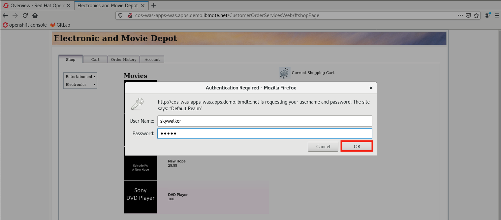

      <br/>

6. After login, the application page titled **Electronic and Movie Depot** will be displayed. From the `Shop` tab, click on an item (a movie) and on the next pop-up panel, drag and drop the item into the shopping cart. 

    

    <br/> 

7. Add a few items to the cart. As the items are added, they’ll be shown under _Current Shopping Cart_ (on the upper right) with _Order Total_.

    

    <br/>

8. Close the **Electronic and Movie Depot** application browser tab.

### Review the application workload flow without operator (Hands-on)

1. Below is an overview diagram on the deployment you've completed from the above steps: 
     - **Note:** DB2 in the middle of the diagram is pre-installed through a different project `db` and has been up and running before your hands-on.  Also it will not be impacted when you're removing the deployment in next step.

     <br/>
     
	 
   
 
2. Return to the Firefox browser and open the OpenShift Console to view the resources on the deployment.

3. View the resources in the project `apps-was`:
     - Select the `apps-was` project from the project drop down menu.
     
	 <br/>
	 
4. View `deployment` details:
   
    - Click on the **Deployments** tab under **Workloads** from the left menu and select `cos-was`
     
	    <br/> 
	 
         
   
        <br/>
   
       - Navigate to the `YAML` tab to view the content of yaml
     
	     <br/>
	 
         
     
	     <br/>
     
5. View `pod` details:

     - Click on the **Pods** tab under **Workloads** from the left menu and select the pod with name starting with `cos-was`
     
       
     
     - Navigate to the `Logs` tab to view the WebSphere Application Server log
     
       <br/> 	 
	 
       
     
	   <br/> 
	 
      - Navigate to the `Terminal` tab to view the files inside the container, and run the following commands to view some of the files in the container: 
        	  
	          ls -lt
			  ls -l /logs
			  ls -l /etc/websphere
			  ls -l /opt/IBM/WebSphere
     
		<br/> 
		 
        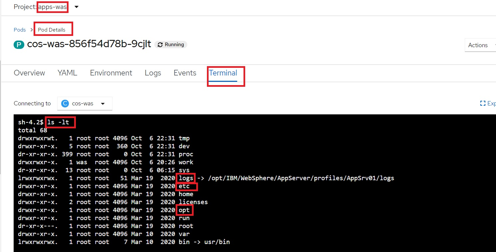
     
        
     
	    <br/>
     
6. View `secret` details:

   - Click on the **Secrets** tab under **Workloads** from the left menu and select the `authdata` secret.
     
     
      
	   <br/>
	  
   - Scroll down to the **Data** section and click on **Reveal Values** to view the content.
     
     
		 
		
      
	  <br/>
      
7. View `service` details:

    - Click on the **Services** tab under **Networking** from the left menu and select the `cos-was` service.

      

     <br/>

    - Review service information including **address** and **port** mapping details.
   
      
      
	  <br/>
      
8. View `route` details:

     - Click on the **Routes** tab under **Networking** from the left menu and select the `cos-was` route. Here you see the route location to access the application.

       

     <br/>
	 
	 <a name="db project resource"></a>


###     View the resources in the project that contains the DB2 database used by the application

1. View the resources in the project `db`:
 
     - Select the `db` project from the project drop down menu.

     <br/>

2. View `deployment` details:   
      
 	 - Click on the **Deployments** tab under **Workloads** from the left menu and select `cos-db-was`
       
	   

     

   - Navigate to the `YAML` tab to view the content of yaml
       
     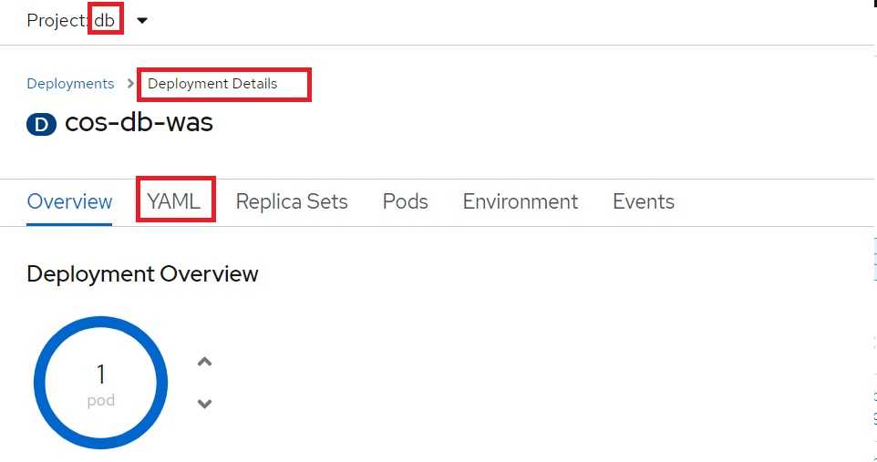
        
3. View `pod` details:
  
   - Click on the **Pods** tab under **Workloads** from the left menu and select the pod with name starting with `cos-db-was`
       
     
       
	     
   - Navigate to the `Logs` tab to view the database logs
	 
   - Navigate to the `Terminal` tab to view the files inside the container: 
        	  
	      ls -lt
		
    	  ls -l /opt/ibm/db2
			  
     
        
4. View `service` details for the project **db**:

   - Click on the **Services** tab under **Networking** from the left menu and select the `cos-db-was` service.
       
     

     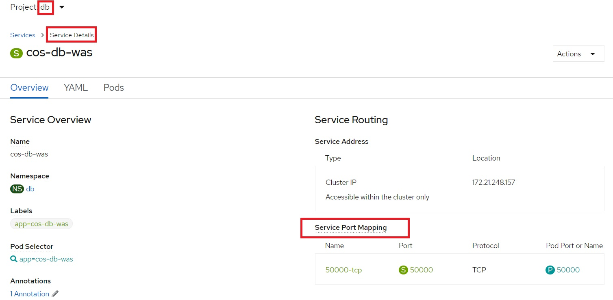


## Remove your deployment (standard deployment without operator) (Hands-on)

1. Return to the terminal window on the VM (Not inside of the container), remove the deploment from the above scenario without the operator, using the following commands:

    **Note:** The pre-installed resources such as DB2, are **not** removed.

    ```
	cd /home/ibmuser/openshift-workshop-was/labs/Openshift/OperationalModernization

    oc delete -f deploy
    ```

    Output:
    ```
    deployment.apps "cos-was" deleted
    route.route.openshift.io "cos-was" deleted
    secret "authdata" deleted
    service "cos-was" deleted
    ```

    The **oc delete** command specified the `-f` parameter which runs the "delete" action using all of the YAML files located in the "deploy" directory. 

<a name="deploy-rco"></a>

## Alternate Deployment Via Runtime Component Operator

Another way to deploy the application is via the **Runtime Component Operator**. It is a generic operator used to deploy different types of application images. The operator has already been installed into your environment. 

For more information, see: [https://github.com/application-stacks/runtime-component-operator](https://github.com/application-stacks/runtime-component-operator)

### Deploy application (via Runtime Component Operator) (Hands-on)

1. Run the following command which uses the Runtime Component Operator to deploy the same Customer Order Service application image:
   ```
   oc apply -f deploy-rco
   ```
   
     Output:
     
	 ```
     runtimecomponent.app.stacks/cos-was-rco created
     secret/authdata-rco created
     ```

2. Let's review what we just did. 

     - First, list the contents of the `deploy-rco` directory:

     ```
     ls deploy-rco
     ```

     The output shows there are only two yaml files:
     ```
     RuntimeComponent.yaml  Secret.yaml
     ```

3. Review `Secret.yaml`: 
     ```
     cat deploy-rco/Secret.yaml
     ```

     - Note that it is the same as the `Secret.yaml` in the `deploy` directory, except the name has been changed to `authdata-rco`.  
     - It serves the same purpose for this new deployment - to override the database user/password.

     <br/>

4. Review `RuntimeComponent.yaml`:
      ```
      cat deploy-rco/RuntimeComponent.yaml
      ```

      And the output:
      
      ```yaml
      apiVersion: app.stacks/v1beta1
      kind: RuntimeComponent
      metadata:
        name: cos-was-rco
        namespace: apps-was
      spec:
        applicationImage: image-registry.openshift-image-registry.svc:5000/apps-was/cos-was
        service:
          port: 9080
        readinessProbe:
          httpGet:
            path: /CustomerOrderServicesWeb/index.html
            port: 9080
          periodSeconds: 10
          failureThreshold: 3
        livenessProbe:
          httpGet:
            path: /CustomerOrderServicesWeb/index.html
            port: 9080
          periodSeconds: 30
          failureThreshold: 6
          initialDelaySeconds: 90
        expose: true
        route:
          termination: edge
          insecureEdgeTerminationPolicy: Redirect
        volumeMounts:
          - mountPath: /etc/websphere
            name: authdata-rco
            readOnly: true
        volumes:
          - name: authdata-rco
            secret:
                secretName: authdata-rco
      ```

      Note that:
	  
      - The kind is `RuntimeComponent`
      - The `expose` attribute is set to `true` to expose a route for the service
      - The attributes within the yaml file are essentially the same information that you provided for the `Service`, `Route`, and `Deployment` resources in the `deploy` directory.
      - The controller for the RuntimeComponent custom resource reacts to changes in the above specification, and creates the corresponding `Service`, `Route`, and `Deployment` objects. 
	   
	  <br/>
	   
5. Issue the following commands to view what the controller has created:
      ```
      oc get Deployment cos-was-rco -o yaml
      oc get Service cos-was-rco -o yaml
      oc get Route cos-was-rco -o yaml
      ```

## Access the application (via Runtime Component Operator) (Hands-on)

1. Ensure you are at the project `apps-was`:
   ```
   oc project apps-was
   ```
   
     Example output:
     ```
     Already on project "apps-was" on server "https://api.demo.ibmdte.net:6443".
     ```
  
2. Run the following command to verify the pod is running:
   ```
   oc get pod
   ```

     If the status does not show `1/1` READY, wait a while, checking status periodically. Note the prefix name for the pod is `cos-was-rco`.
     ```
     NAME                           READY   STATUS    RESTARTS   AGE
     cos-was-rco-6779784fc8-pz92m   1/1     Running   0          2m59s
     ```

3. Run the following command to get the URL of your application (the route URL plus the application contextroot): 
   ```
   echo http://$(oc get route cos-was-rco  --template='{{ .spec.host }}')/CustomerOrderServicesWeb
   ```
   
     Example output:
     ```
     http://cos-was-rco-apps-was.apps.demo.ibmdte.net/CustomerOrderServicesWeb
     ```

4. Return to your Firefox browser window and go to the URL outputted by the command run in the previous step. 

     **Note:** The steps to access the application are the same as those used when deploying without the operator.

     

5. You will be prompted to login in order to access the application. Enter the following credentials:
    - Username: **skywalker**
    - Password: **force**

    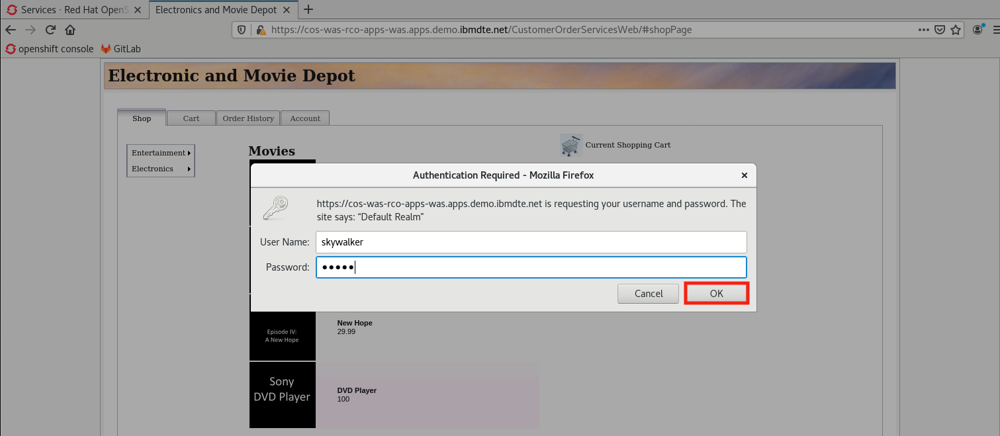

    <br/>

6. After login, the application page titled **Electronic and Movie Depot** will be displayed. From the `Shop` tab, click on an item (a movie) and on the next pop-up panel, drag and drop the item into the shopping cart. 

    

7. Add a few items to the cart. As the items are added, they’ll be shown under _Current Shopping Cart_ (on the upper right) with _Order Total_.

    

    <br/>

8. Close the **Electronic and Movie Depot** applicarion browser tab.

### Review the application workload flow with Runtime Component Operator (Hands-on)

1. Below is an overview diagram on the deployment you've completed from the above steps using Runtime Component Operator: 

     **Note:** DB2 in the middle of the diagram is pre-installed through a different project `db` and has been up and running before your hands-on.

     


2. Return to the Firefox browser and open the OpenShift Console to view the resources on the deployment.

     <br/>

#### Review the resources in the project openshift-operators

1. View the resources in the project `openshift-operators`:

   - Select the `openshift-operators` project from the project drop down menu.

   

2. View operator `deployment` details:

   - Click on the **Deployments** tab under **Workloads** from the left menu and select `runtime-component-operator`
             
      
         
			 
   - Navigate to the `YAML` tab to view the content of yaml
       
      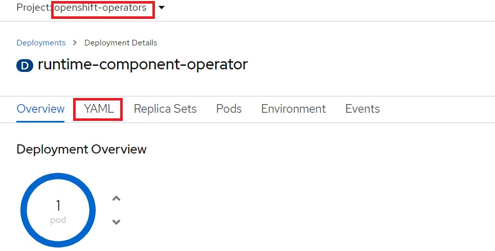
   
3. View operator `pod` details:
   
   - Click on the **Pods** tab under **Workloads** from the left menu and select the pod with name starting with `runtime-component-operator`
       
     
         
	- Navigate to `Logs` to view the runtime-component-operator container log
       
      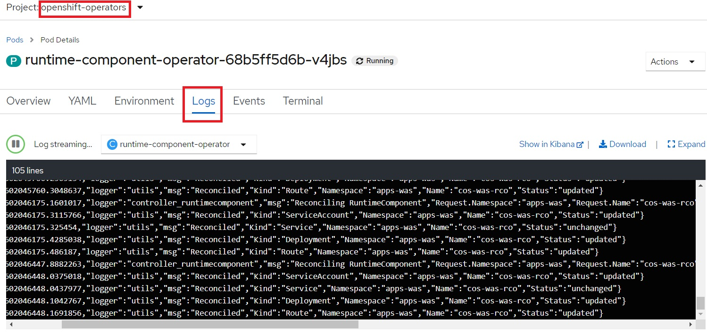
		 
	
  
 
###  View the resources in the project apps-was

   
1. View the resources in the project `apps-was`:

     - Select the `apps-was` project from the project drop down menu.
   
     - View `Runtime Component` instance details:

        - Click on the **Installed Operators** tab under **Operators** from the left menu and select `Runtime Component Operator`.  
          
		    **Note:** The operator is installed at cluster level and is visible to all existing projects, but Runtime Component instance is created under the project `apps-was`.
     
          

         <br/>
	 
       - Navigate to the `YAML` tab to view the content of yaml
     
         
		 
		 <br/>

       - Navigate to the`Runtime Component` tab and select `cos-was-rco` to view the deails of Runtime Component instance
       
         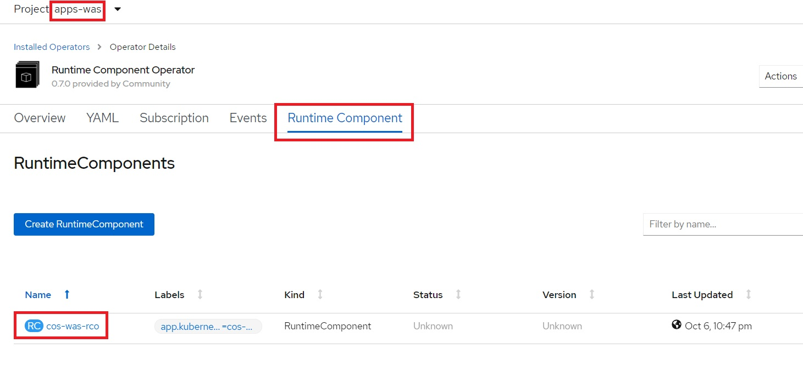
     
2. View `deployment` details:
   
    - Click on the **Deployments** tab under **Workloads** from the left menu and select `cos-was-rco`.
       
        
       
	    	   
    - Navigate to the `YAML` tab to view the content of yaml.    
          
		 **Note:** the deployment is created through the controller of RuntimeComponent custom resource.
       
         
         
         <br/>
		 
3. View `pod` details:   
 
   - Click on the **Pods** tab under **Workloads** from the left menu and select the pod starting with `cos-was-rco`
       
       

          
   - Navigate to the `Logs` tab to view the WebSphere Application Server log
       
       
         
		
		 
4. View `service` details:
  
   - Click on the **Services** tab under **Networking** from the left menu and select `cos-was-rco`
       
      

         
	  
   - Navigate to the `YAML` tab to view the content of yaml.    
 
     **Note** the service is created through the controller of RuntimeComponent custom resource.
         
      
       
	   	   
5. View `route` details:
   
   - Click on the **Routes** tab under **Networking** from the left menu and select `cos-was-rco`
       
     
    
     
	
   - Navigate to the `YAML` tab to view the content of yaml.  
          
		**Note** the route is created through the controller of RuntimeComponent custom resource.
         
        
       
	   
	   
6. View `secret` details:
	  
   - Click on the **Secrets** tab under **Workloads** from the left menu and select `authdata-rco`
        
      
        
		 		

         
         
## Cleanup (the deployment with Runtime Component Operator) (Hands-on)

1. Run the following command in a terminal window to remove the deployment from the above secenario with Runtime Component instance:
   
     **Note:** The pre-installed resources such as Runtime Component Operator, DB2, are not removed.

     ```
     oc delete -f deploy-rco
     ```
   
     Output:
     ```
     runtimecomponent.app.stacks "cos-was-rco" deleted
     secret "authdata-rco" deleted
     ```

2. Verify that the corresponding application `Service`, `Route`, and `Deployment` have also been deleted:

   ```
   oc get Deployment 
   oc get Service 
   oc get Route 
   ```
   
   Output from each `get` command above should be:
   ```
   No resources found in apps-was namespace.
   ```

<a name="summary"></a>
## Summary

Congratulations! You've completed the **Operational Modernization** lab. You containerized and deployed a monolith application to cloud!
