**Lab 5: Creating a merged web server plug-in configuration file for
Liberty**

Contents

# Table of Contents

[Lab 5 Creating a merged web server plug-in configuration file for
Liberty
3](#lab-5-creating-a-merged-web-server-plug-in-configuration-file-for-liberty)

[0.1 The lab environment 5](#the-lab-environment)

[0.1.1 Login to the "Liberty vPOT … Desktop" VM and Get Started
6](#login-to-the-liberty-vpot-desktop-vm-and-get-started)

[1.1 Install and set up IHS and WebSphere Plug-in
9](#install-and-set-up-ihs-and-websphere-plug-in)

[1.2 Configure a Liberty server to generate a configuration file for the
lab web server.
13](#configure-a-liberty-server-to-generate-a-configuration-file-for-the-lab-web-server.)

[1.2.1 Configure a Liberty server for working with the web server plugin
15](#configure-a-liberty-server-for-working-with-the-web-server-plugin)

[1.2.2 Review the plugin configuration
18](#review-the-plugin-configuration)

[1.3 Copy the server 'blue' to create a cluster of servers
20](#copy-the-server-blue-to-create-a-cluster-of-servers)

[1.4 Create a merged plug-in configuration file
26](#create-a-merged-plug-in-configuration-file)

[1.5 Explore the plugin-cfg.xml 29](#explore-the-plugin-cfg.xml)

[1.6 Testing the plug-in 32](#testing-the-plug-in)

[1.7 Cleanup 34](#cleanup)

[Appendix: Configure a Liberty server via admin center
35](#appendix-configure-a-liberty-server-via-admin-center)

[1.8 Configure a Liberty server via admin center.
35](#configure-a-liberty-server-via-admin-center.)

# Lab 5 Creating a merged web server plug-in configuration file for Liberty

The WebSphere Plug-in can be used with an Apache web server to route
HTTP requests to applications running in Liberty servers. It is common
to provide workload balancing and failover of application requests by
running the same application in multiple application server processes, a
pattern referred to as an application cluster. In such a topology, the
web server plug-in needs to share the requests across all the
application servers in the cluster, and it can be directed to do so by
using a configuration that contains information about all of the
application servers. This is known as a merged plug-in configuration
because it involves merging routing information from multiple
application servers.

There are three ways to provide the merged plug-in configuration to the
web server:

**1.** Create the plug-in configuration for each application server, use
a utility to merge these configurations into a single file, then copy it
to the web server installation. This method can be used for Liberty
servers from any edition of WebSphere that are **not managed in a
Liberty collective**. This is the method that we will use in this lab.

**2.** Manage the application server in a Liberty collective, and use
the dynamicRouting feature in the collective controller process to
provide the information from each application server to the web server
plug-in. For this method the web server plug-in configuration only needs
to contain information about the collective controller process; the
plug-in then contacts the controller to obtain information about all the
servers in the collective, and will direct HTTP requests to all of the
applications in all the application servers. This method requires a
WebSphere Network Deployment (ND) license for the collective controller
host, but the application servers running the applications can be from
any WebSphere edition (Liberty Core, WAS Base or ND).

**3.** Organize the application servers into managed clusters within a
Liberty collective (using the clusterMember feature in each server) and
use the ClusterManagerMBean in the controller process to generate a
merged plug-in configuration for all the servers in a given cluster.
This method requires a WebSphere Network Deployment (ND) license for all
the Liberty servers.

**Note:** In this lab, you will use **OPTION \#1** to create a merged
plug-in configuration file that will allow a web server to spray HTTP
requests across three liberty server that are running the same sample
application.

You will use capabilities built into the Liberty server to automatically
generate a plug-in configuration file, and a utility to merge those
files. You will also perform some updates to the application server
configuration which result in generation of an updated plug-in
configuration file and see the effect of session affinity on routing in
the application cluster.

**The hi-level steps for this lab are listed
below:**

  - Install the IHS and WebSphere plug-in

  - Unzip and run a provided server configuration, including two simple
    applications that display application server information.

  - Examine the server configuration, and adjust the web server plugin
    configuration to match your web server plugin installation

  - Clone the server to produce three servers with the same application
    but different names, and adjust the server HTTP port numbers to make
    them unique, so the servers can be run on the same host without port
    conflicts

  - Start all the servers to test the application and generate their
    plugin-cfg.xml files.

  - Examine the plug-in configuration files generated by the servers,
    then merge them into a single file with the pluginUtility that is
    provided with Liberty.

  - Configure the web server plug-in between the web server and Liberty
    using the merged plug-in configuration file and test the application
    routing of requests across the Liberty servers.

  - Compare the behavior of the plug-in when sending requests to the two
    sample applications, and the effect of using an HTTP session in one
    of the applications.

**TIP:** To reduce typing or copy & paste of command, you can find the
related code snippets or commands in the VMWare image in the directory:

**/home/ibmdemo/Student/lab-files/CodeSnippets/LibertyBootcamp\_Lab5\_IHS\_Liberty\_
CodeSnippets.txt**

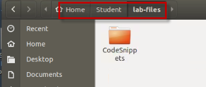

##  The lab environment

One (1) Linux VM has been provided for this lab.

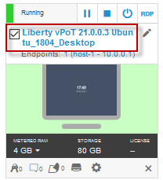

> The **“Liberty vPOT … Desktop”** VM has the following software
> available:

  - Application Project with Liberty

  - Maven 3.6.0

<!-- end list -->

  - The login credentials for the **Liberty vPOT … Desktop”** VM are:

> User ID: **ibmdemo**
> 
> Password: **passw0rd (That is a numeric zero in passw0rd)**

### **0.1.1** **Login to the "Liberty vPOT … Desktop" VM and Get Started**

1.  If the VM is **not** already started,
    start it by clicking the **Play** button.

> 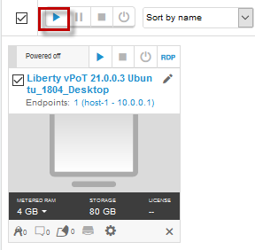

2.  After the VM is started, click the **“Liberty vPOT … Desktop”** VM
    icon to access it.

> 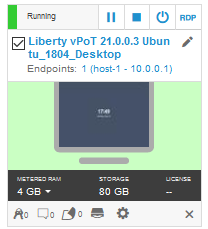

3.  Login with **ibmdemo** ID.
    
    1.  Click on the “ibmdemo” icon on the Ubuntu screen.

> 

2.  When prompted for the password for “ibmdemo” user, enter “passw0rd”
    as the password:

> Password: **passw0rd** (lowercase with a zero instead of the o)
> 
> 

4.  Resize the Skytap environment window for a larger viewing area while
    doing the lab.

> From the Skytap menu bar, click on the “**Fit to Size**”
>  icon. This will enlarge the viewing
> area to fit the size of your browser window.
> 
> 

<table>
<tbody>
<tr class="odd">
<td></td>
<td>
<strong>Important:</strong>

<strong>Click CANCEL</strong>…. If, at any time during the lab, you get a pop-up asking to install updated software onto the Ubuntu VM.

The one we experience is an update available for VS Code.

<strong>CLICK CANCEL!</strong>

</td>
</tr>
</tbody>
</table>

## Install and set up IHS and WebSphere Plug-in

In the following steps, you will unzip and configure an IHS server using
the zip file that is provided for the lab.

<table>
<tbody>
<tr class="odd">
<td></td>
<td>
<strong>TIP:</strong>

<strong>{LAB_HOME}</strong> refers to: <strong>/home/ibmdemo/Student/WLP_21.0.0.3</strong>
</td>
</tr>
</tbody>
</table>

This lab environment includes a copy of IHS and the WebSphere plug-in,
which can be found under the ***{LAB\_HOME}*** directory.

1.  Open a Terminal window and **unzip** the **IHS server** zip file for
    your system into the {LAB\_HOME} directory.

<table>
<tbody>
<tr class="odd">
<td>
cd /home/ibmdemo/Student/WLP_21.0.0.3

unzip /home/ibmdemo/Student/WLP_21.0.0.3/IHS-9.0.0.2-linux_x86_64.zip
</td>
</tr>
</tbody>
</table>

The IHS server is extracted to the **{LAB\_HOME}\\IHS** directory where
IHS is now installed.

This contains a copy of IBM HTTP Server, which is the Apache web server
that is provided with WebSphere. The zip also has the WebSphere web
server plug-in pre-installed in IHS.

2.  Run the IHS **postinstall** script to perform some host-specific
    setup of IHS.

|                                                        |
| ------------------------------------------------------ |
| /home/ibmdemo/Student/WLP\_21.0.0.3/IHS/postinstall.sh |

**Note: You might see the warning “postinst: Could not reliably
determine the server’s fully qualified domain name, using 127.0.0.1 for
ServerName”.** This can be ignored

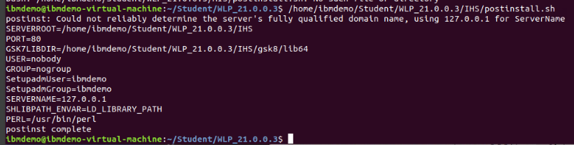

The script also creates the following directory that you will use later
for the web server plug-in log files:
**{LAB\_HOME}\\IHS\\plugin\\logs\\webserver1**

The IHS server is configured based on the contents in the **http.conf**
file of the IHS server.

Customizing the IHS server is accomplished by modifying this file. In
the next step, you will change the default port that the IHS server
listens for incoming requests. The default port is the standard HTTP
port “80”. You will change this to port 9180.

3.  Change the default HTTP port number for IHS by editing the main
    configuration file, *{LAB\_HOME}\\IHS\\conf\\httpd.conf* as follows:
    
    1.  > Use the gedit editor to Open the **conf/httpd.conf** file for
        > updates

|                                                               |
| ------------------------------------------------------------- |
| gedit /home/ibmdemo/Student/WLP\_21.0.0.3/IHS/conf/httpd.conf |

2.  > Use **Ctrl-f** key and “search” the line containing “**Listen**”
    > configuration parameter.
    
    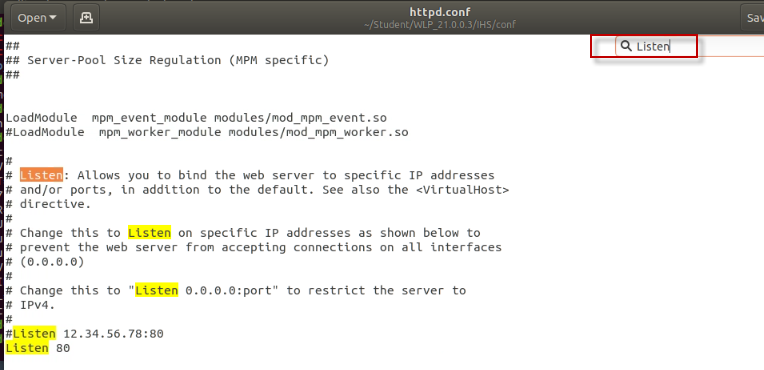

3.  > Change the line:
    
    Listen 80
    
    to use port 9180
    
    Listen 9180
    
    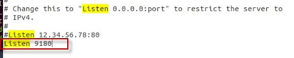

4.  > **Save and Close** the httpd.conf file

<!-- end list -->

4.  **Start** the IHS Server
    
    1.  > Change the directory to *{LAB\_HOME}*\\IHS\\bin

|                                                |
| ---------------------------------------------- |
| cd /home/ibmdemo/Student/WLP\_21.0.0.3/IHS/bin |

2.  > Use the apachectl command to start the IHS server.

|                                         |
| --------------------------------------- |
| ./apachectl -k start -f conf/httpd.conf |

5.  Check that the IHS is running:
    
    1.  > Using the Firefox Browser on the VM, point your browser to:

> <http://localhost:9180>
> 
> It should show the IBM HTTP Server main page. which indicates that IHS
> server is up and running. This screen comes from
> *{LAB\_HOME}/IHS*/htdocs/index.html.
> 
> This htdocs directory is the “document root” for the Apache Httpd
> server.
> 
> 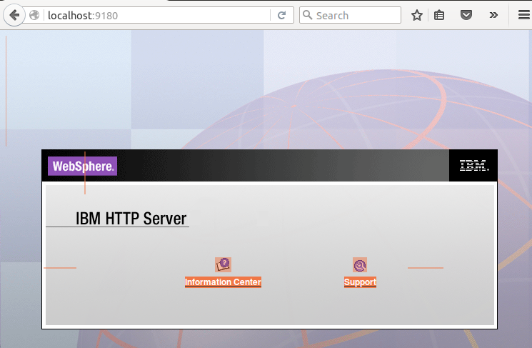

6.  **Stop** IHS with the following command:

|                     |
| ------------------- |
| ./apachectl -k stop |

## Configure a Liberty server to generate a configuration file for the lab web server.

> For this lab you will set up a cluster of three servers. All three
> servers will contain the same two applications and have the same
> configuration except for the HTTP port values (which need to be unique
> so they can all run on the same host).
> 
> Starting from a server configuration provided for the lab, you will
> create some configuration elements that control most of the values
> that the server will put into the generated plugin-cfg.xml file.

  - You can use the Admin Center (admin GUI) to create these
    configuration elements. Using the Admin Center Config tool is a good
    way to see all the configuration elements and attributes available
    in the server. **This method is shown in the Appendix**.

  - **The alternative approach, and the approach you will use in the
    lab**, is to use the product documentation to create the code
    snippet:  
    <https://www.ibm.com/docs/en/was-liberty/nd?topic=configuration-pluginconfiguration>

> In this lab, there are three Liberty servers that will be used with
> the IHS web server. The incoming HTTP requests from the Web Server
> will be routed via the web server plugin which distributes the
> workload to one of the three Liberty servers. The Liberty servers are
> named “blue”, “green”, and “red”.

1.  > Open a terminal window on the VM and navigate to the Liberty root
    > directory

|                                                |
| ---------------------------------------------- |
| **cd /home/ibmdemo/Student/WLP\_21.0.0.3/wlp** |

2.  > Unzip the lab files to the Liberty **/usr/servers** directory

> The zip file contains the Liberty server configuration for the “Blue”
> server.

<table>
<tbody>
<tr class="odd">
<td><blockquote>

<strong>unzip /home/ibmdemo/Student/WLP_21.0.0.3/labs/</strong>management/2_MergePlugin_20180107/server-lab6.zip -d usr/servers/

</blockquote></td>
</tr>
</tbody>
</table>

> 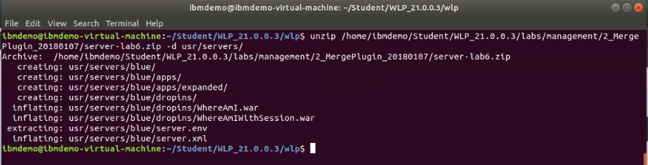

3.  > Start the “**blue**” Liberty server, using the following commands:
    > The server will start and run as a background process.

<table>
<tbody>
<tr class="odd">
<td><blockquote>

<strong>cd /home/ibmdemo/Student/WLP_21.0.0.3/wlp/bin</strong>

<strong>./server start blue</strong>

</blockquote></td>
</tr>
</tbody>
</table>

> 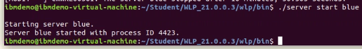

4.  > From the Firefox Browser on the VM, test that the “**WhereAmI**”
    > application is running in Liberty

> <http://localhost:9080/WhereAmI>
> 
> The simple application displays the information about the Liberty
> server that handled the http request. In this case, you directly
> invoked the application on the “Blue” server using its internal http
> port (9080).

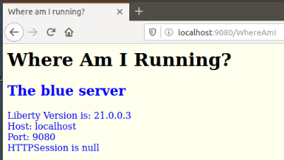

5.  > Before continuing with the lab, ensure the IHS server is STOPPED

|                                                                   |
| ----------------------------------------------------------------- |
| **/home/ibmdemo/Student/WLP\_21.0.0.3/IHS/bin/apachectl -k stop** |

6.  > Keep the “blue” Liberty server **RUNNING**

### Configure a Liberty server for working with the web server plugin

> For Liberty servers to properly work with the Web Server Plugin, the
> server configuration file (server.xml) must include the
> \<pluginConfiguration\> stanza.
> 
> For this lab, there are two basic pluginConfigration properties that
> need to be set in the server.xml file for each of the Liberty servers
> that will be load balanced via the IHS server and the web server
> plugin:

  - **pluginInstallRoot:** This property defines the location of the web
    server plugin file. It should be set to the plugin directory of the
    IHS install.

> In this lab environment, the **PluginInstallRoot** must match
> **${LAB\_HOME}\\IHS\\plugin**

  - > **logFileName:** This property will be used by the plug-in to
    > create a log file with the specified name.

> The specified directory must already exist. The postinstall script
> that you ran earlier in the lab created the directory
> ${LAB\_HOME}/IHS/plugin/logs/webserver1.
> 
> This property must match
> **${LAB\_HOME}/IHS/plugin/logs/webserver1/http\_plugin.log**

1.  > Add the \<pluginConfiguration\> to the server,xml file of the
    > “blue” server.
    
    1.  > Open the server.xml file using the gedit editor

|                                                                           |
| ------------------------------------------------------------------------- |
| gedit /home/ibmdemo/Student/WLP\_21.0.0.3/wlp/usr/servers/blue/server.xml |

2.  > Add the following text to the server.xml to set a variable to the
    > location of \[LAB\_HOME}, as illustrated below

|                                                                             |
| --------------------------------------------------------------------------- |
| \<variable name="LAB\_HOME" value="/home/ibmdemo/Student/WLP\_21.0.0.3" /\> |

3.  > Add the following text to the server.xml file to define the Plugin
    > Configuration to match the IHS web server configuration, as
    > illustrated below.

<table>
<tbody>
<tr class="odd">
<td><blockquote>

&lt;pluginConfiguration pluginInstallRoot="${LAB_HOME}/IHS/plugin" logFileName="${LAB_HOME}/IHS/plugin/logs/webserver1/http_plugin.log"/&gt;

</blockquote></td>
</tr>
</tbody>
</table>

> 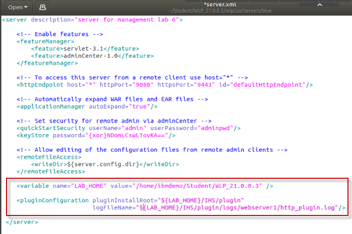

4.  > **Save** and **close** the server.xml file

> This lab demonstrates HTTP session affinity, which uses the
> **CloneID** of each server to determine the server for which a request
> has affinity. These identifiers need to be unique for each server in
> each cluster.  
> By default, a Liberty server will generate a unique identifier to use
> as its CloneID and will persist that in its workarea.
> 
> The workarea is in the local file system, by default, under the server
> **configuration/output** directory.
> 
> If the workarea is deleted, or the server is started with the --clean
> option, the CloneId is lost and will be replaced with a new value as
> the server is restarted, requiring regeneration or editing of the
> plugin-cfg.xml information for that server in order to re-establish
> affinity for requests to that server.
> 
> Setting a value for the CloneID in the server's configuration avoids
> the risk of losing a generated CloneID. So is a good practice to set a
> unique cloneID in the server.xml file for each server in the cluster.
> 
> In this lab. You are using three Liberty servers with a unique server
> name: (blue, green, red). So, you can simply set the CloneID to the
> value of the server name, as shown below.

1.  > Set the **CloneID** in the “Blue” server configuration file.
    
    1.  > Open the server.xml file using the gedit editor

|                                                                           |
| ------------------------------------------------------------------------- |
| gedit /home/ibmdemo/Student/WLP\_21.0.0.3/wlp/usr/servers/blue/server.xml |

2.  > Add the following text to the server.xml to set a variable to the
    > location of \[LAB\_HOME}, as illustrated below

|                                               |
| --------------------------------------------- |
| \<httpSession cloneId="${wlp.server.name}"/\> |

> **TIP:** Liberty has several built-in variables that can be used as
> needed. The **"${wlp.server.name}** variable contains the name of the
> Liberty server. In this case, “blue”.
> 
> 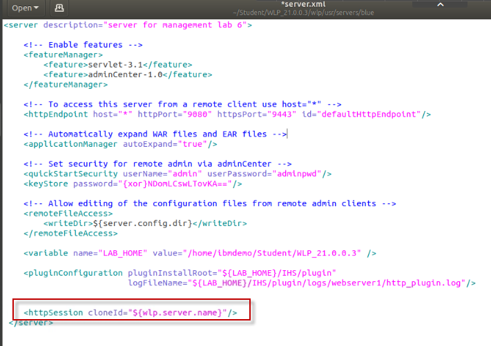

2.  **Save** and **Close** the server.xml file

### Review the plugin configuration

Web server plug-ins enable the IHS web server to communicate requests
for dynamic content, such as servlets, to the Liberty application
servers.

A web server plug-in is associated with each web server definition. The
configuration file (**plugin-cfg.xml**) that is generated for each
plug-in is based on the applications that are routed through the
associated web server.

In this section of the lab, you will examine the web server plugin
configuration file (plugin-cfg.xml) that was created for the “blue”
Liberty server.

1.  > Ensure the “blue” Liberty server is running

|                                                               |
| ------------------------------------------------------------- |
| /home/ibmdemo/Student/WLP\_21.0.0.3/wlp/bin/server start blue |

2.  > View the plugin-cfg.xml file that was automatically generated by
    > the server *blue*. It is located in the following directory:
    > **{server.output.dir}\\logs\\state**

|                                                                                          |
| ---------------------------------------------------------------------------------------- |
| gedit /home/ibmdemo/Student/WLP\_21.0.0.3/wlp/usr/servers/blue/logs/state/plugin-cfg.xml |

3.  > Since you specified the $(LAB\_HOME} variable in the **Log file
    > name** property and the **Plugin Install Root** property, make
    > sure they have been correctly expanded to the fully qualified
    > path, as shown below.

> **IMPORTANT**: If the paths are incorrect, then you must correct the
> configuration in the server.xml file before you continue the lab.
> 
> 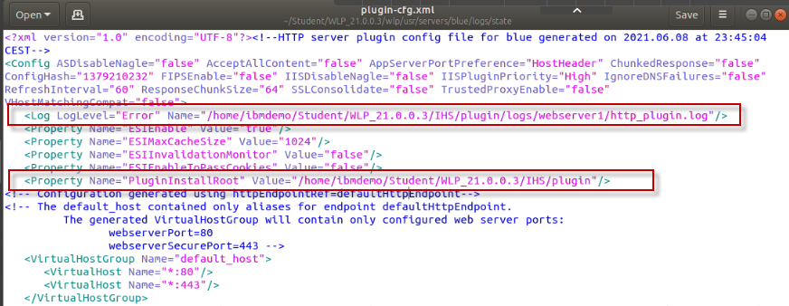

4.  > See that the **CloneID** value has been resolved to the actual
    > server name of *blue*.

> **IMPORTANT**: If the **CloneID** is incorrect, then you must correct
> the configuration in the server.xml file before you continue the lab.
> 
> 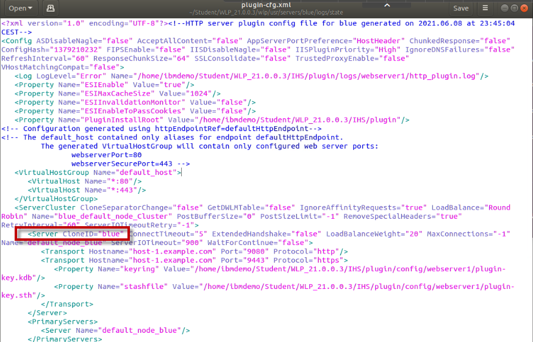

5.  **Close** the plugi-cfg.xml file.

<table>
<tbody>
<tr class="odd">
<td></td>
<td><blockquote>

<strong>TIP:</strong>

Each time you make changes to the web server plugin configuration or the HTTP session configuration, the server will regenerate the plugin-cfg.xml for the server in the ${server.config.dir}\logs\state directory.

After generating the file, the server writes this message to the messages.log file: 
 
I SRVE9103I: A configuration file for a web server plugin was automatically generated for this server at /home/ibmdemo/Student/WLP_21.0.0.3/wlp/usr/servers/blue/logs/state/plugin-cfg.xml

</blockquote></td>
</tr>
</tbody>
</table>

## Copy the server 'blue' to create a cluster of servers

Now that the configuration for the “blue” server is complete, copy the
server configuration to two additional Liberty servers, which will be
named “green”, and “red”, and will run the same applications as the blue
server.

1.  Stop the “blue” server

|                                                              |
| ------------------------------------------------------------ |
| /home/ibmdemo/Student/WLP\_21.0.0.3/wlp/bin/server stop blue |

2.  Change to the Liberty “servers” directory

|                                                        |
| ------------------------------------------------------ |
| cd /home/ibmdemo/Student/WLP\_21.0.0.3/wlp/usr/servers |

3.  Copy the “blue” server configuration to a new server configuration
    named “green”

|                  |
| ---------------- |
| cp -r blue green |

4.  Copy the “blue” server configuration to a new server configuration
    named “red”

|                |
| -------------- |
| cp -r blue red |

5.  List the “servers” directory. You should now have three server
    directories, named blue, green, and red.

> **Note:** You may see additional servers listed from other labs you
> have completed. That is OK.

|       |
| ----- |
| ls -l |

> 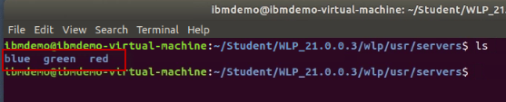

6.  Edit the **server.xml** file for the **green** server to change the
    HTTP ports to unique values, so that the port numbers won't conflict
    when they are all run on the same host.
    
    1.  > Open the server.xml file for the **green** server

|                                                                            |
| -------------------------------------------------------------------------- |
| gedit /home/ibmdemo/Student/WLP\_21.0.0.3/wlp/usr/servers/green/server.xml |

2.  > For the “green” server, change the HTTP Endpoint ports to 9081 and
    > 9444 as shown below

<table>
<tbody>
<tr class="odd">
<td><blockquote>

&lt;httpEndpoint host="*" httpPort="9081" httpsPort="9444" id="defaultHttpEndpoint"/&gt;

</blockquote></td>
</tr>
</tbody>
</table>

> 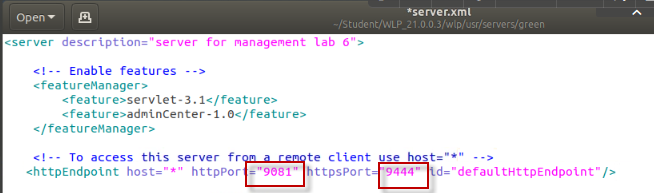

3.  > **Save** the server.xml file and **close** the editor

<!-- end list -->

7.  Edit the **server.xml** file for the **red** server to change the
    HTTP ports to unique values, so that the port numbers won't conflict
    when they are all run on the same host.

<!-- end list -->

1.  > Open the server.xml file for the **red** server

|                                                                          |
| ------------------------------------------------------------------------ |
| gedit /home/ibmdemo/Student/WLP\_21.0.0.3/wlp/usr/servers/red/server.xml |

2.  > For the “red” server, change the HTTP Endpoint ports to 9082 and
    > 9445 as shown below

<table>
<tbody>
<tr class="odd">
<td><blockquote>

&lt;httpEndpoint host="*" httpPort="9082" httpsPort="9445" id="defaultHttpEndpoint"/&gt;

</blockquote></td>
</tr>
</tbody>
</table>

> 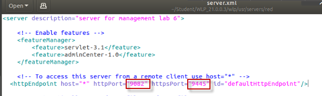

1.  **Save** the server.xml file and **close** the editor

<!-- end list -->

8.  Add a **virtual host** definition to each server.xml.

> A virtual Host controls which ports a client can use to send requests
> to the server. In each case the virtual host entry should reference
> the **defaultHttpEndpoint**, which is being used by the sample
> applications, and have child **host alias** elements that specify the
> HTTP port of the liberty server (so that requests can still be made
> directly to the server) and the port of the IHS server, which we set
> earlier to be **9180**. For convenience, add the complete set of
> ports, for all server, to the server.xml of each server:

1.  > For your reference, listed below are the commands to open each of
    > the server.xml files using the gedit editor.

<table>
<tbody>
<tr class="odd">
<td>
gedit /home/ibmdemo/Student/WLP_21.0.0.3/wlp/usr/servers/blue/server.xml

gedit /home/ibmdemo/Student/WLP_21.0.0.3/wlp/usr/servers/green/server.xml

gedit /home/ibmdemo/Student/WLP_21.0.0.3/wlp/usr/servers/red/server.xml
</td>
</tr>
</tbody>
</table>

2.  > Add the following **VirtualHost** stanza to the server.xml file
    > for the blue, green and red servers: The command to open the
    > server.xml for each server is shown below.

<table>
<tbody>
<tr class="odd">
<td>
&lt;virtualHost id="default_host" allowFromEndpointRef="defaultHttpEndpoint"&gt;

&lt;hostAlias&gt;*:9080&lt;/hostAlias&gt;

&lt;hostAlias&gt;*:9081&lt;/hostAlias&gt;

&lt;hostAlias&gt;*:9082&lt;/hostAlias&gt;

&lt;hostAlias&gt;*:9180&lt;/hostAlias&gt;

&lt;/virtualHost&gt;
</td>
</tr>
</tbody>
</table>

3.  > **Save** each of the servr.xml files. Then **close** the editor.

4.  > Each server’s server.xml file should now include the virtualHost
    > stanza as illustrated below.

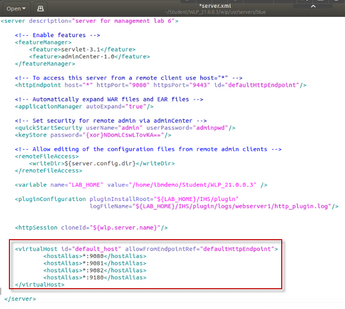

9.  Start all the servers with the --clean option to clear out the
    copied workarea:

<table>
<tbody>
<tr class="odd">
<td>
/home/ibmdemo/Student/WLP_21.0.0.3/wlp/bin/server start blue --clean

/home/ibmdemo/Student/WLP_21.0.0.3/wlp/bin/server start green --clean

/home/ibmdemo/Student/WLP_21.0.0.3/wlp/bin/server start red --clean
</td>
</tr>
</tbody>
</table>

10. Using the Firefox Browser on the VM, make sure you can access the
    demo applications in all the servers by invoking them directly, via
    their internal HTTP ports.

> **Blue Server**
> 
> <http://localhost:9080/WhereAmI>
> 
> <http://localhost:9080/WhereAmIWithSession>
> 
> **Green Server**
> 
> <http://localhost:9081/WhereAmI>
> 
> <http://localhost:9081/WhereAmIWithSession>
> 
> **Red Server**
> 
> <http://localhost:9082/WhereAmI>
> 
> <http://localhost:9082/WhereAmIWithSession>

11. **Close** the Firefox Browser and all the open Browser tabs. This
    will clear the browser cache and session data

The servers should all be setup correctly and successfully handing the
application requests from the browser.

In the next section, you will merge the HTTP Pugin files that were
automatically generated for each of the servers, into a single HTTP
plugin configuration. This will allow the IHS web server to route
incoming HTTP requests to all three of the Liberty servers to load
balance the workload.

## Create a merged plug-in configuration file

When the Liberty servers were started, Liberty generated its
**plugin-cfg.xml** file in its **{server.output.dir}/logs/state**
directory.

There is a **pluginUtility** command provided with Liberty that can
merge the separate plugin-cfg.xml files into a single (merged)
plugin-cfg.xml file that is required by the IHS Web Server.

There are two ways to specify the input files for the pluginUtility:

  - > Specify a comma-separated list of fully qualified file names

  - > Specify a directory that contains all the files to be merged (in
    > which case you would need to rename those files so they can all go
    > in the same directory).

> For this lab we will use the first method, providing a comma-separated
> list of fully qualified file names.

1.  View the HELP for the pluginUtility tool

<!-- end list -->

1.  > Run the pluginUtility with “help” flag to see the available
    > options for running the tool.

> The pluginUtility supports the “merge” and “generate” options as
> shown.

|                                                                |
| -------------------------------------------------------------- |
| /home/ibmdemo/Student/WLP\_21.0.0.3/wlp/bin/pluginUtility help |

> 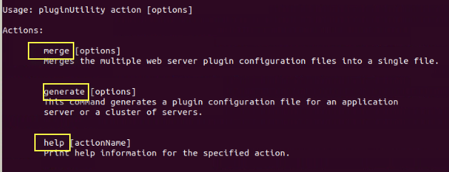

2.  > View the HELP for the “**merge**” action

|                                                                      |
| -------------------------------------------------------------------- |
| /home/ibmdemo/Student/WLP\_21.0.0.3/wlp/bin/pluginUtility help merge |

> 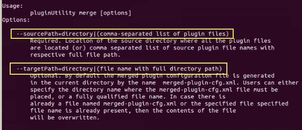
> 
> As noted earlier, you will merge the plugin-cfg.xml files by providing
> a comma separated list of plugin files. This is accomplished using the
> --sourcePath option with a comma separated list of plugin files.

2.  Merge the plugin-cfg.xml files for the three servers, proving a
    comma-separated list of files using their fully qualified path

<!-- end list -->

1.  > Navigate to the BLUE server’s directory

|                                                             |
| ----------------------------------------------------------- |
| cd /home/ibmdemo/Student/WLP\_21.0.0.3/wlp/usr/servers/blue |

2.  > Run the pluginUtility to merge the plugin-cfg.xml files from the
    > blue, green, and red servers

|                                                                                                                                                                                                        |
| ------------------------------------------------------------------------------------------------------------------------------------------------------------------------------------------------------ |
| /home/ibmdemo/Student/WLP\_21.0.0.3/wlp/bin/pluginUtility merge --sourcePath=logs/state/plugin-cfg.xml,../green/logs/state/plugin-cfg.xml,../red/logs/state/plugin-cfg.xml --targetPath=plugin-cfg.xml |

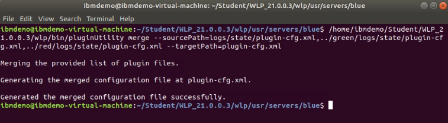

> **  
> **The merged plugin-cfg.xml file is created in the location defined by
> the **--targetPath** option on the pluginUtility. In this case, the
> file is generated in the current directory from where the command was
> executed. {**LAB\_HOME}/wlp/usr/servers/blue/plugin-cfg.xml**.

3.  Copy the merged plugin-cfg.xml file to the plugin directory
    specified in the web server’s configuration file httpd.conf).

> **Note:** The file MUST be in this location for the Web Server to work
> with the web server plugin and route traffic to the Liberty servers.

|                                                                           |
| ------------------------------------------------------------------------- |
| cp ./plugin-cfg.xml \~/Student/WLP\_21.0.0.3/IHS/plugin/config/webserver1 |

> Everything should now be setup and configured to run the applications
> through the web server, where the web server plugin is invoked to
> inspect the incoming HTTP request, and route to one of the three
> Liberty serves that are configured to run the application.

## Explore the plugin-cfg.xml

Before running the application, you will first explore the contents of
the merged plugin-cfg.xml file to gain an understanding of how the web
server plugin is configured to route incoming HTTP requests of specific
applications to the three Liberty servers.

1.  Examine the merged pluin-cfg.xml file

|                                                                                       |
| ------------------------------------------------------------------------------------- |
| gedit /home/ibmdemo/Student/WLP\_21.0.0.3/IHS/plugin/config/webserver1/plugin-cfg.xml |

There are four key sections of the plugin-cfg.xml file, and identified
by COMMENTS in the file:

  - Server Clusters

  - Virtual Hosts Groups

  - URI Groups

  - Routes

The **Server Cluster** configuration defines the Liberty **servers**
that are included in the cluster that can accept incoming HTTP requests.
The Server Cluster defines the load balancing option, which in this case
is “Round-Robin”. The alternative load balancing option is “Random”.

Each of the Liberty **Server** configuration is defined under the Server
Cluster. The Server configuration defines the unique CloneID, HTTP(S)
ports, timeout values, and more.

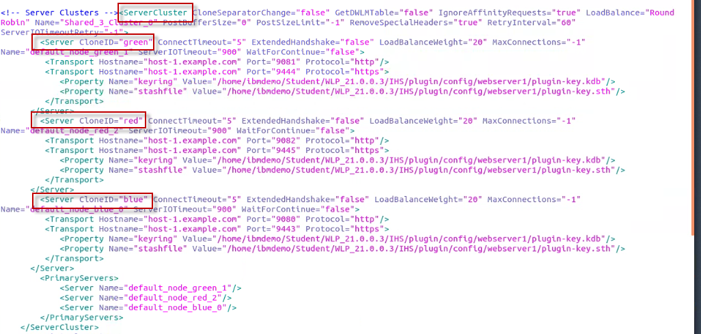

The **Virtual Hosts Groups** define the HOST and PORT that the incoming
HTTP traffic can be routed.

In this case, the Asterisk (\*) means that ANY host on the specified
ports can handle the incoming requests.

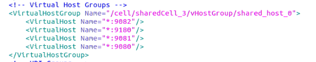

The **URI Group** defines the URI’s that must be matched for the
incoming traffic to be routed to a server.

In this case, the WhereAMI and WhereAnIWithSession are included in the
URI matching, as these applications are running on the Liberty servers.

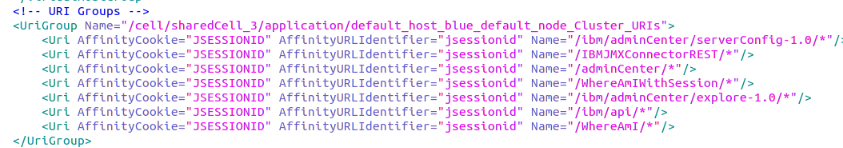

The **Route** directive ties the **VirtualHostGroup**, **UriGroup**, and
**ServerCluster** elements together.

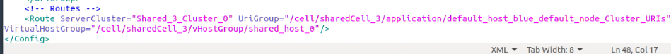

The **\<Route\>** directive instructs the plug-in to forward requests
for URLs that match the **UriGroup** (meaning, URLs that match the
application context routes in the servers, like **"/WhereAmI/\*")**

And**,** requests that are sent to hosts in the **VirtualHostGroup**
(meaning, any requests that arrive on port 9180); the requests should be
forwarded to a WebSphere server in **ServerCluster** (meaning, the
servers that listen on ports 9080, 9081 and 9082 – our Liberty servers).

In other words, the plug-in will cause IHS web server to forward any
requests that belong to our application to Liberty, and it will handle
all other requests itself.

The plugin-cfg.xml file is directly tied to your Liberty topology. If
you make changes you to the topology, you must update plugin-cfg.xml.

If you were to add more applications to your Liberty server, you would
have to copy the regenerated plug-in configuration file to the IHS
install to access the new applications through IHS.

The new plugin-cfg.xml file would include your new applications in
**UriGroup**, so the plug-in would forward those requests to Liberty as
well as requests for the WhereAmI application.

In the case of a Liberty cluster, you would also have to re-generate a
new plug-in configuration file whenever you add or remove cluster
members, to update the **ServerCluster** directives.

If you manage your Liberty servers in a Collective, you can use the
Dynamic Routing feature to make those routing changes automatically.
However, Using Dynamic Routing and Liberty Collectives is beyond the
scope of this exercise.

2.  **Close and Exit the Gedit editor without saving any changes to the
    file**

## Testing the plug-in

Now everything is set up to test the plugin load balancing and failover
capabilities.

1.  Start the web server with this command:

<table>
<tbody>
<tr class="odd">
<td>
cd ~/Student/WLP_21.0.0.3/IHS/bin

./apachectl -k start -f conf/httpd.conf
</td>
</tr>
</tbody>
</table>

2.  **CLOSE** the Firefox Browser and all opened Browser tabs, if
    opened. We want to be sure there is no browser cached content before
    continuing with the lab.

3.  **Re-Launch the Firefox Browser**

4.  Check that IHS is running by entering this into your browser:
    
    <http://localhost:9180>
    
    You should see the IHS welcome screen displayed in your browser:  
      
    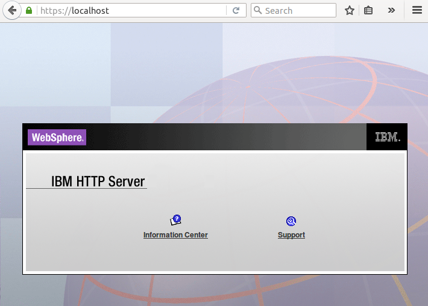

5.  Check that the web server **error\_log** and verify the WebSphere
    Plugin has been loaded.

|                                                                                               |
| --------------------------------------------------------------------------------------------- |
| tail -50 /home/ibmdemo/Student/WLP\_21.0.0.3/IHS/logs/error\_log | grep -A 6 'Plugins loaded' |

> 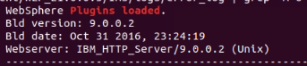

6.  Access the “WhereAmI” application through the web server using this
    URL:

[http://localhost:9180/WhereAmI](http://localhost/WhereAmI)

7.  **Refresh** the browser several times and see the plug-in performing
    the round robin load balancing around the red, blue, and green
    servers in the cluster.

8.  Access the “WhereAmiWithSession” application, which creates an HTTP
    session, using this URL:

<http://localhost:9180/WhereAmIWithSession>

9.  **Refresh** the browser and note that all the requests go to the
    same server; this is the session affinity function.

10. Try **stopping** that server and retrying the request. What happens?
    You should see that the session affinity causes all the requests to
    go to that server unless you **stop** the server Then the request
    **'fails over'** to a different server and establishes affinity
    there.

<!-- end list -->

1.  > To stop the server that handled the **WhereAMIWithSession**
    > application, use the corresponding command to STOP the COLOR of
    > server that the application has affinity.

<table>
<tbody>
<tr class="odd">
<td>
<strong>Stop the BLUE Server</strong>

/home/ibmdemo/Student/WLP_21.0.0.3/wlp/bin/server stop blue

<strong>Stop the GREEN Server</strong>

/home/ibmdemo/Student/WLP_21.0.0.3/wlp/bin/server stop green

<strong>Stop the RED Server</strong>

/home/ibmdemo/Student/WLP_21.0.0.3/wlp/bin/server stop red
</td>
</tr>
</tbody>
</table>

2.  **Refresh** the “WhereAmIWIthSession” application in the Browser.
    Now a DIFFERENT color server handles the requests.

## Cleanup

Clean up the environment.

1.  Stop the liberty servers using the following commands:

<table>
<tbody>
<tr class="odd">
<td>
<strong>Stop the BLUE Server</strong>

/home/ibmdemo/Student/WLP_21.0.0.3/wlp/bin/server stop blue

<strong>Stop the GREEN Server</strong>

/home/ibmdemo/Student/WLP_21.0.0.3/wlp/bin/server stop green

<strong>Stop the RED Server</strong>

/home/ibmdemo/Student/WLP_21.0.0.3/wlp/bin/server stop red
</td>
</tr>
</tbody>
</table>

2.  Stop the web server using the following command:

|                                                               |
| ------------------------------------------------------------- |
| /home/ibmdemo/Student/WLP\_21.0.0.3/IHS/bin/apachectl -k stop |

3.  Close the Browser

4.  Close all opened Terminal windows

# Appendix: Configure a Liberty server via admin center

## Configure a Liberty server via admin center.

> Using the Admin Center Config tool is a good way to see all the
> configuration elements and attributes available in the server.

1.  Set the correct configuration properties for the liberty server to
    use when generating the web server plugin configuration file. Using
    the Admin Center Config tool: open the tool by entering this in your
    browser:

> <http://localhost:9080/ibm/adminCenter/serverConfig-1.0/>
> 
> If the browser displays a warning about the connection being
> untrusted, add the security exception.

2.  Login to the Admin Center using the user (**admin**) and password
    (**adminpwd**) that are specified in the quickStartSecurity
    configuration in the server.xml (the password is deliberately left
    in plain text so you can see it).

3.  In the Configuration Files screen, select server.xml. This will open
    the server configuration editor. You can switch between the Design
    and Source views in the editor.  
      
    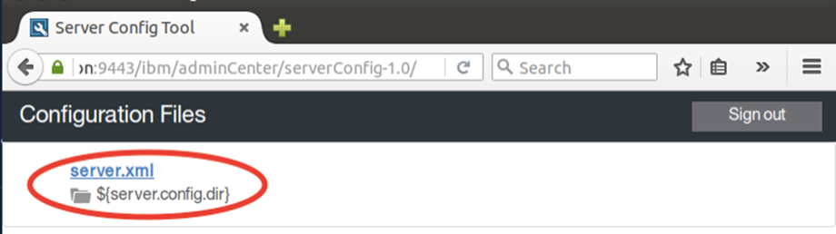

4.  In the configuration editor **Design view**, click on the **Server**
    scope and then click on **Add child**.

> For this lab, we need to override some of the default configuration
> settings for the web server plugin so that the appropriate values are
> used for the plugin-cfg.xml file that is generated by the Liberty
> server.  
>   
> 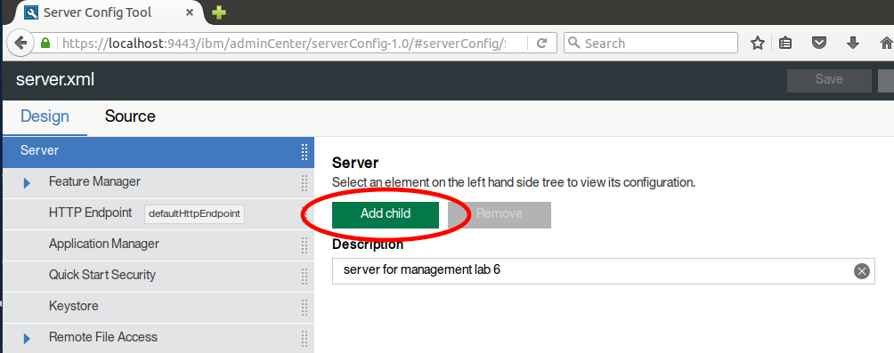

5.  Double-click on **Web Server Plugin**.  
      
    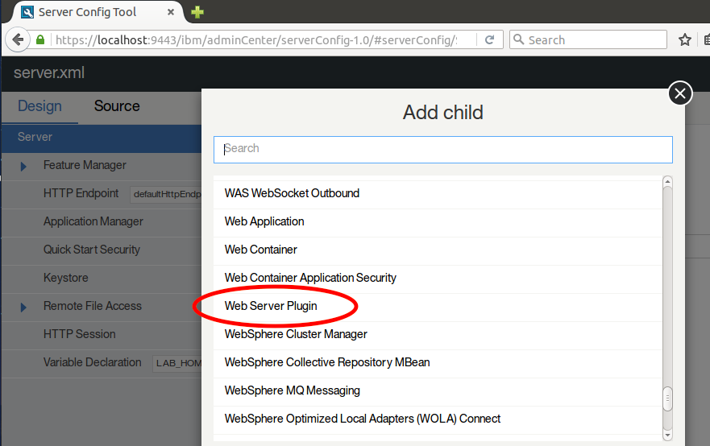

6.  Change the first attribute, the **Plugin Install Location**, to
    match the plugin directory in your IHS install, which should be
    **${LAB\_HOME}\\IHS\\plugin**. You can either declare LAB\_HOME as a
    variable in the server configuration (add a server child element
    type Variable Declaration) or enter the absolute path for
    ${LAB\_HOME} in the **Plugin install location**.  
    Save your changes by clicking the Save button.

7.  > Go back to the **Web Server Plugin** configuration element, and
    > scroll down to the **Log file name** property. This will be used
    > by the plug-in to create a log file with the specified name, but
    > the specified directory must already exist. The postinstall script
    > that you ran in step 1.2.2 above created the directory
    > ${LAB\_HOME}/IHS/plugin/logs/webserver1 so we will specify the log
    > file name as
    > **${LAB\_HOME}/IHS/plugin/logs/webserver1/http\_plugin.log**.  
    >   
    > 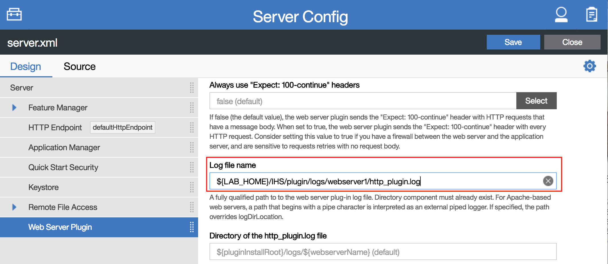

8.  This lab will demonstrate HTTP session affinity, which uses the
    CloneID of each server to determine the server for which a request
    has affinity. These identifiers need to be unique for each server in
    a given cluster.  
    By default, a Liberty server will generate a unique identifier to
    use as its CloneID, and will persist that in its workarea. The
    workarea is in the local file system, by default under the server
    configuration/output directory. If the workarea is deleted, or the
    server is started with the --clean option, the CloneId is lost and
    will be replaced with a new value as the server is restarted,
    requiring regeneration or editing of the plugin-cfg.xml information
    for that server in order to re-establish affinity for requests to
    that server. Setting a value for the CloneID in the server's
    configuration avoids the risk of losing a generated CloneID so is a
    good practice if you can determine values that will be unique for
    each server within the cluster. In this case we are going to create
    servers with unique names, so we will use the server name as the
    CloneID value.  
      
    Click on the top-level **Server** element, and **Add child** of type
    **HTTP Session**. Set the **Clone identifier** value in the HTTP
    Session configuration to the variable that liberty uses for the
    server name: **${wlp.server.name}**.  
      
    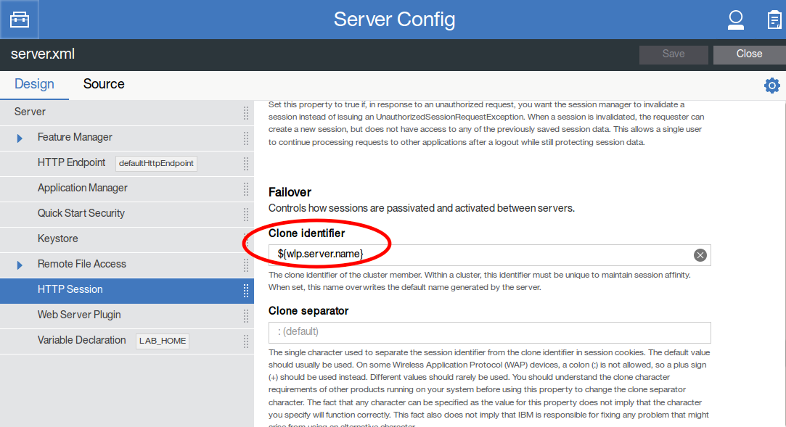

9.  Click the **Save** button to save the configuration.

10. > You have now finished using the Admin Center and can remove it
    > before cloning your server to create the cluster. Close your
    > browser window and open the
    > **{LAB\_HOME}\\wlp\\usr\\servers\\blue\\server.xml** file in an
    > editor.

> Delete (or comment out) the following lines:
> 
> \<feature\>adminCenter-1.0\</feature\>  
> \<remoteFileAccess\>  
> \<writeDir\>${server.config.dir}\</writeDir\>  
> \</remoteFileAccess\>

11. **Save** the configuration.

#
