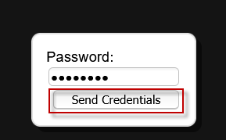
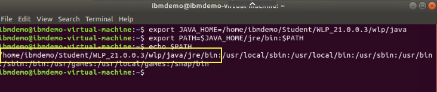

# Liberty - Migration Toolkit**

**Software Analyzer and Binary Scanner**

In this lab we will learn to use the following migration tools, which
are a subset of the WebSphere Migration Toolkit suite of tools.

The **Liberty Migration Toolkit** determines the suitability of
migrating your applications from WebSphere Application Server, or other
third-party Java EE servers, to WebSphere Liberty. To analyze an
application for migration suitability, the application must be imported
into your Eclipse-based IDE.

The **Migration Toolkit Eclipse plug-in** includes several rule sets to
scan Java EE applications for the use of vendor specific deployment
descriptors, JSP files with proprietary APIs, and Java code with
proprietary APIs. The rules scan applications for the use of Java
technologies and APIs that are not supported in WebSphere Liberty.

The **Migration Toolkit for Application Binaries** is a stand-alone tool
that can scan your application binaries, without source code, to give
you a report of the programming models used by your application, and
where they will run. It also offers an option to generate a detailed
report about which line of your application may need to be changed.

In this lab exercise, you will learn how to:

  - Import the Sample Application onto Eclipse

  - Scan the imported application

  - View Migration Results and Generate Report.

  - Create additional scan reports and compare.

You will also learn how to:

  - Install the Migration Toolkit for Application Binaries

  - Use the toolkit to scan an application

  - Generate an evaluation report

  - Generate a detailed report

<table>
<tbody>
<tr class="odd">
<td>
<strong>Notice</strong>

<ul>
<li>
You don’t need to be an Eclipse power-user. But, a basic level of familiarity with Eclipse is beneficial.
</li>
<li>
Efforts have been made to ensure the screenshots in this lab are current and accurate. However, there may be subtle variations in what you see. The differences may be attributed to the Eclipse version used.
</li>
</ul></td>
</tr>
</tbody>
</table>

##  WebSphere developer and Migration tools in the Eclipse Marketplace 

For your reference, below are some links and remarks about the various
 WebSphere developer tools and migration tools, all of which can be
 downloaded from the Eclipse marketplace.
 
**Note:** The tools required for this lab have already been downloaded
 an installed in the lab environment.
 
   - **WebSphere Application Server Developer Tools** (this link is for v.8.5.5, but 9.x contains the same function for v9)
    
     <https://marketplace.eclipse.org/content/ibm-websphere-application-server-v85x-developer-tools>
 
     An Eclipse IDE for building and deploying Java EE, OSGi and Web 2.0 applications to WebSphere Application Server V8.5x.
 
     For more information about installing and downloading the tools,
 including archived versions of the tools for older versions of
 Eclipse, see [WebSphere Application Server
 Developer Tools  Releases](https://developer.ibm.com/wasdev/docs/websphere-developer-tools-releases/)
 

   - **Liberty Developer Tools**
 <https://marketplace.eclipse.org/content/bm-liberty-developer-tools>
 
     An Eclipse IDE for building and deploying Java EE, OSGi and Web 2.0 applications to Open Liberty and WebSphere Application Server Liberty.
 
     For more information about installing and downloading the tools,
 including archived versions of the tools for older versions of
 Eclipse, see [WebSphere Application Server
 Developer Tools  Releases](https://developer.ibm.com/wasdev/docs/websphere-developer-tools-releases/).

     Releases from 2021-03 onwards have some known issues and workarounds which can be found
 [here.](https://github.com/OpenLiberty/open-liberty-tools/wiki/Liberty-Tools-known-issues)
 
 
   - **WebSphere Application Server Migration Toolkit**
 <https://marketplace.eclipse.org/content/ibm-websphere-application-server-migration-toolkit>
 
     The IBM® WebSphere® Application Server Migration Toolkit is a suite of tools and knowledge collections that enables your organization to  migrate quickly and cost-effectively to WAS Liberty and WebSphere Application Server V8.5.5 or V9, whether from a previous version of WebSphere Application Server or competitive application servers including Apache Tomcat Server, JBoss Application Server, Oracle  Application Server, and Oracle® WebLogic Server. It features cloud migration rules for running your application on Liberty for Java on  IBM Cloud and other third-party PaaS environments such as Cloud Foundry.
 
     Go to the [WebSphere migration tools download page](http://ibm.biz/DownloadWASMigTools) to download this tool and the command line binary scanner.
 

  - **IBM WebSphere Application Server Migration Toolkit - WAS
 Liberty**

     <https://marketplace.eclipse.org/content/ibm-websphere-application-server-migration-toolkit-was-liberty>
 
     The IBM® WebSphere Application Server Migration Toolkit helps you move  traditional WebSphere Application Server applications to Liberty, which can be running inside or outside of the cloud.
 
     Go to the [WebSphere migration tools download  page](http://ibm.biz/DownloadWASMigTools) to download this tool  and the command line binary scanner.

## Accessing the lab environment

If you are doing this lab as part of an instructor led workshop (virtual or face to face), an environment has already been provisioned for you. The instructor will provide the details for accessing the lab environment.

Otherwise, you will need to reserve an environment for the lab. You can obtain one here. Follow the on-screen instructions for the “**Reserve now**” option.

<https://techzone.ibm.com/my/reservations/create/60da2c20e2cb7a001f656575>

 The lab environment contains one (1) Linux VM, named **Workstation**.

  
    
  The Ubuntu Linux **Workstation** VM has the following software installed for the lab:
  
  - Application Project with Liberty
  - Maven 3.6.0 

   
  
1.  Access the lab environment from your web browser. 
    
    A Published Service is configured to provide access to the **Workstation** VM through the noVNC interface for the lab environment.

    a.  When the environment is provisioned, right-mouse click on the **Published Service** link and open the URL in a new private or incognito browser window, as described below:  
    
    - If using **Google Chrome** browser, select **"Open link in incognito window"** from the context menu. 

      
    
    - If using **Firefox** browser, select **"Open link in new private window"** from the context menu. 

      

    b. Click on the **"vnc.html"** link to open the lab environment through the **noVNC** interface. 

      

 
    c. Click the **Connect** button 
    
      

    d. Enter the password as:  **passw0rd**. Then click the **Send Credentials** button to access the lab environment. 

    > Note: That is a numeric zero in passw0rd  

      

2. Login with **ibmdemo** ID.
    
    a.  Click on the “**ibmdemo**” icon on the Ubuntu screen.

      

    b. When prompted for the password for “**ibmdemo**” user, enter
    “**passw0rd**” as the password:

    Password: **passw0rd** (lowercase with a zero instead of the o)
 
      

     
	
3.  Once you access the **Student VM** through the published service, you will see the Desktop, which contains all the programs that you will be using (browsers, terminal, etc.)

   

## Tips for working in the lab environment     

1.  You can use your Browsers **zoom in** and **zoom out** options to resize the virtual desktop to fit your screen.

    The examples below are using Firefox and Chrome browsers. 

    - Firefox example: 
    
    

    - Chrome example: 
      
     

2.  You can copy / paste text from the lab guide into the lab environment using the clipboard in the noVNC viewer. 
   
    a. Copy the text from the lab guide that you want to paste into the lab environment
    
    b. Click the **Clipboard** icon and **paste** the text into the noVNC clipboard

    
    
    c. Paste the text into the VM, such as to a terminal window, browser window, etc. 

    d. Click on the **clipboard** icon again to close the clipboard

    > **NOTE:** Sometimes pasting into a Terminal window in the VM does not work consistently. In this case you might try again, or paste the text into a **Text Editor** in the VM, and then paste it into the Terminal window in the VM. 

3. An alternative to using the noVNC Copy / Paste option, you may consider opening the lab guide in a web browser inside of the VM. Using this method, you can easily copy / paste text from the lab guide without having to use the noVNC clipboard. 

     

|                                         |                                                                                                                                      |
| --------------------------------------- | ------------------------------------------------------------------------------------------------------------------------------------ |
|  | **TIP:** Liberty is pre-installed on the VM environment provided. **{LAB\_HOME}** refers to: **/home/ibmdemo/Student/WLP\_21.0.0.3** |

**TIP:** To reduce typing or copy & past of commands, you can find the
related code snippets or commands in the VMWare image in the directory:

        /home/ibmdemo/Student/lab-files/CodeSnippets/LibertyBootcamp_Lab6_LibertyMigrationToolkit_CodeSnippets.txt

<table>
<tbody>
<tr class="odd">
<td></td>
<td>
<strong>Important:</strong>

<strong>Click CANCEL</strong>…. If, at any time during the lab, you get a pop-up asking to install updated software onto the Ubuntu VM.

The one we experience is an update available for VS Code.

<strong>CLICK CANCEL!</strong>

</td>
</tr>
</tbody>
</table>

## Import the Sample Day Trader Application
    
To analyze an application for migration suitability, the application
    **source code** must be imported into your Eclipse-based IDE. If the
    application is not already in Eclipse, an easy way to import the
    application and organize it in projects that reflect their structure
    as EAR, WAR, and EJB files is by using the Eclipse import function
    as illustrated in the steps below.

1. If Eclipse is not already started, start it now
    
    a.  Use the File Explorer to navigate to the directory
        
        Home > Student > WLP_21.0.0.3 > wdt > eclipse
    
    b. Double-click on the **eclipse** executable to start Eclipse.
        
    
    
    c.  When the Eclipse launcher prompts you to select a workspace,
         enter the following directory. Then click the **Launch**
         button.

        /home/ibmdemo/Student/WLP_21.0.0.3/migworkspace

    

    d.  Close the **welcome page** by clicking on the **‘X**’ icon.

    

2.  Import the sample application source code that is provided with
     the lab
    
    a.  From the Eclipse main menu, Select **File > Import** menu
         option.
        
    
    
    b.  From the context menu. expand **Java EE**, select **EAR**
         File, then click **Next**
        
        
    
    c.  Click the **Browse** button to navigate to the location of the
        day trader sample application EAR file used in this lab
        
    
    
      
    d.  Navigate to the following directory:
        
        /home/ibmdemo/Student/WLP_21.0.0.3/labs/development/1_LibertyMigrationToolkit_20171223
    
    e.  Select **daytrader20-ee5-src.ear**. Click **Open**
        
    
    
    f.  Set **Target runtime** to **None**. Click **Next**
        
    
    
    g. On the “**Utility JARs and web libraries**” page, accept the
        default values, click **Next**
        
    
    
    h.  The next panel shows different additional projects that will
         be created. Later we will configure the migration toolkit to
         scan these projects. Click **Finish**.
        
    
        
    The daytrader application will be imported into the Eclipse
    workspace.
    
    i. Click **Yes,** if prompted to switch to the Java EE
        perspective

<table>
<tbody>
<tr class="odd">
<td></td>
<td>
<strong>IMPORTANT TIP:</strong>

The daytrader application source code that was imported into the Eclipse workspace will show ERRORS in the projects.

That is OK and expected since the workspace has not been setup with the proper Java Class Paths for the application to successfully compile

The application does <strong>NOT</strong> need to compile successfully for the migration toolkit to scan the application and report possible application migration issues in the source code.
</td>
</tr>
</tbody>
</table>

 

## Scan the DayTrader Sample application
    
Once the application is imported into the Eclipse workspace that has the migration toolkit plugin installed, you are ready to use the     software analyzer to scan the application for application possible    migration issues.
    
The daytrader application that you will scan is an application     that currently runs on WebSphere Traditional Application Server,    version 7 environment. The goal of this exercise is to determine    what application code changes are necessary to migrate the daytrader application form WebSphere Traditional (Version 7) to Liberty.
    
The migration tools take into consideration, the JEE version and     Java version differences between the source and target runtime    environments. It also considers differences between WebSphere    versions and editions.

<table>
<tbody>
<tr class="odd">
<td>

</li>
</td>
<td>

<strong>Information:</strong>

<strong>The Eclipse environment used for this lab has the Migration Tools Eclipse Plugin installed. The plugins are available from the Eclipse Marketplace, which can be accessed from within the Eclipse workspace via Help &gt; Eclipse Marketplace option from the main menu.</strong>

</td>
</tr>
</tbody>
</table>

To begin, launch the **Software Analyzer** tool in Eclipse, and set the configuration options based on the migration source and target runtime environment preferences.

These preferences determine the **migration rules** that must be applied when the Software Analyzer scans the application for potential migration issues from the source to the target runtime environments.

 

1.  Launch the Software Analyzer tool: Right-click on the
    **daytrader20-ee5-src** sample application that you imported, and
    navigate to **Software Analyzer Software Analyzer Configurations**
    
    

2.  Create a new Software Analyzer configuration
    
    a.  **Right-mouse click on Software Analyzer, and select “New
        Configuration” form the context menu**
        
    
    
    b.  Enter **DayTrader Liberty Core** as the Name of the new
        configuration.
        
    
    
    c.  Click **Analyze selected projects** radio button. and choose all five of the Day Trader application related projects to be   analyzed.
        
    

3.  Set the **Rule Set** for the software analyzer configuration
    
    a.  Select the **Rules tab**
    
    b. Select **WebSphere Application Server Version Migration** from
        the **Rule Sets** drop-down.
    
    c. Click the **Set button**
        
    

4.  Complete the Rule Set configuration by selecting the source and
    target environment configurations
    
    a.  Configure the rule set as shown below: Click **OK** button
        when complete

    - Source Application server: **WebSphere Application Server V7.0**

    - **Target Application server: Liberty Core**

    - **Target Java EE version: Java EE 7**

    - **Target Java version: IBM Java 8**
    
    
    
    b. Click the **OK** button to continue
    
       
    c. From the New Configuration page, Click **Apply** and then
        **Analyze**
        
    
        
    At this point, the software analyzer scans the application    projects. When complete, the results are displayed in the         **Software Analyzer Results** tab at the bottom pf the Eclipse   perspective.
        
     

### Review the software analysis results
            
In this section of the lab, you will review the results of            the migration analysis.
            
The results are presented in groups, based on the types of         rules that are applied. At the highest-level grouping, the          analysis results to be reviewed are arranged by Files, JSP            pages, Java Code, and XML files.
            
Under each of those hi-level groupings, further            categorization of flagged rules is displayed based on the             differences between versions of Java EE and Java between  the   Source and Target runtimes configured defined in the rule set.
            
In the steps to follow, you will review the analysis            results for the Java Code from the daytrader application            projects. You will learn how the migration tools help the            developer understand where the application may require            changes during migration, based on the differences between            the source and target environments, and how to get            additional contextual help and insights to make the            necessary code changes during the migration.

<table>
<tbody>
<tr class="odd">
<td></td>
<td>
<strong>TIP:</strong>

<strong>Remember, in this case, the rules flagged are based on migrating the daytarder application from traditional WebSphere Application Server V7 to Liberty Core.</strong>

<strong>If you change the rule set to specify different source and target environments, the results will be different</strong>
</td>
</tr>
</tbody>
</table>

1.  Locate the Java code review results
    
    a.  Click **Software Analyzer Results** tab, located at the bottom
        of the Eclipse workspace.
        
    On the left is the scan history. There is currently only one     scan for **DayTrader Liberty Core**
    
    b.  Click the **Java Code review** tab to inspect the results of
        scanning Java code
        
    

2.  Choose one of the flagged items under the **Liberty Migration**
    section to view a specific issue
    
    a.  Double click on the Software Analyzer tab to bring into full
        screen mode (for a larger viewing area)

    b.  Click and expand the **Liberty migration > Java technology
        Report > Liberty Core > Low complexity > Java Message Service
        (JMS)**
        
    

3.  Display the **contextual help** for the selected item
    
    a. From the main menu, click **Help > Show contextual help**
    
    b.  Click on the **Java Message Service (JMS)** to highlight the line item.
        
    
    
    c.  **The contextual help** is displayed for the rule that was flagged for this item.
        
    Note that the help message explains that even though JMS is not  supported for Liberty core edition, it is available in other     editions via other features. The same restriction applies to MDB  and remote EJBs that are flagged.
        
    

4.  Expand **Liberty** to examine additional scan results. You will see
    that the deprecated JAX-RPC API is not available in Liberty. In the
    HELP, Options are provided for the developer.
    
    a.  Expand **Liberty migration > Java technology support > Liberty
        > Medium complexity**
    
    b.  Under **Medium complexity**, click on **JAX-RPC** and read the
        **Help** text
        
    

5.  Let’s review a flagged issue under the category of **WebSphere
    traditional to Liberty**. These issues relate specifically to
    differences between WebSphere traditional and Liberty. The previous
    issues were related to differences in Java technologies.
    
    a.  Under **WebSphere traditional to Liberty** section, examine
        which third party APIs are not available in Liberty.
        
     
    
        
    In addition to reviewing the migration analysis using the        Eclipse IDE, you can also generate reports that can be shared     with your development team.

6.  Generate a report for the Liberty Core section of the migration
    analysis
    
    a.  Select **Liberty Core** and click the **Generate Report** button
        
    
    
    b.  Select **Java Code Review Results** from the Report dialog box.
        Click the **OK** button
        
    
        
    The result will appear in a different pane and will look like
        the one below:
    
    c.  **Close** the PDF report when you finish reviewing it
        
    
    
     
        
## Create Scan Report for WebSphere to Liberty 
        
The scan report and analysis in the previous section was a         result of the migration rule set from WebSphere Traditional V7        to Liberty Core.
        
Because Liberty Core does NOT support the full range of Java EE        API specifications, in which WebSphere Traditional does, you        found there were migration issues that were flagged because the        APIs are not available in Liberty Core. However, Liberty (or        Liberty Base) does support the full set of Java EE APIs.
        
So, lets configure a migration scan that focuses on migration        from WebSphere Traditional V7 to Liberty and review the results.

 

1.  If the Software Analyzer Results is still in **full screen** mode,
    **double click** on it to revert to the normal view, and you can see  the daytrader projects in the Enterprise Explorer view.

2.  Setup a new **Software Analyzer configuration** for the new
    migration analysis.
    
    a.  Right click on any **daytrader2—ee5-src** project and navigate
         to **Software Analyzer** **Software Analyzer Configurations…**
        
    
    
    b.  Right-mouse click on **Software Analyzer**, and select **“New
        > Configuration”** form the context menu
        
    
    
 
    c.  Enter **DayTrader Liberty** as the Name of the new
        configuration.
        
    
    
    d.  Click **Analyze selected projects** radio button. and choose all  five of the Day Trader application related projects to be    analyzed.
        
    

3.  Set the **Rule Set** for the software analyzer configuration
    
    a.  Select the **Rules tab**
    
    b.  Select **WebSphere Application Server Version Migration** from
        the **Rule Sets** drop-down.
    
    c. Click the **Set button**
        
    

4.  Complete the Rule Set configuration by selecting the source and
    target environment configurations
    
    a.  Configure the rule set as shown below: Click **OK** button when
        complete

    - Source Application server: **WebSphere Application Server V7.0**

    - Target Application server: **Liberty**

    - Target Java EE version: **Java EE 7**

    - Target Java version: **IBM Java 8**
    
    
    
    b.  Click the **OK** button to continue

    c.  From the New Configuration page, Click **Apply** and then
         **Analyze**
        
    
        
    At this point, the software analyzer scans the application         projects. When complete, the results are displayed in the         **Software Analyzer Results** tab at the bottom pf the Eclipse   perspective.

5.  Note there are now two runs in the scan history pane. The most
    recent is the “**DayTrader Liberty**” scan.
    
    a.  Select the **DayTrader Liberty**” scan
    
    b.  Select the **Java Code Review** tab
    
    c.  Drill down to **Liberty migration > Java Technology support >
        Liberty**
        
    Note that compared to the previous run, **no JMS**, **MDB, or     EJB** issues are reported, because they only apply to the         **Liberty Core Edition. Liberty (base) edition supports these    Java EE APIs.**
        
    

6.  **Exit** Eclipse
    
     

## Migration Toolkit for Application Binaries
        
The Migration Toolkit for Application Binaries provides a         command line tool that quickly evaluates application binaries         for rapid deployment on newer versions of WebSphere Application       Server traditional or Liberty.

This command-line tool enables administrators and developers to
evaluate, inventory and analyze applications in minutes without
accessing the source code. The tool can generate individual reports or a consolidated application migration report containing the following
reports:

  - Application Evaluation Report

  - Application Inventory Report

  - Detailed Migration Analysis Report

  - Liberty Configuration

The tool can either display an HTML report or save the report as an HTML
or JSON file.

Learn more and see samples of the reports here:
<https://www.ibm.com/support/pages/node/318851#binaryscanner>

The migration tools and Binary scanner can be downloaded from here:
<https://www.ibm.com/support/pages/websphere-migration-knowledge-collection-downloads>

The **Migration Toolkit for Application Binaries** has already been
downloaded on the VM used for the lab. Installing the Binary Scanner is
simply a matter of extracting the Java archive file. You will do that in the steps below.

1.  Install the migration toolkit for application binaries.
    
    a.  Open a Terminal window
    
    b.  Set the JAVA_HOME variable and add it to the path

        export JAVA_HOME=/home/ibmdemo/Student/WLP_21.0.0.3/wlp/java

        export PATH=$JAVA_HOME/jre/bin:$PATH

        echo $PATH

    

2.  Install the binary scanner from the java archive provided

        java -jar /home/ibmdemo/Student/WLP_21.0.0.3/MigrationToolkit/binaryAppScannerInstaller.jar /home/ibmdemo/Student/WLP_21.0.0.3 --acceptLicense

    

    This will create the “**wamt**” directory under a directory under
 {LAB_HOME.

3.  View the newly created directory.

        cd /home/ibmdemo/Student/WLP_21.0.0.3/wamt

        ls

    The executable is “**binaryAppScanner.jar**”. The PDF files is the
documentation, with examples, in several languages.

    

4.  To see a summary of the available command line options, run the
     binary scanner with the **--help** option.

        java -jar ./binaryAppScanner.jar --help | more

    a.  Use the “**Space bar**” to scroll through the output from the
     help, as it was piped to the “**more**” command.
    
    

    <table>
    <tbody>
    <tr class="odd">
    <td>
<strong>Notice:</strong>

    
It is a best practice to identify your custom application class packages with the  --includePackages option. By doing so, you avoid scanning Java EE and third-party packages which should not affect your migration effort.   
    If no --includePackages or --excludePackages options are explicitly specified, the tool excludes Java EE and some third-party packages by default. These packages are identified as scan options near the beginning of the report.
</td>
    </tr>
    </tbody>
    </table>

    In the next step, you will use the binary scanner to scan the same **daytrader** application that was used earlier in the lab. With the binary scanner’s “**technology report**”, you will easily see which Java EE APIS are used in the application and supported by the various editions of WebSphere and Liberty.

5.  Run the command to generate an “**Evaluation Technology report**”
    for the daytrader application

        java -jar ./binaryAppScanner.jar /home/ibmdemo/Student/WLP_21.0.0.3/labs/development/1_LibertyMigrationToolkit_20171223/daytrader20-ee5-src.ear --evaluate --includePackages=org.apache,wasdev.sample

    A browser window will open showing a report about the programming models used by the application and where they will run.

    Review the report to see what programming models are used in the day trader application. Note the Java EE API used in the DayTrader app that are NOT supported in Liberty and/or Liberty Core. Note that the APIs are supported in the Traditional WebSphere editions.

    

6.  Re-run the command, but this time with **--analyze** option.

    Specifying the **“--analyze**” option on the AppScanner generates
    the **Detailed Migration Analysis Report**, which contains details
    about which rules were flagged for the application. Details include
    file names, match criteria, and line numbers when available.

        java -jar ./binaryAppScanner.jar /home/ibmdemo/Student/WLP_21.0.0.3/labs/development/1_LibertyMigrationToolkit_20171223/daytrader20-ee5-src.ear --analyze --includePackages=org.apache,wasdev.sample

    a.  A browser window will open showing detailed information about
     which code may have to be changed: Review the report
    
    

7. Re-run the command, but this time with **--inventory** option
    
    Specifying the **“--inventory**” option on the AppScanner generates
    the **Application Inventory Report**, which contains a high-level
    inventory of the content and structure of each application.
    
    Potential deployment problems and performance considerations are
    also included.

        java -jar ./binaryAppScanner.jar /home/ibmdemo/Student/WLP_21.0.0.3/labs/development/1_LibertyMigrationToolkit_20171223/daytrader20-ee5-src.ear --inventory --includePackages=org.apache,wasdev.sample

    a. A browser window will open showing detailed information about the  structure of your application, providing information that helps  understand the relative complexity of the application being considered for migration to Liberty.
    
    

     

## Summary

In this lab you have learned:

  - How to install and use Liberty Migration Toolkit on Eclipse

  - How to install and use Migration Toolkit for Application Binaries

<table>
<tbody>
<tr class="odd">
<td></td>
<td>
<strong>TIP:</strong>

The Migration Toolkit for Application Binaries is the technology that underpins the reports in the <strong>IBM Transformation Advisor</strong> Tool that is included in the WebSphere Hybrid Edition product.

Refer to the link below to learn more about Transformation Advisor and how accelerates Java application Modernization.

<a href="https://www.ibm.com/garage/method/practices/learn/ibm-transformation-advisor">https://www.ibm.com/garage/method/practices/learn/ibm-transformation-advisor</a>
</td>
</tr>
</tbody>
</table>

**=== END OF LAB ===**
