# Transformation Advisor: Introduction to Common Code Discovery


**Duration:** 60 minutes

Need support? Contact **Yi Tang** and **Kevin Postreich**


## Introduction to Transformation Advisor - Common Code Discovery

This lab highlights the capability of IBM Cloud Transformation Advisor (TA) to get an estimate of the total cost of modernizing all applications in the TA workspace, taking into consideration common (shared) code included across applications, that only need to be updated once.

IBM Cloud Transformation Advisor (TA), an application modernization tool included in IBM Cloud Pak for Applications (CP4Apps), has the great capabilities to quickly evaluate and help deploy on-premises Java EE applications for deployment to Liberty and container-based clouds.

TA provides a whole new way to look at your data with its **workspace level view.** This view provides the estimated development effort to modernize all of the applications in the TA workspace, taking into account all the code that is common across your applications.

With this capability, in cases where applications share common code or utility jars, it easy to see that the average cost to modernize applications can be significantly lower when compared to looking at each application in isolation.

That makes it easy to see where your modernization effort will deliver the highest return on investment (ROI) for modernization.

A major challenge of application modernization is to get an accurate estimate of the effort for modernizing a workspace with multiple applications which might associated with each other.

**Development teams need to consider two aspects:**

  - what code needs to be modernized only once (because it was used in multiple applications)?

  - what is the reduction in effort for resolving the same issues that repeat across many applications?

This is a complex and time-consuming process and can be very difficult to achieve an accurate estimate of the code changes and effort.

To resolve these complex concerns, Transformation Advisor analysis process discovers common code in the application to provide an accurate analysis of the overall effort to modernize the applications in the workspace.

**Common code can be:**

  - jar files from shared libraries (customer defined common code)

  - jar files that exist across different applications (dynamically discovered common code).

TA uses a combination of filename and checksum to ensure that dynamically discovered common code is truly common. Once the common code is modernized, it is modernized for all applications that use it. This means that the true effort involved in modernizing the workspace will be significantly less than it might appear when looking at each of the applications in isolation.

TA applies the concept of a **base cost** and **instance cost** across all issues at the workspace level, along with a capping mechanism for the cases where there are thousands of instances.

It is based the assumption that the same team will modernize all of code in the workspace, so the same issue that appears in every application will have its base cost (typically high) applied just once for the workspace and its instance cost (typically much lower) applied many times.

The overall effort to modernize the workspace is the effort to **modernize the common code**, plus the effort to **modernize the code unique to individual applications**.

TA client trials shows a typically reduction in modernization effort of around 70% when compared to the apparent effort from the application centric approach.

## Business Context

You are an architect in your development team and you are planning to move your existing Java application, ACME, to Liberty and a container-based cloud.

ACME application has several modules, and you are using TA to evaluate the application modernization effort needed to move ACME application to Liberty and RedHat OpenShift.

You know that it is extremely challenging to get a good estimate of the effort required. You want to use Transformation Advisor with its common code discovery and workspace view to get a practical and realistic estimate of the effort based on the analysis and insights gained from TA. Then report back to the development team to craft a modernization plan for your ACME enterprise application.

  <br/>


## Accessing the environment

If you are doing this lab as part of an instructor led workshop (virtual or face to face), an environment has already been provisioned for you. The instructor will provide the details for accessing the lab environment.

Otherwise, you will need to reserve an environment for the lab. You can obtain one here. Follow the on-screen instructions for the “**Reserve now**” option.

<https://TBD-to-the-reservation-link>

The lab environment contains six (6) Linux VMs. 

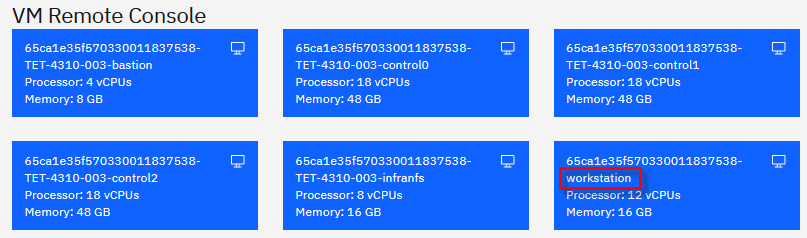


<br/>

1.  Access the lab environment from your web browser. 
     
    A `Published Service` is configured to provide access to the **`Workstation`** VM through the noVNC interface for the lab environment.
    
    a. When the demo environment is provisioned, click on the **`environment tile`** to open its details view. 

    b. Click on the **`Published Service`** link which will display a **Directory listing**  
    
    c. Click on the **`vnc.html`** link to open the lab environment through the **noVNC** interface. 
    
    
    
    d. Click the **`Connect`** button 
    
      


    e. Enter the password as:  **`passw0rd`**. Then click the **`Send Credentials`** button to access the lab environment. 

    > Note: That is a numeric zero in passw0rd  

      

	 
	 <br>
	 
2.  If prompted to Login to the "workstation" VM, use the credetials below: 

    The login credentials for the **workstation”** VM is:
 
     - User ID: **techzone**

     - Password: **IBMDem0s!**

     > Note: That is a numneric zero in the password

	 <br>
 
     
	 
	 <br>

## Tips for working in the lab environment     

1. You can resize the viewable area using the **noVNC Settings** options to resize the virtual desktop to fit your screen.

    a. From the environemnt VM, click on the **twisty** on the noNC control pane to open the menu.  

    

    b. To increase the visible area, click on `Settings > Scaling Mode` and set the value to `Remote Resizing`
      
     


2.  You can copy / paste text from the lab guide into the lab environment using the clipboard in the noVNC viewer. 
   
    a. Copy the text from the lab guide that you want to paste into the lab environment
    
    b. Click the **Clipboard** icon and **paste** the text into the noVNC clipboard

    
    
    c. Paste the text into the VM, such as to a terminal window, browser window, etc. 

    d. Click on the **clipboard** icon again to close the clipboard

   
3. An alternative to using the noVNC Copy / Paste option, you may consider opening the lab guide in a web browser inside of the VM. Using this method, you can easily copy / paste text from the lab guide without having to use the noVNC clipboard. 


    <br>


# Part 1: Load WebSphere Application Server Data to TA

In this lab, you will work with a data collection archive generated from TA data collections from three (3) WebSphere Application Server environments. Combined, these applications represent a portion of an enterprise view of Java applications running on WebSphere in the data center.

Using the TA console, you could upload the three data collections individually to a TA workspace. However, in this lab, we introduce an alternative option to do a “**bulk upload**” of all three of the collections at once.

Bulk upload is available only as a REST API in TA. The API requires that the three individual data collection zip archives generated from the various WebSphere servers, all be added to a single zip archive. The bulk upload API uploads all the data collections withing the master zip archive, saving time in cases where there are many data collections to upload into TA.

The WebSphere Application Server bulk load data collection archive has already been created for the lab. It is stored in a GitHub repo.

Additionally, this lab uses TA local, which is already installed on the **Workstation** VM.

In this section of the lab, you will clone the GitHub repo to the **Workstation** environment, start TA local, and upload the WebSphere Application Server bulk data to TA local using the TA bulk load API.

1.  Clone GitHub demo artifacts
    
    a. Open a new Terminal window

    

    b.  Clone the GitHub repo by running the commands below from the terminal window.

        cd /home/techzone

        git clone https://github.com/IBMTechSales/appmod-pot-labfiles

    Once the repo is clone, the local lab artifacts is available in the following directory.
 
    > /home/techzone/appmod-pot-labfiles
 
    The bulk data file, **bulk\_data\_3.zip** is located at:
 
    > /home/techzone/appmod-pot-labfiles/labs/TransformationAdvisor

1.  Start TA Local.
    
    a. TA Local needs to be started using the following commands and selections:

        cd /home/techzone/transformation-advisor-local-3.8.1

        ./launchTransformationAdvisor.sh


    b. Type **`5`** for starting Transformation Advisor and press **`Enter`**.

    
 
    This starts TA Local. After TA Local is started, the URL to the TA console is provided.
 
    

3.  Upload WebSphere Application Server bulk data to TA Local.

    After TA Local is ready, run the `curl command` shown below to call the TA “**bulkImport”** API to upload the WebSphere Application Server bulk data to TA Local.

    a. Upload the **bulk_data_3.zip** using the following command in a terminal window on the **Workstation** VM:

        curl -v -k -X POST "http://server0.gym.lan:2220/lands_advisor/advisor/v2/collectionArchives/bulkImport" -H "accept: */*" -H "archiveName: bulk_data_3.zip" -H "Content-Type: application/octet-stream" --data-binary "@/home/techzone/appmod-pot-labfiles/labs/TransformationAdvisor/bulk_data_3.zip" 

    - TA’s REST APIs are exposed through the endpoint “**lands\_advisor/advisor/v2**” on **port 2220.**
     
    - The bulkImport is invoked via **http POST** and the necessary http headers

    - The data collection **archive name** and **path** to the “bulk\_data\_3.zip” file is passed in as parameters to the API

    When invoking the bulkImport API, the command returns immediately. However, the bulk import process takes a few minutes to complete. You see the output as follows:


    **Output from the curl command:**

    ```
    curl -v -k -X POST "http://server0.gym.lan:2220/lands_advisor/advisor/v2/collectionArchives/bulkImport" -H "accept: */*" -H "archiveName: bulk_data_3.zip" -H "Content-Type: application/octet-stream" --data-binary "@/home/techzone/appmod-pot-labfiles/labs/TransformationAdvisor/bulk_data_3.zip"
    
    Note: Unnecessary use of -X or --request, POST is already inferred.
    * Trying 10.100.1.61:2220...
    * Connected to server0.gym.lan (10.100.1.61) port 2220 (#0)
    
    > POST /lands_advisor/advisor/v2/collectionArchives/bulkImport HTTP/1.1
    > Host: server0.gym.lan:2220
    > User-Agent: curl/7.76.1
    > accept: */*
    > archiveName: bulk_data_3.zip
    > Content-Type: application/octet-stream
    > Content-Length: 4460706
    > Expect: 100-continue
    > 
    * Mark bundle as not supporting multiuse
    < HTTP/1.1 100 Continue
    < Content-Length: 0
    < Date: Tue, 13 Feb 2024 15:00:29 GMT
    * We are completely uploaded and fine
    * Mark bundle as not supporting multiuse
    < HTTP/1.1 200 OK
    < Date: Tue, 13 Feb 2024 15:00:29 GMT
    < Cache-Control: no-store
    < Pragma: no-cache
    < X-Content-Type-Options: nosniff
    < Content-Type: application/json
    < Content-Language: en-US
    < Content-Length: 161
    < 
    
    * Connection #0 to host server0.gym.lan left intact 
      {"message":"Bulk upload started.}
      Track the status at: http://server0.gym.lan:2220/lands_advisor/advisor/v2/collectionArchives/bulkImport/status/83265910884066"
   
    ```
    It takes a few minutes (3-5 minutes) for the upload to complete.

4.  You can track the progress of the upload by using the command that is displayed at the end of the “bulkImport” output on the Terminal Window

    **Example:**
 
    From the web browser: 

    http://server0.gym.lan:2220/lands_advisor/advisor/v2/collectionArchives/bulkImport/status/83265910884066
    
    **(The ID will be different on your environment)**
 
    **Note**: Your URL will be different than the example shown, as the URL to the status is specific for each bulkImport, which includes a **unique ID** for the bulkImport.
 
    Run the bulkImport status job, repeatedly, until you see the message “**Bulk Upload Complete”**
 
    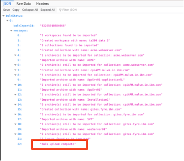
 
    **Note:** You can also track the progress of the upload by tailing the logs for the **taserver** docker container. 
    
    When the logging stops, that is an indication that the data collection archive upload has been completed, and you can continue to the next section.

        docker logs -f taserver


# Part 2: Evaluate WebSphere Application Server Data

## 2.1 Review the Workspace summary information in TA

Once the bulk data upload processing is complete, it creates a **workspace** in TA named “**ta300_data_3”.**

1.  Open the new workspace in the TA console

    a.  If the web browser window is not open, launch it by clicking the web browser icon in the desktop.

    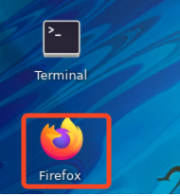

    b.  In the web browser window, click the **`TA Local bookmark`** to open TA console.

    The TA local URL is: **http://server0.gym.lan:3000**
 
    
 
    TA **UI Welcome page** is displayed, and you can see that **ta300_data_3** workspace is listed.

    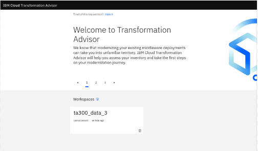

2.  Click **`ta300_data_3`** workspace link to access the workspace.

    
 
    The **ta300_data_3** workspace page is displayed and has evaluated 15 java applications, including 5 applications related to the ACME application.
 
    TA has analyzed the **15 java applications** and determined that the total cost of modernizing all applications in the workspace to WebSphere Liberty is 102.5, which is 6.8 days per application.
  
    TA also provided the summarization of the effort modernizing code that is **unique to each application** as well as common code among the applications.
 
    In this summary, modernizing the **common code cost** is **11** days, and **unique application modernization cost** is **91.5** days.
 
    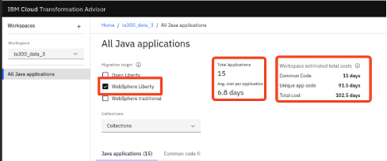
 
    The workspace includes analysis of applications from **three** (3) WebSphere Application Server environments, per the bulk upload.
 
    The bulk upload operation loaded the applications into TA, each into a separate “**collection**”. The name of the collections was determined by the hostnames of the WebSphere server where the applications were running. These names can be overridden in the TA UI, if desired.
 
    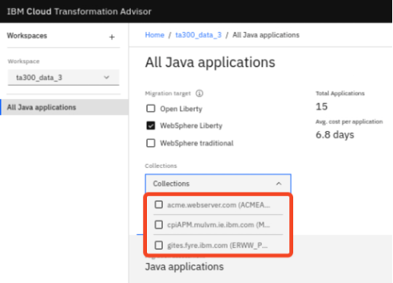
 
    These default collection names can be overridden in the TA UI, if desired, by using the “**edit collection**” option from the Options menu. For this lab, you will just keep the default collection names.
 
    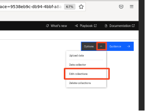
 
    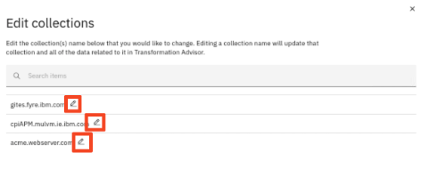
 
3. If you opened the “**edit Collections**” option, **close** it now.

    <br/>

## 2.2 Review the Workspace summary for ONLY the ACME applications

In this exercise we want to get an accurate estimate required to modernize the complete set of ACME applications.
 
The ACME applications are in the “**acme.webserver.com**” collection.
 
TA provides a very nice capability to create “**Groups**” for Java applications. Groups provide a “**Group estimated total cost”** allowing you to evaluate a subset of your workspace data.

The benefit of this is that you can easily get an accurate estimate for modernizing a subset of the applications in the workspace.
 
Let’s create a new group for the ACME applications.

1. Click the **`Collections`** dropdown menu.

    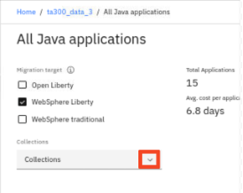.

2. Check the box next to **`acme.webserver.com`.** Ensure the other two collections remain UNCHECKED.

    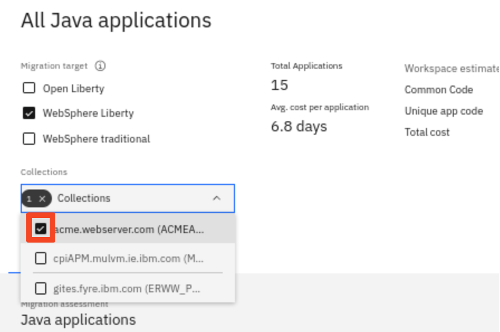

3.  Next, check the box next to Java application, which will select all five ACME applications. Then click **`Add to group`**.

    

4.  Give a group name as **`ACME`** and click **`Add to group(s)`.**

    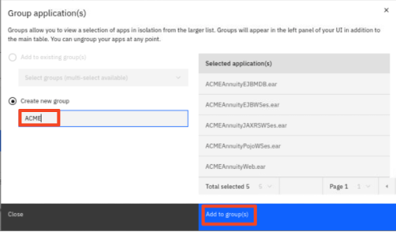
 
    A new Group named **ACME** has been created, and is listed under **Groups** in the TA navigation menu
 
    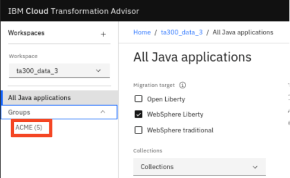

5.  Select the **`ACME`** group under **`Groups`**, which will cause TA to recalculate the effort involved to modernize the workspace scoped to only include the ACME group of applications.

    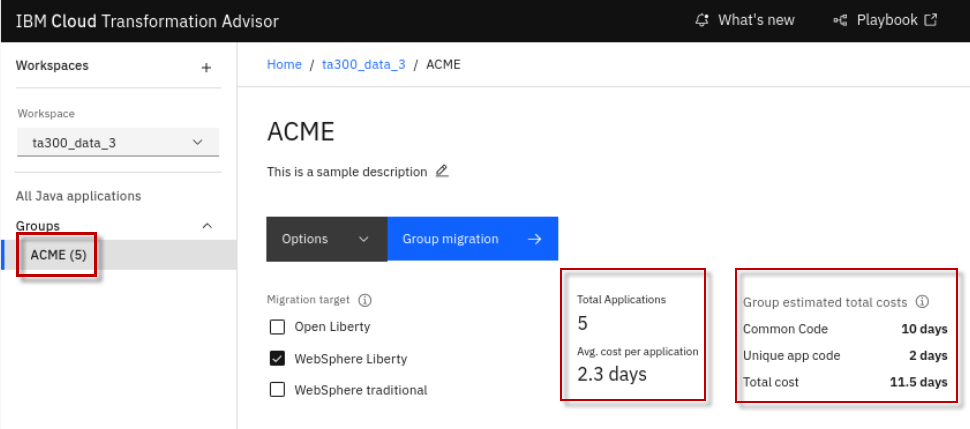
 
    Now you see that TA has recalculated the costs associated for modernizing just the ACME group of applications.
 
    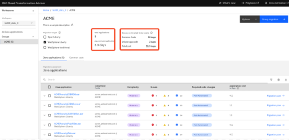
    
    The **ACME group summary** now shows **5 applications** and an average of **2.3** days to modernize each application.
 
    TA’s assessment of the Group estimated costs take into consideration the following:

    - The **unique application code** to be modernized, which is **2** days.

    - The **Common code** shared between some or all the applications, which is **10** days.

    With this view, TA has produced a realistic and more accurate cost estimate for modernizing the ACME application.
 
    The cost to modernize the **5** ACME applications including common code, that only needs to be updated ONCE, is about **11.5** days.
 
    From this we can see the value of the TA analysis in terms of looking into the applications to find COMMON CODE and SHARED libraries, then coming up with a reasonable recommendation for modernizing the applications since common code only needs to be fixed once and is fixed for all the applications that use it.
 
    In this example, without common code discovery, the view of the individual applications cost of modernization shows **49.5** days, as illustrated below. However, the **more accurate assessment** of the **Total cost** is **11.5** days based on TA’s analysis of the common code used among the ACME applications.
 
    The cost for modernizing the **unique application code** in the ACME group is just **2** days.
 
    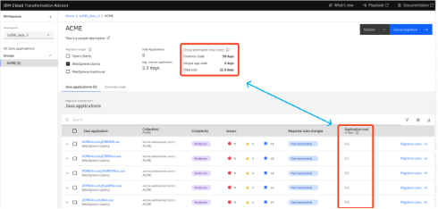
 
    TA displays the number of Common code files that it detected and used for each application.
 
    Transformation Advisor looks for common code between all applications, even if in different collections in the workspace.
 
   
## 2.3 Explore Common code discovery in TA

In this section of the lab, you will dig into the details of the ACME applications to understand the cost for modernizing applications that share common code. You will gain insights into common code libraries, and which applications share this code.

With these insights you will learn which common code libraries would provide the best ROI for modernizing first, since you only pay for modernizing the shared library once, and all applications that use that common code benefit.

1.  First, let’s take a quick look at the Common code files that have been discovered in the workspace
    
    a. From the ACME group, open the “**`Common code`**” tab

    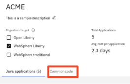

    b. Now you see the summary for the common code files, including the **Complexity, Issues**, **Used by Applications**, and **Common code cost** to modernize the common code file.

    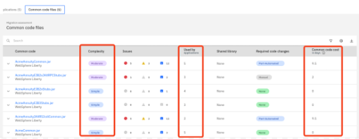

2.  Return to the “**`Java Applications`**” tab, and view the details of the common code used by the **ACMEAnnuityEJBMDB.ear** application
    
    a.   Click the “**`Java applications`**” tab to return to the list of ava applications

    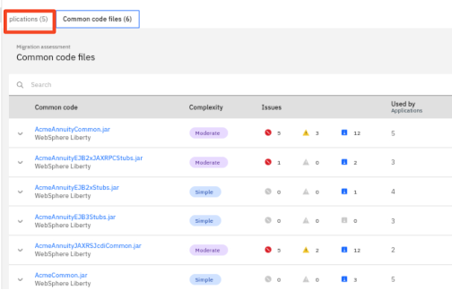

    b.  Expand the **ACMEAnnuityEJBMDB.ear** application to get the details of the common code used by the application

    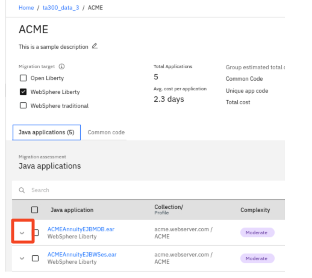

    The details about the common code used by the **ACMEAnnuityEJBMDB.ear** is displayed

    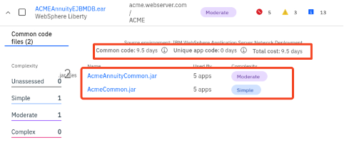
 
    **Note the important details about the modernization cost for the application and common code**

    - The application uses **2** common code jar files
    
      - AcmeAnnuityCommon.jar
    
      - AcmeCommon.jar

    - Both common code jars are used by **5** applications

    - **AcmeAnnuityCommon.jar** modernization complexity is **MODERATE**

    - **AcmeCommon.jar** modernization complexity is **SIMPLE**

    - Cost to modernize the **common code** is **9.5** days

    - Cost to modernize the **unique application code** is **0** days (no code changes required)

    With this information you can see that **ALL** the cost associated for modernizing the **ACMEAnnuityEJBMDB.ear** is in common code, and these common code files are used by **5** applications.
 
    This means that you only modernize these common code files once and it is fixed for all **5** of the applications that also share this common code.

    c.  **`Collapse`** the "common code details view" for the **ACMEAnnuityEJBMDB.ear** application


3.  Now view the details of the common code used by the **ACMEAnnuityEJBWSes.ear** application.
    
    a.  Expand the “**ACMEAnnuityEJBWSes.ear”** application from the Java applications list

    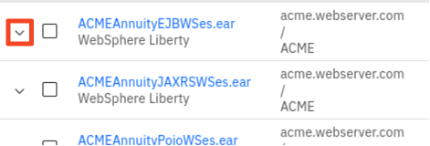
 
    The details about the common code used by the **ACMEAnnuityEJBWSes.ear** is displayed.
 
    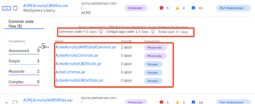
 
    **Note the important details about the modernization cost for the application and common code**

    - The application uses **5** common code jar files

    - Cost to modernize the **common code** is **9.5** days

    - Cost to modernize the **unique application code** is **1.5** days


4.  Since the **AcmeAnnuityCommon.jar** common code is used for all 5 applications, let’s review the modernization details of it.
    
    a.  Click into the **AcmeAnnuityCommon.jar** common code file to get the modernization details

    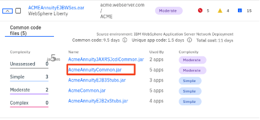

    b. The details view for the **AcmeAnnuityCommon.jar** file reveals very important information and insights about modernizing the ACME applications, as illustrated below. 

    - **AcmeAnnuityCommon.jar** is used by all **5** ACME applications

    - The modernization cost for **AcmeAnnuityCommon.jar** is **9.5** days

    - Looking at each application in isolation, as illustrated below, you see the total cost for each app is between **9.5** days and **11** days.
    
      - **AcmeAnnuityCommon.jar** accounts for **9.5** days of that cost, but only needs to be incurred once.

    - Modernizing the **unique application code** across all **5** applications is only **2** days.
      - 1.5 days for ACMEAnnuityEJBWSes.ear
      - 0.5 day for ACMEAnnuityJAXRSWSes.ear

    The insights gained here clearly show that performing the **9.5** days required to modernize the **AcmeAnnuityCommon.ja**r file means that MOST of the work will be completed for all five (5) of the ACME applications.
 
    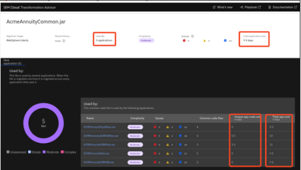

5.  While in the **AcmeAnnuityCommon.jar** details view, scroll down to view the applications that use this common utility jar. 

    As noted in the previous step, the AcmeAnnuityCommon.jar is used by all 5 ACME application. 

6.  From the list of applications using this common code utility jar, `click` on the **ACMEAnnuityEJBWSes.ear** application to display its details. 

    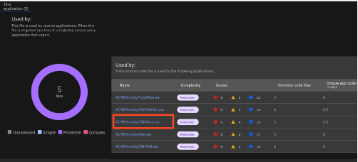

 
7.  While in the **ACMEAnnuityEJBWSes.ear** details view, scroll down to the **Complexity Rues** and **Issues Detail** sections, where you can begin to dig deeper into the specific issues flagged by TA.
    
    a. Notice that Transformation Advisor splits the Issues details into two sections making it quick and easy to get to the specific details you want to review.

    - Common Code issues

    - Unique Code issues

    Here you begin to gain insights into the specific issues that need to be addressed, and the associated costs for resolving the specific issues that were discovered.
 
    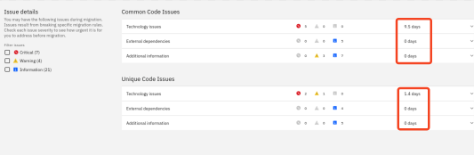
 
    In summary, the insights gained using Transformation Advisors common code discovery capability clearly show that performing the **10** days of effort required to modernize the **AcmeAnnuityCommon.jar** file means that MOST of the work will be completed for all five (5) of the ACME applications.
  
    Recall the summary view for the **ACME group of applications** showed the **Total cost** for modernizing the entire ACME group of applications is **11.5** days.
 
    
 
    You learned that **10** days of that work is modernizing the common code, which only needs to be done once.
 
    You further learned that the **AcmeAnnuityCommon.jar** file cost accounts for **9.5** days of the **10** days required to modernize the common code.
 
    Lastly, you learned that the cost associated for modernizing the **unique application code** for the **ACME group** of applications is only **2** day of the **11.5** days estimated by Transformation Advisor.

    <br/>

## 2.3.1 Export and review the Workspace summary and application details

For large enterprises, there could be hundreds of applications and thousands of common code files that need to be analyzed.

Transformation Advisor provides the ability to export all that data into PDF files and comma separated view (CSV) files that can easily be shared among the development team.

The CSV files provide a nice way to manipulate, sort, order, and view the large volume of data to help you with actual planning of your modernization projects.

The export generates a zip file of the workspace summary and /or application details depending upon your selectin criteria on the export.

1.  Export the Workspace and application details for the **ACME** group of applications.
    
    a.  From TA, return to the `ACME group` applications list.

    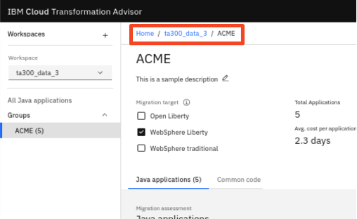

    b.  From the **Java applications** view of the ACME group, click on the **`Export`** icon.

    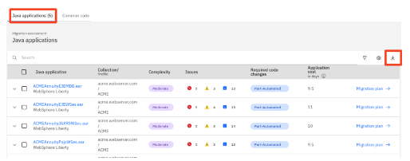

    c.   From the “Export” page, ensure the “**Summary of workspace**” and “**Application details**” are selected to be exported, then click **`Export`**.

    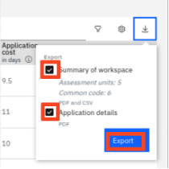
 
    A zip file named “**ta300_data_3_ACME_WebsphereLiberty_report.zip**” is created in the directory: **/home/techzone/Downloads.**

2.  From a Terminal window, unzip (extract) the contents of the archive, using the following commands:

        cd /home/techzone/Downloads

        unzip ta300_data_3_ACME_websphereLiberty_report.zip -d /home/techzone/Downloads/ACME


3.  Explore the file structure and contents of the exported data.
    
    a. Open a `File Explorer` window on the VM and navigate to the directory: 
    
        Home > techzone > Downloads > ACME > ta300_data_3_ACME

    The file structure is split into two categories, one for the workspace summary, and the other for the application details.
 
    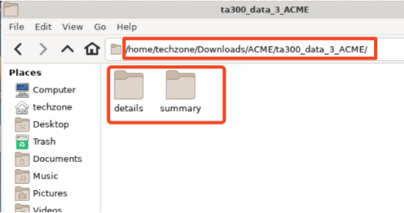

    b.  Open the **`summary`** directory.
    
    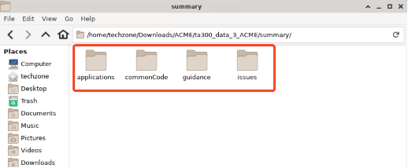

    ___

    Note that the **workspace summary** data is separated by applications, common code, and rules.
 
    In each of the sub-directories you find the csv and pdf files that contain the summary data
    ___


    c.  Navigate to **`/home/techzone/Downloads/ACME/ta300_data_3_ACME/summary/applications`** directory, and open the pdf file to view the ACME applications summary.

    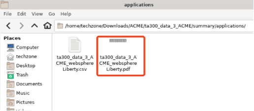
 
    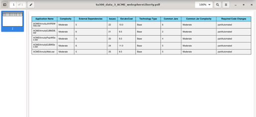

    d.  Navigate to **`/home/techzone/Downloads/ACME/ta300_data_3_ACME/summary/commonCode`** directory, and open the pdf file to view the common code summary

    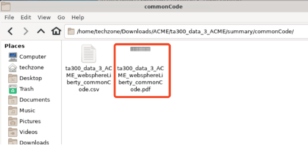
 
    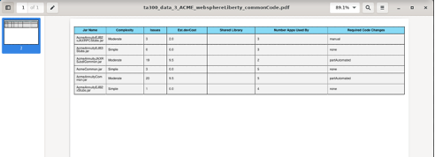

    You may continue to explore the csv and pdf files in the other sections of the exported data.

    When you are ready, continue to the next and final section of the lab where you explore how Transformation Advisor and the Binary Scanner from the WebSphere application migration toolkit work together for planning and analysis of Java modernization projects.

# Part 3: Using Binary Scanner with TA

The Migration Toolkit for Application Binaries is a tool in the IBM WebSphere Application Server Migration Toolkit. The tool includes scanning capability to quickly evaluate application binaries for rapid deployment on WebSphere Application Server traditional and Liberty.

This command-line tool enables administrators to evaluate applications in minutes without accessing the source code. This tool can also be integrated with TA and add scanned data into an existing TA workspace.

**The binary scanner can scan an application binary such as a WAR or EAR file.**

  - Scanning a binary archive only produces application data.

**The binary scanner can also scan a WebSphere application server profile configuration.**

  - With this option, the binary scanner also collects the WebSphere server configuration data and produces deployment accelerators for building and deploying the application to Liberty, traditional WebSphere in containers, and container-based clouds.

**The binary scanner can also be run using the **`--ta`** option, which produces a data collection archive that can be uploaded directly into Transformation Advisor.**

  - With the **`--ta`** option, the data collection archive can be uploaded to TA. The applications can be analyzed alongside the applications you already have uploaded into the TA UI. This provides the ability to get a broader understanding of the applications in the enterprise, including code that may be common among applications from different WebSphere Applications and Application servers.

<table>
<tbody>
<tr class="odd">
<td><p>The Transformation Advisor Data Collector (TA DC) is built on the WebSphere Migration Toolkit for Application Binaries (aka Binary Scanner) and both are interchangeable for analyzing applications running in WebSphere App Server.  For best results, you should always run the latest available version when possible.</p>
<p><strong>Reasons to run Binary Scanner include:</strong></p>
<ul>
<li><p>You are ready to start data collection, but you do not already have TA installed.  This can speed up the analysis phase where discovery can proceed while a suitable OpenShift or RHEL system is found for installing TA or TA Local in parallel.</p></li>
<li><p>The Binary Scanner is already built into WAS, shipped as part of WebSphere 9.0.5.14 or later fix packs and can be run directly on those systems without a Change Request process to add any additional software on controlled systems.</p></li>
<li><p>For WAS systems older than 9.0.5.14, the latest binary scanner may be downloaded from <a href="https://www.ibm.com/support/pages/migration-toolkit-application-binaries"><span class="underline">https://www.ibm.com/support/pages/migration-toolkit-application-binaries</span></a> and run directly on those systems (or on an available backup), without first having TA installed. </p></li>
</ul>
<p><strong>Reasons to use TA DC include.</strong></p>
<ul>
<li><p>If TA is already installed but is not at the latest level, then using the in-built Data Collector ensures results are compatible for upload.</p></li>
<li><p>TA data collector attempts to automatically uploads results to TA on completion </p></li>
<li><p>The TA Data Collector is still required for analyzing other Application Servers such as WebLogic, JBoss and Tomcat if migration artifacts are required. Otherwise, the binary scanner can analyze the application binary to allow viewing the assessment in TA.</p></li>
<li><p>The binary scanner does not have --ta mode for WebLogic, JBoss, and Tomcat.  Competitive reports generated by the binary scanner standalone cannot be uploaded into TA.</p></li>
</ul></td>
</tr>
</tbody>
</table>

In this section, you are going to run the binary scanner against a WebSphere application server profile configuration that has an application called **`PlantsByWebSphere`** deployed. You will use the **`--ta`** option and upload the resulting data collection archive into the TA workspace.

The Binary scanner is a stand-alone jar file. It has already been downloaded to the following directory on the Workstation VM.

> /home/techzone/binary-scanner/wamt

The WebSphere Application Server environment configuration is also available on the Workstation VM in the following directory:

> /opt/IBM/WebSphere/AppServer85515

<br/>

1.  Run the binary scanner to collect the data for the **PlantsByWebSphere** application in the WebSphere profile named “**profile1**”, using the **“--ta**” option.


        cd /home/techzone/binary-scanner/wamt

        java -jar binaryAppScanner.jar /opt/IBM/WebSphere/AppServer85515 --ta --profile=AppSrv01


    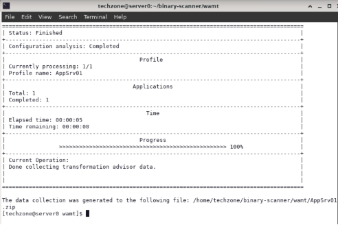
 
    The generated data collection archive is name **AppSrv01.zip** and is created in the following directory:
 
    > /home/techzone/binary-scanner/wamt
 
     With the data collection archive, **AppSrv01.zip** created using the “--**ta”** option, it can be uploaded into the Transformation Advisor from the UI.

2.  In the TA UI, return to the “**All Java Applications**” view.

    
 
    All 15 applications should again be displayed and listed in the workspace.
 

3. Upload the “**profile1.zip**” file to TA.
    
    a.  From the TA UI, click **`Options > Upload data`** from the **`options`** menu, to start uploading the new **`AppSrv01.zip`** archive collected from the binary scanner.

    


    b. Click **`Drop or add file`** link.

    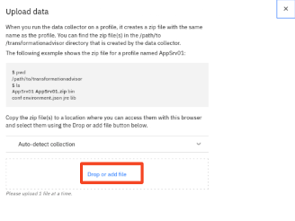

    c. Navigate to **`Home > techzone > binary-scanner > wamt`** directory. Select **AppSrv01.zip**, then click **`Open`**.

    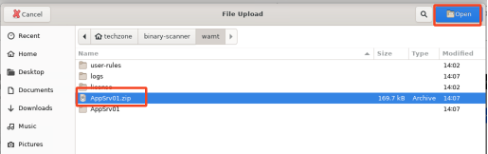

    e. Click the drop-down menu for “**Auto-detect collection**”

    This option lets you choose how the new collection will be named as it’s uploaded to TA.

    - The default mode is to “auto-detect” the name from the archive. The name will be the name of the host machine name that the collection archive was generated

    - You can choose to upload the collection to an “existing collection” already in the TA workspace.

    - You can choose to provide your own unique collection name.

    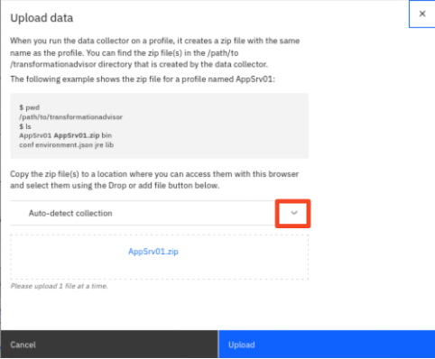

    f.  In this case, just accept the default selection “**Auto-detect collection name from archive**”. Then click **`Upload`** to upload the data.

    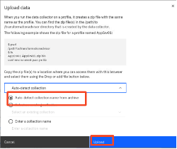
 
    The Java applications in the local WebSphere Application Server are added to the **ta300_data_3** workspace.
 
     Now the total number of applications in the workspace is **16.**
 
    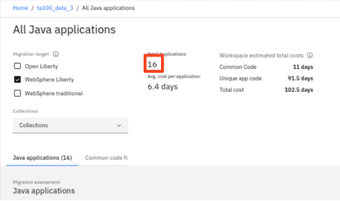

4.  View the Java applications in the new collection that was created when the **AppSrv01.zip** was uploaded.
    
    a. Expand the “Collections” list, and select the new collection named **`server0.gym.lan`**.

    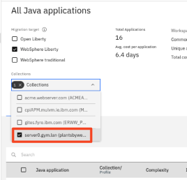

    b. Review the list of applications in this collection. This collection includes the **PlantsByWebSphere** application that is ready for analysis from the workspace.

    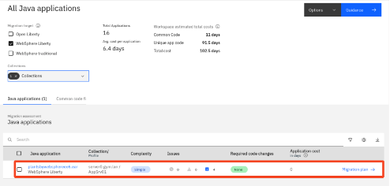


    <br/>

    Transformation Advisor looks for common code between all applications, even if in different collections in the workspace.

    A uses a combination of **JAR file name** and **CHECKSUM** to determine if the shared library jar file is **IDENTICAL** and truly shared among applications.

    Therefore, adding the new collection to the same workspace would be beneficial to get an “**Enterprise View**” of the apps being analyzed.  

    Applications on different WebSphere Application servers, which would be in different collections, may share common code from across the enterprise.

# Summary

Congratulations\! You have completed the IBM Transformation Advisor Common Code Process lab.

With the analysis and insights gained through Transformation advisor and its Common Code discovery capabilities, it is easy to get a realistic and more accurate estimate of modernizing a set of applications that share common code.

As such, in cases where common code is discovered among applications in the workspace, you will likely see significantly lower total and average cost per application modernization when compared to assessing each application in isolation.

That makes it easy to see how to expend your modernization effort to produce the optimal ROI for modernization.

