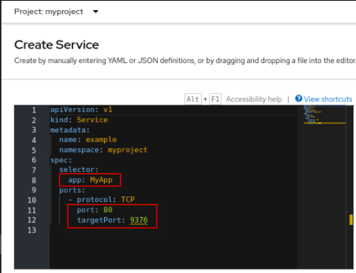
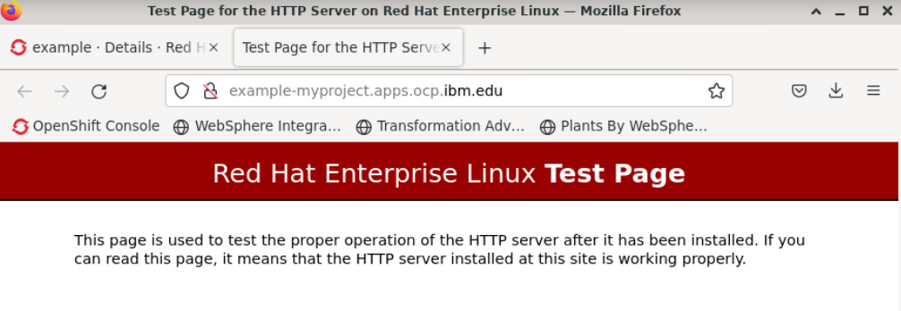

# Introduction to Container Orchestration using Openshift

 

**Last updated:** March 2024

**Duration:** 45 minutes

Need support? Contact **Kevin Postreich, Yi Tang**

## Introduction 

In this lab, we will introduce you to the basics of container Orchestration using Openshift. We will

- Perform basic navigation using the web console
- Deploy the example `httpd` image through the web console.
- Deploy the example `httpd` image through the command line.


## Accessing the environment

If you are doing this lab as part of an instructor led workshop (virtual or face to face), an environment has already been provisioned for you. The instructor will provide the details for accessing the lab environment.

Otherwise, you will need to reserve an environment for the lab. You can obtain one here. Follow the on-screen instructions for the “**Reserve now**” option.

<https://TBD-to-the-reservation-link>

The lab environment contains six (6) Linux VMs. 


<br/>

1.  Access the lab environment from your web browser. 
     
    A `Published Service` is configured to provide access to the **`Workstation`** VM through the noVNC interface for the lab environment.
    
    a. When the demo environment is provisioned, click on the **`environment tile`** to open its details view. 

    b. Click on the **`Published Service`** link which will display a **Directory listing**  
    
    c. Click on the **`vnc.html`** link to open the lab environment through the **noVNC** interface. 
    
    
    
    d. Click the **`Connect`** button 
    
      


    e. Enter the password as:  **`passw0rd`**. Then click the **`Send Credentials`** button to access the lab environment. 

    > Note: That is a numeric zero in passw0rd  

      

	 
	 <br>
	 
2.  If prompted to Login to the "workstation" VM, use the credetials below: 

    The login credentials for the **workstation”** VM is:
 
     - User ID: **techzone**

     - Password: **IBMDem0s!**

     > Note: That is a numneric zero in the password

	 <br>
 
     
	 
	 <br>

## Tips for working in the lab environment     

1. You can resize the viewable area using the **noVNC Settings** options to resize the virtual desktop to fit your screen.

    a. From the environemnt VM, click on the **twisty** on the noNC control pane to open the menu.  

    

    b. To increase the visible area, click on `Settings > Scaling Mode` and set the value to `Remote Resizing`
      
     


2.  You can copy / paste text from the lab guide into the lab environment using the clipboard in the noVNC viewer. 
   
    a. Copy the text from the lab guide that you want to paste into the lab environment
    
    b. Click the **Clipboard** icon and **paste** the text into the noVNC clipboard

    
    
    c. Paste the text into the VM, such as to a terminal window, browser window, etc. 

    d. Click on the **clipboard** icon again to close the clipboard

   
3. An alternative to using the noVNC Copy / Paste option, you may consider opening the lab guide in a web browser inside of the VM. Using this method, you can easily copy / paste text from the lab guide without having to use the noVNC clipboard. 


    <br>


## Deploy the example 'httpd' image through the web console

### Login to the OpenShift web console

1. Open the Firefox Web Browser from the VM. 

     
 
     <br/>

2. Select the **`OpenShift Console`** bookmark at the top left of the browser window to access the OpenShift Container Platform web console.

     
     
	 <br/>
	 
 
3. Log in to the account using the following credentials:
   
     * Username: **`ocadmin`**
     * Password: **`ibmrhocp`**

     


### Overview

1. Click on the **`Overview`** tab under **`Home`** in the left menu to view a summary of events:

    

	 <br/>

2. Scroll down to view the resources `Cluster utilization`:

    

     <br/>

3. View the `Cluster inventory` information on the Overview page. You can Click on each item in the inventory to find out more:

    

    Note that:

    - **`Nodes`** represent physical or virtual hardware that your Openshift cluster is running.
    - **`Pods`** are used to host and run one or more containers. Each node may run multiple pods. Containers in the same pod share the same network and storage.
    - **`Storage classes`** represent the different types of storage configured and made available for your Openshift cluster. 
    - **`Persistent Volume Claims`** (PVCs) represent the usage of storage by the pods. After a pod is removed, data not persistent to persistent storage are gone.

### Projects

Openshift `projects` allow you to group related resources together and to assign them separate management policies. 
It is common for artifacts related to different applications to be assigned to different `projects`. Resources that belong to the same project are stored in the same Kubernetes `namespace`.

1. Click on the **`Projects`** tab under **`Home`** in the left menu, followed by **`Create Project`**:

    

	<br/>

2. In the dialog, enter `myproject` as project name, then click **`Create`**:

    

	 <br/>
	 
3. After creation, click on each of the tabs of myproject you just created. 

   Note the following:

    - The `YAML` tab shows you the YAML representation of your project. Every resource in Openshift is represented as a REST data structure. We'll be working with YAML files a lot more when we interact with Openshift via the command line.
    - The `Role Bindings` tab shows you the security configurations that apply to your project. For now, just take notice that there are many different roles already defined when a project is created. Each of these **roles** is used for a different purpose, and already mapped to different **users** and **groups**, or **service accounts**.

   

### First Application

The typical artifacts you will need to run an application in Openshift are:

- A `container image` containing your application, hosted in a container registry
- One or more `pods` that specifies where to fetch an image and how it should be hosted. 
- A `deployment` to control the number of instances pods. You don't normally configure a `pod` directly. Instead, you configure a `deployment` to manage a set of `pods`.
- A `service` that exposes the application within the internal network, and enables the application to be load balanced within the Openshift cluster.
- A `route` or `ingress` to make the application accessible outside of the Openshift cluster firewall.

    

#### First deployment 

1. Under the **`Workloads`** tab, click **`Deployments`**. Then click **`Create Deployment`**:

    

	 <br/>

2. Note that the console shows you the YAML file for the deployment. 

   make the following changes to the yaml as decribed and illustrated below. 

    a. Type `'example'` as the **'name'** of the deployment. Be sure to retain the single quotes as illustrated below. 
    
    b. Change the number of `replicas` from 3 to **`2`** 

    c. change **'app: name'** to `app: httpd` under 'matchLabels' and 'labels' 
    
    d. Click **`Create`**:

    


    Here is the specification of the deployment in its entirety:

    ```yaml
    apiVersion: apps/v1
    kind: Deployment
    metadata:
      namespace: myproject
      name: 'example'
    spec:
      selector:
        matchLabels:
          app: httpd
      replicas: 2
      template:
        metadata:
          labels:
            app: httpd
        spec:
          containers:
            - name: container
              image: >-
                image-registry.openshift-image-registry.svc:5000/openshift/httpd:latest
              ports:
                - containerPort: 8080
                  protocol: TCP
      strategy:
        type: RollingUpdate
        rollingUpdate:
          maxSurge: 25%
          maxUnavailable: 25%
    ```

3. Let's review this resource:

    - Every resource in Openshift has a group, version, and kind. For the `Deployment` resource:
        - The group is `apps`
        - The version is `v1`
        - The kind is `Deployment`
    - The `metadata` specifies data that is needed for the runtime:
        - The name of this instance is `example`
        - The namespace where the resource is running is `myproject`
        - Though not shown here, any labels associated with the resource. We will see the use of labels later.
    - The `spec` section defines the details specific to this kind of resource:
        - The `selector` defines details of the `pods` that this `deployment` will manage. The `matchLabels` attribute with value `app: httpd` means this `deployment` instance will search for and manage all pods whose labels contain `app: httpd`.
    - The `replicas: 2`  field specifies the number of instances to run.
    - The `template` section describes information about how to run the container image and create the `pods`:
        - The `labels` section specifies what labels to add to the pods being to be created. Note that it matches the labels defined in the `selector`.
        - The `containers` section specifies where to fetch the container image and which ports to expose. For our example, the image to run is `openshift/httpd`.
    - The `stratey` section defines how to create, upgrade, or downgrade different versions of applications. 
        - The `RollingUpdate` strategy is the default strategy. It  allows you to update a set of pods without downtime. It replaces pods running the old version of the application with the new version, one by one.
    <br/> 
 
4. Wait for both pods to be running:

    

    <br/> 


5. Click on `Pods` tab. 

    Note that the pods resources are managed by the controller for your `deployment`. 

    You do not create the pod resources yourself. 
That is the reason that `Pods` tab is under the `deployment` resource you just created.

    

    <br/> 

6. Click on one of the pods:

    

    <br/> 

7. Explore the various **tabs** for your pod

    

    <br/> 

     - **`Detils:`** displays the hi-level detsils of the pod.
     - **`Metrics:`** displays the overall resource usage for your pod. 
     Note that for CPU usage, the unit is m, or milli-core, which is 1/1000th of one core.
     - **`YAML:`** examine the YAML that describes your pod. This YAML is created by the deployment controller based on the specification you supplied in your deployment. Note that labels associated with your pod are what you had specified in the deployment.
     - **`Environment:`** lists the environment variables defined for your pod. For our `httpd` pod, there is none.
     - **`Logs:`** shows the console log for your container. 
     - **`Events:`** are a resource type in Kubernetes that are automatically created when other resources have state changes, errors, or other messages that should be broadcast to the system.
     - **`Terminal:`** Opens a remote shell into your container. As with the Introduction to Docker lab, no shell is available within the container for this image. This makes it more secure, but also more difficult to debug.


### First Service

A **`service`** enables the pods we just created to be load balanced within the Openshift cluster. 

1. Scroll down to the **`Networking`** tab on the left navigation, click **`Services`**, then click **`Create Service`**:

    

    <br/>

2. Update the `YAML` parameters as follows:
    
    **(Before update)**
    
    
    a. Under spec.selector: 
	
      - change `MyApp` to `httpd`
        
        This is how the service will find the pods to load balance. Therefore, it matches the labels (`spec.selector.matchLabels`) that we used when creating the deployment for the httpd application.
   
    <br/>   
   
    b. Under spec.ports:
	
      - change `80` to `8080` and 
      - change `9376` to `8080` (the same ports we used in the containers lab).
    
	<br/>
	
	c. Click `Create`

   
    **(After update)**
    

    <br/>
	
3. After the service is created, click on the **`YAML`** tab:

    

    The YAML file looks like:
    ```yaml
    kind: Service
    apiVersion: v1
    metadata:
      name: example
      namespace: myproject
      uid: d716f19c-3fbe-4917-89f3-7ea426d66494
      resourceVersion: '12721128'
      creationTimestamp: '2024-02-12T23:21:02Z'
      managedFields:
        - manager: Mozilla
          operation: Update
          apiVersion: v1
          time: '2024-02-12T23:21:02Z'
          fieldsType: FieldsV1
          fieldsV1:
            'f:spec':
              'f:internalTrafficPolicy': {}
              'f:ports':
                .: {}
                'k:{"port":8080,"protocol":"TCP"}':
                  .: {}
                  'f:port': {}
                  'f:protocol': {}
                  'f:targetPort': {}
              'f:selector': {}
              'f:sessionAffinity': {}
              'f:type': {}
    spec:
      clusterIP: 172.30.14.92
      ipFamilies:
        - IPv4
      ports:
        - protocol: TCP
          port: 8080
          targetPort: 8080
      internalTrafficPolicy: Cluster
      clusterIPs:
        - 172.30.14.92
      type: ClusterIP
      ipFamilyPolicy: SingleStack
      sessionAffinity: None
      selector:
        app: httpd
    status:
      loadBalancer: {}
    ```

4. Note that for this service, there is a cluster wide IP address created, and that it is being load balanced. Also session affinity is not set for this service.

### First Route

A route exposes your internal endpoints outside your cluster's built-in firewall. 

1. Click on the **`Route`** tab under **`Networking`** in the left navigation, then click **`Create Route`**:

    

    <br/>

2. Supply input to the following parameters:

    - Name: `example`
    - Service: `example`
    - Target Port: `8080 --> 8080 (TCP)`
    - Click `Create`

    <br/>

    

    Note that we are ignoring TLS configuration just for the purpose of this lab.  Security will be addressed in a different lab.

    <br/>

3. Access the route at the link provided under the `Location` field of the Route resource. The route location will open in a new browser tab.

    

    <br/>

4. If you have configured everything correctly, the browser will show the  `Red Hat Enterprise Linux Test page`. 

  

<br/>

**Congratulations**, you just deployed your first application to Openshift.

<br/>

### Changing Replica Instances

1. Click on the **`Projects`** tab under **`Home`** from the left navigation, then type `myproject` in the **filter** field:

    

2. Click on `myproject`:

    

    <br/>

3. Scroll down to the `Inventory` section to see the resources that were created. Recall that we have created one deployment with 2 pods in the specification. We also created one service, and one route.

    

    <br/>

4. Under the **Inventory** section, click on the **2 pods** link:

    

     <br/>

5. Delete one of the pods by clicking on the menu on the right, then selecting `Delete pod`. When prompted, click `Delete`.

    

    a. Click `Delete` to confirm the deletion of the pod 

    


    This is not the right way to reduce number of instances. You will notice that as soon as one of the pods is being terminated, another one is being created. 
    
    The reason is that the controller for the `deployment` resource knows that your specification is for **2 instances**, and it honors that specification by creating another one. This also gives you automatic failure recovery should one of the pods crashes on its own.

    

 
    <br/>

6. To change the number of instances, you will need to change the specification of your deployment. Click on the **`Deployments`** tab under **`Workloads`** in the left navigation, then click on `example` deployment:

    

    <br/>

7. Click on the **`down arrow`** to reduce the replica size down to 1:

    

    <br/>

8. After the operation is completed, click on the **`YAML`** tab:

    

    Note that the console had changed the REST specification on your behalf so that the replica count is now 1:


    


## Deploy the exmample 'httd' image through the command line

You can use both `oc`, the openshift command line tool, or `kubectl`, the Kubernetes command line tool, to interact with Openshift. 

Resources in Openshift are configured via REST data structure. 
For the command line tools, the REST data structure may be stored either in  a YAML file, or in a JSON file.

The command line tools may be used to:

- List available resources
- Create resources
- Update existing resources
- Delete resources


###  Command Line Terminal

The `oc` command is already installed on your VM's terminal.

1. Open a new `Terminal` window on the Desktop VM:
   
    
   
    <br/>
   
2. If you have not yet cloned the GitHub repo with the lab artifacts, in a previous lab, run the following command on your terminal:

```   
  cd /home/techzone
		
  git clone https://github.com/IBMTechSales/appmod-pot-labfiles.git 
```

3. Change directory to:  `appmod-pot-labfiles/labs/IntroOpenshift`


        cd /home/techzone/appmod-pot-labfiles/labs/IntroOpenshift
    

### Login to OpenShift

1. Login to OpenShift CLI with the `oc login` command from the terminal. 

   When prompted for the username and password, enter the following login credentials:

    Username: `ocadmin`

    Password: `ibmrhocp`

        oc login -u ocadmin -p ibmrhocp

    <br/> 

    After login, the project last accessed is displayed, and it may or may not be the `default` project shown below:

    
   

### Listing resources

2. Use `oc api-resources` to list all available resource kinds. 

    Note that resources in Openshift have a `group`, `version`, and `kind`. 
Some resources are global (not in a namespace), while others are scoped to a `namespace`.

    Many resources also have short names to save typing when using the command line tool.

    For example, you may use `cm` instead of `ConfigMap` as a command line parameter when the parameter is for a `KIND`.

    **Example output:**

    ```
    NAME                                  SHORTNAMES       APIGROUP                              NAMESPACED   KIND
    bindings                                                                                     true         Binding
    componentstatuses                     cs                                                     false        ComponentStatus
    configmaps                            cm                                                     true         ConfigMap
    endpoints                             ep                                                     true         Endpoints
    events                                ev                                                     true         Event
    limitranges                           limits                                                 true         LimitRange
    namespaces                            ns                                                     false        Namespace
    nodes                                 no                                                     false        Node
    ...   
    ```


### Listing instances of a resource kind

3. List all projects: `oc get projects`

    ```
    NAME          DISPLAY NAME   STATUS
    default                      Active
    ibm-cert-store               Active
    ibm-system                   Active
    kube-node-lease              Active
    kube-public                  Active
    kube-system                  Active
    myproject                    Active
    ...
    ```


4. List all pods in all namespaces: `oc get pods --all-namespaces`

    ```
    NAMESPACE                                          NAME                                                              READY   STATUS      RESTARTS       AGE
    clusteroverride                                    clusterresourceoverride-operator-8447f78c94-9ww57                 1/1     Running     1              3d22h
    db2                                                db2-6b759748bf-spkgr                                              1/1     Running     2              5d23h
    ibm-common-services                                iam-onboarding-4knm6                                              0/1     Completed   0              217d
    ibm-common-services                                ibm-common-service-webhook-f74fd799d-vrlr4                        1/1     Running     11             217d
    ibm-common-services                                ibm-namespace-scope-operator-948fd44bb-5wb97                      1/1     Running     11             217d
    ibm-common-services                                meta-api-deploy-594f4f9bf4-mvq2k                                  1/1     Running     11             217d
    ibm-common-services                                pre-zen-operand-config-job-hld85                                  0/1     Completed   0 
    ...
    ```

5.  List all pods within a namespace: `oc get pods -n myproject`

    ```
    NAME                       READY   STATUS    RESTARTS   AGE
    example-5648b6cf6d-gz46j   1/1     Running   0          19h
    ```
     


### Projects

6. List all projects: `oc get projects`

    ```
    NAME          DISPLAY NAME   STATUS
    default                      Active
    ibm-cert-store               Active
    ibm-system                   Active
    kube-node-lease              Active
    kube-public                  Active
    kube-system                  Active
    myproject                    Active
    ...
    ```

7. Get current project: `oc project` (Note: current project may not be `default` as shown below):

    ```
   Using project "default" on server "https://api.ocp.ibm.edu:6443".
    ```

8. Change to a specific project

    ```
    oc project myproject
    ```

    ```
    Now using project "myproject" on server "https://api.ocp.ibm.edu:6443".
    ```


4. Create a new project and make it the current project: 
     ```
     oc new-project  project1
     ```   

    The output from creating a new project:

    ```
    Now using project "project1" on server "https://api.ocp.ibm.edu:6443".

    You can add applications to this project with the 'new-app' command. For example, try:

    oc new-app rails-postgresql-example

    to build a new example application in Ruby. Or use kubectl to deploy a simple Kubernetes application:

    kubectl create deployment hello-node --image=k8s.gcr.io/e2e-test-images/agnhost:2.33 -- /agnhost serve-hostname
    ```


5. Switch to the `default` project: 
   ```
   oc project default
   ```


6. Switch back to `project1`: 
   ```
   oc project project1
   ```

    Output: 
   
        Now using project "project1" on server "https://api.ocp.ibm.edu:6443".

7. View the REST specification of the project: 
   ```
   oc get project project1 -o yaml
   ```

   The output of the resource specification in **yaml**

    ```yaml
    apiVersion: project.openshift.io/v1
    kind: Project
    metadata:
      annotations:
        openshift.io/description: ""
        openshift.io/display-name: ""
        openshift.io/requester: ocadmin
        openshift.io/sa.scc.mcs: s0:c28,c7
        openshift.io/sa.scc.supplemental-groups: 1000770000/10000
        openshift.io/sa.scc.uid-range: 1000770000/10000
      creationTimestamp: "2024-02-13T18:51:45Z"
      labels:
        kubernetes.io/metadata.name: project1
        pod-security.kubernetes.io/audit: restricted
        pod-security.kubernetes.io/audit-version: v1.24
        pod-security.kubernetes.io/warn: restricted
        pod-security.kubernetes.io/warn-version: v1.24
      name: project1
      resourceVersion: "13199098"
      uid: 34c89410-a09a-419e-82dd-d2788379ad01
    spec:
      finalizers:
      - kubernetes
    status:
      phase: Active
    ```

### First Application

#### First Deployment

1. In th terminal window, under the directory where you cloned the labs repository `(/home/techzone/appmod-pot-labfiles/labs/IntroOpenshift)`, you will find `Deployment.yaml`, which you will use to deploy the `httpd` application using the OpenShift CLI.   

        cd /home/techzone/appmod-pot-labfiles/labs/IntroOpenshift

        ls -l

     Output:
     ```
     -rw-rw-r-- 1 techzone techzone 669 Feb 13 11:48 Deployment.yaml
     -rw-rw-r-- 1 techzone techzone 171 Feb 13 11:48 Route.yaml
     -rw-rw-r-- 1 techzone techzone 197 Feb 13 11:48 Service.yaml
     ```
	 
2. Review the contents of `Deployment.yaml`  

     ```
     clear
     
     cat Deployment.yaml
     ```

     This allows us to deploy the same image in a different project. Using the same image customized for different environments is an important concept that will be covered further in future labs.


     ```yaml
     apiVersion: apps/v1
    kind: Deployment
    metadata:
      name: example
      namespace: project1
    spec:
      selector:
        matchLabels:
          app: httpd
      replicas: 2
      template:
        metadata:
          labels:
            app: httpd
        spec:
          containers:
            - name: httpd
              image: image-registry.openshift-image-registry.svc:5000/openshift/httpd:latest
              ports:
                - containerPort: 8080
              imagePullPolicy: Always  
              securityContext:
                allowPrivilegeEscalation: false
                runAsNonRoot: true
                capabilities: 
                  drop: 
                  - ALL
                seccompProfile: 
                  type: "RuntimeDefault"
     ```


3. Apply the deployment via the command line: 

    ```
    oc apply -f Deployment.yaml
    ```

    After applying the yaml, you will see a message that the deployment resource  was created

    ```
    deployment.apps/example created
    ```
    
4. Check the status of deployment: 

    ```
    oc get deployment example -o wide
    ```

    There should be 2 of 2 pods in the READY state: 

    ```
    NAME      READY   UP-TO-DATE   AVAILABLE   AGE    CONTAINERS IMAGES                                                                    SELECTOR
    example   2/2     2            2           103s   httpd        image-registry.openshift-image-registry.svc:5000/openshift/httpd:latest   app=httpd

    ```

    If the status does not show available **`READY 2/2`**, wait a few seconds, then rerun the command.

   

5. List the running pods created by the controller for the deployment: 
   ```
   oc get pods
   ```

    The pods should be in the **`Running`** state

    ```
    NAME                      READY   STATUS    RESTARTS   AGE
    example-764854fb5-lhdm7   1/1     Running   0          5m53s
    example-764854fb5-s5f68   1/1     Running   0          5m53s

   ```

6. Show the logs of one of the pods: `oc logs <pod name>`

   **Note:** `\<pod name\>` is the name of the pods from the `oc get pods` command in the previous step. 

 
7. Take a look at `Service.yaml` and note that it's for the `project1` namespace:

    ```
    clear
    
    cat Service.yaml
    ```

    Example output:

    ```yaml
    apiVersion: v1
    kind: Service
    metadata:
      name: example
      namespace: project1
    spec:
      ports:
        - protocol: TCP
          port: 8080
          targetPort: 8080
      selector:
        app: httpd
      type: ClusterIP
    ```

    Notice tha **selector** set to **app: httd** which means the service willload balance pods with label `app: httpd` within the `project1` namespace: 

8. Create the service. 
    
    ```
    oc apply -f Service.yaml
    ```
 
    The service is created

    ```
    service/example created
    ```

9. Examine Route.yaml:
    ```
    clear
    
    cat Route.yaml
    ```
   
    Notice the route targets the **exmple** Service  
    Output:
   
    ```yaml
    apiVersion: route.openshift.io/v1
    kind: Route
    metadata:
      name: example
      namespace: project1
    spec:
      port:
        targetPort: 8080
      to:
        kind: Service
        name: example
    ```

10. Apply the route to make the service reachable from outside the cluster: 
    
    ```
    oc apply -f Route.yaml
    ```
    
    The route is created

    ```
    route.route.openshift.io/example created
    ```

11. Use the following command to get the URL for the route. Then open the URL in the Browser on the VM: 
   
    ```
    echo http://$(oc get route example --template='{{ .spec.host }}')
    ```
    Output:
   
    ```
    http://example-project1.apps.ocp.ibm.edu
    ```

12. Open your Firefox browser again and visit the URL outputted by the previous command. You should see a web page displaying the following message:

    


### Changing Replica Instance

1. List pods: `oc get pods`

    ```
    NAME                      READY   STATUS    RESTARTS   AGE
    example-75778c488-7k7q2   1/1     Running   0          60m
    example-75778c488-c9jhd   1/1     Running   0          60m
    ```

2. Delete one of the pods: `oc delete pod <pod name>`

    ```
    pod "example-764854fb5-lhdm7" deleted
    ```

3. List pods again and note that a new instance has been created as expected. The deployment specified 2 instances, so the controller tries to maintain 2 instances: `oc get pods`

  **Note:** New pod is automaticially started

    ```
    NAME                      READY   STATUS    RESTARTS   AGE
    example-764854fb5-pjdgg   1/1     Running   0          42s
    example-764854fb5-s5f68   1/1     Running   0          44m
    ```

4. To cange the number of pods, you can patch the resource in one of two ways:
   
     - Scripted patch using the `patch` option of the command line: This command reduces the number of pods to 1. 
      
	     ```
         oc patch deployment example -p '{ "spec": { "replicas": 1 } }'

         oc get pods
       ```
      
       ```
       NAME                      READY   STATUS    RESTARTS   AGE
       example-764854fb5-s5f68   1/1     Running   0          47m
       ``` 

     - Interactive patch using the `edit` option of the command line through `vi` editor:
     
	     ```
         oc edit deployment example
       ```
      
	  Under the `spec` section (not under the `status` section), change `replicas: 1` to `replicas: 2`, and **save** the change in the vi editor (by `:wq`).

      The output:
      ```
      deployment.extensions/example edited
      ```

5. List the pods to show 2 pods runing after issueing the previous commands: 

    ```
    oc get pods
    ```

    If you edited and saved the resource in the previous step, there will be two pods running. 

    ```
    NAME                      READY   STATUS    RESTARTS   AGE
    example-764854fb5-s5f68   1/1     Running   0          50m
    example-764854fb5-w6w8j   1/1     Running   0          75s
    ```


     **Note:** The above edits the copy that is stored in Openshift. You may also edit your local copy of `Deployment.yaml` and re-apply it.

      <br/>


6. Edit the `Deployment.yaml` on the VM, and re-apply the updates

    a. From a `Terminal` window, change to the lab directory foler where the `Deployment.yaml` file resides

        cd  /home/techzone/appmod-pot-labfiles/labs/IntroOpenshift

    b. Use gedit to edit the `Deployment.yaml` file

        gedit ./Deployment.yaml

    


    c. `Save` the Deployment.yaml file

    d. Re-Apply the Deployment

        oc apply -f ./Deployment.yaml

    The example deployment has been re-applied. 

        deployment.apps/example configured
        
7. List the pods again to see that `3` pods are now running

    ```
    oc get pods
    ```

    Three pods running

    ```
    NAME                      READY   STATUS    RESTARTS   AGE
    example-764854fb5-s5f68   1/1     Running   0          63m
    example-764854fb5-t4w24   1/1     Running   0          111s
    example-764854fb5-w6w8j   1/1     Running   0          13m
    ```


8. Cleanup:
    
    ```
    oc delete route example
    oc delete service example
    oc delete deployment example
   
    oc get pods  
    ``` 

    The Output should state that no resources found in the project

    ```
    No resources found in project1 namespace.
    ```
   
   **Note:** You may have to run the **oc get pods** command a few times, to wait for the pods to be deleted.

<br/>

Congratulations, you have deployed your first application to Openshift via the command line.

END OF LAB
