# Lab 2161: Rapidly deploy and configure your Java applications with WebSphere Liberty and OpenShift Container Platform

 

**Last updated:** March 2024

**Duration:** 90 minutes

Need support? Contact **Kevin Postreich, Yi Tang**

## Overview
This lab provides fundamental hands-on experience with modernizing existing Java applications to WebSphere Liberty, deployed into a container platform, such as Red Hat OpenShift. 

The focus of this lab is on the practical aspects of application deployment and configurations and not the analysis of the Transformation Advisor results. *Other labs cover Transformation Advisor in detail.*

Upon completion of this lab, you will have gained skills to download and use the `Transformation Advisor migration bundle` to deploy and configure your application in the following scenarios: 

1.  **to a locally running WebSphere Liberty** - useful for deploying to Liberty in a VM

2.  **to a container image** – useful for deploying to Kubernetes

3.  **using the Liberty Operator** – useful for deploying to OpenShift


**IBM Cloud Transformation Advisor** (Transformation Advisor) is an application modernization tool that is entitled through IBM Cloud Pak for Applications and WebSphere Hybrid Edition. Transformation Advisor helps you quickly evaluate on-premises Java EE applications for deployment to the cloud. 

The Transformation Advisor tool provides the following value:

  - Identifies the Java EE programming models in the app

  - Determines the complexity of replatforming these apps by listing a high-level inventory of the content and structure of each app

  - Highlights Java EE programming model and WebSphere API differences between the WebSphere runtime profile types 

  - Identifies Java EE specification implementation differences that might affect the app

  - Generates accelerators for deploying the application to Liberty and containers in a target environment

Additionally, the tool provides a recommendation for the right-fit IBM WebSphere Application Server edition and offers advice, best practices, and potential solutions to assess the ease of moving apps to Liberty or newer versions of WebSphere traditional. It accelerates application migrating to cloud process, minimizes errors and risks and reduces time to market.


## Objective

The objectives of this lab are to:

  - Learn how to download the application migration bundle and use it to deploy an application to WebSphere Liberty running locally

  - Learn how to fully populate the migration bundle placeholders and build the application into a container image

  - Learn the role of Kustomize when deploying the migration bundle

  - Learn how to deploy your application to OpenShift with a single command

  - Learn how to create multiple configurations for the application and deploy them to OpenShift


## Prerequisites

The following prerequisites must be completed prior to beginning this lab:

  - Familiarity with basic Linux commands

  - Have internet access

  - Access to the TechZone lab environment

## Accessing the lab environment

If you are doing this lab as part of an instructor led workshop (virtual or face to face), an environment has already been provisioned for you. The instructor will provide the details for accessing the lab environment.

Otherwise, you will need to reserve an environment for the lab. You can obtain one here. Follow the on-screen instructions for the “**Reserve now**” option.

<https://TBD-to-the-reservation-link>

The lab environment contains six (6) Linux VMs.


1.  Access the lab environment from your web browser.

    A `Published Service` is configured to provide access to the **`Workstation`** VM through the noVNC interface for the lab environment.
 
    a. When the demo environment is provisioned, click on the **`environment tile`** to open its details view.
 
    b. Click on the **`Published Service`** link which will display a **`Directory listing`**
 
    c. Click on the **`vnc.html`** link to open the lab environment through the **`noVNC`** interface.
 
    
 
    d. Click the **`Connect`** button
 
    
 
    e. Enter the password as: **`passw0rd`**. Then click the **`Send Credentials`** button to access the lab environment.
 
    Note: That is a numeric zero in passw0rd
 
    

2.  If prompted to Login to the "workstation" VM, use the credentials below:

> The login credentials for the **workstation”** VM is:

  - User ID: **techzone**

  - Password: **IBMDem0s\!**

> Note: That is a numeric zero in the password
> 
> 

## Tips for working in the lab environment

1. You can resize the viewable area using the **noVNC Settings** options to resize the virtual desktop to fit your screen.

    a. From the environment VM, click on the **`twisty`** on the noNC control pane to open the menu.

    

    b. To increase the visible area, click on **`Settings > Scaling Mode`** and set the value to **`Remote Resizing`**

    

2. You can copy / paste text from the lab guide into the lab environment using the clipboard in the noVNC viewer.

    a. Copy the text from the lab guide that you want to paste into the lab environment

    b. Click the **`Clipboard`** icon and **`paste`** the text into the noVNC clipboard

    

    c. Paste the text into the VM, such as to a terminal window, browser window, etc.

    d. Click on the **`clipboard`** icon again to close the clipboard

    An alternative to using the noVNC Copy / Paste option, you may consider opening the lab guide in a web browser inside of the VM. Using this method, you can easily copy / paste text from the lab guide without having to use the noVNC clipboard.

## Lab Tasks

In this lab, you will use the Transformation Advisor `migration bundle` to build a container image and deploy an application to a local container for testing.

Then you will deploy the application to “dev” and “staging” environments in OpenShift. 

You will leverage the `WebSphere Liberty Operator`, Kustomize (a Kubernetes native configuration management framework), and deployment artifacts generated by IBM Cloud Transformation Advisor’s migration bundle.

To simplify the lab and to allow you to focus on the migration bundle, certain software and artifacts have already been put in place for you. These are as follows:

  - **Transformation Advisor** has been installed and collected data has been loaded

  - **docker** (for creating and running images) has been installed

  - **oc** (OpenShift command Line tool for running OCP commands) has been installed

  - The **PlantsByWebSphere Sample Application**, built as an Enterprise Archive file (EAR) is available from the lab resource provided.

  - **Convenience scripts** to streamline tasks will be used to save time and allow you to focus on the value and outcomes, which would ideally be scripted in your environment too.


# Part 1: Application Assesment    

## 1.1 Pull down the Lab artifacts and setup lab environment

1.  If you have not yet cloned the GitHub repo with the lab artifacts, in a previous lab, run the following command on your terminal:

    a.  Open a new Terminal window and clone the git repository to pull down the lab artifacts

    

    b.  Run the commands to clone the git repository to the local system

        cd /home/techzone

        git clone https://github.com/IBMTechSales/appmod-pot-labfiles.git

    c.  **Add “execute” permissions to the shell scripts**

        find ./appmod-pot-labfiles -name "\*.sh" -exec chmod +x {} \\;

2.  Run the provided shell script to setup the lab environment.

    The lab-setup.sh script moves files from the cloned git repo to a **student** directory used in the lab.
 
        cd /home/techzone/appmod-pot-labfiles/labs/RuntimeModernization/scripts
 
        ./lab-setup.sh
 
    When complete, you will see the following output
 
     
    ==========================
 
     lab-setup script completed
 
    ==========================
    

## 1.2 Launch Transformation Advisor (local)

Transformation Advisor provides a **`migration plan`** for each application being assessed for modernization. The migration plan includes a **`migration bundle`** of generated artifacts that accelerate the deployment of applications to Liberty in containers and Kubernetes / OpenShift.

The migration bundle includes diverse artifacts, depending on the needs of the application to accelerate the build and deployment of an application Container image into an OpenShift container platform.

The Transformation Advisor is installed locally on the **Workstation** VM. 

1. Launch the Transformation Advisor tool using the steps below.

    a.  From **Workstation** VM Desktop Tool Bar, click the `Terminal` icon to open a Terminal window.

    

    b.  Launch the **Transformation Advisor** with commands:

        cd /home/techzone/transformation-advisor-local-3.8.1

        ./launchTransformationAdvisor.sh

     Wait for Transformation Advisor to initialize and display the **action menu** list.

    c.  Type **`5`** and press **`Enter`** to “Start” the **Transformation Advisor**.

     
 
    d. The **Transformation Advisor** application is started, **`right-click`** the application URL link and select **`Open Link`** to launch it in a web browser window.
 
     The URL is displayed in the output from the TA command: [**http://server0.gym.lan:3000**](http://server0.gym.lan:3000)
 
     
 
     The **Transformation Advisor** Home page is displayed in the Web Browser.
 
     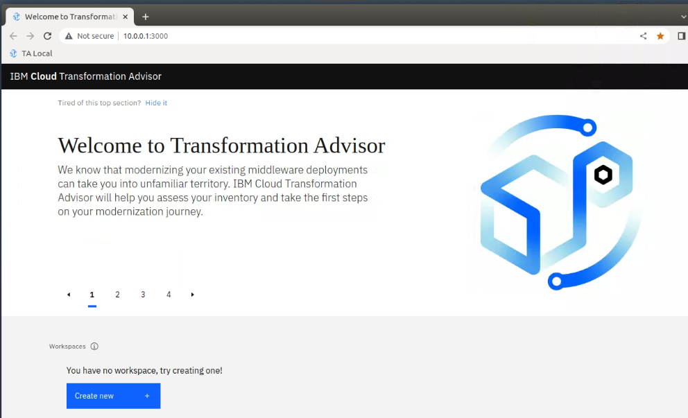

    In the next section, you will create a new “**Workspace**” in Transformation Advisor and upload the saved results from the scan of a WebSphere Application Server that has a single application deployed, named “PlantsByWebSphere”.


## 1.3 Create new workspace and upload scan results from a WebSphere Application Server

In this section, create a new workspace named **'proof_of_concept'**.

A `workspace` is a designated area that will house the migration recommendations provided by Transformation Advisor based on the Data Collector scan results of your application server environment.

1. Create a new workspace named **proof-of-concept**

    a.  From the Transformation Advisor Home page, click the **`Create New`** button

    b.  Type **`proof_of_concept`** as the Workspace name. Then click the **`Create`** button

     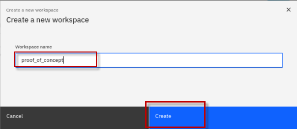

2. Upload an existing **'scan results'** file provided for the lab.

    The scan results file is provided for you.

    It was produced by running the Transformation Advisor **Data Collector** on a WebSphere Application Server that had the **PlantsByWebSphere** application deployed.

    a. Click the **`Upload`** button

    b. Click the **`Drop or add file`** link. Then click the **`Upload`** button

    

    c.  Navigate to **Home \> Techzone \> appmod-pot-labfiles \> labs \> RuntimeModernization**

    d.  Select **`pbw-collection.zip`** file. Then click the **`Open`** button

    

    e. Once the **pbw-collection.zip** has been added, click on the **`Upload`** button to upload the results into Transformation Advisor.

    

    After a few moments, the application data will be uploaded to the Transformation Advisor UI.

    The **proof-of-concept workspace** contains data for a single app that is being used as a test case. We will now review this application in Transformation Advisor.

    The "**proof_of_concept**" workspace displays the “**All Java Applications**” page which shows the recommendations for the workspace.

    There is a single application called **plantsbywebsphereee6.ear**. 
    
    By default, "WebSphere Liberty" is selected as a modernization target. All the information provided assumes that this application will be modernized to WebSphere Liberty.

    


## 1.4 Analyze the plantsbywebsphereee6 application

 Transformation Advisor provides detailed information about each application that has been analyzed. This application has a complexity of **`Simple`**.
 
 **Simple** means:
 
  - The application is ready to be deployed to WebSphere Liberty
  - No changes to the source code are required
 
   ___
   
   **Note:** We will describe some of the other information displayed in Transformation Advisor later in the lab.

   ___


 ***How is this application ready for deployment when it shows 4 issues?***
 
 In this case, the application has four **`Informational`** issues.
 
 Informational issues do not prevent the application from executing on the new runtime (WebSphere Liberty) but there may be small changes in the application’s behavior.
 
 If unexpected behavior is found during testing, then reviewing these **Informational** issues may help explain what is happening.

1.  We are now ready to review the **'migration plan'** for this application. 

    a. Click on the **`Migration plan`** link at the end of the row of the **plantsbywebsphereee6.ear** application.

    

    b.  The **Migration Plan** page opens.

    This page contains a summary of the application being migrated:

    - a preview of the files that will help during deployment (highlighted below)

    - a list of the application’s dependencies.

    All the files can be downloaded in a single convenient **migration bundle**.

    

2. At the bottom of the screen, there is a `Appliction Dependencies` section. 
    
    This shows all the files, in addition to the application, that are required for a deployment. **Plantsbywebspheeee6.ear** has two dependencies.

    a. Expand the section it to see the details

    b. In this case, DB2 drivers called **db2jcc.jar** and **db2cc_licence.jar** are required for deployment

    

3.  Download the migration bundle by clicking the **`Download`** button in the bottom right. 

    A zip file named “**plantsbywebsphereee6.ear_migrationBundle.zip**” will download to your **Download** folder.

    


We will go through a step-by-step process of using the Transformation Advisor migration bundle to deploy **plantsbywebsphereee6.ear** as follows:

  - Ensure the application can run locally on WebSphere Liberty

  - Build an immutable container image running on WebSphere Liberty

 - Ensure the application can run locally on WebSphere Liberty in a container

  - Deploy the image to OpenShift “**dev**” environment (and configure it) using a single command

  - Redeploy and reconfigure the image for a “**staging**” environment with a single command

# Part 2: Runtime Modernization    

## 2.1 Runtime Modernization

**Runtime modernization** moves an application to a 'built for the cloud' runtime with the least amount of effort. WebSphere Liberty is a fast, dynamic, and easy-to-use Java application server.

Ideal for the cloud and containers, Liberty is open sourced, with fast start-up times, no server restarts to pick up changes, and a simple XML configuration.

Applications deployed on the WebSphere Liberty container runtime can be built, deployed and managed with the same common technologies and methodologies that would be used by cloud-native (built for the cloud) applications.

### 2.1.1  Deploy PlantsByWebSphere app to a locally running WebSphere Liberty

In this lab environment, WebSphere Liberty is installed locally on the Workstation VM.

In this step, you will create a new Liberty server to run the PlantsByWebSphere application.

Then you will review the `placeholder files` in the Transformation Advisor bundle to see the dependency files that need to be copied into the Liberty Server.

Then you will use the `server.xml` file generated by Transformation Advisor, and included in the migration bundle, to configures the Liberty erver for the application.

### 2.1.2   Create a local Liberty Server

1.  From a **`Terminal`** window, create a new local WebSphere Liberty server named ‘**pbwserver**”

        /home/techzone/wlp/bin/server create pbwserver

    **output:**

    ```
    Server pbwserver created.
    ```

2.  From the **Terminal** window, start the local WebSphere Liberty server.

        /home/techzone/wlp/bin/server start pbwserver

    **Output:**

    ```
    Starting server pbwserver.

    Server pbwserver started with process ID #####
    ```

3.  Confirm the local WebSphere Liberty server is running. Open the `Firefox` web browser, open a new browser tab. Then go to: **http://localhost:9080**

    

4.  Currently, the PlantsByWebSphere application is NOT deployed to the Liberty server. Furthermore, the Liberty server is NOT configured to run the application. 

    a. From the web browser, attempt to reach the application:

    [**http://localhost:9080/PlantsByWebSphere**](http://localhost:9080/PlantsByWebSphere)
 
    You will receive the message that the “**Context Root Not Found**”. This is expected as the application is not yet deployed to the Liberty server.

      


<br/>    

### 2.1.3 Review the placeholder files in the migration bundle

In this section, you will review the migration bundle to see what files need to be added to the WebSphere Liberty configuration to run the application. 

Then you will use the provided Liberty configuration file,  **`server.xml`**, to configure the Liberty server.

The `server.xml` file is used to configure Liberty by providing values for ports, security, context routes and by providing application-specific configuration such as access to application data sources.


1.  Let’s make note of the 3 `placeholder files` that are placed in the `migration bundle`.

    The placeholder files are convenient references to let you know which files you will need to copy to the **Liberty server**.
 
    *Note: You will fully populate the migration bundle in later steps*.

    a.  From the **Terminal window**, list the placeholder files in the migration bundle.

        unzip -l /home/techzone/Downloads/plantsbywebsphereee6.ear\_migrationBundle.zip | grep placeholder
 
    
 
    - The **`target`** directory contains the placeholder file for the PlantsByWebSphere application EAR deployment file. This is a reminder that you need to copy the PlantsByWebSphere EAR file the Liberty server.

    - The **`src/main/liberty/lib`** directory contains the placeholder files for the DB2 database libraries required by the application. This is a reminder that you need to copy the DB2 libraries to the Liberty server.

    <br/>

### 2.1.4   Configure the Liberty server for PlantsByWebSphere

In this section, you will copy the required dependency files and server configuration to the Liberty server.

  - Copy the **DB2 libraries** to the directory defined in the "DB2 driver configuration" in the server.xml file.

  - Copy the **PlantsByWebSphere EAR** file to the “apps” directory of the Liberty server

  - Copy the **server.xml** file from the migration bundle to the Liberty server, replacing the default server.xml file

To facilitate executing the `copy` steps above, we have provided a `convenience shell script` that creates the required directories and copies the files to the Liberty server.

You will run the script, which will prompt you to press the  “**Enter**” key before executing each of the commands in the script. This allows you to examine the command, while avoiding having to perform mundane copy/paste activities in the lab.

<br/>

**The script performs the following steps for you.** 

- **Step 1:** Create a new directory where the migration bundle will be extracted

-  **Step 2**: Unzip the migration bundle, replacing the one you had previously extracted in the lab

-  **Step 3:** create the "**lib/global**" directory in Liberty server, where the DB2 libraries will be copied. This directory matches the location defined in the **server.xml**

-  **Step 4:** Copy the DB2 driver libraries to Liberty server's "lib/global" directory

-  **Step 5:** Copy the PlantsByWebSphere application EAR file to Liberty server. The EAR is copied to the “**apps**” directory of the server.

-  **Step 6:** Copy the **server.xml** file from the migration bundle to the Liberty server. This replaces the existing default server.xml that was created when you created the server.

<br/>

1.  Run the `local-liberty-config.sh` shell script to configure the Liberty server as noted above.

        cd /home/techzone/appmod-pot-labfiles/labs/RuntimeModernization/scripts
 
        ./local-liberty-config.sh -i

    Examine the command to be executed. Then press the `Enter` key when you are ready for the script to execute the command for you.
    
    Note: The “`-i`” parameter tells the script to run in interactive mode, prompting you to press the **`Enter` key** to run the command shown.

    <br/>
    
    <details>
     <summary><b><font color="dodgerblue">Click to expand:</font></b> For reference: The screenshots of each step of the "local-liberty-config" script
     </summary>

    <br/>

    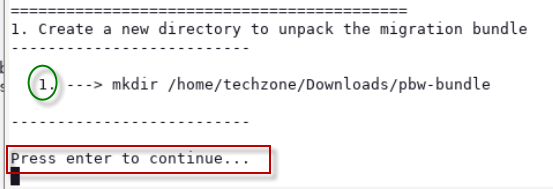

    

    

    

    

    

    </details>

    ___

    The following message is displayed when all of the steps in the script are complete. 

    

    ___

2.  From a **Terminal** window, `start` the Liberty server named ‘**pbwserver**”

        /home/techzone/wlp/bin/server start pbwserver

3.  Rerun the PlantsByWebSphere application from the browser.

        http://localhost:9080/PlantsByWebSphere
 
    Now the application is running in Liberty, and the main page is displayed.
 
    

4.  Attempt to click on any of the tabs: “**Flowers**”, **Fruits & Vegetables**”, or “**Trees**”.

    ___

    **Note the exception.** This is an expected erorr. The issue is in the JPA persistence (Database access). A user is not defined, and therefore authentication to the database failed.
 
    
 
    ___

    These pages should display a catalog of items in their respective category, which are rereived from the application database. 

    **So what happened?** 
    
    Transformation Advisor does not collect any `sensitive data` for the application server.  This means the application-specific configuration information in the **server.xml** file has not been set. In this case, the `username` and `password` to access the database are missing.

    In the next section, you will review the server.xml file and add the sensitive data required to access the application database.  

    <br/>

### 2.1.5   Review the server.xml file

Now you will review the **`server.xml`** file and set the necessary configuration information. 

The **server.xml** file defines a set of **`features`** that the application requires. By importing only the necessary **features** to support the application’s API needs, the footprint of the deployed application and Liberty server is kept as small as possible.

1. Review the server.xml file

    Using the “**`gedit`**” editor in a **`Terminal`** window, open the **server.xml** file located in the Liberty server

        gedit /home/techzone/wlp/usr/servers/pbwserver/server.xml

    - **Section 1** contains the `features` that the application requires, and these are discovered automatically during analysis performed the Transformation Advisor **Data Collector**.

      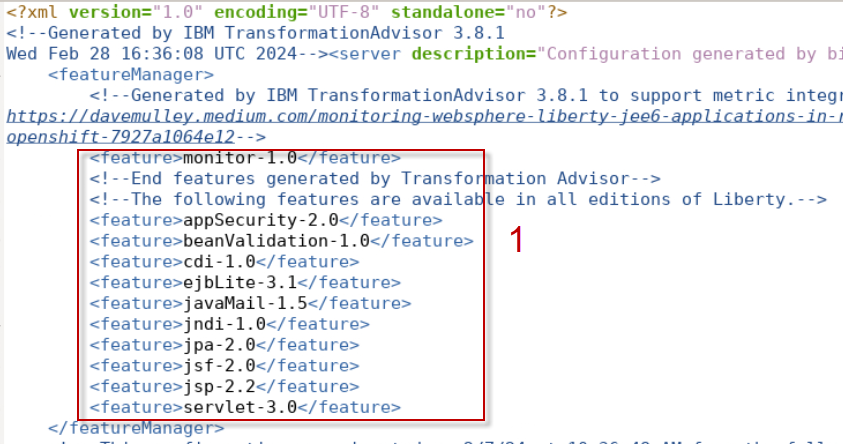

    - **Section 2:** Defines the `resources` required to access the database

      - The **`authdata`** defies the BD2 user and password that is used by the datasources. These refer to variables that are defined in the server.xml file.

      - The **`jdbc`** driver defines the required libraries. These are the libraries you copied into this location via the script

      

    - **Section 3:** The **`datasource`** contains all the information required to access the database: Database user, password, database name, host, and port number.

      


    - **Section 4** contains the variables for the **`non-sensitive configuration data`**. For example, the port to run the server on. The values of these variables are collected by Transformation Advisor.

      

    - **Section 5** contains the **`sensitive data variables`**. 
    
      You can see that the values for these variables are all **blank**, as this information is **never** collected by Transformation Advisor.

      


2.  The reason that the **PlantsByWebSphere** application retuned an “Exception” is because the values for the **sensitive variables** has not been set. 
  
    

    Next, you will update the server.xml to include the credentials required to access the application database. 


### 2.1.6   Update the server.xml and retest the PlantsByWebSphere application


1. From a Terminal window, `stop` the Liberty server named ‘pbwserver”

        /home/techzone/wlp/bin/server stop pbwserver

2. From the `gedit` editor that you have open, update the values in the **server.xml** file for the sensitive data as illustrtated below:

   a. Scroll to the bottom of the server.xml file to view the sensitive-data variables. 

   b.  Set the default value for **rhel9_baseNode01_pbwuser_password** to: **`db2inst1-pwd`**
    
   c. Set the default value for **rhel9_baseNode01_pbwuser_user** to: **`db2inst1`**

     
    
   d. **`Save`** and **`close`** the server.xml in the editor


3. From a Terminal window, `start` the Liberty server named ‘pbwserver”

        /home/techzone/wlp/bin/server start pbwserver


4. Reload and test PlantsByWebSphere application in the browser

        http://localhost:9080/PlantsByWebSphere


    a. Click the “**Flowers**” tab. The catalog of flowers should now be displayed.

    


3. From a **Terminal** window, `Stop` the Liberty server named ‘**pbwserver**”

        /home/techzone/wlp/bin/server stop pbwserver


### Checkpoint

At this point in the lab, you have successfully demonstrated "Runtime Modernization" of the PlantsByWebSphere application to WebSPhere Lberty on a local VM. 

In the next sections, you will perform "Operational Moderniztion" whereby deploying the PlantsByWebSphere application to containers and Red Hat OpenShift. 

# Part 3: Operational Modernization    

## 3.1 Operational Modernization

Operational modernization gives an operations team the opportunity to embrace modern operations best practices without putting change requirements on the development team. 

The scaling, routing, clustering, high availability, and continuous availability functionality that were previously provided by the application server middleware, can be provided by the container platform. 

This allows the operations team to run cloud-native and modernized applications in the same environment with the same standardized logging, monitoring, and security frameworks.


## 3.1.1  Explore the Containerfile used to build PlantsByWebSphere as a container image

In the previous section, you used the **server.xml** to get the  application running on a local Liberty instance. This was to show you how the Transformation Advisor **server.xml** file is used. If you are moving to Liberty in VMs as your new runtime, then you are done! 

However. if containers are to be your final destination, this section explores the Transformation Advisor migration bundle artifacts that accelerate application deployment to Lberty in containers. 

In the case of **`Simple`** applications, it is not necessary to carry out a separate step of deploying to a local Liberty instance at all. Instead, by using the Transformation Advisor migration bundle, you can deploy your application to Liberty running in a container all in one go. This is what we will do now.

___

For this section of the lab, the migration bundle has already been updated as follows:

  - The **PlantsByWebSphere EAR** file has been added to the migration bundle. And its placeholder has been removed

  - The **DB2 libraries** have been added to the migration bundle, and the placeholders have been removed

  - The **server.xml** file is configured with default values for the database access
    
___

 


1.  The `migration bundle` is ready to be used to generate an image of your application running on WebSphere Liberty. To do this, we will use the **`Containerfile`** that comes with the migration bundle.

    

    a. Explore the Containerfile in the migration bundle

        gedit /home/techzone/Student/labs/appmod/pbw-bundle-complete/Containerfile
 
 
    - The **FROM** statements in the **Containerfile** pull in the following two images. 
     
      - **`Open JDK 8`**
      - **23.0.0.12** version of **`WebSphere Liberty`**.

      

      

      ___

      **Note:** The Containerfile has been modified for this lab to pull `23.0.0.12` of `WebSphere Liberty`. By default, it pulls the latest WebSphere Liberty.

      ___

   
    - The **RUN** commands in the Containerfile create the necessary folder structures and copies the **`binary files`** from the migration bundle into the appropriate locations in the image.

      

    - There are several lines in the file that have been commented out. 
    
      By default, the **Containerfile** assumes that your application is available as a **binary** file. However, it can also be used to build your application from **source** code. The full details of how to do this can be found in **README.md** in the migration bundle.

      

    b. `Close` the "gedit" editor. **DO NOT SAVE ANY CHNAGES TO THE FILE!** 

    <br/>


### 3.1.2 Setup, build and run PlantsByWebSphere in a local container

For the PlantsByWebSphere application to propery run in a local container, it requires access to the application database, which runs in a separate container. 

The application container and the database container must be connected to the same local Docker network.

In this lab, the steps to build, setup, and run the PlantsByWebSphere application in a local container are:

- **Step 1:** Ensure the DB2 application database is running

- **Step 2:** Create a local Docker network

- **Step 3:** Ensure the Docker network is created

- **Step 4:** Connect the DB2 database container to the Docker network

- **Step 5:**  Build and tag the application container image

- **Step 6:**  Start the application in the container

To facilitate executing the steps above, we have provided a `convenience shell script` that performs these steps.

You will **run the script**, which will prompt you to press “**Enter**” key before executing each of the commands in the script. This allows you to examine the command before they are executed, while avoiding having to perform mundane copy/paste activities in the lab.

1. Run the following command to setup, ,build, and run the PlantsByWebSphere application in a local container.

        cd /home/techzone/appmod-pot-labfiles/labs/RuntimeModernization/scipts
 
        ./build-container -i

    **Note:** The `-i` parameter tells the script to run in interactive mode, prompting you to press **`Enter`** key to run the command shown.

    ___

    **Note:** The script also performs any necessary cleanup tasks, in the event you need to rerun the script for some unknown reason.
    ___
    
   
    
    <details>
     <summary><b><font color="dodgerblue">Click to expand:</font></b> For reference: The screenshots of each step of the "build-container" script
     </summary>

  
    

    
    

     
    

   
    

    
    

   
    

    
    **Note:** The `docker run` command contains a few parameters that are defined below: :
 
    \-d : start the container in detached mode. This is just for convenience
 
    \-p : expose the applications HTTP and HTTPS ports
 
    \--network : connect the container to the Docker network that the DB2 database is connected
 
    \--rm : remove the container when the container is stopped. This is just for convenience
 


    </details>

    ___

    The following message is displayed when all of the steps in the script are complete. 

    

    ___   

2.  Check that the container is up and running.

        docker ps | grep pbw

    

3.  From the browser, access the PlantsByWebSphere application that is running in the local container

        http://server0.gym.lan:9080/PlantsByWebSphere
 
     
 
    And view the catalog of `Flowers`, which are retrieved from the database.
 
    

9.  `Stop` the PlantsByWebSphere container

        docker stop pbw

**Considerations and recommendations:**

In the section of the lab you just completed, running the application in a local container, we updated the **server.xml** by adding the sensitive data values for the database access. Then we baked that configuration into the container image.

However, a big part of container image value is that they are **`immutable`**. No matter where you take and deploy the image, the operating system, runtime, security patch level, etc. will be the same. This gives you great reproducibility and gets away from the classic **"but it works for me!"** issue.

We lose much of this value if we bake in the configuration with the image, as we will have to produce an image for each new configuration.

Instead of using the exact same image in each of your development, staging and production environments, you would need to use different images. 

___

It is **never** best practice to hard code configuration into your image.
___

**Recommendation:**

In the next section, we will look at how the migration bundle helps you manage this configuration easily across all your environments and how it will simplify deployment to your OpenShift cluster. The migration bundle uses `Kustomize` to help achieve this.


## 3.2 Explore how Kustomize is used in the migration bundle

**`kustomize`** is simple way to manage configuration across all your different deployments and environments without the need for templates.

By using **`overlays`**, it allows you to break out your basic configuration information (ports, names, hosts, etc.) from your sensitive data (usernames, password, etc.) that are likely to change in every deployment.

Every **kustomize** artifact is plain `YAML` and can be validated and processed in a standardized way. Plus, it makes them very human readable\! It is natively built into **kubectl** and the **OpenShift client**.

1.  From a **`Terminal` window**, list the contents of the **`deploy`** folder of the migration bundle

        ls /home/techzone/Student/labs/appmod/pbw-bundle-complete/deploy

    

    a.  There are two folders.
    
      - **`k8s:`** Contains files to accelerate deployment into **Kubernetes**. These help to create routes, services, and deployments. We will focus on deployment to OpenShift with **kustomize** in this lab.
    
      - **`kustomize:`** Contains the files for deployment using **kustomize**.

2.  Go to the `Kustomize` folder located under the `deploy` directory 

        cd /home/techzone/Student/labs/appmod/pbw-bundle-complete/deploy/kustomize

3.  Examine the structure of the **kustomize** folder:
    
        ls -R
        
    
    
        

    **Base:**

    - contains the **`Kustomization.yaml`** that describes the resources managed by Kustomize

    - contains the **`application.cr-yaml`** This is the **WebSphere Liberty operator custom resource file** that will execute the deployment and mount the necessary secrets and configuration that are created from the secret file and config map file. 
    
    **Overlays:**

    - contains all your different deployment configurations.

    - In this case, only a single deployment has been created for your **`dev`** systems.


    **Obverlays/dev**

    - The `config map yaml file` will contain all your application-specific non-sensitive data that will be created as configMaps in OpenShift.

    - The `secret yaml file` will contain all your application-specific sensitive data that will be created as secrets in OpenShift.

    - Optionally contain additional yaml files that override configuration in the `base` configuration.

    ___

    **Note:** In the next section we will use this kustomize structure to deploy your application image.

    Further information on **kustomize** can be found at <http://kustomize.io>
    
    ___


## 3.3 Deploy to OpenShift with config

From the previous sections in the lab, you have an `immutable container image` built. 

In this section, you will push that image to an image registry and then deploy it into OpenShift “**dev**” project, along with its configuration, with a single command, using the `WebSphere Liberty Operator` and the generated deployment artifacts in the `migration bundle`.


### 3.3.1 Deploy the application to the OpenShift “dev” environment

The application uses a DB2 database that contains a catalog of items used for the ”dev” environment.

___

**Note:**  
After you deploy the application to the **dev** environment in OpenShift, you will explore and examine the Liberty Operator and Kustomize yaml artifacts in the migration bundle, which are used to deploy the application.

___

Deploying the PlantsByWebSphere application and its configuration to OpenShift is easily accomplished using a single command.

However, in this lab, before you can deploy the application to OpenShift, the container image must be propery tagged and pushed to an image registry. In this lab, we use the OpenShift Internal registry.

The following steps need to be performed, and will be done using a `convemience script` that is provided for this lab. 

  - Tag the container image for pushing to the OpenShift Internal Registry

  - Login to OpenShift

  - Create the “dev” project where the application will be deployed

  - Login to the OpenShift internal registry

  - Push the container image to the registry

  - Deploy the application and it configuration to OpenShift “dev” project

To streamline executing the steps above, we have provided a `convenience shell script` that performs the steps.

You will run the script, which will prompt you to press **`Enter`** key before executing each of the commands in the script. This allows you to examine the command before they are executed, while avoiding having to perform mundane copy/paste activities in the lab.

1. Run the following command to tag and push the PlantsByWebSphere container image to the OpenShift internal registry and deploy the application to the dev” project.

        cd /home/techzone/appmod-pot-labfiles/labs/RuntimeModernization/scripts
 
        ./dev-deploy-pbw-ocp.sh -i

    **Note:** The `-i` parameter tells the script to run in interactive mode, prompting you to press **`Enter`** key to run the command shown.

    ___

    **Note:** The script also performs any necessary cleanup tasks, in the event you need to rerun the script for some unknown reason.

    ___


    <details>
     <summary><b><font color="dodgerblue">Click to expand:</font></b> For reference: The screenshots of each step of the "dev-deploy-pbw-ocp" script
     </summary>

   <br/> 

    **Step 1:** Tag the PlantsByWebSphere container image for pushing to the OpenShift internal registry

    


    **Step 2:** Login to OpenShift

    

    **Step 3:** Create the ‘dev’ project in OpenShift, where the application will be deployed

    

    **Step 4:** Switch to the ‘dev’ project, where subsequent OCP commands in the script will be executed.

    
  
    **Step 5:** Login to the OpenShift internal registry, so we can push the PlantsByWebSphere image.

     

    **Step 6:** Push the PlantsByWebSphere container image to the OpenShift interna image registry.

    

    **Step 7:** List the Image Stream and see that it is available.

    

    **Step 8:** Deploy the PlantsByWebSphere application and its  configuration to the ‘dev’ project.

    

    **Step 9:** List the new ‘deployment’ and see that it is available.

    


    **Step 10:** List the PlantsByWebSphere ‘pod’ and see that it is ready.

    

    **Step 11:** Show the ‘route’ to the PlantsByWebSphere application running in the ‘dev’ project.

    
 
    </details> 

    ___

    When the script completes, you will see the **PlantsByWebSphere Route** shown.

    

    ___

2. From the browser, navigate to the PlantsByWebSphere route for the `dev` deployment:

        http://plantsbywebsphereee6-dev.apps.ocp.ibm.edu/PlantsByWebSphere
 

    Optionally, you can use **`Right-mouse click`** on the **`PlantsByWebSphere URL`** in the Terminal window and select **`open Link`**. This will launch the application in the web browser.
 
    

3. The PlantsByWebSphere main page is displayed.

    

4. Click on the **`Trees`** category and view the trees that are loaded in the ‘dev’ environment database.

    This catalog of trees was retrieved from the DB2 database in the `dev` environment.
 
    


###  3.3.2 Review the “dev” overlay configuration that was used to deploy the application and configuration

The **`overlays/dev`** directory contains configuration that is specific and unique for the **`dev`** deployment.


1. Examine and understand how to configure the sensitive data as Kubernetes secrets
 
    a. From a **`Terminal`** window, navigate to the 'secrets' yaml file in the 'dev'overlay folder in the migration bundle

        clear
        
        cd /home/techzone/Student/labs/appmod/pbw-bundle-complete/deploy/kustomize
 
        cat overlays/dev/plantsbywebsphereee6-secret.yaml
 
    
 
    Notice that we already inserted the DB2 database `user` and `password` in the yaml file that configures the sensitive data in a Kubernetes secret.
 
    **Note:** Data in this file is REQUIRED to be bese64 encoded.


    b. `How did we encode the values?` 
    
    To update the migration bundle with the sensitive data, we **Base64 encoded** the values as illustrated below.
 
    - We encoded the following values:
   
      ___

      - user: **db2inst1**

        echo db2inst1 | base64

      The encoded value is: **ZGIyaW5zdDEK**

      ___

      - password: **db2inst1-pwd**

        echo db2inst1-pwd | base64

      The encoded value is: **ZGIyaW5zdDEtcHdkCg==**

      ___ 

2.  From a **Terminal** window, examine the **`application-cr.yaml`**

    The **`application-cr.yaml`** is the WebSphere Liberty custom resource used to deploy the PlantsByWebSphere application.
 
        
        cd /home/techzone/Student/labs/appmod/pbw-bundle-complete/deploy/kustomize
 
        gedit base/application-cr.yaml

    a.  In this lab, we chose to override the application image, as we will push the same immutable image to different namespaces in OpenShift. 
    
    Therefore, following the rules of Kustomize, the **applicationImage** definition in the application-cr.yaml is “blank”. It is overridden in overlays/dev.

    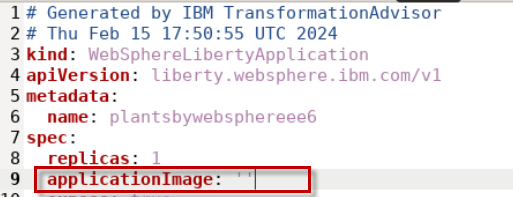

    b.  The `secret` and `configmap` references pull in the server configuration as `environment variables`.

    

    c.  For this lab, we do not have transport level security enabled.

    

    d.  We must accept the license.

    

    e.  **`Close`** the `gedit` editor. **DO NOT SAVE ANY CHANGES TO THE FILE\!**
    

3.  From a **Terminal** window, examine the `config map` for the `dev` deployment

     The **`plantsbywebsphereee6-configmap.yaml`** contains the variables defined in the `server.xml`.
 
     All values defined in the **configMap** are created as environment variable in the container. These environment variables override any default values that may have been set in the server.xml.
 
        cd /home/techzone/Student/labs/appmod/pbw-bundle-complete/deploy/kustomize
 
        gedit overlays/dev/plantsbywebsphereee6-configmap.yaml


    a. This configuration overrides the **database server name.** It references the application database server for the “**dev**” environment.

    

    b.  **`Close`** the “**gedit**” editor. **DO NOT SAVE AY CHANGES TO THE FILE!**


###  3.3.3 Explore the WebSphere Liberty Operator in OpenShift

In this section, you will take a look at the **WebSphere Liberty Operator** in the OpenShift console to see what has been deployed.

1.  Login to OpenShift console

    a.  Open a new tab in the web browser

    b.  Click on the **`OpenShift Console`** bookmark on the bookmark toolbar

    c.  Login credentials:

    - Username: `ocadmin`

    - Password: `ibmrhocp`

2.  View the **IBM WebSphere Liberty** `Operator`

    a.  Click on **`Operators > Installed Operators`** in the left-hand menu

    b.  Type **`Liberty`** in the filter

    c.  Click on **`IBM WebSphere Liberty`**

    


3. View the **WebSphereLibertyApplication** `Deployment`

    a.  Click on the tab called **`WebSphereLibertyApplication`**

    

    b. You will see the **plantsbywebsphereee6** application listed in the ‘dev’ namespace

    b. Click on the link called **`plantsbywebsphereee6`** under the **Name** column

    

    c.  Select the **`Resources`** tab

    

    d. Select the link for the **`Deployment`**

    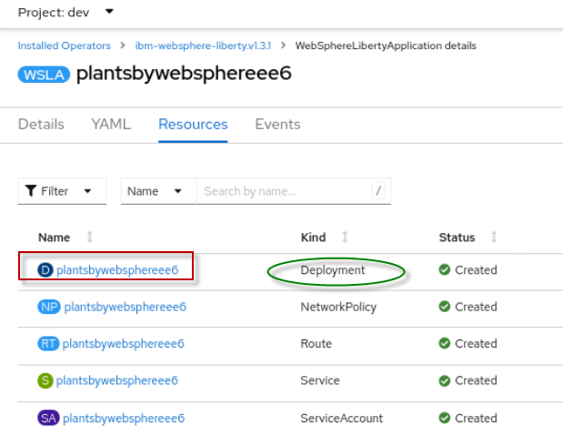

    e. The PlantsByWebSphere deployment has one `pod` running

    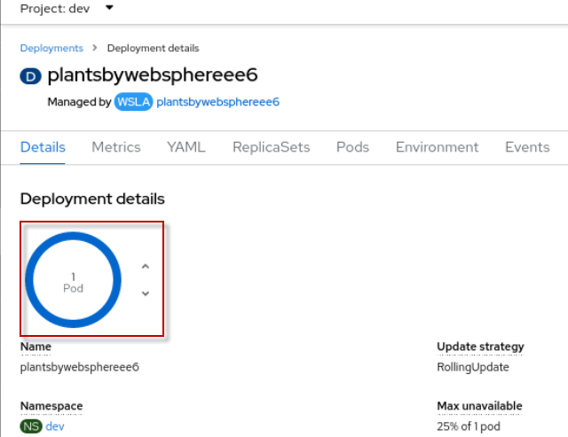


4.  View the WebSphereLibertyApplication **`Route`**

    a.  Return to the **plantsbywebsphereee6 operator** page

    

    b.  Click the **`Resources`** tab

    

    c.  Select the link of **Kind: `route`**

    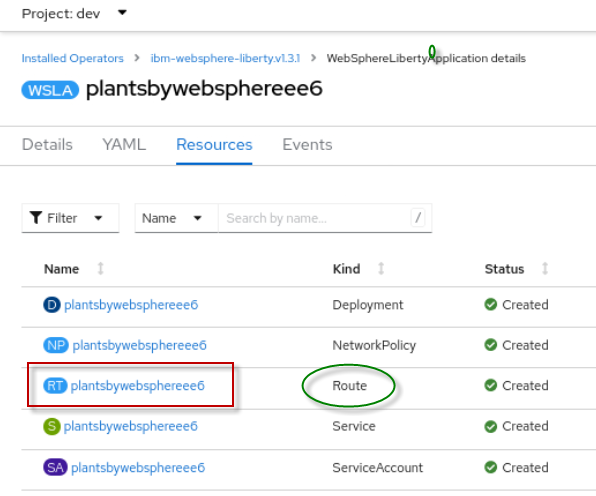

    d.  Click on the **`Location`** link for the route

    

    e.  The **Welcome to Liberty** page is displayed in a new Browser tab. 

    

    f.  Append the context root ‘**PlantsByWebSphere’** to access the PlantsByWebSphere application

        http://plantsbywebsphereee6-dev.apps.ocp.ibm.edu/PlantsByWebSphere


# Summary

___
**Congratulations!**

**You have successfully completed the core learning objectives in the lab**

___

In this lab, you learned how to deploy applications to WebSphere Liberty using the WebSphere Liberty Operator and the deployment artifacts produced by Transformation Advisor in its migration bundle.

You explored the options for deployment: 

  - locally running Liberty
  - Liberty as an image running in local container
  - Liberty as an image running in OpenShift.

You learned how to easily configure deployments to OpenShift to allow the same immutable image to be deployed for different configurations such as ‘dev’ and ‘staging’ environment deployments.

You learned about some of the practical ways you can secure your configuration data.

You explored the PlantsByWebSphere assessment details and reports in Transformation Advisor.


___

You may continue your learning journey with the optional sections of the lab. 

___


# Optional Sections: 

<details>
 <summary><b><font color="dodgerblue">Click to expand:</font></b> Section 3.4 GitOps and configuration management
 </summary>

<br/>

## 3.4 GitOps and configuration management

At this point we have two distinct elements for deployment: the **application image** and the **configuration for that image for each potential environment**. In the GitOps model, these two elements are stored in separate Git repositories. 

You can further distribute the configuration into different repositories for each environment. This approach allows you to treat configuration as if it were code and to apply standard code development techniques such as Pull Requests, code review and maintain a full audit history. This approach delivers excellent controls and oversights for configuration changes for your OpenShift clusters, especially as you promote changes through your environments.


This illustration above comes from an excellent article on real world GitOps: <https://developer.ibm.com/blogs/gitops-best-practices-for-the-real-world/>

We will not cover all of GitOps it in detail in this lab - however, there are two relevant areas that are worth mentioning briefly.

**Configuration Drift**

With the GitOps approach, there is the risk that the deployed configuration for the OpenShift cluster does not match what is in the Git repository. Someone could have updated the OpenShift cluster directly, for example. There are a number of tools to manage this configuration drift, with ArgoCD being a common tool to address this issue. It can be configured to sync manually or automatically, so that any changes made directly on the cluster are reverted to what is in the Git repository. 

The OpenShift GitOps Operator can be used to install ArgoCD into your OpenShift cluster. Further details on how to this can be found here: <https://developer.ibm.com/tutorials/deploy-open-liberty-applications-with-gitops/>

**Securing Secrets**

Even with controls and restricted access to Git repositories, it is not considered good practice to store the sensitive data in plain text (aka the values entered into the secrets files). There are generally two approaches you can take to tackle this: encrypt the values or use a reference:

  - **Encrypt the values**: In this approach, the value in the secret file is encrypted when it is committed to the Git repo. During deployment to OpenShift there is an extra step where the secret values are decrypted. `SealedSecrets` is one implementation of such an approach.

  - **Use a reference**: In this case, the secrets and their values are stored in a secret manager. During deployment, a reference is provided to the secret manager which will then mount the secret to the deployed container. `HashiCorp Vault` is a common implementation of this approach.

In both cases, there is additional work to be done above what has been covered in this lab. However, the kustomize files provided in the migration bundle gives you a good starting point to identify the secrets and provide a standard output that can be transformed to suit your selected approach.

</details>


<details>
 <summary><b><font color="dodgerblue">Click to expand:</font></b> Section 4: (Optional)   Promote PlantsByWebSphere to the ‘staging’ environment in OpenShift
 </summary>

<br/>

## 4.1 Re-Deploy PlantsByWebSphere to the ‘staging’ environment in OpenShift

You have deployed the PlantsByWebSphere application with its configuration, to a ‘dev’ environment, using a single kustomize command.

In this section, you will deploy the same application again, with a different configuration, to a ‘staging’ environment, using a single kustomize command with a different overlay configuration called 'staging'. 

**To do this, we need to do the following:**

  - Copy the ‘dev’ overlays yaml files to a new overlays folder. We will name it ‘staging’.

  - Update the environment specific configuration in the new ’staging’ overlays folder.

___

**Note:** 

For this section of the lab, the PlantsByWebSphere application that you deploy to the ‘staging’ environment will access a different DB2 database than was used in the ‘dev’ environment.

It is typical to use different databases as the application is promoted to higher environments that support different phases of testing to production.

___


### 4.1.1 Setup and exaamine the 'staging' deployment configuration

In this lab, the ‘staging’ database has a different set of ‘Trees’ loaded in the catalog, compared to the ‘dev’ database.

While in a real environment, the different databases might use different database access credentials, in this lab environment, the credentials remain the same as the ‘dev’ database.

**What are the configuration changes between the ‘dev’ and ‘staging’ environments in this lab scenario?**

  - The database **server** **hostname** is different between ‘dev’ and ‘staging’.

**What is staying the same between the ‘dev’ and ‘staging’ deployment?**

  - The same immutable container image for PlantsByWebSphere application is used in ‘dev’ and ‘staging’

  - We continue to use the same database name: PBW

  - We continue to use the same database port: 50000

  - We continue to use the same database access credentials

The values for the **database name, port, and host** are all stored in a **config map** yaml file. Therefore, the config map yaml file in the ‘staging’ overlay folder will be different than the config map file used in thee ‘dev’ overlay folder.

This means that to deploy the PlantsByWebSphere application to the ‘staging’ environment, all that needs to be done is to update the `DB2 hostname` in the `config map` yaml file located in the ‘staging’ overlays folder. Then run the single command to deploy the PlantsByWebSphere application to the staging environment.

**Now we are ready to start:**

  - Copy the ‘dev’ overlays yaml files to a new overlays folder. We will name it ‘staging’.

  - Update the environment specific configuration in the new ’staging’ overlays folder.

To streamline executing the steps above, we have provided a `convenience shell script` that performs these steps.

You will `run the script` to setup the staging overlay, while avoiding having to perform mundane copy/paste activities in the lab.

After running the script, we will review the changes that were made to the config map yaml file.

1.  Run the following commands to setup the `overlays/staging` folder with the updated config map. 

        cd /home/techzone/appmod-pot-labfiles/labs/RuntimeModernization/scripts

        ./kustomize-staging.sh

    **Note:** The script also performs any necessary cleanup tasks, in the event you need to rerun the script for some unknown reason.

    

2.  Examine the **staging** overlay

        ls /home/techzone/Student/labs/appmod/pbw-bundle-complete/deploy/kustomize/overlays

    The contents were copied ‘as-is’ from the ‘dev’ overlay directory
 
    

3.  The ‘**staging’** overlay directory contains the same 4 yaml files as the ‘dev’ overlay

        ls /home/techzone/Student/labs/appmod/pbw-bundle-complete/deploy/kustomize/overlays/staging

    

4.  The **plantsbywebspheree6-configmap.yaml** file contains the ‘**staging’** environment specific configuration.

    Specifically, the “**DataSource serverName**” for the DB2 database has been updated to the ‘staging’ environment database host
 
        gedit /home/techzone/Student/labs/appmod/pbw-bundle-complete/deploy/kustomize/overlays/staging/plantsbywebsphereee6-configmap.yaml
 
    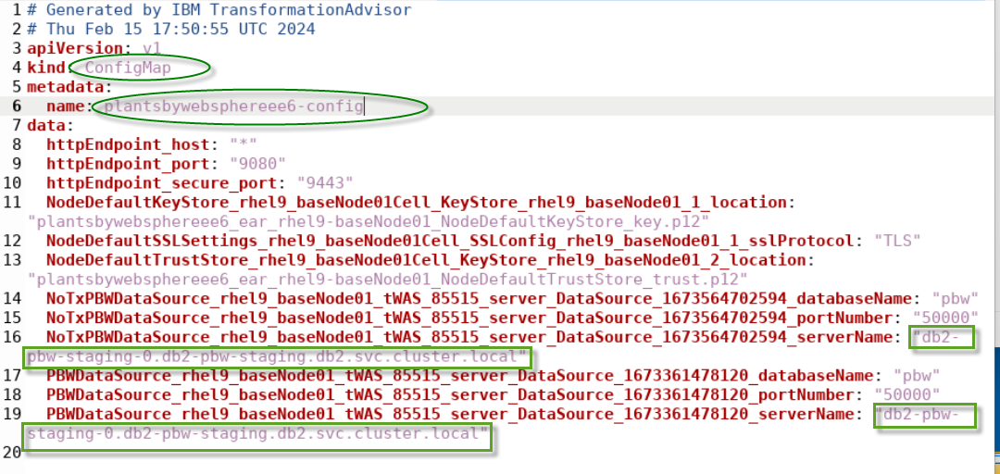


5. **`Close`** the "gedit" editor. **DO NOT SAVE ANY CHNAGES TO THE FILE!**


### 4.1.2 Deploy PlantsByWebSphere to staging evironment

In this section, you will run the same steps to deploy and configure the application to the staging environment, which were used in dev. 

The differecne is the configuration deltas you examined in the overlays/staging folders in the migration bundle. 


1.  Run the following `convenience shell script` to deploy the PlantsByWebSphere application to the ‘**staging’** environment.

    **Note:** The script performs the same steps as the deployment to the ‘dev’ environment.
 
    ___

    The script performs any necessary cleanup tasks, in the event you need to rerun the script for some unknown reason.
 
    ___

        cd /home/techzone/appmod-pot-labfiles/labs/RuntimeModernization/scripts
 
        ./staging-deploy-pbw-ocp.sh
 
    Notice in **`step 8`** of the script, the command to deploy the application uses the configuration from the `staging` overlay, as illustrated below.
 
    

   When the script completes, the URL (Route) to the PlantsByWebSphere application running in the staging environment is displayed.

   


2.  Open a new browser tab and go to that URL:

        http://plantsbywebsphereee6-staging.apps.ocp.ibm.edu/PlantsByWebSphere
 
    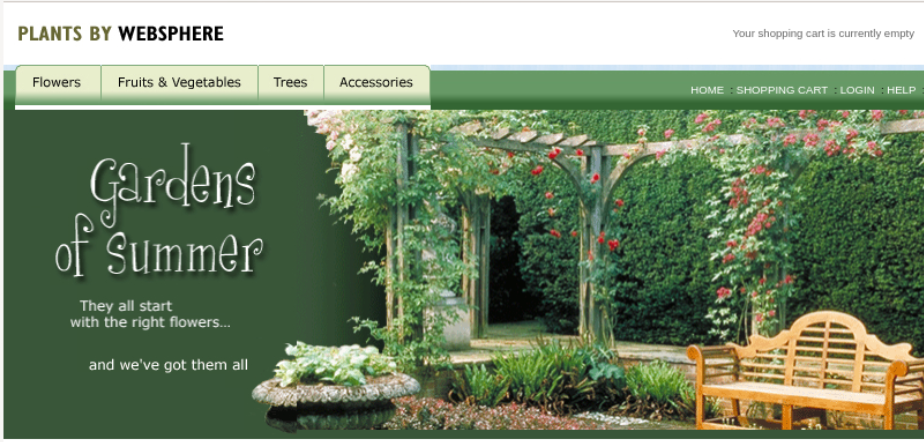

3.  In the application, click on the “**Trees**” category. This the list of trees in the “**staging**” database.

    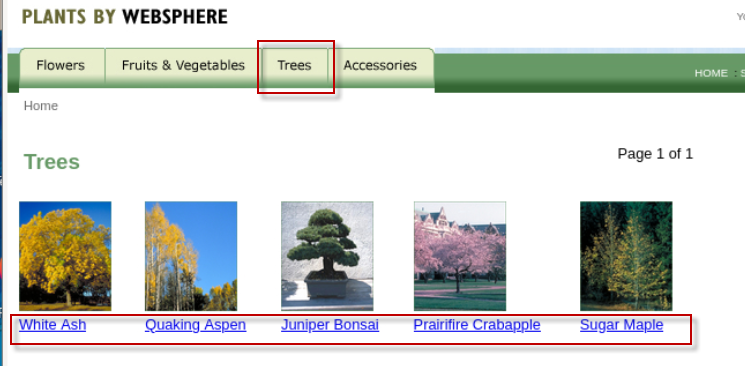

4.  You may refer to the catalog of trees in the ‘**dev’** environment, and notice the trees are named differently in the staging environment.

    a. Open a new browser tab and go to the application running in the `dev` environment.

        http://plantsbywebsphereee6-dev.apps.ocp.ibm.edu/PlantsByWebSphere

    


</details>    


<details>
 <summary><b><font color="dodgerblue">Click to expand:</font></b> Section 5: (Optional) Exploring the PlantsByWebSphere application in the proof_of_concept workspace
 </summary>

<br/>

## 5.1 Exploring the PlantsByWebSphere application in the proof_of_concept workspace

IBM Cloud Transformation Advisor (TA) analyzes application and configuration data collected from Java application server environments. TA delivers great insights that help organizations plan and implement a modernization journey to WebSphere Liberty and Kubernetes base container platform for existing Java applications.
 
TA provides recommendations for modernization which includes and considers application complexity, dependencies, potential issues, and estimated development effort.
 


1. In a browser window, return to Transformation Advisor using the following URL: 

        http://localhost:3000

2. Open the `proof-of-concept` workspace, if it is not already open

    


3.  Scroll down to the `Java applications` section and note the high-level summary for the ‘**plantsbywebsphereee6.ear**’application assessment.

  - Complexity

  - Issues

  - Required code changes

  - Application cost (in days for development)

    

This workspace has only a single application name `plantsbywebsphereee6.ear`. It is summarized as `simple` to  modernize to WebSphere Liberty.  

 ***Complexity values and their meanings:***
 
**`Simple`**: The application is ready for deployment, no access to the source code is required. 

  - Simple complexity value typically represents about 20% of applications.
 
 **`Moderate`**: Code changes are required before deployment; however, these code changes are well known, and specific help is provided for each issue to assist in resolving it. 
 
   - Moderate complexity value typically represents about 80% of applications.
 
 **`Complex`**: The application uses a technology that does not have a direct equivalent in the new runtime and a new approach will need to be adopted. In our experience, only about 1 in 6 customers have these kinds of applications. 
 
   - Complex complexity value typically represents less than 1% of applications.

4. Click on **plantsByWebSphereee6.ear** which will expand the analysis

    

    a. Scroll down, noting the groups or categories of analysis available
    
    - **Complexity rules**
    
    - **Required code changes**
    
    - **Issue details**

      - Critical

      - Warning

      - Informational
    
    - **Additional reports**

      - Technology report

      - Inventory report

      - Analysis reports


5.  View the **`Analysis Report`** for more detailed application information

    **Analysis Report**

    The **Detailed Migration Analysis Report** does a deep dive on the preferred migration target to help you understand any migration issues, like deprecated or removed APIs, Java SE version differences, and Java EE behavioral differences.

    a.  Click on the **`Analysis report`** link. 

    

    b. The **Analysis report** will open in a new browser tab

    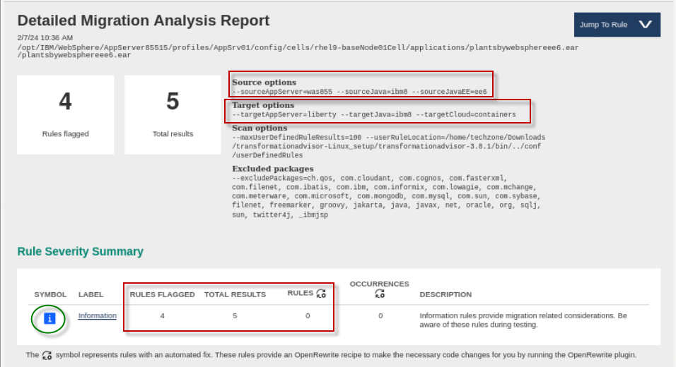
 

    c.  Note the **target**

    - Because the **source** was traditional WebSphere v8.5.5, which is Java EE 6, the target is also EE6.

    - Because the source was running Jave SE 8, the target is also set to Java SE 8.

    By default, Transformation advisor recommends the first step of modernization to Liberty that requires the minimal amount of change and effort.
 
    You may use the binary scanner with the `--ta` option if you want to assess the modernization effort to newer versions Java, Jave EE, or Jakarta EE. Running the binary scanner with the `-ta` option produces an archive file that can be loaded into Transformation Advisor for analysis.

    d.  Click on the **`Information`** label, to review the details of this item.

    
 
    The **Information** rules provide migration related considerations. Be aware of these rules during testing. Many of these rules relate to connectivity to other resources that need to be considered during migration.

    e.  You may review the Information rules for PlantsByWebSphere migration.

    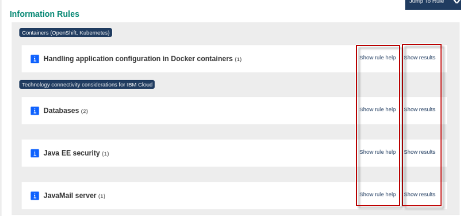


6.  Return to the **Cloud Transformation Advisor** browser tab that shows the **plantsbywebsphereee6.ear details** page. Then click on **`Inventory Report`**, which will open in a new browser tab.

    

    a.  Scroll down and review the Inventory Report, which is especially useful in larger applications.

    The **Inventory report** provides a high-level inventory of the content and structure of each application, plus information about potential deployment problems and performance considerations.
 
    

    b.  Scroll down to the bottom of the **Inventory report** and locate **`the Contained Archives`** section.

    The inventory report provides valuable insights into utility jars that are contained in the application. It also provides the ‘package’ name of the utility jar. This is extremely valuable to help determine what 3<sup>rd</sup> party utilities are used by the application.

    c.  Notice the PlantsByWebSphere application contains utility jar named **‘pbw-lib’jar**’. The archive package is “ibm.com.websphere’, indicating it is NOT a 3<sup>rd</sup> party utility jar.

    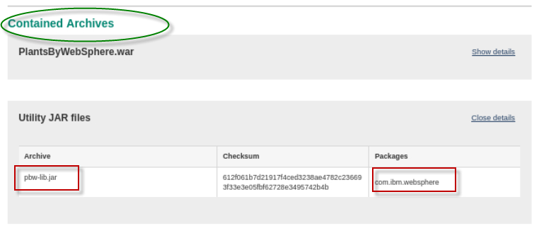

    d.  Return to the **Cloud Transformation Advisor** browser tab that shows the **plantsbywebsphereee6.ear details** page. Then click on **`Technology report`**, which will open in a new browser tab.

    The **Technology report** provides details on which editions of Liberty support the technologies used by the applications.
 
    

    a.  Scroll down Technology Report, which can quickly help assess which Java EE API technologies that the PlantsByWebSphere application uses, and which editions of Liberty the APIS are available.

    

    b. As you see from the report above, the APIs used in the PlantsByWebSphere application are available in ALL editions of Liberty.

</details>


