# Lab 4310

## WebSphere proactive CVE protection and memory leak remediation observed by Instana 

 
## Introduction to IBM WebSphere Automation

[IBM WebSphere Automation](https://www.ibm.com/cloud/websphere-automation) focuses on delivering value to existing WebSphere Application Server (WAS) environments by helping administrators reduce the cost, effort and risk of addressing common vulnerabilities, automating tasks and remediating capacity incidents.

It removes manual toil so that your team can spend more time innovating while minimizing the cost of extending the life and maximizing the ROI of your WebSphere investments.

WebSphere Automation helps organizations gain visibility, operational efficiencies, and cost savings quickly by extending the life of WebSphere investments and giving teams time to focus on unlocking new value and fixing the imbalance of pure maintenance versus innovation tasks. It provides the following benefits:

  - WebSphere operators and administrators save time and embrace DevSecOps by implementing patches more efficiently on virtual and container environments to keep operations compliant and secure.

  - Enhanced remediation capabilities with insights and recommendations improve the speed and depth of understanding outages and anomalies as they occur.

  - Augmented operational experience with access to simplified and consolidated information that enables teams to act.

IBM WebSphere Automation is a stand-alone product that runs on Red Hat OpenShift. Entitlement to Red Hat OpenShift is included with IBM WebSphere Automation but must be installed separately. As part of IBM Automation platform, WebSphere Automation includes containerized components and common software services on top of a common automation layer, to manage WebSphere incidents, hybrid applications, and cost with complete observability, governance, and compliance.

You can deploy it virtually anywhere through containers that are supported by Red Hat® OpenShift® software, on IBM Cloud®, on essentially any existing infrastructure on-premises, or through private and public clouds. Use only the capabilities you need with a fully modular approach that is designed to be easy to consume.

## Accessing the lab environment

An environment is provisioned for you for this lab session. The instructor or lab proctor can provide details for accessing the lab environment.

The lab environment contains seven Linux VMs. 

**Note:** The `Student` VM is the only VM that you access directly in the lab environment.

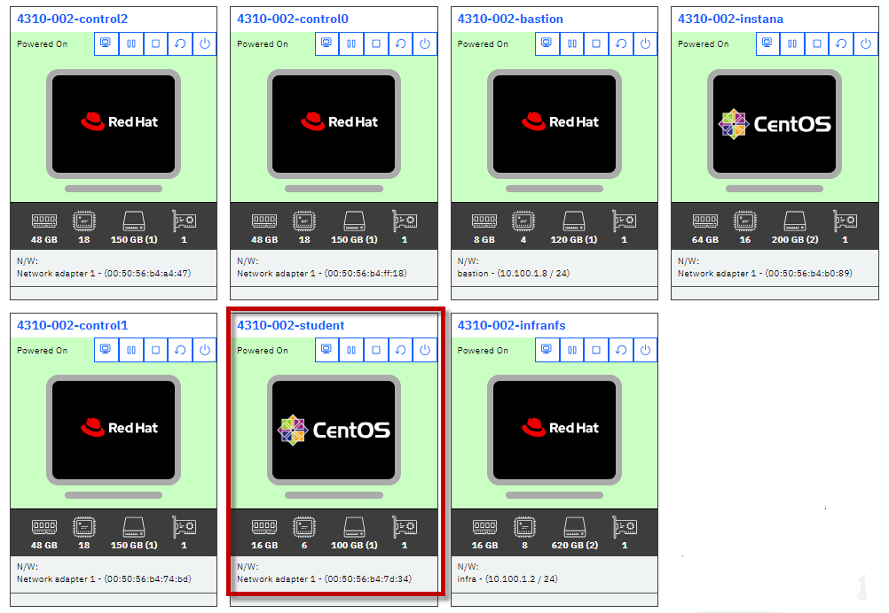

 
    
The Linux **`Student`** VM is the only VM that you directly interact. 
The remaining VMs are the RedHat OpenShift Cluster VMs that hosts the  IBM WebSphere Automation solution. 
   

1.  Access the `Student` VM in the lab environment, from your web browser. 
    
    On the **`Student`** tile, click the **`CentOS`** screen logo to open the lab environment. 
    
    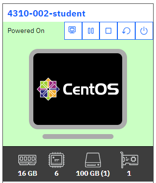
    
2.  If a login screen is displayed, log in with the following credentials:
    
    User ID `ibmuser` 
    
    Password `engageibm`.
    
	
4.  The desktop opens, which contains all the programs that you use (Firefox web browser, Terminal, File Explorer) during the session.

 

   

## Tips for working in the lab environment     

1. The UI allows you to fit the viewing area to fit the browser window size that you are using.

    

2.  You can copy and paste text from the lab guide into the lab environment by using **`Send Text`** clipboard. 
   
    )

     

3. (Optional) Open the `lab-commands.txt` file in an editor, to copy & paste commands throughout the lab. 

   **TIP:** `You may use the lab-commands.txt file to copy & paste commands throught the lab.` 
   
        gedit /home/ibmuser/WAS-Automation-LabFiles/techxchange/lab-commands.txt

            

## Section 1 - Set up IBM WebSphere Automation in the lab environment 

1. Log in to the Student VM. You see the Desktop, which contains all the programs that you use (browsers, terminal) in this session.

    The login credentials for the STUDENT image are:
    >
    >    User ID: ibmuser
    >
    >    Password: engageibm

   

2. Clone the GitHub repo to download the lab artifacts and Linux shell scripts that are used in the lab. Then, set execute permissions for the scripts. 

    a. Open a Terminal window on the VM, and ensure that you are in the home directory of the user, ibmuser:

        cd /home/ibmuser

    b. From the Terminal window, run the following command to clone the repo:

        git clone https://github.com/IBMTechSales/WAS-Automation-LabFiles.git

    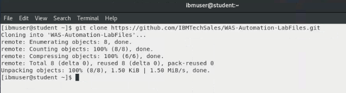

    c. Add execute permissions to the shell sctipts in the cloned repository

        find ./WAS-Automation-LabFiles -name "*.sh" -exec chmod +x {} \;

    d.  Verify the shell scripts are now executable in the two lab directories:

        ls -l /home/ibmuser/WAS-Automation-LabFiles/techxchange/*

    

### 1.1 Overview - Configuring WebSphere Automation

The Fix Deployment capability of WebSphere Automation delivers determines which APARs and interim fixes resolve a specific vulnerability, and enables one-click download and deploy of fixes. This capability augments the existing automated vulnerability assessment and fix history tracking.

To apply security fixes from managed servers, both WebSphere Automation and the WebSphere servers must be properly configured to communicate by using SSH. 

The following configuration tasks must be completed to use the Fix Deployment features in IBM WebSphere Automation.  

You run a Linux shell script, which automates the setup process. The script performs the following tasks:

  - Create the `ssh key`
  - Copy the key over to the WAS server to be monitored
  - Create the `wsa-ansible` secret that contains the key
  - Create the `known_hosts` file
  - Create the `wsa-secure-fixcentral-creds` secret that contains the IBM ID credentials to access IBM Fix Central

First, you must verify that IBM WebSphere Automation is in the "Ready" state. 

### 1.2 Ensure WebSphere Automation is "Ready" for use 

1. Log in to Red Hat OpenShift CLI:

    a. Open a new Terminal window in the VM.
  
    b. Type `oc login -u ocadmin -p ibmrhocp` to log in to Red Hat OpenShift. 
    
    Use the following credentials to log in: 
    > 
    > username: ocadmin

    > password: ibmrhocp

     

      

2.  Type `oc project websphere-automation` to ensure that you are working in the **websphere-automation** project

    

3. Type `oc get wsa` to verify that IBM WebSphere Automation ready in your environment. 

   **Note:** The output must indicate that the WSA resource **`READY`** state is **`True`** before you can continue with the lab.  

    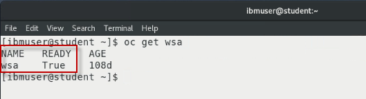

### 1.3 Use the provided shell script to setup WebSphere Automation

In this section, you run a shell script that performs the setup steps noted above, which are required to use the Fix Deployment features in IBM WebSphere Automation. 

1. Ensure you are in directory where the shell scripts are located. 

        cd /home/ibmuser/WAS-Automation-LabFiles/techxchange/lab1-CVE

 
2. Run the shell script to configure WebSphere Automation:

        ./wsa-setup.sh

    > Note: The script runs without any user interaction.  

3. When the script completes, verify that the **test-connection** Ansible playbook ran successfully, as illustrated in the console output. 

    You should see the message **TEST PASSED**, which indicates that WebSphere automation is properly configured. 

    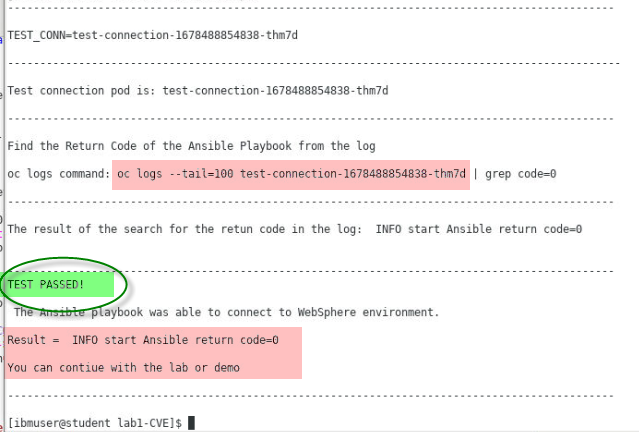

    <table>
    <tbody>
    <tr class="odd">
    <td></td>
    <td>
<strong>What if the script FAILS?</strong>

    
If the script completed with "TEST FAILED", contact the lab instructor. 

    Then, RE-RUN the script again. 

    Note: you can also run the `oc logs --tail` command that is shown in the console output, which displays the entire log output from the ansible playbook. That log might provide additional insights into the error. 

    </td> 
    </tr>
    </tbody>
    </table>

**You have now completed the WebSphere Automation setup procedures**

If the `wsa-setup.sh` script completed with **TEST PASSED**, you can proceed with the lab.

 

## Section 2 - Accessing the WebSphere Automation UI

A WebSphere administrator sets up WebSphere Automation by registering and configuring WebSphere Application Servers and WebSphere Liberty servers. 

For this lab, WebSphere Automation is pre-installed on an OpenShift cluster. You have your individual WebSphere Automation installation. Let’s access your environment.

1.  On the *Student VM*, open a browser and enter the following URL (there is a WebSphere Automation link on bookmark toolbar):
    
  	 <a href="https://cpd-websphere-automation.apps.ocp.ibm.edu/zen/#/homepage">https://cpd-websphere-automation.apps.ocp.ibm.edu/zen/#/homepage</a>

   

    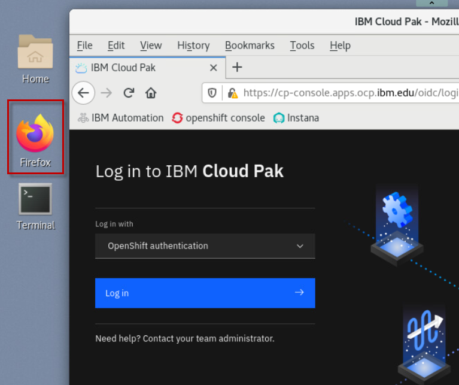
	
	 

2.  On the `Log in to IBM Cloud Pak` page, select the **`OpenShift authentication`** as the authentication type. Then click `Log in`

    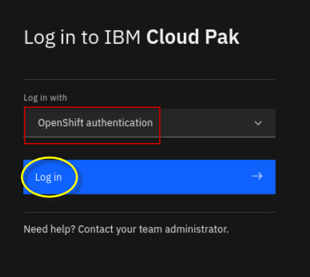
 
    **Note:** If necessary, accept all the browser security warnings and certificates. In Firefox, click **Advanced**, and then scroll down and click **Accept the risk and continue**. 

     
	
3.  Enter **`ocadmin`** as username and **`ibmrhocp`** as password. And click **`Log In`**.

    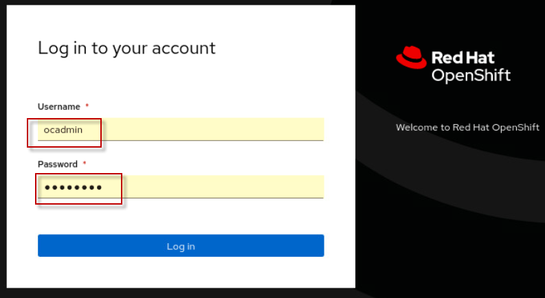

     

    
4.  At this point, you should be at the ***IBM Automation Welcome page*** 

    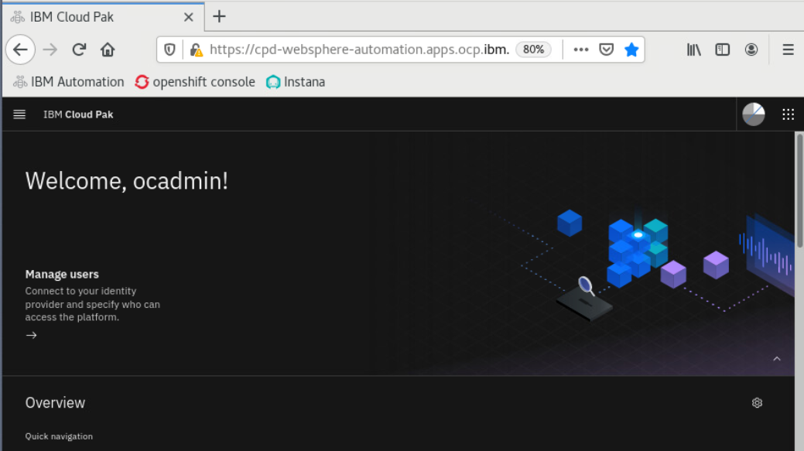

     
	
5.  View the `Application Runtimes` that are registered with IBM Automation.

    a. Click the menu icon in the upper left corner of the page.

      

    b. Click **`Operate`**, and then select **`Application runtimes`**.
  
    Application Runtimes represent the Traditional WebSphere and WebSphere Liberty servers that are registered with IBM Automation.

      

       

6. The **Application runtimes – Security** page appears. There is no data displayed because no WebSphere or Liberty servers are registered yet.

    

     

###  2.1 Receiving security & event notifications via email

> **Note: In this lab environment, we have not configured email notifications.**

Notifications are sent to a list of email addresses when a change is detected in the security or health status of one or more servers that WebSphere Automation monitors.

For security monitoring, email notifications are sent when a new security bulletin is published that affects your server inventory, when a newly tracked server is vulnerable to one or more existing CVEs, or when a security fix is successfully applied to a managed server. 

For server health monitoring, email notifications are sent when an investigation into a server health issue is started, when an investigation successfully completes, or when an investigation fails to complete. 

You can also define custom notifications for events that occur in WebSphere Automation using webhook notifications for `Slack` and `ServiceNow`. 

**Reference:** To review the information that is included in each email, see Example notification contents in the IBM WebSphere Automation documentation: 

https://www.ibm.com/docs/en/ws-automation?topic=notifications-example-notification-contents

 

## Section 3 - Register WebSphere Application Server with IBM WebSphere Automation

In this section, you run a Linux shell script to automatically register a WebSphere Application Server to IBM WebSphere Automation. 

The Linux shell script obtains the necessary information as described below. Then, the script runs a `wsadmin` script to register the WebSphere Application Server.  

WebSphere Application Servers and WebSphere Liberty servers are added to WebSphere Automation by registering them with the *usage metering* service.

To register your application servers with the usage metering service, it requires the following usage metering details. The script you  run gathers this information. 

  - **URL**: The URL of the usage metering service in WebSphere Automation. This service registers WebSphere Application Server and Liberty servers with WebSphere Automation so that you can track security vulnerabilities.

  - **API Key**: The token that is used to authenticate the WebSphere Application Server and Liberty servers during the registration process.

  - **Usage metering certificate**: The certificate that contains the public key. This key allows a WebSphere Liberty server that is registering with WebSphere Automation to do an SSL handshake with the metering service.

In this section, you run the `register-was-server.sh` script to register a WebSphere Application Server, version 9.0.5.7. 

1.  Minimize the browser window and open a new terminal window.

    
	
	
2. Run the `register-was-server.sh` script to register the WebSphere server with IBM WebSphere Automation

    a. Change directory to the location of the script:
        
        cd /home/ibmuser/WAS-Automation-LabFiles/techxchange/lab1-CVE

    b. Run the script, passing in the parameter `9057` to register the WebSphere version 9.0.5.7 server in this lab environment. 

        ./register-was-server.sh 9057    

    
        
    Once the script completes, you see the message indicating that the WebSphere server was successfully registered. 

   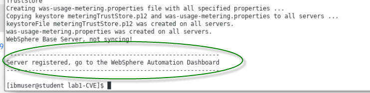

   At this point, the newly registered server is automatically added to the WebSphere Automation dashboard in the UI. 

3. View the newly registered WebSphere server in WebSphere Automation Dashboard

    a. Open the browser in the VM, and go to the tab where the WebSphere Automation dashboard is displayed. 

    > Note: the URL is: https://cpd-websphere-automation.apps.ocp.ibm.edu/websphereauto/security
    
    b. From the WebSphere Automation **`Security`** dashboard, confirm that the tWAS v9.0.5.7 server is registered in IBM Automation.

    > Note: It might take 15 - 30 seconds for the server to be displayed in the WebSphere Automation UI.

    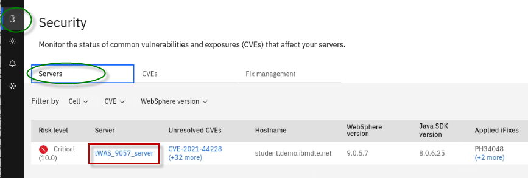

     

## Section 4 - Proactive CVE protection for WebSphere with IBM WebSphere Automation

### 4.1 Business Context for this scenario

You are a WebSphere Administrator, part of a WebSphere Operations Team that is responsible for maintaining security compliance of the WebSphere estate in the enterprise. 

A typical “as-is” process for maintaining security compliance for WebSphere environments is often a very manual and time consuming process, as illustrated below:  

 This is where **IBM WebSphere Automation** can help\!

With WebSphere Automation, you have:

  - **Management dashboard:** A Consolidated dashboard increases awareness and response time to common vulnerabilities and exposures (CVEs).

  - **Automated vulnerability tracking:** Let WebSphere Automation track new security bulletins across your existing traditional WebSphere and Liberty environments, on virtual machines or containers.

  - **Contextual notifications:** Receive security bulletin notifications only when new vulnerabilities affect the environment you manage, reducing noise and interruptions to the WebSphere operations team.

  - **Shared, live visibility to key stakeholders:** WebSphere operators and security compliance teams can see the real-time security posture of the WebSphere estate, accelerating action and minimizing the risk of miscommunication.

  - **Fix History:** A complete audit trail for when vulnerabilities are detected, and when patches or upgrades are applied to resolve issues
  
  - **Automated fix installation of Fixpaks and iFixes** to your WebSphere and Liberty servers, directly from the IBM WebSphere Automation dashboard. 

In this section, you use the IBM WebSphere Automation to demonstrate its powerful capabilities for proactive CVE protection for WebSphere. 

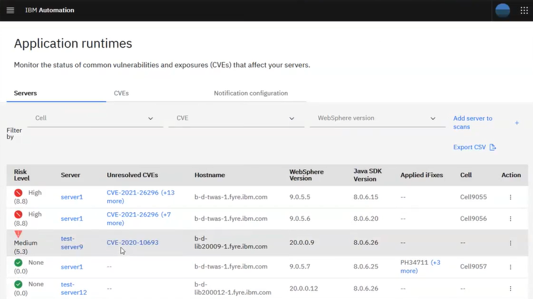

### 4.2 How IBM WebSphere Automation automatically manages your WebSphere and Liberty server security posture 

WebSphere administrators register their WebSphere Application Server or Liberty servers with WebSphere Automation. 

The WebSphere Automation *vulnerability manager* makes an assessment of the security compliance status of each server. Common vulnerabilities or exposures (CVEs) for each server are displayed in the WebSphere Automation UI in an interactive list, and each server is assessed a risk level. Administrators can learn more about the pertinent CVEs, plan their response, and complete the application of the required security fixes to their managed servers by using the WebSphere Automation UI.

When the IBM Product Security Incident Response Team (PSIRT) publishes new or updated security bulletins, the WebSphere Automation *CVE/PSIRT monitor* detects them and collects the data about the CVEs from the bulletins. The WebSphere Automation vulnerability manager checks the applicability of the new CVEs to the registered servers. If exposures are found, the WebSphere Automation vulnerability notifier sends email notifications to a customizable list of addresses that new vulnerabilities exist.

After defining an exposure mitigation plan, administrators can then use the WebSphere Automation UI to select published fix packs or interim fixes to repair vulnerabilities. During the fix installation process, WebSphere Automation requests the selected fix from IBM Fix Central, stores it in the Kafka data store, and then installs it on the indicated server.

 

### 4.3 Working with Traditional WebSphere servers with IBM Automation – Security Vulnerabilities

You can view the security vulnerability status of each server in your inventory from the **Security** page in the WebSphere Automation UI. 
For each server, the numerical risk level in the range 0 - 10 represents the highest CVSS value of its CVEs.

You can track security vulnerabilities for your servers from a single user interface (UI) in WebSphere Automation.

In this section of the lab, you do the following tasks: 

  - **Resolve known vulnerabilities in the WebSphere traditional application server**, by using the built-in capabilities in IBM WebSphere Automation to prepare and install the recommended iFix that is documented in the security bulletin for this vulnerability. 

  - **Review the security posture and fix history of the WebSphere application server.**   After applying iFixes or Fixpaks, IBM Automation immediately updates the security information for that application server to show that the critical vulnerabilities are patched. 

   

1.	In the browser, go to the **Security -> Servers** dashboard in WebSphere Automation.

    
 
    You see that this server Risk Level is **10.0**, with **(+## more)** unresolved CVEs. 

    >**Note:** Near the top of that list is the LOG4J vulnerability, known as CVE-2021-44228, with a critical score of **10**.  
 

	|         |           |  
    | ------------- |:-------------|
    |    | <strong>TIP:</strong>  <strong>Note:</strong> New vulnerabilities are discovered constantly, so the number of CVEs discovered might be different than what is shown in the screen capture.
    
     
 
### 4.3.1 Review CVE-2021-44228 to understand the remediation options for the LOG4J vulnerability

In this section, you review the details of the critical (10.0) **CVE-2021-44228** CVE and determine the appropriate remediation options to resolve the CVE.

You apply the iFix that is documented in the IBM security bulletin to resolve the Log4J vulnerability in the traditional WebSphere 9.0.5.7 server, as reported in **CVE-2021-44228**.

1.  Notice in the IBM Automation console that **tWAS 9.0.5.7** is vulnerable to **CVE-2021-44228**.

    

2.  View the security bulletins for the **CVE-2021-44228** Log4J vulnerability.

    a.  Click **CVE-2021-44228** link under the 9057 servers **Unresolved CVEs** column.

    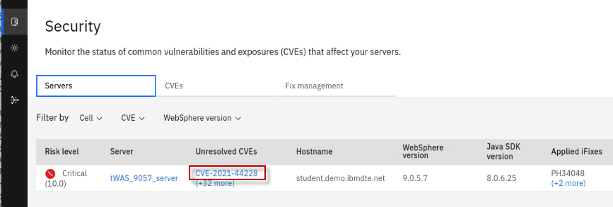

    From the CVE Information page that is displayed, you can see important details about this CVE.

    <u>Here you can see the following details:</u>

    - Risk Level **Critical (10)**

    - Date the vulnerability was detected in the “**registered**” server

    - Number of days the 9057 WebSphere server was **exposed** to the vulnerability

    - List of affected servers that are registered with IBM WebSphere Automation

    - Link to the IBM security bulletin for the CVE

    > **Note:** The **Days Exposed** and **date detected** are expressed from the point of time that the server is registered with IBM WebSphere Automation.

    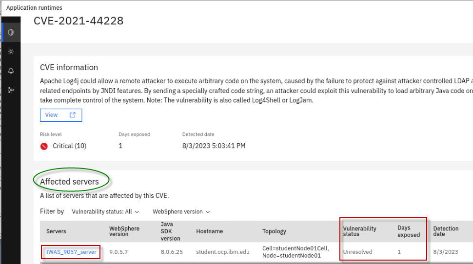

    b.  Click the **View** Link to view the IBM security bulletin for this CVE.

    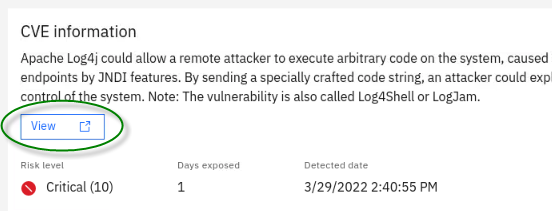

    c.  The security bulletin is displayed in a new browser tab.

    d. Close the `site cookies` dialog box, if displayed
    
    e.  Review the security bulletin to learn about the vulnerability, versions of WebSphere affected, and options for remediating the vulnerability.

    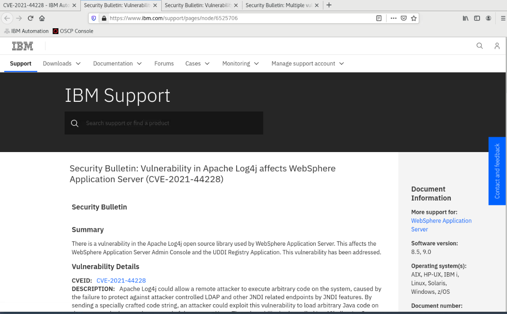
 
    As you can see, IBM WebSphere Automation makes it easy for you to get to the related security bulletins directly from the CVE information within the WebSphere Automation dashboard so you can have all the details and remediation options at your fingertips.

    > **Note:** The IBM Security Bulletin associated with this vulnerability documents the options for remediating CVE-2021-44228 and related CVEs (CVE-2021-4104 and CVE-2021-45046).

    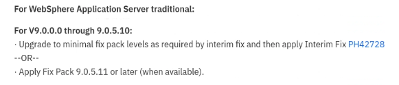

    You can also acess the security bulletins from the **ibm.com/support** pages. You are prompted to log in by using your IBM ID to access the content from the IBM Support site. 

    <https://www.ibm.com/support/pages/node/6525706>

3. Close the browser tab containing the security bulletin    

4.  Return to the browser tab that contains the `IBM WebSphere Automation dashboard`. Then, return to the **`Security`** view.

    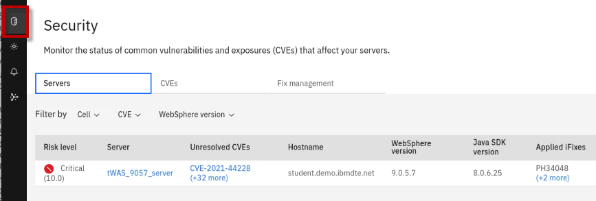

### 4.3.2 Update tWAS server v9.0.5.7 to fix the LOG4J vulnerability

You can automatically deploy fixes to servers in your managed server inventory through the WebSphere Automation UI. You must have a user profile with at least the **Modify WebSphere inventory** permission, and the servers that you want to fix must be registered and configured for fix installation with WebSphere Automation.

In this section, you leverage the built-in capabilities in IBM WebSphere Automation to automatically prepare and install the recommended iFix to the traditional WebSphere 9.0.5.7 server to remove the Log4J vulnerability reported as **CVE-2021-44228**.

There are a couple of additional components in the product to support this use case:

  - **Fix manager**
    
    The WebSphere Automation *fix manager* uses credentials that you provide to access IBM Fix Central to request fixes. Fixes are fetched and stored in the file storage defined for the `websphereSecure` custom resource. The fix manager manages the storage space according to frequency of use, deleting older fixes to make room for more recently requested fixes.

  - **Installation manager**
  
    The WebSphere Automation *installation manager* communicates with the registered server by using the administrator privileges that you provide. When you initiate the installation of a fix, the installation manager ensures that the target server has sufficient space for the fix, transfers the fix to the target server, installs the fix, and creates a log file of the steps taken. If you request a backup of the server environment as part of the fix installation, the installation manager checks for sufficient disk space on the server, and creates an archive of the Installation Manager, Installation Manager data, and WebSphere Application Server or WebSphere Application Server Liberty server installation directories.

### 4.3.2.1 Navigate to the Server and unresolved CVE to fix

Apply the recommended iFix to resolve the CVE-2021-44228 vulnerability.

1.  Notice in the IBM Automation console that **tWAS 9.0.5.7** is vulnerable to **CVE-2021-44228**.

    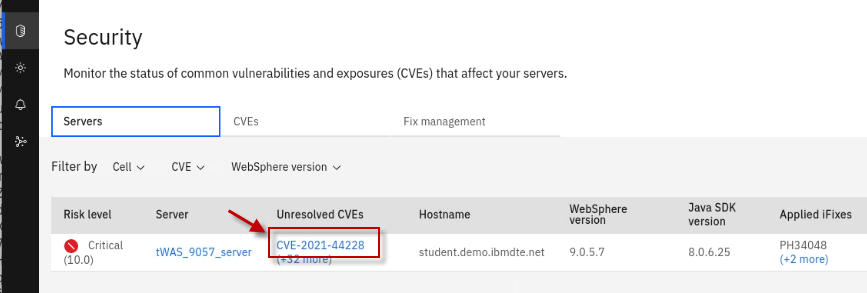

 
    **Note:** The IBM Security Bulletin associated with this vulnerability documents the options for remediating CVE-2021-44228 and related CVEs (CVE-2021-4104 and CVE-2021-45046) 

    

 
    You fix it by applying the recommended iFix (PH42728).

     

2. Click **tWAS_9057_server** to view the list of CVEs and vulnerabilities.
 
     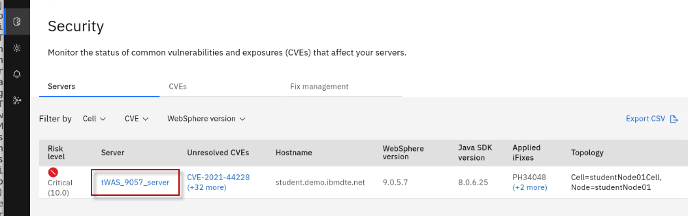
    

    The list displays both *resolved* and *unresolved* CVEs for the selected server. It also shows the **Risk Level** to identify the severity of the vulnerabilities, and the number of days the server was exposed to the vulnerability. 

    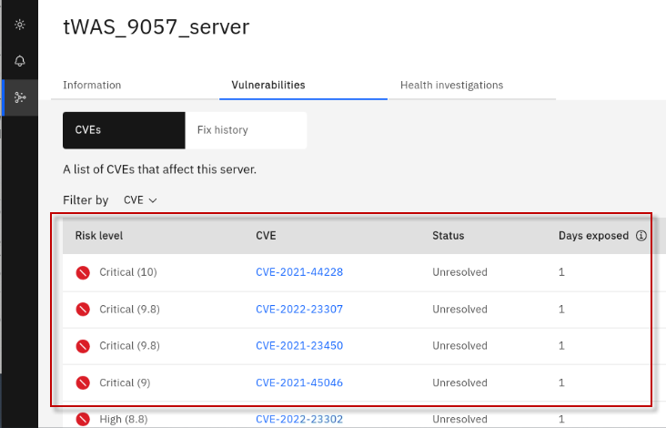
 
3. Click **CVE-2021-44228** to view the CVE information and affected servers.

    

    On the CVE Information page for CVE-2021-44228, a list of **Affected Servers** is displayed along with the option to **Prepare fix**. 

    >**DO NOT prepare fix yet.** You do that in the following steps. 

    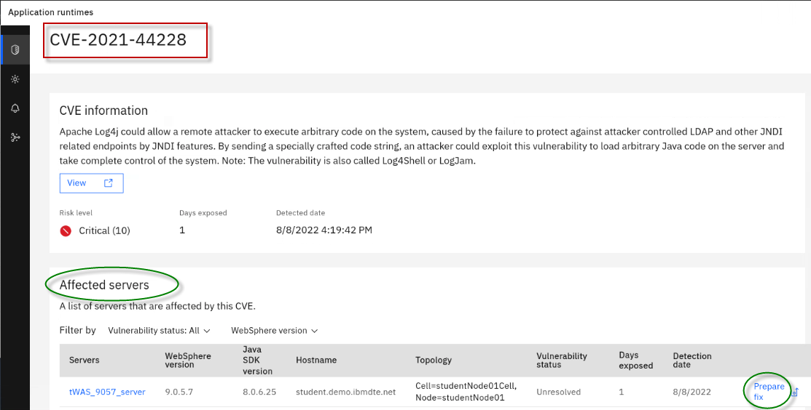
    

### 4.3.2.2 Prepare Fix 

The *Fix Deployment* capability of WebSphere Automation delivers automation that determines which APARs and interim fixes resolve a specific vulnerability, and enables one-click download and deploy of fixes. 

Selection of the wanted iFix or published fix pack is exposed through the **Prepare fix** dialog, which can be found in the CVE details view. Select the target server to patch and the dialog shows all affected servers that are known to WebSphere Automation, and lets you select the desired fix.

After you select the fix, WebSphere Automation provides two options: 

  - **Fetch fix:** 

    If installation is deferred to a later time, then the **Fetch fix** option causes the fix to be downloaded and stored for later use. 
  
    This might be a preferred option for fix packs because they are significantly larger than interim fixes, especially for traditional WebSphere fix packs.
  
  - **Fetch then install fix:** 

    This option automatically downloads the fix and then installs it after the download is complete. 
  
    Fetched fixes are stored within WebSphere Automation for immediate reuse. 

       

    > Now you can download and install the recommended iFix for the CVE into the tWAS_9057_server.  

1. Download the recommended iFix to resolve the CVE.
 
    Next to each affected server, there is a link to **`Prepare Fix`**. 
    
    a. Click the **`Prepare fix`** link next to **tWAS_9057_server** for **CVE-2021-44228**.

    

    b. From the **Select fix** page, select the **`PH42728`** iFix. Then, click **`Fetch fix`**. 

    
    |         |           |  
    | ------------- |:-------------|
    |    | <strong>IMPORTANT:</strong>    If the **PH42728** iFix is not listed under the **resolution** column as illustrated in the screen shot below, give WebSphere Automation a few more minutes to load the fix meta-data into its database.      To avoid overloading WebSphere Automation, it only loads the meta-data for unresolved CVEs when a WebSphere or Liberty server is registered. WebSphere Automation only loads the meta-data for the unresolved CVEs of the registered servers.     WebSphere Automation does this by using a background process that spins up several threads. Because there are more unresolved CVEs than the number of threads loading the meta-data, it takes WebSphere Automation a couple of iterations to load all of the meta-data for the fixes.      Typically, the process completes within 8-10 minutes after the server is registered.    WebSphere Automation continues to load fix meta-data as new unresolved CVEs are detected for registered servers.

    

    This action causes WebSphere Automation to fetch the fix from IBM Fix Central, using the credentials that you configured at the beginning of the lab. 

    The **Status** field automatically updates as the action progresses. 

    

    When the fix is successfully fetched from IBM Fix Central, the status changes to **Ready to Install**.

    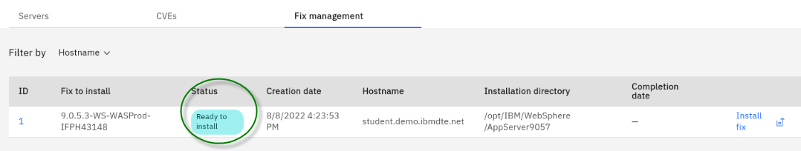

2. Stop the WebSphere Application Server: 

    a. Return to a Terminal window in the VM

    b. Run the `stopServer.sh` command below 
    
        /opt/IBM/WebSphere/AppServer9057/bin/stopServer.sh tWAS_9057_server -username wasadmin -password wasadmin

        

	|         |           |  
    | ------------- |:-------------|
    |    | <strong>TIP:</strong>  IBM WebSphere Automation will attempt to stop the WebSphere Application Server, if the credentials areprovided in the `soap.client.props` file. 
 However, in this lab environment, the WebSphere credentials are not stored, and you must manually stop the WebSphere Application Server in order for IBM WebSphere Automation to apply the iFix that was downloaded.   

3. Verify the WebSphere Application Server is stopped, using the command below: 

        /opt/IBM/WebSphere/AppServer9057/bin/serverStatus.sh tWAS_9057_server -username wasadmin -password wasadmin

    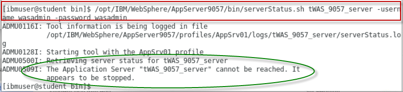 
   

4. Install the fix to resolve the CVE.

    After the fix is successfully fetched, the action to **Install the fix** is made available next to the affected server.

    a. Click **Install fix** next to **tWAS_9057_server**.

    

    b. When prompted to confirm the installation, click **Proceed**.

    > **Note:** For this lab, **Create backup** option should be set to **off**.

    c. After installation starts, a new **fix record** is created, and the installation begins.

    
    
    d. The installation can take 5 or 6 minutes to complete. Wait until you see the status change to **Installation complete**.

    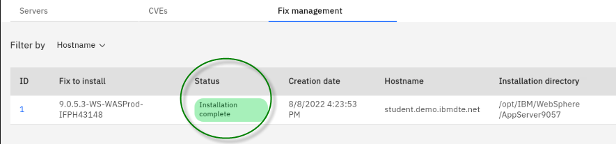

    > **TROUBLESHOOTING TIP**
    > 
    > If the installation fails, click the **ID** of the action and view the `runbook.log` output file. 
    >
    >  Common errors that are reported in the log are the `ssh key` and the `wsa-ansible secret not properly configured in the environment`.  
    >
    > 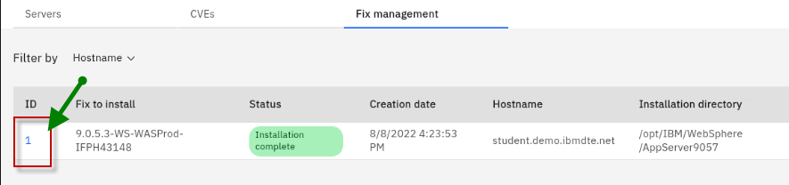
    >
    > 

5. Restart the WebSphere Application Server: 

    a. Return to a Terminal window in the VM

    b. Run the `startServer.sh` command below 
    
        /opt/IBM/WebSphere/AppServer9057/bin/startServer.sh tWAS_9057_server

        

    |        |           |  
    | ------------- |:-------------|
    |    | <strong>TIP:</strong>  IBM WebSphere Automation will START WebSphere Application Servers after it installs a fix, if and only if, IBM WebSphere Automation Stopped the server. 
 However, in this lab, you manually stopped WebSphere Application Server, so WebSphere Automation did NOT restart it.    

     

**Congratulations!** You successfully applied the iFix to resolve the critical CVE on the tWAS_9057_server. 

In the next section of the lab, you review the updated security posture and fix history of the WebSphere server. 

 

### 4.3.3 View the security posture and Fix History of your WebSphere servers

### Fix history

Information technology operations teams must be responsive to the latest security vulnerabilities. A patching service-level agreement (SLA) requires that an operations team fixes vulnerabilities within 30, 60 or 90 days (or faster) based on vulnerability severity.

Therefore, it is vital to document the date that a vulnerability was detected, and the date that the fix was applied. WebSphere Automation provides a detailed history of fixes applied to each registered server, including information about when each issue was detected, when and how it was fixed, and how many days that servers were exposed.

A record of all detected security vulnerabilities (CVEs) and the resolution status makes it easy to respond to patching SLA inquiries. WebSphere Automation keeps track of when vulnerabilities are detected, when and how they are fixed, and how many days that servers are exposed.

In this section, you review the security posture and fix history of the two traditional WebSphere servers that are used in the lab to demonstrate how WebSphere Automation manages the details, so you can handle your patching SLAs with ease.

Since you applied the PH42762 iFix, now you can examine the updated security posture of the 9057 WebSphere Application Server.

1.  View the **tWAS_9057_server** CVE Information.
    
    a. From the **Security** view in the WebSphere Automation dashboard, click the **tWAS_9057_server** link located under the **Server** column.

    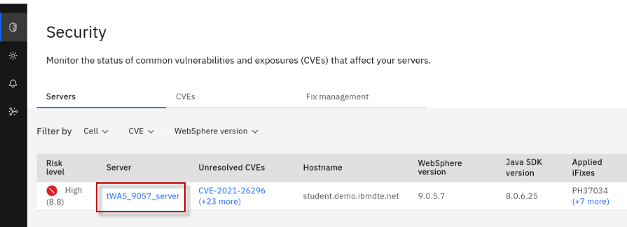
  
    b.  Select the **Information** tab.

    

    c.  From the **Information** view, you can see the list of Installed iFixes for the 9057 server.

    
 
    > Notice that the **Fixed date** for the iFixes that are related to the Log4J vulnerability shows that they were installed moments ago.
    > 
    > However, there are additional iFixes that do not have a Fixed date. That is because these fixes were already applied to the server prior to it being registered with IBM WebSphere Automation.

    |                                                |                                                                                                                                                                                                                                                                                                                           |
    | ---------------------------------------------- | ------------------------------------------------------------------------------------------------------------------------------------------------------------------------------------------------------------------------------------------------------------------------------------------------------------------------- |
    |  | IBM WebSphere Automation reports ALL iFixes that were applied, regardless of when they were applied. However. It can only determine fix dates, number of days that the server was vulnerable, and vulnerability detected date for servers from the time the WebSphere Application Server is registered with IBM WebSphere Automation. |

2.  View the **tWAS_9057_server** CVE Vulnerabilities details.
    
    a.  From the **tWS_9057_server** view, select the **Vulnerabilities** tab.

    

    b. From the list of CVEs, sort by **Status**, and display the **Resolved CVEs** on top.

    
 
    The CVEs that are listed as **Resolved** are related to Log4J CVEs that were fixed by applying the iFix earlier; **CVE-2021-44228** being the most critical CVE listed.
 
    As illustrated above, the **Vulnerabilities view** provides the details about when the vulnerability was detected in this specific server, and how many days the server was exposed to each vulnerability.

3.  View the **tWAS_9057_server** Fix History details.
    
    a.  From the **tWS_9057_server** view, select the **Vulnerabilities** tab.
    
    b. Select **Fix History**, as illustrated below:

    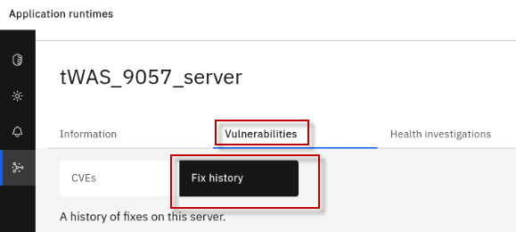

4.  Notice the Fixes that were applied.

    

    >**Fix history** shows changes to the server. You can see the action that was taken, and in this case, the Fixes were **Installed**. Next to each Fix you can view the CVEs that were resolved by that Fix, and more importantly, the date that the Fix was applied that resolved specific vulnerabilities.

5.  You can also monitor the status of common vulnerabilities and exposures (CVEs) that affect your servers.
    
    a.  Return to the **Security** view. Then, select the **CVEs** category.

    
 
    > Using this view, you can easily determine which servers are affected by specific CVEs.
    >  
    > As an example, focus on CVE-2021-44228. This is one of the CVEs that was fixed in the tWAS_9057_server when you applied the iFix earlier in the lab.
    > 
    > This CVEs view helps your team quicky identify how many servers have been fixed, and how many remain exposed to specific CVEs.

    b. View the **CVE-2021-44228** CVE from the current view. Notice that the registered server is patched for this CVE. There are now zero registered servers vulnerable to the CVE. 

    

    In this section you learned how easy IBM WebSphere Automation makes it for your Information technology operations teams to respond to the latest security vulnerabilities, ensuring that there is a record of patching critical CVEs in accordance with your patching service-level agreement (SLA).

    You learned how to use the automated fix deployment capabilities to easily fix vulnerable servers directly from the IBM WebSphere Automation UI. 
    
    You learned that WebSphere Automation provides a detailed history of fixes applied to each registered server, including information about when each issue was detected, when and how it was fixed, and how many days servers were exposed.

     

**Congratulations!**  You completed the proactive CVE management lab for traditional WebSphere Application Servers.      

 

## Section 5 - Detect and trigger investigation of Application Memory Leak with IBM WebSphere Automation

In this section of the lab, you are going to use a traditional WebSphere Application
Server registered with IBM WebSphere Automation (WSA), and monitored by Instana to drive a memory leak investigation.

You will learn how WSA can automatically:

  - detect memory leaks before they cause a JVM crash

  - gather problem determination (PD) information while the leak is in
    progress

  - analyze the Problem Determination info and produce a report which can be exported and shared with application development teams or application vendors.

You will use a sample application which continuously adds objects to the JVM heap to create a memory leak event.

Instana will detect the event and initiate communication with
WebSphere Automation to inform that a leak has been detected. 

Then WebSphere Automation opens an investigation and gathers the necessary problem diagnostic information for that server.  

You will see the investigation is opened and progresses though its investigation proess. These processes include:

  - Memory leak detected

  - Identifying server

  - Collecting heap dump

  - Analyzing heap dump

  - Investigation complete

Upon completing the investigation, WSA provides an analysis summary which indicates the likely potential root cause of the memory leak. 

In this lab, the root cause is a vector, growing unbounded, in the sample application which is being hosted by the servlet wrapper. 

WSA also allows you to download all the files that you need to share with your application development team or application vendor, so that they could take the action to remediate the memory leak in the application.

 ### 5.1 Verify the Instana agent is running and configured

For this lab, the Instana agent has already been installed on the VM. 

However, installing the Instana agent is simple. Using the Instana UI, you can select options for installing the agent, such as the `agent mode`, `agent runtime`, and `installation mode`. Doing so, produces a `curl command` that you run from a Terminal window, to install the Linux agent. 

1. Check that the Instana agent process is running. You should see the Instana Java process listed. 

        ps -ef | grep instana

    

     
    **Tip:** The Instana agent is installed in **/opt/instana/agent** directory.

2. Login to the Instana UI

    a.  From the web browser, open a new window and click the `Instana
    bookmark` to access Instana page.

    
 
     The login credentials are:
 
     > E-Mail: **admin@instana.local**
 
     > Password: **qJgN6hS6sE**

3.  Verify the Instana agent installation

    a. Click on the `Infrastructure` icon on the left navigation bar. 
    
    You will see the `WebSphere` infrastructure zone that we configured in the Instana agent for this lab. 
    
    This infrastructure zone is configured for montoring WebSphere, using Instana's out of the box capabilities. 

    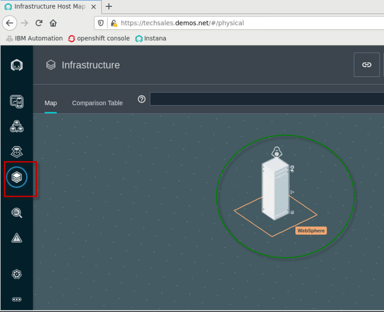

    b. Click `Time Rage` dropdown button, select `Last 5 minutes` and click `Live`.

    

    The Istana agent is now set to monitor the changes in 5 minutes interval, the agent installation is now completed.

### 5.2 WebSphere Automation integration with Instana and WebSphere Servers

WebSphere Automation (WSA) communicates with Instana to receive real-time Instana alerts. 

WSA also accesses the VMs where registered WebSphere servers are hosted to collect problem diagnostic information. 

To do so, a secure ssh connection must be configured between the Instana server and the VM hosting WebSphere Application Servers. 

-----------------------------------------------------------

For this lab, we have configured the secure ssh connections required for Instana, WebSphere Automation, and WebSphere Application Server environments, according to the product documentation. 

----------------------------------------------------------

### 5.3 Configure Instana for memory leak alert

Configuring Instana to create alerts is outside the scope of this lab.

The Instana configuration has already been performed, as required for the lab. 

However, for your reference, the detailed steps for configuring Instana alerts for WebSphere Application Server is docuemnted in **`Appendix A`** of this lab guide. 

The high-level Instana configuration for the memory leak alert includes:

  - create a custom payload
  - create an alert channel
  - create a custom event
  - create an alert
 
   

1.  View the `Custom payload` that was created for the lab

    Adding a custom payload to your alert notifications enables you to use Instana alerts more efficiently.

    a. From the Instana page, go to **`Settings > Team Settings`** page,
    under **`Events & Alerts`**. Then click **`Custom Payload`**.

    b. You see the custom payload that is configred for the lab.

    In our case, alert notifications include a custom payload based on the automatically detected PID of the internal Process ID of the processes being monitored. 

    

2.  View the `alert channel` that was created for the lab

    An Alert Channel is a mechanism that is used to get Events out of Instana and into another system when Events are trigger. There are a variety of Alert Channels including email notifications, slack, Watson AIOps, and more.
    
    a.  On the Team Settings page, under **`Events & Alerts`**, click **`Alert Channels`**.

    b. You see the alert channel named `WebSphere Automation Healing Webhook` that is configured for the lab.

    
   

3.  View the `custom event` that was created for the lab

    A Custom Event enables you to create issues or incidents based on an individual metric of any given entity.
    
    a. On the Team Settings page, under **`Events & Alerts`**,
    click **`Events`**.

    b. You see the custom event named `Memory Usage High` that was configured for the lab.  

    

4.  View the  `alert` that was creatd for the lab

    An Alert is raised when an `event` has triggered, such as `high memory usage over 80% for some period`. 

    a. On the Team Settings page, under **`Events & Alerts`**,
    click **`Alerts`**

    b. You see the Alert named `WbSphere Automation Healing Memory Leak` that was configured for the lab. 

    

### 5.4 WebSphere memory leak check with WebSphere Automation

In this section, you run a script to create a memory leak incident for an application running in a WebSphere Application server instance which is already registered in WebSphere Automation. 

When WebSphere Automation detects the memory leak, it automatically conducts the analysis to identify the root cause.

1.  Run the following Linux shell script to install a memory leak application in WebSphere Application Server, which will also restart the WebSphere application server to pick up the changes. 

    a. From a Terminal window, ensure you are in the directory that where the script is located

        cd /home/ibmuser/WAS-Automation-LabFiles/techxchange/lab2-MemoryLeak
    
    b. Run the command below to install the memory leak app in the WebSphere Application Server:
        
        ./klp-tWAS_configure_MLApp.sh

    

2.  Login to WebSphere Automation, if you are not already logged in
  
    a.  On the *Student VM*, open a browser and enter the following URL (there is a WebSphere Automation link on bookmark toolbar):
    
  	 <a href="https://cp-console.apps.ocp.ibm.edu/oidc/login.jsp#/homepage">https://cp-console.apps.ocp.ibm.edu/oidc/login.jsp#/homepage</a>

    
	
	 

    b.  On the `Log in to IBM Cloud Pak` page, select the **`OpenShift authentication`** as the authentication type. Then click `Log in`

    
 
    **Note:** If necessary, accept all the browser security warnings and certificates. In Firefox, click **Advanced**, and then scroll down and click **Accept the risk and continue**. 

     
	
    c.  Enter **`ocadmin`** as username and **`ibmrhocp`** as password. And click **`Log In`**.

    

     

    
    d.  At this point, you should be at the ***IBM Automation Welcome page*** 

    

     

3.  Go to the `Application Runtimes` which shows the WebSphere servers registered with IBM Automation.

    a. Click the menu icon in the upper left corner of the page.

      

    b. Click **`Operate`**, and then select **`Application runtimes`**.
  
    Application Runtimes represent the Traditional WebSphere and WebSphere Liberty servers that are registered with IBM Automation.

      

           

4.  In the WebSphere Automation UI, click on the **`Health`** icon.

    The `Health` section is where you view and analyze server health problems. 

    
 
    Since all the application are working fine at this time, you do not see any health investigations on the Health page yet.
 
    

5.  In this lab, you can also monitor the WebSphere application server
    memory change in Instana.
    
    a. In **Instana administration console**, click **`Infrastructure`** icon, click
        **`Comparison Table`**, select **`JVMs`** from the dropdown, and click **`bootstrap WAS90.SERV1.`**

    
 
    As you can see, currently there is not any issue with the WAS server.

    

6. Set the `Time Range` to `Last 5 minutes` and click `Live` to see the current state

    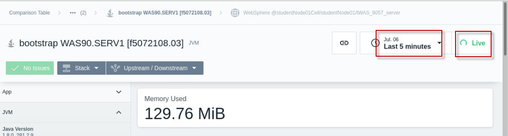

7.  From the Terminal window, run the provided script which will run a sample memory leak application in WebSphere. Instana will immediately show the significant increase in JVM heap usage, which will create an application memory leak event.

        /home/ibmuser/WAS-Automation-LabFiles/techxchange/lab2-MemoryLeak/klp-curl_MLAPP_add_was.sh

    The script output is showing like this:

    <table>
    <tbody>
    <tr class="odd">
    <td>
[ibmuser@student ~]$ /home/ibmuser/WAS-Automation-LabFiles/techxchange/lab2-MemoryLeak/klp-curl_MLApp_add_was.sh

    
Increased heap usage by 25MB

    
Increased heap usage by 50MB

    
Increased heap usage by 75MB

    
Increased heap usage by 100MB

    
Increased heap usage by 125MB

    
Increased heap usage by 150MB

    
Increased heap usage by 175MB

    
Increased heap usage by 200MB

    
Increased heap usage by 225MB

    
Increased heap usage by 250MB

    
Increased heap usage by 275MB

    
Increased heap usage by 300MB

    
Increased heap usage by 325MB
</td>
    </tr>
    </tbody>
    </table>

8.  In the Instana page, you can see that the memory is increasing steadily, and one issue is detected.

    

9.  Go back to the WebSphere Automation UI. You see that WebSphere Automation has received the Memory leak alert and activate its investigation on the issue. 

    Initially you might see the Server `Not identified yet` status and soon you see the server name is identified. 

    
    
    a. Click the **`Investigating`** link to view its details.

    

10. The Investigating section lists the problem, status, Server, Host
    and Cell information, why the investigation is started and the
    investigation history. 
    
    a. Click the **View history** dropdown to see current investigation activities

    

    The WSA memory leak investigation activities include:

    - Memory leak detected
    - Identifying server
    - Collecting heap dump
    - Analyzing heap dump
    - Investigation complete

    The screenshot below shows that the investigation is in process.
 
    

11. After a few minutes, the WebSphere Automation investigation will show `Investigation Complete`. You can see the analysis summary which points to the root cause of the issue.

    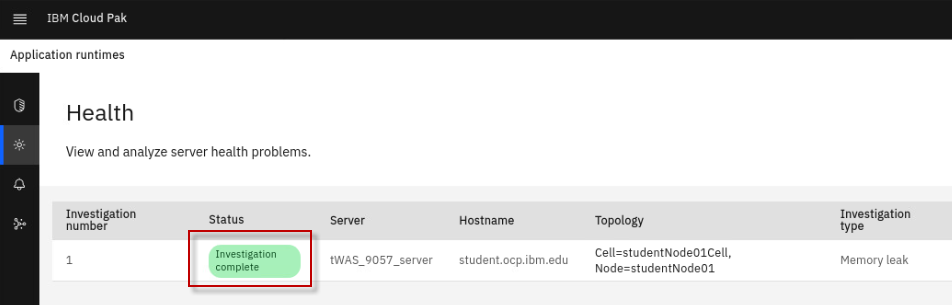
    
    You can also click **`Download all files`** to get the analysis
    reports, heap dumps and WebSphere Automation runbooks on your workstation.

    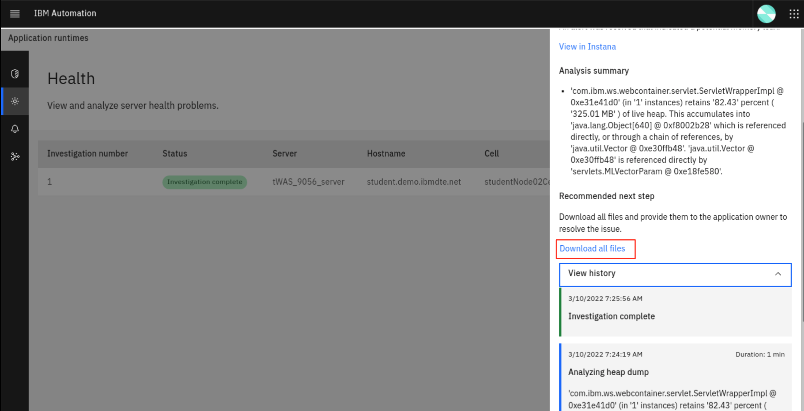

    

    

    

12. you can run a script to reduce the heap usage and then stop the WAS
    server with the commands:

        /home/ibmuser/WAS-Automation-LabFiles/techxchange/lab2-MemoryLeak/klp-curl_MLAPP_removeLast.sh

        /opt/IBM/WebSphere/AppServer9057/bin/stopServer.sh tWAS_9057_server -username wasadmin -password wasadmin

     

    **Congratulations!** You have completed the WebSphere Automation Memory Leak Detection lab.

     

### Appendix A: Detailed steps to configure Instana for memory leak alert

 
<b>Click to expand:</b> Appendix A: Detailed steps to configure Instana for memory leak alert
 

 

This section describes the steps to configure Instana for the memory
leak alert to be used by WebSphere Automation (WSA). 

 You will use the Instana administrative console UI to complete the following activities.

The actives include: 

  - create a custom payload
  - create an alert channel
  - create a custom event
  - create an alert
 
   

1.  Create a custom payload.

    Adding a custom payload to your alert notifications enables you to use Instana alerts more efficiently.

    You can create a custom payload by using the Instana administrative
console or using the Instana API, in the lab, you are using the Instana administrative console.

    a. From the Instana page, go to **`Settings > Team Settings`** page,
    under **`Events & Alerts`**. Then click **`Custom Payload`**.

    

    b. In the **`Key`** field, type **`PID`**, do not use any other value for the key. Set the **`Value type`** to **`Dynamic`**. In
    the **`Value`** field, click **`Select Tag`** and select **`Internal -
    Process ID`**, then click **`Save`**.

    

2.  Gather the WSA information required to set up the Alert Channel.
    
    a. From the Terminal window, run the following **oc** commands to
        get the **Webhook URL** for WebSphere Automation installation.

        oc login --username=ibmadmin --password=engageibm --insecure-skip-tls-verify=true --server=https://api.demo.ibmdte.net:6443
 
        oc project websphere-automation
 
        oc get route cpd -o jsonpath=https://{.spec.host}/websphereauto/health/webhooks/instana/memleak
 
    Your outputs look like this

    <table>
    <tbody>
    <tr class="odd">
    <td>
[ibmuser@student ~]$ oc login --username=ibmadmin --password=engageibm --insecure-skip-tls-verify=true --server=https://api.demo.ibmdte.net:6443

    
Login successful.

    
You have access to 66 projects, the list has been suppressed. You can list all projects with 'oc projects'

    
Using project "websphere-automation".

    
[ibmuser@student ~]$ oc project websphere-automation

    
Already on project "websphere-automation" on server "https://api.demo.ibmdte.net:6443".

    
[ibmuser@student ~]$ oc get route cpd -o jsonpath=https://{.spec.host}/websphereauto/health/webhooks/instana/memleak

    
https://cpd-websphere-automation.apps.demo.ibmdte.net/websphereauto/health/webhooks/instana/memleak
</td>
    </tr>
    </tbody>
    </table>

    The WebSphere Automation Webhook URL is: **https://cpd-websphere-automation.apps.demo.ibmdte.net/websphereauto/health/webhooks/instana/memleak**, you will use it later.

    b. Run the following oc command to get the token for WebSphere
    Automation installation.

        oc get secret -o jsonpath='{.data.token}' wsa-health-webhooks-apis-sa-generated-token | base64 -d
 
    The output is shown below, you will use the token value later, when you create the alert channel. 

    <table>
    <tbody>
    <tr class="odd">
    <td>
[ibmuser@student ~]$ oc get secret -o jsonpath='{.data.token}' wsa-health-webhooks-apis-sa-generated-token | base64 -d

    
eyJhbGciOiJSUzI1NiIsImtpZCI6InJ1YTJ4VU1JdnRkemdlcFM1M0habGtTcXVuM1hlZlBrY19UUl82QWRWc0kifQ.eyJpc3MiOiJrdWJlcm5ldGVzL3NlcnZpY2VhY2NvdW50Iiwia3ViZXJuZXRlcy5pby9zZXJ2aWNlYWNjb3VudC9uYW1lc3BhY2UiOiJ3ZWJzcGhlcmUtYXV0b21hdGlvbiIsImt1YmVybmV0ZXMuaW8vc2VydmljZWFjY291bnQvc2VjcmV0Lm5hbWUiOiJ3c2EtaGVhbHRoLXdlYmhvb2tzLWFwaXMtc2EtdG9rZW4tc3R3bW4iLCJrdWJlcm5ldGVzLmlvL3NlcnZpY2VhY2NvdW50L3NlcnZpY2UtYWNjb3VudC5uYW1lIjoid3NhLWhlYWx0aC13ZWJob29rcy1hcGlzLXNhIiwia3ViZXJuZXRlcy5pby9zZXJ2aWNlYWNjb3VudC9zZXJ2aWNlLWFjY291bnQudWlkIjoiMzcxNjBjZmYtMTUwNy00MWYyLWFlODgtYjg5MjcxZjJlNzlmIiwic3ViIjoic3lzdGVtOnNlcnZpY2VhY2NvdW50OndlYnNwaGVyZS1hdXRvbWF0aW9uOndzYS1oZWFsdGgtd2ViaG9va3MtYXBpcy1zYSJ9.TVQfRO6E2ZTa4BBSvVgiv-74gbhEG-BVOBu0WaUFG_FBRJsplT6qr_trcsrvyNL9BVrF3kGd4oCqCos8HQGoIO0wEt7DsyePEbIRwL_vn8Jyr_qBr7cHrbWhu4y6EMWCObDWQdZRUsJqtgSLxtTzYqSf6upo_uQczjD5waWLX3gZbeeh5GcyNctFaQPpp_neM6HY-gZJxCSm8o7XmNB1Zcxg-F6ehhdf-0uXDXGYuBKsouWpBatERwBoVL3JgWQTPDUeIJApH9EOlO9LDieb8gaJDbWVB4b1ZsIWdlJg_F5pbWbapRuM8aAlf0HOxCaV84zTifK7J5R2NBf9xxeqrCqMpeSxfR5_Heh9WIl1lviKVn3qeS6aktj6duyu_5lpHw6RQjArcUk5NCxfe7hGS64BaISEbNdfrcYTNqEKeiNmydEuX7PpJaJxHBkmYYbWnZ0BrMaqQ1kUlTcvACs5FsNmbBQ3MOt3hin8dDqC9A1mFA_KlD1Oa1suhuY0DB_8tGwhKsIxFxY9pbKXhmqRl__7oueFxuFxxfvPWanL0WzRsoTJShyhcO6K3oyZPJWC4Cr2I42qo_g_Lth7gBIYRdzFJ63xpNgGUDStTXXcMkfMnm8v-lo5qzsezdgYBb6l152zcS6dA7Ld3502zIpnMx6ZGQadDL8uOSZbK-2CRU0
</td>
    </tr>
    </tbody>
    </table>

3.  Create an alert channel.

    To create an alert channel by using the Instana administrative  console,

    a.  On the Team Settings page, under **`Events & Alerts`**, click **`Alert Channels`**.

    

    b. Click **`Add Alert Channel`** and select **`Generic Webhook`**.

    

    c. On the Create Generic **Webhook Alert Channel** page, enter the name as `WebSphere Automation Healing Webhook` in the **`Name`** field

    d. Enter the **`Webhook URL`** you have for WebSphere
    Automation installation.

        https://cpd-websphere-automation.apps.demo.ibmdte.net/websphereauto/health/webhooks/instana/memleak
 
    

    e. Under **`Custom HTTP Request Headers`**, click **`Add Header`**.

    

    f. Create the following two `request headers`. Then click **`Test Channel`**.

    <table>
    <thead>
    <tr class="header">
    <th>
    <strong>Key</strong>
    </th>
    <th><strong>Value</strong></th>
    </tr>
    </thead>
    <tbody>
    <tr class="odd">
    <td>Content-Type</td>
    <td>application/json</td>
    </tr>
    <tr class="even">
    <td>Authorization</td>
    <td>Token value you get with the oc command in previous step</td>
    </tr>
    </tbody>
    </table>

      
 
     g. Be sure you clicked **`Test Channel`** to test the channel before you proceed. 

    You should see the message showing the channel was successfully triggered.

    

4.  After verifying the channel, click **`Create`** to create it.

    The alert channel is created.
 
    

5.  Create a `custom event`

    A Custom Event enables you to create issues or incidents based on an individual metric of any given entity.
    
    To create a custom event by using the Instana administrative console:

    a. On the Team Settings page, under **`Events & Alerts`**,
    click **`Events`**, then click **`New Event`**.

    

    b. Create a custom event named “**`Memory Usage High`**”. Set its parameters as shown below. 

    **Note:** Refer to screenshot below!

    `1. Event Details`
      - Name: Memory Usage High
      - Description: Memory usage over 80%
      - Issue Severity: Warning
      - Grace Period: 90 s

    `2. Condition`
      - Source: Built-in metrics
      - Entity type: JVM
      - Metric: Memory > Used percentage
      - Time window: 10 s
      - Aggregation: max
      - Operator: >=
      - Percentage: 80

    `3. Scope`
      -  Apply on (required): All available entities

    

    c. Click **`Create`** to create the new custom event.

1.  Create an `alert`.

    An Alert is raised when an event has triggered, such as high memory usage over 80% for some period. 

    To create an alert by using the Instana administrative console,

    a. On the Team Settings page, under **`Events & Alerts`**,
    click **`Alerts`**, then click **`New Alert`**.

    

    b. In the **`Name`** field, type a name for the alert as: **`WebSphere Automation Healing Memory Leak`**.

    

    c. In the **`Events`** menu, select **`Alert on Event(s)`**.

    

    d. In the **`Events`** section, click **`Add Event`**.

    

    e. In the `Add Events window`, enter **`memory usage h`** in the search box and select **`Memory Usage High`**. You can filter the list by using a keyword (for example, leak) to help find the entry in the list.

    Click **`Add 1 Event`**.

    

    f. Add two more events: **`Garbage collection activity high** (for JVM)` and **`Memory leak** (for JVM)`.

    
 
    The event list updated:
 
    

    g.  In the **`Scope`** menu, select **`All available entities`**.

    

    h.  Under **`Alerting`**, click **`Add Alert Channel`**, select the alert channel that you created previously. Then click **`Add 1 Channel`**.

    
 
    

    i. Click **`Create`**.

    
 
    The alert is created. 
 
    

**Now the Instana configuration for memory leak alert is completed**

