# WebSphere proactive CVE protection and memory leak remediation observed by Instana 

**Duration:** 90 mins

Need support? 

  - **Kevin Postreich** - kevinlp@us.ibm.com

  - **Yi Tang** - yitang@us.ibm.com

## Introduction to IBM WebSphere Automation

[IBM WebSphere Automation](https://www.ibm.com/cloud/websphere-automation) focuses on delivering value to existing WebSphere Application Server (WAS) environments by helping administrators reduce the cost, effort and risk of addressing common vulnerabilities, automating tasks and remediating capacity incidents.

It removes manual toil so that your team can spend more time innovating while minimizing the cost of extending the life and maximizing the ROI of your WebSphere investments.

In conversations with customers, the same three concerns repeatedly come up. Organizations must keep their IT estate secure, compliant amd resilient to disruption, they must keep it running optimally, and they must reduce costs and maximize ROI.

WebSphere Automation helps organizations gain visibility, operational efficiencies, and cost savings quickly by extending the life of WebSphere investments and giving teams time to focus on unlocking new value and fixing the imbalance of pure maintenance versus innovation tasks. It provides the following benefits:

  - WebSphere operators and administrators save time and embrace DevSecOps by implementing patches more efficiently on virtual and container environments to keep operations compliant and secure.

  - Enhanced remediation capabilities with insights and recommendations improve the speed and depth of understanding outages and anomalies as they occur.

  - Augmented operational experience with access to simplified and consolidated information that enables teams to act.

With WebSphere Automation, security, business efficiency and resilience become standard. IBM can meet you wherever you are in your optimization and automation journeys to help you quickly deliver value and increase ROI, while laying a solid automation foundation to support future growth.

IBM WebSphere Automation is a stand-alone product that runs on Red Hat OpenShift. Entitlement to Red Hat OpenShift is included with IBM WebSphere Automation but must be installed separately. As part of IBM Automation platform, WebSphere Automation includes containerized components and common software services on top of a common automation layer, to manage WebSphere incidents, hybrid applications, and cost with complete observability, governance, and compliance.

You can deploy it virtually anywhere through containers that are supported by Red Hat® OpenShift® software, on IBM Cloud®, on essentially any existing infrastructure on-premises, or through private and public clouds. Use only the capabilities you need with a fully modular approach that is designed to be easy to consume.

## 1.0 Set up IBM WebSphere Automation in the lab environment 

1. Log in to the Student VM. You see the Desktop, which contains all the programs that you use (browsers, terminal) in this session.

The login credentials for the STUDENT image are:
>
>    User ID: ibmuser
>    Password: engageibm

   

2. Clone the GitHub repo to download the lab artifacts and Linux shell scripts that are used in the lab. Then, set execute permissions for the scripts. 

    a. Open a Terminal window on the VM, and ensure that you are in the home directory of the user, ibmuser:

        cd /home/ibmuser

    b. From the Terminal window, run the following command to clone the repo:

        git clone https://github.com/IBMTechSales/WAS-Automation-LabFiles.git

    

    c.  Navigate to the cloned repo directory for this lab:

        cd /home/ibmuser/WAS-Automation-LabFiles/lab1-CVE

    d. Add execute permission to the shell scripts:

        chmod 755 *.sh

### 1.1 Overview - Configuring WebSphere Automation

The Fix Deployment capability of WebSphere Automation delivers determines which APARs and interim fixes resolve a specific vulnerability, and enables one-click download and deploy of fixes. This capability augments the existing automated vulnerability assessment and fix history tracking.

To apply security fixes from managed servers, both WebSphere Automation and the WebSphere servers must be properly configured to communicate by using SSH. 

The following configuration tasks must be completed to use the Fix Deployment features in IBM WebSphere Automation.  

You run a Linux shell script, which automates the setup process. The script performs the following tasks:

  - Create the `ssh key`
  - Copy the key over to the WAS server to be monitored
  - Create the `wsa-ansible` secret that contains the key
  - Create the `known_hosts` file
  - Create the `wsa-secure-fixcentral-creds` secret that contains the IBM ID credentials to access IBM Fix Central

First, you must verify that IBM WebSphere Automation is in the "Ready" state. 

### 1.2 Ensure WebSphere Automation is "Ready" for use 

1. Log in to Red Hat OpenShift CLI:

    a. Open a new Terminal window in the VM.
  
    b. Type `oc login -u ibmadmin -p engageibm` to log in to Red Hat OpenShift. 
    
    Use the following credentials to log in: 
    > 
    > username: ibmadmin

    > password: engageibm

     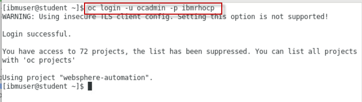

      

2.  Type `oc project websphere-automation` to ensure that you are working in the **websphere-automation** project

    

3. Type `oc get wsa` to verify that IBM WebSphere Automation ready in your environment. 

   **Note:** The output must indicate that the WSA resource **READY** state is **True** before you can continue with the lab.  

    

### 1.3 Use the provided shell script to setup WebSphere Automation

In this section, you run a shell script that performs the setup steps noted above, which are required to use the Fix Deployment features in IBM WebSphere Automation. 

1. Ensure you are in directory where the shell scripts are located. 

        cd /home/ibmuser/WAS-Automation-LabFiles/lab1-CVE

2. Type `sudo yum install sshpass` to install the sshpass tool. This allows commands in the script to be executed without having to enter passwords. When prompted, enter `y` to complete the installation.
  
4. Run the shell script to configure WebSphere Automation:

        ./wsa-setup.sh

    The script runs without any user interaction.  

5. When the script completes, verify that the **test-connection** Ansible playbook ran successfully, as illustrated in the console output. 

    You should see the message **TEST PASSED**, which indicates that WebSphere automation is properly configured. 

    

    <table>
    <tbody>
    <tr class="odd">
    <td></td>
    <td>
<strong>What if the script FAILS?</strong>

    
If the script completed with "TEST FAILED", contact the lab instructor. 

    Then, RE-RUN the script again. 

    Note: you can also run the `oc logs --tail` command that is shown in the console output, which displays the entire log output from the ansible playbook. That log might provide additional insights into the error. 

    </td> 
    </tr>
    </tbody>
    </table>

**You have now completed the WebSphere Automation setup procedures**

If the `wsa-setup.sh` script completed with **TEST_PASSED**, you can proceed with the lab.

 

## 2.0 Accessing the WebSphere Automation UI

A WebSphere administrator sets up WebSphere Automation by registering and configuring WebSphere Application Servers and WebSphere Liberty servers. 

For this lab, WebSphere Automation is pre-installed on an OpenShift cluster. You have your individual WebSphere Automation installation. Let’s access your environment.

1.  On the *Student VM*, open a browser and enter the following URL (there is a WebSphere Automation link on bookmark toolbar):
    
  	 <a href="https://cpd-websphere-automation.apps.demo.ibmdte.net/zen/#/homepage">https://cpd-websphere-automation.apps.demo.ibmdte.net/zen/#/homepage</a>

    
	
	 

2.  On the login page, select the **OpenShift authentication** as the authentication type.

    **Note:** Enlarge the browser window until you see the graphics, as illustrated below. 

     
 
    **Note:** If necessary, accept all the browser security warnings and certificates. In Firefox, click **Advanced**, and then scroll down and click **Accept the risk and continue**. 

     
	
3. Select **htpasswd** as the login selection
  
    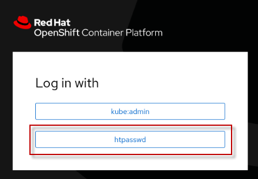
	
	 

4.  Enter **ibmadmin** as username and **engageibm** as password. And click **Log In**.

    

     

     If a Welcome pop-up window appears, click the upper right corner of the pop-up window to dismiss it. You should see **IBM Automation** in the upper left corner of the page. If instead, you see the **"IBM Cloudpak | Administration"** page, go to the **IBM Automation** page by using these steps:  

    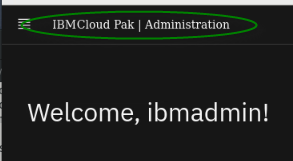

    a. In the upper right corner, click on the **cloudpak switcher** icon

    

    b. Select **IBM Automation (WebSphere Automation)** from the menu

    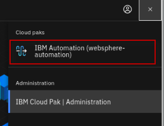

5.  At this point, you should be at the ***IBM Automation Welcome page*** 

    

     
	
6.  View the Application Runtimes that are registered with IBM Automation.

    a. Click the menu icon in the upper left corner of the page.

      

    b. Click **Operate**, and then select **Application runtimes**.
  
    Application Runtimes represent the Traditional WebSphere and WebSphere Liberty servers that are registered with IBM Automation.

      

       

7. The **Application runtimes – Security** page appears. There is no data displayed because no WebSphere or Liberty servers are registered yet.

    |         |           |  
    | ------------- |:-------------|
    |    | <strong>IMPORTANT:</strong>    If any of the labels on the page do nt display properly, refresh the browser window by using the web browser refresh icon.     For example: The label for the **Fix management** tab might display as **!Fix management!** the first time. Refreshing the browser window results in the labels displaying correctly.     Note: This is only a one-time action. 

     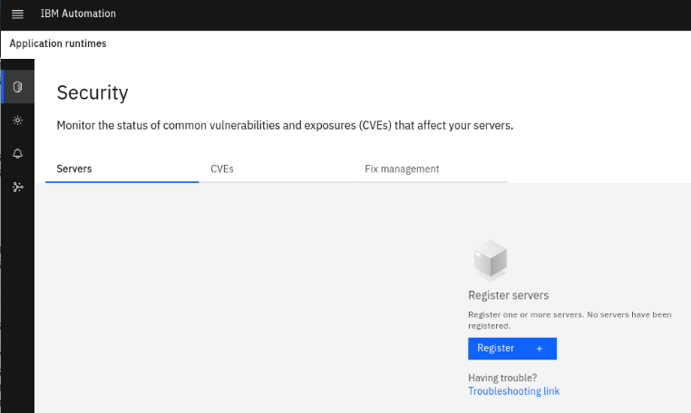

     

###  2.1 Receiving security & event notifications via email

Before you register WebSphere servers with WebSphere Automation, you can configure email addresses to receive notifications when: 

  - New vulnerabilities are discovered in WebSphere servers that are registered with IBM WebSphere Automation
  - iFixes or Fixpacks are installed or uninstalled
  - Instana observability detects memory issues and WebSphere Automation triggers a diagnosis of the event

1.  Add your email address as a receiver of event notifications.
    
    a. Select the **Notifications** menu item from the navigation list.
    
    b. Click the **Email addresses** tab to add the email address where notifications of new CVEs are delivered.

    
	
	 
	
2.  The Email server configuration is pre-configured for this lab. You only need to add your personal email to receive notifications.
    
    a. Click **Add**.
    
    b. Enter your email address.
    
    c. Click **Save**.

    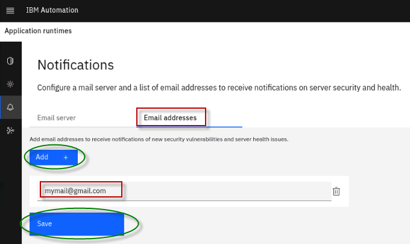

**Great\!** Your email is configured to receive event notifications.

In the next section, you register servers to WebSphere Automation.

 

## 3.0 Register WebSphere Application Server with IBM WebSphere Automation 

In this section, you run a Linux shell script to automatically register a WebSphere Application Server to IBM WebSphere Automation. 

The Linux shell script obtains the necessary information as described below. Then, the script runs a `wsadmin` script to register the WebSphere Application Server.  

WebSphere Application Servers and WebSphere Liberty servers are added to WebSphere Automation by registering them with the *usage metering* service.

To register your application servers with the usage metering service, it requires the following usage metering details. The script you  run gathers this information. 

  - **URL**: The URL of the usage metering service in WebSphere Automation. This service registers WebSphere Application Server and Liberty servers with WebSphere Automation so that you can track security vulnerabilities.

  - **API Key**: The token that is used to authenticate the WebSphere Application Server and Liberty servers during the registration process.

  - **Usage metering certificate**: The certificate that contains the public key. This key allows a WebSphere Liberty server that is registering with WebSphere Automation to do an SSL handshake with the metering service.

In this section, you run the `register-was-server.sh` script to register a WebSphere Application Server, version 9.0.5.7. 

1.  Minimize the browser window and open a new terminal window.

    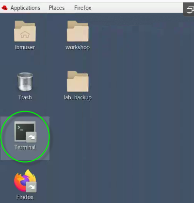
	
	
2. Run the `register-was-server.sh` script to register the WebSphere server with IBM WebSphere Automation

    a. Change directory to the location of the script:
        
        cd /home/ibmuser/WAS-Automation-LabFiles/lab1-CVE

    b. Run the script, passing in the parameter `9057` to register the WebSphere version 9.0.5.7 server in this lab environment. 

        ./register-was-server.sh 9057    

    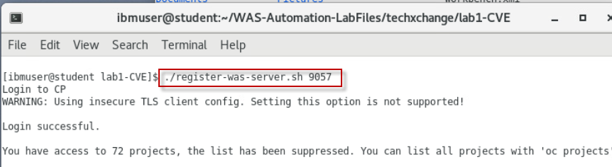
        
    Once the script completes, you see the message indicating that the WebSphere server was successfully registered. 

   

   At this point, the newly registered server is automatically added to the WebSphere Automation dashboard in the UI. 

3. View the newly registered WebSphere server in WebSphere Automation Dashboard

    a. Open the browser and go to the tab where the WebSphere Automation dashboard is displayed. 

    > Note: the URL is: https://cpd-websphere-automation.apps.demo.ibmdte.net/websphereauto/security
    
    c. Go to the WebSphere Automation **Security -> Servers** dashboard, and confirm that the tWAS v9.0.5.7 server is registered in IBM Automation.

    > Note: It might take 15 - 30 seconds for the server to be displayed in the WebSphere Automation UI.

    

 
4.  Check your email. A mail notification is sent that shows new vulnerabilities for the registered application server.

    

	|         |           |  
    | ------------- |:-------------|
    |    | <strong>Information:</strong>  In the email message, there is a link that redirects to the console to show more details about the vulnerability. However, due to network restrictions in the lab environment, this link does not work. 

     

  
Click to expand: Section 4 - Proactive CVE protection for WebSphere with IBM WebSphere Automation

  
## 4.0 Proactive CVE protection for WebSphere Application Server 

### 4.1 Business Context for this scenario

You are a WebSphere Administrator, part of a WebSphere Operations Team that is responsible for maintaining security compliance of the WebSphere estate in the enterprise. 

A typical “as-is” process for maintaining security compliance for WebSphere environments is often a very manual and time consuming process. 

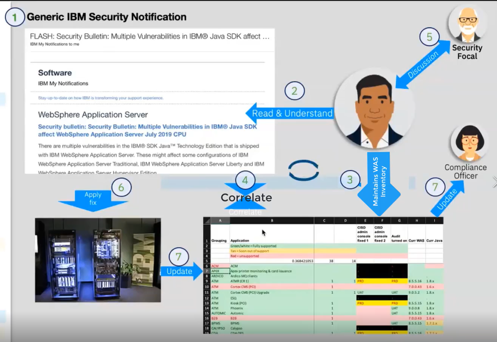

 This is where **IBM WebSphere Automation** can help\!

With WebSphere Automation, you have:

  - **Management dashboard:** A Consolidated dashboard increases awareness and response time to common vulnerabilities and exposures (CVEs).

  - **Automated vulnerability tracking:** Let WebSphere Automation track new security bulletins across your existing traditional WebSphere and Liberty environments, on virtual machines or containers.

  - **Contextual notifications:** Receive security bulletin notifications only when new vulnerabilities affect the environment you manage, reducing noise and interruptions to the WebSphere operations team.

  - **Shared, live visibility to key stakeholders:** WebSphere operators and security compliance teams can see the real-time security posture of the WebSphere estate, accelerating action and minimizing the risk of miscommunication.

  - **Fix History:** A complete audit trail for when vulnerabilities are detected, and when patches or upgrades are applied to resolve issues
  
  - **Automated fix installation of Fixpaks and iFixes** to your WebSphere and Liberty servers, directly from the IBM WebSphere Automation dashboard. 

In this section, you use the IBM WebSphere Automation to demonstrate its powerful capabilities for proactive CVP protection for WebSphere. 

### 4.2 How IBM WebSphere Automation automatically manages your WebSphere and Liberty server security posture 

WebSphere administrators register their WebSphere Application Server or Liberty servers with WebSphere Automation. 

The WebSphere Automation *vulnerability manager* makes an assessment of the security compliance status of each server. Common vulnerabilities or exposures (CVEs) for each server are displayed in the WebSphere Automation UI in an interactive list, and each server is assessed a risk level. Administrators can learn more about the pertinent CVEs, plan their response, and complete the application of the required security fixes to their managed servers by using the WebSphere Automation UI.

When the IBM Product Security Incident Response Team (PSIRT) publishes new or updated security bulletins, the WebSphere Automation *CVE/PSIRT monitor* detects them and collects the data about the CVEs from the bulletins. The WebSphere Automation vulnerability manager checks the applicability of the new CVEs to the registered servers. If exposures are found, the WebSphere Automation vulnerability notifier sends email notifications to a customizable list of addresses that new vulnerabilities exist.

After defining an exposure mitigation plan, administrators can then use the WebSphere Automation UI to select published fix packs or interim fixes to repair vulnerabilities. During the fix installation process, WebSphere Automation requests the selected fix from IBM Fix Central, stores it in the Kafka data store, and then installs it on the indicated server.

 

### 4.3 Working with Traditional WebSphere servers with IBM Automation – Security Vulnerabilities

You can view the security vulnerability status of each server in your inventory from the **Security** page in the WebSphere Automation UI. 
For each server, the numerical risk level in the range 0 - 10 represents the highest CVSS value of its CVEs.

You can track security vulnerabilities for your servers from a single user interface (UI) in WebSphere Automation.

In this section of the lab, you do the following tasks: 

  - **Resolve known vulnerabilities in the WebSphere traditional application server**, by using the built-in capabilities in IBM WebSphere Automation to prepare and install the recommended iFix that is documented in the security bulletin for this vulnerability. 

  - **Review the security posture and fix history of the WebSphere application server.**   After applying iFixes or Fixpaks, IBM Automation immediately updates the security information for that application server to show that the critical vulnerabilities are patched. 

   

1.	In the browser, go to the **Security -> Servers** dashboard in WebSphere Automation.

    
 
    You see that this server Risk Level is **10.0**, with **(+## more)** unresolved CVEs. 

    >**Note:** Near the top of that list is the LOG4J vulnerability, known as CVE-2021-44228, with a critical score of **10**.  
 

	|         |           |  
    | ------------- |:-------------|
    |    | <strong>TIP:</strong>  <strong>Note:</strong> New vulnerabilities are discovered constantly, so the number of CVEs discovered might be different than what is shown in the screen capture.
    
     
 
2.  If you have not already done so, check your email. A mail notification was sent showing new vulnerabilities for the registered application server.

    

	|         |           |  
    | ------------- |:-------------|
    |    | <strong>Information:</strong>  In the email message, there is a link that redirects to the console to show more details on the vulnerability. However, due to network restrictions in the lab environment, this link does not work. 

     

### 4.4 Review CVE-2021-44228 to understand the remediation options for the LOG4J vulnerability

In this section, you review the details of the critical (10.0) **CVE-2021-44228** CVE and determine the appropriate remediation options to resolve the CVE.

You apply the iFix that is documented in the IBM security bulletin to resolve the Log4J vulnerability in the traditional WebSphere 9.0.5.7 server, as reported in **CVE-2021-44228**.

1.  Notice in the IBM Automation console that **tWAS 9.0.5.7** is vulnerable to **CVE-2021-44228**.

    

2.  Click **(+ \<NUMBER\> more)** to expand the list of unresolved CVEs. 
    
    IBM Automation also detects additional unresolved CVEs that are related to the Log4J vulnerability, which are highlighted below and documented in the security bulletin.

    
 
    As noted in the IBM security bulletin, which you explore next, there are three CVEs related to the LOG4J vulnerability. A subset is highlighted below in the list of Unresolved CVEs for this WebSphere Application Server.
 
    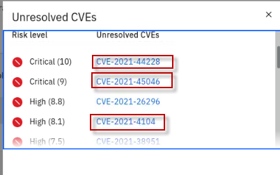

3.  After viewing the complete list of unresolved CVEs for the 9057 server, close the **Unresolved CVEs** view.

4.  View the security bulletins for the **CVE-2021-44228** Log4J vulnerability.

    a.  Click **CVE-2021-44228** link under the 9057 servers **Unresolved CVEs** column.

    

    From the CVE Information page that is displayed, you can see important details about this CVE.

    <u>Here you can see the following details:</u>

    - Risk Level **Critical (10)**

    - Date the vulnerability was detected in the “**registered**” server

    - Number of days the 9057 WebSphere server was **exposed** to the vulnerability

    - List of affected servers that are registered with IBM WebSphere Automation

    - Link to the IBM security bulletin for the CVE

    > **Note:** The **Days Exposed** and **date detected** are expressed from the point of time that the server is registered with IBM WebSphere Automation.

    b.  Click the **View** Link to view the IBM security bulletin for this CVE.

    

    c.  The security bulletin is displayed in a new browser tab.

    d.  Review the security bulletin to learn about the vulnerability, versions of WebSphere affected, and options for remediating the vulnerability.

    
 
    As you can see, IBM WebSphere Automation makes it easy for you to get to the related security bulletins directly from the CVE information within the WebSphere Automation dashboard so you can have all the details and remediation options at your fingertips.

    > **Note:** The IBM Security Bulletin associated with this vulnerability documents the options for remediating CVE-2021-44228 and related CVEs (CVE-2021-4104 and CVE-2021-45046).

    

    You can read the security bulletins from the **ibm.com/support** pages. You are prompted to log in by using your IBM ID to access the content:

    <https://www.ibm.com/support/pages/node/6525706>

    

5.  Return to the browser tab that contains the IBM WebSphere Automation dashboard. Then, return to the **Security** view.

    

### 4.5 Update tWAS server v9.0.5.7 to fix the LOG4J vulnerability

Automated installation of WebSphere and Liberty fixpaks and iFixes was introduced in IBM WebSphere Automation in version 1.4.

You can automatically deploy fixes to servers in your managed server inventory through the WebSphere Automation UI. You must have a user profile with at least the **Modify WebSphere inventory** permission, and the servers that you want to fix must be registered and configured for fix installation with WebSphere Automation.

In this section, you leverage the built-in capabilities in IBM WebSphere Automation to automatically prepare and install the recommended iFix to the traditional WebSphere 9.0.5.7 server to remove the Log4J vulnerability reported as **CVE-2021-44228**.

There are a couple of additional components now included in the product to support this use case:

  - **Fix manager**
    
    The WebSphere Automation *fix manager* uses credentials that you provide to access IBM Fix Central to request fixes. Fixes are fetched and stored in the file storage defined for the `websphereSecure` custom resource. The fix manager manages the storage space according to frequency of use, deleting older fixes to make room for more recently requested fixes.

  - **Installation manager**
  
    The WebSphere Automation *installation manager* communicates with the registered server by using the administrator privileges that you provide. When you initiate the installation of a fix, the installation manager ensures that the target server has sufficient space for the fix, transfers the fix to the target server, installs the fix, and creates a log file of the steps taken. If you request a backup of the server environment as part of the fix installation, the installation manager checks for sufficient disk space on the server, and creates an archive of the Installation Manager, Installation Manager data, and WebSphere Application Server or WebSphere Application Server Liberty server installation directories.

### 4.5.1 Navigate to the Server and unresolved CVE to fix

Apply the recommended iFix to resolve the CVE-2021-44228 vulnerability.

1.  Notice in the IBM Automation console that **tWAS 9.0.5.7** is vulnerable to **CVE-2021-44228**.

    

 
    **Note:** The IBM Security Bulletin associated with this vulnerability documents the options for remediating CVE-2021-44228 and related CVEs (CVE-2021-4104 and CVE-2021-45046) 

    

 
    You fix it by applying the recommended iFix (PH42728).

     

2. Click **tWAS_9057_server** to view the list of CVEs and vulnerabilities.
 
     
    

    The list displays both *resolved* and *unresolved* CVEs for the selected server. It also shows the **Risk Level** to identify the severity of the vulnerabilities, and the number of days the server was exposed to the vulnerability. 

    
 
3. Click **CVE-2021-44228** to view the CVE information and affected servers.

    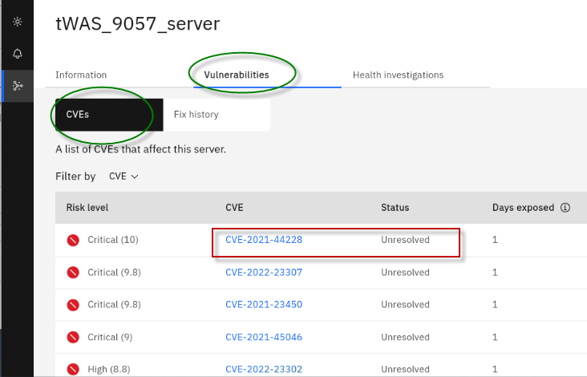

    On the CVE Information page for CVE-2021-44228, a list of **Affected Servers** is displayed along with the option to **Prepare fix**. 

    >**DO NOT prepare fix yet.** You do that in the following steps. 

    
    

### 4.5.2 Prepare Fix 

The *Fix Deployment* capability of WebSphere Automation delivers automation that determines which APARs and interim fixes resolve a specific vulnerability, and enables one-click download and deploy of fixes. 

Selection of the wanted iFix or published fix pack is exposed through the **Prepare fix** dialog, which can be found in the CVE details view. Select the target server to patch and the dialog shows all affected servers that are known to WebSphere Automation, and lets you select the desired fix.

After you select the fix, WebSphere Automation provides two options: 

  - **Fetch fix:** 

    If installation is deferred to a later time, then the **Fetch fix** option causes the fix to be downloaded and stored for later use. 
  
    This might be a preferred option for fix packs because they are significantly larger than interim fixes, especially for traditional WebSphere fix packs.
  
  - **Fetch then install fix:** 

    This option automatically downloads the fix and then installs it after the download is complete. 
  
    Fetched fixes are stored within WebSphere Automation for immediate reuse. 

       

    > Now you can download and install the recommended iFix for the CVE into the tWAS_9057_server.  

1. Download the recommended iFix to resolve the CVE.
 
    Next to each affected server, there is a link to **Prepare Fix**. 
    
    a. Click the **Prepare fix** link next to **tWAS_9057_server** for **CVE-2021-44228**.

    

    b. From the **Select fix** page, select the **PH42728** iFix. Then, click **Fetch fix**. 

    
    |         |           |  
    | ------------- |:-------------|
    |    | <strong>IMPORTANT:</strong>    If the **PH42728** iFix is not listed under the **resolution** column as illustrated in the screen shot below, give WebSphere Automation a few more minutes to load the fix meta-data into its database.      To avoid overloading WebSphere Automation, it only loads the meta-data for unresolved CVEs when a WebSphere or Liberty server is registered. WebSphere Automation only loads the meta-data for the unresolved CVEs of the registered servers.     WebSphere Automation does this by using a background process that spins up several threads. Because there are more unresolved CVEs than the number of threads loading the meta-data, it takes WebSphere Automation a couple of iterations to load all of the meta-data for the fixes.      Typically, the process completes within 8-10 minutes after the server is registered.    WebSphere Automation continues to load fix meta-data as new unresolved CVEs are detected for registered servers.

    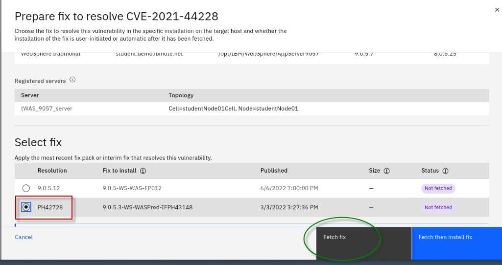

    This action causes WebSphere Automation to fetch the fix from IBM Fix Central, using the credentials that you configured at the beginning of the lab. 

    The **Status** field automatically updates as the action progresses. 

    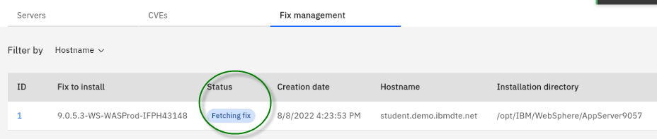

    When the fix is successfully fetched from IBM Fix Central, the status changes to **Ready to Install**.

    

2. Install the fix to resolve the CVE.

    After the fix is successfully fetched, the action to **Install the fix** is made available next to the affected server.

    a. Click **Install fix** next to **tWAS_9057_server**.

    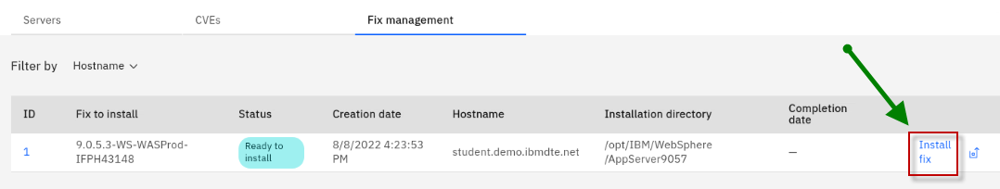

    b. When prompted to confirm the installation, click **Proceed**.

    > **Note:** For this lab, **Create backup** option should be set to **off**.

    c. After installation starts, a new **fix record** is created, and the installation begins.

    
    
    d. The installation can take 5 or 6 minutes to complete. Wait until you see the status change to **Installation complete**.

    

    > **TROUBLESHOOTING TIP**
    > 
    > If the installation fails, click the **ID** of the action and view the `runbook.log` output file. 
    >
    >  Common errors that are reported in the log are the `ssh key` and the `wsa-ansible secret not properly configured in the environment`.  
    >
    > 
    >
    > 

**Congratulations!** You successfully applied the iFix to resolve the critical CVE on the tWAS_9057_server. 

In the next section of the lab, you review the updated security posture and fix history of the WebSphere server. 

 

### 4.6 View the security posture and Fix History of your WebSphere servers

### 4.6.1 Fix history

Information technology operations teams must be responsive to the latest security vulnerabilities. A patching service-level agreement (SLA) requires that an operations team fixes vulnerabilities within 30, 60 or 90 days (or faster) based on vulnerability severity.

Therefore, it is vital to document the date that a vulnerability was detected, and the date that the fix was applied. WebSphere Automation provides a detailed history of fixes applied to each registered server, including information about when each issue was detected, when and how it was fixed, and how many days that servers were exposed.

A record of all detected security vulnerabilities (CVEs) and the resolution status makes it easy to respond to patching SLA inquiries. WebSphere Automation keeps track of when vulnerabilities are detected, when and how they are fixed, and how many days that servers are exposed.

In this section, you review the security posture and fix history of the two traditional WebSphere servers that are used in the lab to demonstrate how WebSphere Automation manages the details, so you can handle your patching SLAs with ease.

Since you applied the PH42762 iFix, now you can examine the updated security posture of the 9057 WebSphere Application Server.

1.  View the **tWAS_9057_server** CVE Information.
    
    a. From the **Security** view in the WebSphere Automation dashboard, click the **tWAS_9057_server** link located under the **Server** column.

    
  
    b.  Select the **Information** tab.

    

    c.  From the **Information** view, you can see the list of Installed iFixes for the 9057 server.

    
 
    > Notice that the **Fixed date** for the iFixes that are related to the Log4J vulnerability shows that they were installed moments ago.
    > 
    > However, there are additional iFixes that do not have a Fixed date. That is because these fixes were already applied to the server prior to it being registered with IBM WebSphere Automation.

    |                                                |                                                                                                                                                                                                                                                                                                                           |
    | ---------------------------------------------- | ------------------------------------------------------------------------------------------------------------------------------------------------------------------------------------------------------------------------------------------------------------------------------------------------------------------------- |
    |  | IBM WebSphere Automation reports ALL iFixes that were applied, regardless of when they were applied. However. It can only determine fix dates, number of days that the server was vulnerable, and vulnerability detected date for servers from the time the WebSphere Application Server is registered with IBM WebSphere Automation. |

2.  View the **tWAS_9057_server** CVE Vulnerabilities details.
    
    a.  From the **tWS_9057_server** view, select the **Vulnerabilities** tab.

    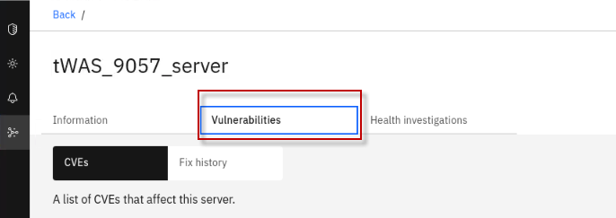

    b. From the list of CVEs, sort by **Status**, and display the **Resolved CVEs** on top.

    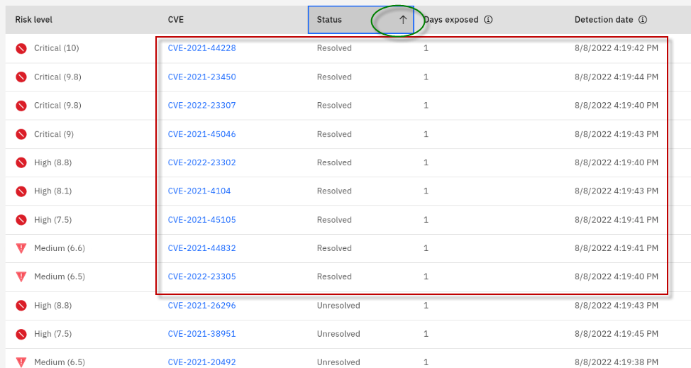
 
    The CVEs that are listed as **Resolved** are related to Log4J CVEs that were fixed by applying the iFix earlier; **CVE-2021-44228** being the most critical CVE listed.
 
    As illustrated above, the **Vulnerabilities view** provides the details about when the vulnerability was detected in this specific server, and how many days the server was exposed to each vulnerability.

3.  View the **tWAS_9057_server** Fix History details.
    
    a.  From the **tWS_9057_server** view, select the **Vulnerabilities** tab.
    
    b. Select **Fix History**, as illustrated below:

    

4.  Notice the Fixes that were applied.

    

    >**Fix history** shows changes to the server. You can see the action that was taken, and in this case, the Fixes were **Installed**. Next to each Fix you can view the CVEs that were resolved by that Fix, and more importantly, the date that the Fix was applied that resolved specific vulnerabilities.

5.  You can also monitor the status of common vulnerabilities and exposures (CVEs) that affect your servers.
    
    a.  Return to the **Security** view. Then, select the **CVEs** category.

    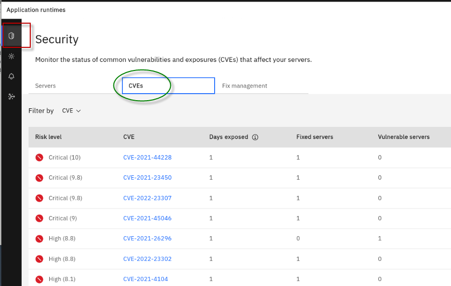
 
    > Using this view, you can easily determine which servers are affected by specific CVEs.
    >  
    > As an example, focus on CVE-2021-44228. This is one of the CVEs that was fixed in the tWAS_9057_server when you applied the iFix earlier in the lab.
    > 
    > This CVEs view helps your team quicky identify how many servers have been fixed, and how many remain exposed to specific CVEs.

    b. View the **CVE-2021-44228** CVE from the current view. Notice that the registered server is patched for this CVE. There are now zero registered servers vulnerable to the CVE. 

    

    In this section you learned how easy IBM WebSphere Automation makes it for your Information technology operations teams to respond to the latest security vulnerabilities, ensuring that there is a record of patching critical CVEs in accordance with your patching service-level agreement (SLA).

    You learned how to use the automated fix deployment capabilities to easily fix vulnerable servers directly from the IBM WebSphere Automation UI. 
    
    You learned how to demonstrate the date that a vulnerability was detected, and the date that the fix was applied. WebSphere Automation provides a detailed history of fixes applied to each registered server, including information about when each issue was detected, when and how it was fixed, and how many days servers were exposed.

**Congratulations!**  You completed the proactive CVE management lab for traditional WebSphere Application Servers.      

  
Click to expand: Section 5 - Detect and trigger investigation of Application Memory Leak with IBM WebSphere Automation

## 5.0 Detect and Address Application Memory Leak with IBM WebSphere Automation and Instana

In this lab, you are going to use a traditional WebSphere Application
Server and a Liberty Server registered with WSA and monitored by Instana
to drive a memory leak investigation.

You are going to use a sample application and a script which is going to
continuously add objects to the heap to create a memory leak event.
Instana will detect such event and will initiate a communication with
WSA to inform that a leak has been detected. Once that is done, WSA will
open an investigation and begin gathering the necessary problem
diagnostic information for that server. You can see the investigation is
opened and the process which it goes through. These processes include:

  - Memory leak detected

  - Identifying server

  - Collecting heap dump

  - Analyzing heap dump

  - Investigation complete

In the end of the investigation, WSA provides an analysis summary which
indicates the likely potential root cause of the memory leak. In this
case it is a vector inside the sample application which is being hosted
by the servlet wrapper. WSA also allow you to simply download all the
files that you need with your application development team or
application vendor so that they could take the action to fix the
application.

At the end of this lab, you will learn how WSA can automatically:

  - detect memory leaks before they cause a crash

  - gather problem determination (PD) information while the leak is in
    progress

  - analyze the PD info and produce a report which can be exported and
    share with app development teams or app vendors.

 ### 5.1 Installing and starting Instana agent

In this section, you install an Instana agent to the **STUDENT**
workstation and start it.

In this lab, you wil install a Linux agent in the `student` VM, where the WebSphere Application Server used in this lab is installed.  

Using the Instana UI, you can select options for installing the agent, such as the `agent mode`, `agent runtime`, and `installation mode`. Doing so, produces a curl command that you run from a Terminal window, to install the Linux agent. 

In this lab, we have provided a simple Linux shell script that installs the Linux agent and configures a `WebSphere` infrastructure zone for monitoring WebSphere Application Server. 

1.  Install the Instana Linux agent on the Student VM

    a.  Open a new Terminal window.
    
    b. Run the following script to install the instana agent

        cd /home/ibmuser/WAS-Automation-LabFiles/lab2-MemoryLeak/techxchange

        ./klp-install-instana-agent.sh
        
    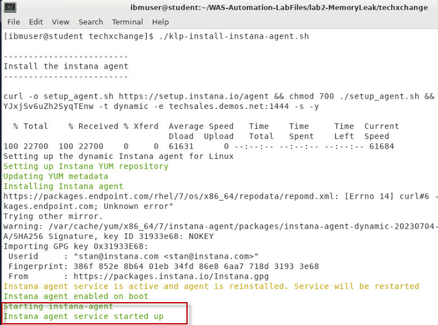
 
     
    The Instana agent is installed in **/opt/instana/agent** directory.

    The script also defined an Instana Infrastructure Zone for WebSphere by enabling the Instana `Hardware & Zone plugin settings` as illustrated below:  
    
    

    > For reference purposes only, Instana's configuration file is located here: `/opt/instana/agent/etc/instana/configuration.yaml`

    Lastly, the script restarted the Instana agent with the updated configuration.

      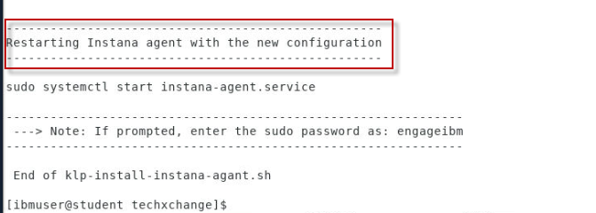

2. Login to the Instana UI

    a.  From the web browser, open a new window and click the `Instana
    bookmark` to access Instana page.

    
 
     The login credentials are:
 
     > E-Mail: **admin@instana.local**
 
     > Password: **qJgN6hS6sE**

3.  Verify the Instana agent installation

    > Note: after the agent is started, it might take a few minutes for the agent to sync with Instana server.

    a. Go back to `Instana administrative console` in the web browser, 
    
    b. Click on the `Infrastructure` icon on the left navigation bar. 
    
    You will see the `WebSphere` infrastructure zone that was configured when you installed the Instana agent using the Linux script.  

    

    c. Click `Time Rage` dropdown button, select `Last 5 minutes` and click `Live`.

    

    After a few minutes, you see that the infrastructure zone you defined is displayed.

    
 
    The Istana agent is now set to monitor the changes in 5 minutes interval, the agent installation is now completed.

### 5.2 Configure WebSphere Automation integration with Instana and WebSphere Servers

WebSphere Automation (WSA) communicates with Instana to receive real-time Instana alerts. 

WSA also accesses the VMs where registered WebSphere servers are hosted to collect problem diagnostic information. 

To do so, a secure ssh connection must be configured between the Instana server and the VM hosting WebSphere Application Servers. 

In this lab, you will run a simple Linux shell script that configures and validates the secure SSH connection,

1. Configure the secure ssh connection between Instana server and the Linux Student VM

    a. Return to the Terminal window in the Student VM.

    b. Run the following script that configures the secure ssh connection and restarts the Instana server.

        cd /home/ibmuser/WAS-Automation-LabFiles/lab2-MemoryLeak/techxchange

        ./klp-instana-setup.sh 

    c. Ensure the script completed with the `TEST PASSED` message. 

    When the script completes the ssh configuration, it tests the secure connection. If the connection is properly configured, the `TEST PASSED` message is displayed. 

    If the test passes, you can continue with the lab.

    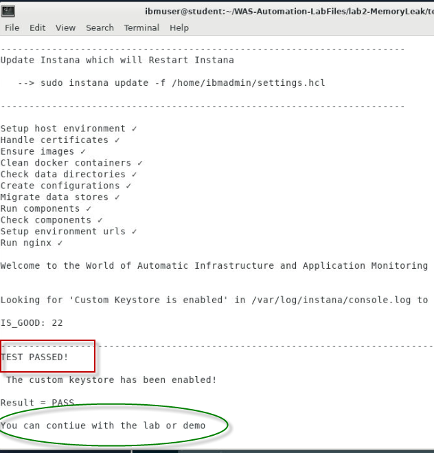

### 5.3 Configure Instana for memory leak alert

This section describes the steps to configure Instana for the memory
leak alert to be used by WebSphere Automation (WSA). 

 You will use the Instana administrative console UI to complete the following activities.

The actives include: 

  - create a custom payload
  - create an alert channel
  - create a custom event
  - create an alert
 
   

1.  Create a custom payload.

    Adding a custom payload to your alert notifications enables you to use Instana alerts more efficiently.

    You can create a custom payload by using the Instana administrative
console or using the Instana API, in the lab, you are using the Instana administrative console.

    a. From the Instana page, go to **`Settings > Team Settings`** page,
    under **`Events & Alerts`**. Then click **`Custom Payload`**.

    

    b. In the **`Key`** field, type **`PID`**, do not use any other value for the key. Set the **`Value type`** to **`Dynamic`**. In
    the **`Value`** field, click **`Select Tag`** and select **`Internal -
    Process ID`**, then click **`Save`**.

    

2.  Gather the WSA information required to set up the Alert Channel.
    
    a. From the Terminal window, run the following **oc** commands to
        get the **Webhook URL** for WebSphere Automation installation.

        oc login --username=ibmadmin --password=engageibm --insecure-skip-tls-verify=true --server=https://api.demo.ibmdte.net:6443
 
        oc project websphere-automation
 
        oc get route cpd -o jsonpath=https://{.spec.host}/websphereauto/health/webhooks/instana/memleak
 
    Your outputs look like this

    <table>
    <tbody>
    <tr class="odd">
    <td>
[ibmuser@student ~]$ oc login --username=ibmadmin --password=engageibm --insecure-skip-tls-verify=true --server=https://api.demo.ibmdte.net:6443

    
Login successful.

    
You have access to 66 projects, the list has been suppressed. You can list all projects with 'oc projects'

    
Using project "websphere-automation".

    
[ibmuser@student ~]$ oc project websphere-automation

    
Already on project "websphere-automation" on server "https://api.demo.ibmdte.net:6443".

    
[ibmuser@student ~]$ oc get route cpd -o jsonpath=https://{.spec.host}/websphereauto/health/webhooks/instana/memleak

    
https://cpd-websphere-automation.apps.demo.ibmdte.net/websphereauto/health/webhooks/instana/memleak
</td>
    </tr>
    </tbody>
    </table>

    The WebSphere Automation Webhook URL is: **https://cpd-websphere-automation.apps.demo.ibmdte.net/websphereauto/health/webhooks/instana/memleak**, you will use it later.

    b. Run the following oc command to get the token for WebSphere
    Automation installation.

        oc serviceaccounts get-token wsa-health-webhooks-apis-sa
 
    The output is shown below, you will use the token value later, when you create the alert channel. 

    <table>
    <tbody>
    <tr class="odd">
    <td>
[ibmuser@student ~]$ oc serviceaccounts get-token wsa-health-webhooks-apis-sa

    
eyJhbGciOiJSUzI1NiIsImtpZCI6InJ1YTJ4VU1JdnRkemdlcFM1M0habGtTcXVuM1hlZlBrY19UUl82QWRWc0kifQ.eyJpc3MiOiJrdWJlcm5ldGVzL3NlcnZpY2VhY2NvdW50Iiwia3ViZXJuZXRlcy5pby9zZXJ2aWNlYWNjb3VudC9uYW1lc3BhY2UiOiJ3ZWJzcGhlcmUtYXV0b21hdGlvbiIsImt1YmVybmV0ZXMuaW8vc2VydmljZWFjY291bnQvc2VjcmV0Lm5hbWUiOiJ3c2EtaGVhbHRoLXdlYmhvb2tzLWFwaXMtc2EtdG9rZW4tc3R3bW4iLCJrdWJlcm5ldGVzLmlvL3NlcnZpY2VhY2NvdW50L3NlcnZpY2UtYWNjb3VudC5uYW1lIjoid3NhLWhlYWx0aC13ZWJob29rcy1hcGlzLXNhIiwia3ViZXJuZXRlcy5pby9zZXJ2aWNlYWNjb3VudC9zZXJ2aWNlLWFjY291bnQudWlkIjoiMzcxNjBjZmYtMTUwNy00MWYyLWFlODgtYjg5MjcxZjJlNzlmIiwic3ViIjoic3lzdGVtOnNlcnZpY2VhY2NvdW50OndlYnNwaGVyZS1hdXRvbWF0aW9uOndzYS1oZWFsdGgtd2ViaG9va3MtYXBpcy1zYSJ9.TVQfRO6E2ZTa4BBSvVgiv-74gbhEG-BVOBu0WaUFG_FBRJsplT6qr_trcsrvyNL9BVrF3kGd4oCqCos8HQGoIO0wEt7DsyePEbIRwL_vn8Jyr_qBr7cHrbWhu4y6EMWCObDWQdZRUsJqtgSLxtTzYqSf6upo_uQczjD5waWLX3gZbeeh5GcyNctFaQPpp_neM6HY-gZJxCSm8o7XmNB1Zcxg-F6ehhdf-0uXDXGYuBKsouWpBatERwBoVL3JgWQTPDUeIJApH9EOlO9LDieb8gaJDbWVB4b1ZsIWdlJg_F5pbWbapRuM8aAlf0HOxCaV84zTifK7J5R2NBf9xxeqrCqMpeSxfR5_Heh9WIl1lviKVn3qeS6aktj6duyu_5lpHw6RQjArcUk5NCxfe7hGS64BaISEbNdfrcYTNqEKeiNmydEuX7PpJaJxHBkmYYbWnZ0BrMaqQ1kUlTcvACs5FsNmbBQ3MOt3hin8dDqC9A1mFA_KlD1Oa1suhuY0DB_8tGwhKsIxFxY9pbKXhmqRl__7oueFxuFxxfvPWanL0WzRsoTJShyhcO6K3oyZPJWC4Cr2I42qo_g_Lth7gBIYRdzFJ63xpNgGUDStTXXcMkfMnm8v-lo5qzsezdgYBb6l152zcS6dA7Ld3502zIpnMx6ZGQadDL8uOSZbK-2CRU0
</td>
    </tr>
    </tbody>
    </table>

3.  Create an alert channel.

    To create an alert channel by using the Instana administrative  console,

    a.  On the Team Settings page, under **`Events & Alerts`**, click **`Alert Channels`**.

    

    b. Click **`Add Alert Channel`** and select **`Generic Webhook`**.

    

    c. On the Create Generic **Webhook Alert Channel** page, enter the name as `WebSphere Automation Healing Webhook` in the **`Name`** field

    d. Enter the **`Webhook URL`** you have for WebSphere
    Automation installation.

        https://cpd-websphere-automation.apps.demo.ibmdte.net/websphereauto/health/webhooks/instana/memleak
 
    

    e. Under **`Custom HTTP Request Headers`**, click **`Add Header`**.

    

    f. Create the following two `request headers`. Then click **`Test Channel`**.

    <table>
    <thead>
    <tr class="header">
    <th>
    <strong>Key</strong>
    </th>
    <th><strong>Value</strong></th>
    </tr>
    </thead>
    <tbody>
    <tr class="odd">
    <td>Content-Type</td>
    <td>application/json</td>
    </tr>
    <tr class="even">
    <td>Authorization</td>
    <td>Token value you get with the oc command in previous step</td>
    </tr>
    </tbody>
    </table>

      
 
     g. Be sure you clicked **`Test Channel`** to test the channel before you proceed. 

    You should see the message showing the channel was successfully triggered.

    

4.  After verifying the channel, click **`Create`** to create it.

    The alert channel is created.
 
    

5.  Create a `custom event`

    A Custom Event enables you to create issues or incidents based on an individual metric of any given entity.
    
    To create a custom event by using the Instana administrative console:

    a. On the Team Settings page, under **`Events & Alerts`**,
    click **`Events`**, then click **`New Event`**.

    

    b. Create a custom event named “**`Memory Usage High`**”. Set its parameters as shown below. 

    **Note:** Refer to screenshot below!

    `1. Event Details`
      - Name: Memory Usage High
      - Description: Memory usage over 80%
      - Issue Severity: Warning
      - Grace Period: 90 s

    `2. Condition`
      - Source: Built-in metrics
      - Entity type: JVM
      - Metric: Memory > Used percentage
      - Time window: 10 s
      - Aggregation: max
      - Operator: >=
      - Percentage: 80

    `3. Scope`
      -  Apply on (required): All available entities

    

    c. Click **`Create`** to create the new custom event.

1.  Create an `alert`.

    An Alert is raised when an event has triggered, such as high memory usage over 80% for some period. 

    To create an alert by using the Instana administrative console,

    a. On the Team Settings page, under **`Events & Alerts`**,
    click **`Alerts`**, then click **`New Alert`**.

    

    b. In the **`Name`** field, type a name for the alert as: **`WebSphere Automation Healing Memory Leak`**.

    

    c. In the **`Events`** menu, select **`Alert on Event(s)`**.

    

    d. In the **`Events`** section, click **`Add Event`**.

    

    e. In the `Add Events window`, enter **`memory usage h`** in the search box and select **`Memory Usage High`**. You can filter the list by using a keyword (for example, leak) to help find the entry in the list.

    Click **`Add 1 Event`**.

    

    f. Add two more events: **`Garbage collection activity high** (for JVM)` and **`Memory leak** (for JVM)`.

    
 
    The event list updated:
 
    

    g.  In the **`Scope`** menu, select **`All available entities`**.

    

    h.  Under **`Alerting`**, click **`Add Alert Channel`**, select the alert channel that you created previously. Then click **`Add 1 Channel`**.

    
 
    

    i. Click **`Create`**.

    
 
    The alert is created. 
 
    

**Now the Instana configuration for memory leak alert is completed**

### 5.4 WebSphere memory leak check with WebSphere Automation

In this section, you run a script to create memory leak incident for an
application running in a WebSphere Application server instance which is
already registered in WebSphere Automation. When WebSphere Automation
detects the memory leak, it automatically conducts the analysis to
identify the root cause.

1.  Run the following Linux shell script to install a memory leak application in WebSphere Application Server and restart the WebSphere application server. 

    a. From the Terminal window,
    run the command below to install the memory leak app and restart the WebSphere application server:

        cd /home/ibmuser/WAS-Automation-LabFiles/lab2-MemoryLeak/techxchange

        
        ./klp-tWAS_configure_MLApp.sh

1.  Login to WebSphere Automation, if you are not already logged in. 

    a.  Open a Firefox web browser

    

    b.  Click WebSphere Automation bookmark

    

    c.  Click OpenShift authentication

    

    d.  Click **htpasswd.**

    

    e.  Enter Username and Password as: **ibmadmin** / **engageibm** and click **Log in**.

    

3.  In the WebSphere Automation UI, click on the **`Health`** icon.

    The `Health` section is where you view and analyze server health problems. 

    
 
    Since all the application are working fine at this time, you do not see anything in the Health page yet.
 
    

4.  In this lab, you can also monitor the WebSphere application server
    memory change in Instana.
    
    a. In **Instana administration console**, click **`Infrastructure`** icon, click
        **`Comparison Table`**, select **`JVMs`** from the dropdown, and click **`bootstrap WAS90.SERV1.`**

    
 
    As you can see, currently there is not any issue with the WAS server.

    

5. Set the `Time Range` to `Last 5 minutes` and click `Live` to see the current state

    

6.  From the Terminal window, run the provided script which will run a sample memory leak application in WebSphere. Instana will immediately show the significant increase in JVM heap usage, which will create an application memory leak event.

        /home/ibmuser/WAS-Automation-LabFiles/lab2-MemoryLeak/techxchange/klp-curl_MLAPP_add_was.sh

    The script output is showing like this:

    <table>
    <tbody>
    <tr class="odd">
    <td>
[ibmuser@student ~]$ /home/ibmuser/WAS-Automation-LabFiles/lab2-MemoryLeak/techxchange/klp-curl_MLApp_add_was.sh

    
Increased heap usage by 25MB

    
Increased heap usage by 50MB

    
Increased heap usage by 75MB

    
Increased heap usage by 100MB

    
Increased heap usage by 125MB

    
Increased heap usage by 150MB

    
Increased heap usage by 175MB

    
Increased heap usage by 200MB

    
Increased heap usage by 225MB

    
Increased heap usage by 250MB

    
Increased heap usage by 275MB

    
Increased heap usage by 300MB

    
Increased heap usage by 325MB
</td>
    </tr>
    </tbody>
    </table>

7.  In the Instana page, you can see that the memory is increasing steadily, and one issue is detected.

    

8.  Go back to the WebSphere Automation UI. You see that WebSphere Automation has received the Memory leak alert and activate its investigation on the issue. 

    Initially you might see the Server `Not identified yet` status and soon you see the server name is identified. 

    
    
    a. Click the **`Investigating`** link to view its details.

    

9.  The Investigating section lists the problem, status, Server, Host
    and Cell information, why the investigation is started and the
    investigation history. 
    
    a. Click the **View history** dropdown to see current investigation activities

    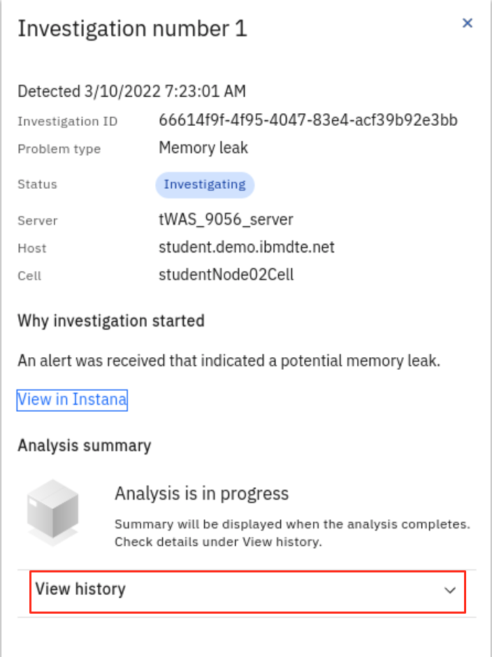

    The WSA memory leak investigation activities include:

    - Memory leak detected
    - Identifying server
    - Collecting heap dump
    - Analyzing heap dump
    - Investigation complete

    The screenshot below shows that the investigation is in process.
 
    

10. If you check your email, you should have received a WSA notification like the following for the issue.

    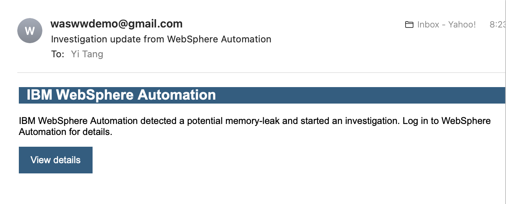

11. After a few minutes, the WebSphere Automation investigation is completed. You can see the analysis summary which points to the root cause of the issue.
    
    You can also click **`Download all files`** to get the analysis
    reports, heap dumps and WebSphere Automation runbooks on your workstation.

    

    

    

    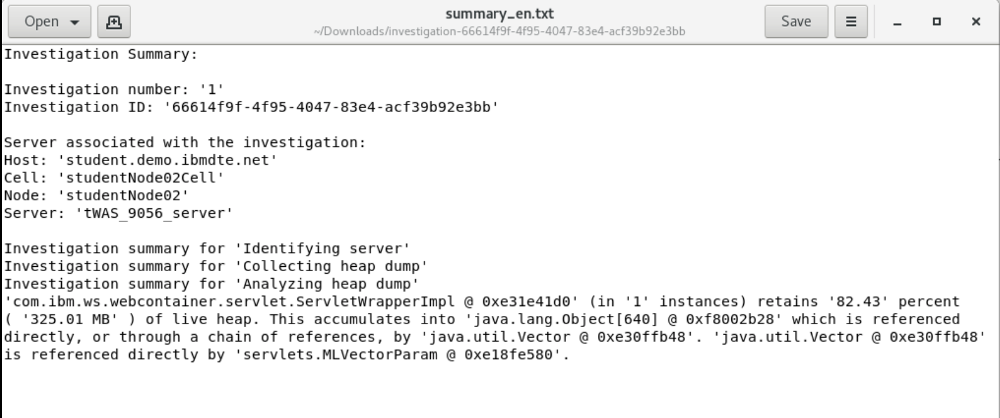

12. Now WSA has successfully detected and analyzed WAS memory leak
    issue, it has sent you another email to confirm that.

    

13. you can run a script to reduce the heap usage and then stop the WAS
    server with the commands:

        /home/ibmuser/WAS-Automation-LabFiles/lab2-MemoryLeak/techxchange/klp-curl_MLAPP_removeLast.sh

        /opt/IBM/WebSphere/AppServer9057/bin/stopServer.sh tWAS_9057_server

# Summary

**Congratulations!** You have completed the WebSphere Automation Memory
Leak Detection lab.

With automated tooling and insights, IBM WebSphere Automation enables
teams to modernize and secure IT estates, adapt and respond to incidents
efficiently, and optimize WebSphere operations. WebSphere system
operators and administrators can reduce the cost, effort, and risk of
addressing vulnerabilities, automate critical activities, and preserve
uptime with early detection, notification, and remediation of incidents.

IBM WebSphere Automation helps teams remove manual toil to work less on
maintenance tasks and more on strategic activities, while unlocking new
value, extending the life, and increasing ROI of WebSphere investments.

IBM WebSphere Automation is part of IBM Automation, a set of shared
automation services that help you get insight into how your processes
run, visualize hotspots and bottlenecks, and use financial impact
information to prioritize which issues to address first.

To learn more about IBM WebSphere Automation, visit
[ibm.com/cloud/websphere-automation](http://ibm.com/cloud/websphere-automation)

