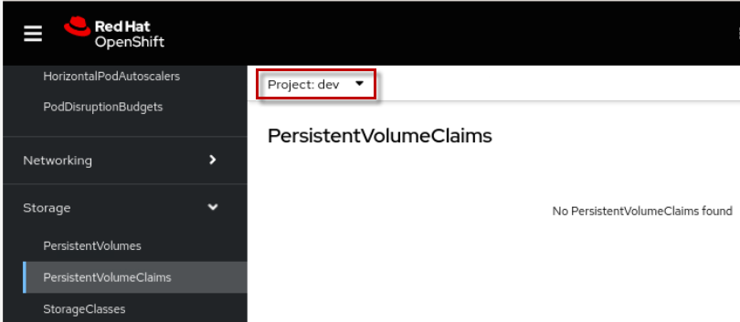
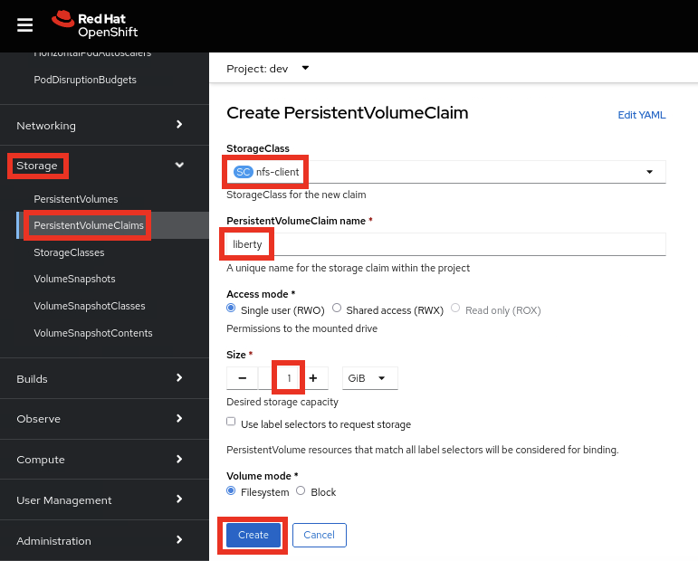
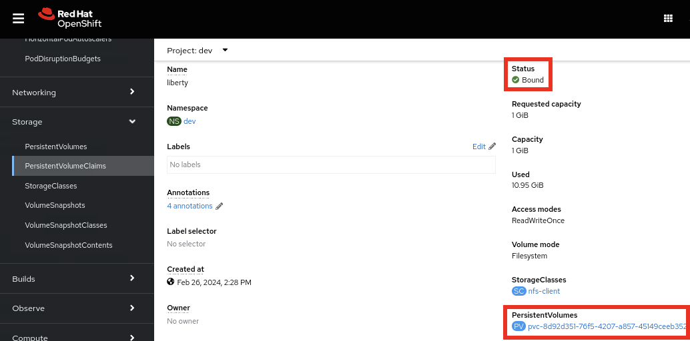
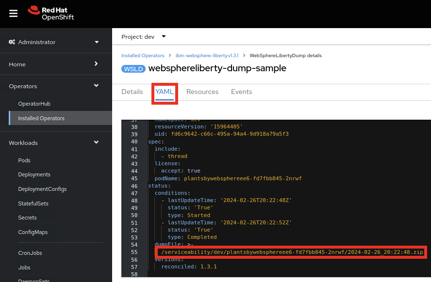

# Liberty Day-2 Operations in containers

 

**Last updated:** March 2024

**Duration:** 45 minutes

Need support? Contact **Kevin Postreich, Yi Tang**

## Intoduction

In this lab, we will introduce you to the basics of day 2 operations in containers on OpenShift. We will:

- Deploy an example application using the WebSphere Liberty Operator
- Use the built-in day 2 diagnostic capabilities of the WebSphere Liberty Operator including server dump and diagnostic trace
- Delete the operator-managed application and directly deploy an application
- Perform day 2 diagnostic steps directly on the running application including server dump and diagnostic trace
- Download diagnostic data locally

## Accessing the environment

If you are doing this lab as part of an instructor led workshop (virtual or face to face), an environment has already been provisioned for you. The instructor will provide the details for accessing the lab environment.

Otherwise, you will need to reserve an environment for the lab. You can obtain one here. Follow the on-screen instructions for the “**Reserve now**” option.

<https://TBD-to-the-reservation-link>

The lab environment contains six (6) Linux VMs. 


<br/>

1.  Access the lab environment from your web browser. 
     
    A `Published Service` is configured to provide access to the **`Workstation`** VM through the noVNC interface for the lab environment.
    
    a. When the demo environment is provisioned, click on the **`environment tile`** to open its details view. 

    b. Click on the **`Published Service`** link which will display a **Directory listing**  
    
    c. Click on the **`vnc.html`** link to open the lab environment through the **noVNC** interface. 
    
    
    
    d. Click the **`Connect`** button 
    
      


    e. Enter the password as:  **`passw0rd`**. Then click the **`Send Credentials`** button to access the lab environment. 

    > Note: That is a numeric zero in passw0rd  

      

	 
	 <br>
	 
2.  If prompted to Login to the "workstation" VM, use the credetials below: 

    The login credentials for the **workstation”** VM is:
 
     - User ID: **techzone**

     - Password: **IBMDem0s!**

     > Note: That is a numneric zero in the password

	 <br>
 
     
	 
	 <br>

## Tips for working in the lab environment     

1. You can resize the viewable area using the **noVNC Settings** options to resize the virtual desktop to fit your screen.

    a. From the environemnt VM, click on the **twisty** on the noNC control pane to open the menu.  

    

    b. To increase the visible area, click on `Settings > Scaling Mode` and set the value to `Remote Resizing`
      
     


2.  You can copy / paste text from the lab guide into the lab environment using the clipboard in the noVNC viewer. 
   
    a. Copy the text from the lab guide that you want to paste into the lab environment
    
    b. Click the **Clipboard** icon and **paste** the text into the noVNC clipboard

    
    
    c. Paste the text into the VM, such as to a terminal window, browser window, etc. 

    d. Click on the **clipboard** icon again to close the clipboard

   
3. An alternative to using the noVNC Copy / Paste option, you may consider opening the lab guide in a web browser inside of the VM. Using this method, you can easily copy / paste text from the lab guide without having to use the noVNC clipboard. 


    <br>

## Building and deploying the application

1. Open a new `Terminal` window on the Desktop VM:
   
    
   
    <br/>
   
2. If you have not yet cloned the GitHub repo with the lab artifacts, in a previous lab, run the following command on your terminal:

```   
  cd /home/techzone
		
  git clone https://github.com/IBMTechSales/appmod-pot-labfiles.git 
```

3. Change directory to:  `appmod-pot-labfiles/labs/Day2/scripts`


        cd /home/techzone/appmod-pot-labfiles/labs/Day2/scripts

4. Run the script to build and deploy the PlantsByWebSphere application to the "dev" namespace:
   ```
   ./day2.sh
   ```

## Day-2 Operations (Hands-on)

It is often necessary to gather server **logs**, **traces** and/or **dumps** for analyzing some problems with an application. The [WebSphere Liberty Operator](https://www.ibm.com/docs/en/was-liberty/core?topic=operator-websphere-liberty-overview) makes it easy to gather these on a server running inside a container. You can also gather these files without the WebSphere Liberty Operator. Both scenarios will be covered in this lab.

### Day-2 Operations with the WebSphere Liberty Operator

Storage must be configured so the generated artifacts can persist, even after the pod is deleted. This storage can be shared by all instances of the operator-managed applications. Red Hat OpenShift on IBM Cloud utilizes the storage capabilities provided by IBM Cloud.

In the lab environment, you will attach storage using the storage class backed by NFS storage that we configured for the lab environment. 

First, let's create a request for storage.

#### Request storage (Hands-on)

1. Login to OpenShift console

    a. Open a new tab in the web browser

    b. Click on the `OpenShift Console bookmark` on the bookmark toolbar

    c. Login credentials:

    - Username: `ocadmin`

    - Password: `ibmrhocp`


2. In the OpenShift console, from the left-panel, select **Storage** > **Persistent Volume Claims**.

3. Switch to the `dev` project  

    a. From the `Project` drop-down list, select `dev`. 

    

5. Click on the **Create Persistent Volume Claim** button.

    

6. Ensure that **Storage Class** is `nfs-client`. If not, select it from the list.

7. Enter `liberty` for the **Persistent Volume Claim Name** field.

8. Request **1 GiB** by entering `1` in the text box for **Size**.

9. Click on **Create**.

    

10. The created Persistent Volume Claim will be displayed. Wait for the **Status** field to change from `Pending` to `Bound`. It may take 1-2 minutes.

11. Once bound, you should see the volume displayed under the **Persistent Volume** field.

    


#### Enable serviceability (Hands-on)

Now, let's enable the serviceability option for the application. It's recommended that you do this step during initial deployment of the application - not when you encounter an issue and need to gather server traces or dumps. 

OpenShift cannot attach volumes to running Pods. It'll have to create a new Pod, attach the volume, and then take down the old Pod. If the problem is intermittent or hard to reproduce, you may not be able to reproduce it on the new instance of server running in the new Pod. 

The volume can be shared by all Liberty applications that are in the same namespace and won't be used unless you perform day-2 operation on a particular application. This makes it easy to enable serviceability with initial deployment.

1. Specify the name of the storage request (Persistent Volume Claim) you made earlier to the `spec.serviceability.volumeClaimName` parameter provided by the `WebSphereLibertyApplication` custom resource. The WebSphere Liberty Operator will attach the volume bound to the claim to each instance of the server. 

     In your terminal, run the following command:
     ```
     oc patch wlapp plantsbywebsphereee6 -n dev --patch '{"spec":{"serviceability":{"volumeClaimName":"liberty"}}}' --type=merge
     ```
    
 	 - This patches the definition of `wlapp` (shortname for `WebSphereLibertyApplication`) instance `plantsbywebsphereee6` in namespace `dev` (indicated by `-n` option). 
       - The `--patch` option specifies the content to patch with. In this case, we set the value of `spec.serviceability.volumeClaimName` field to `liberty`, which is the name of the Persistent Volume Claim you created earlier. 
       - The `--type=merge` option specifies to merge the previous content with the newly specified field and its value.

2. Run the following command to get the status of the `plantsbywebsphereee6` application. Verify that the changes were reconciled and there are no errors:

    ```
    oc get wlapp plantsbywebsphereee6 -n dev -o wide
    ```
    Example output:
    ```
    NAME                   IMAGE                                                             EXPOSED   RECONCILED   RECONCILEDREASON   RECONCILEDMESSAGE   RESOURCESREADY   RESOURCESREADYREASON       RESOURCESREADYMESSAGE            READY   READYREASON   READYMESSAGE                                         AGE
    plantsbywebsphereee6   default-route-openshift-image-registry.apps.ocp.ibm.edu/dev/pbw   true      True                                                True             MinimumReplicasAvailable   Deployment replicas ready: 1/1   True                  Application is reconciled and resources are ready.   110m
    ```
    The value under `RECONCILED` should be `True`. 
    
    >**Note:** If the `REONCILED` value is `False`, then an error occurred. 

    The `REASON` and `MESSAGE` columns will display the cause of the failure. 
    
    A common mistake is creating the Persistent Volume Claim in another namespace. Ensure that it is created in the `dev` namespace.

3. In the OpenShift console, from the left-panel, click on **Workloads** > **Pods**. Wait until there is only 1 pod on the list and its **Ready** column says 1/1.

4. Click on this pod.

    

5. The pod's name is needed for requesting server dump and trace in the next sections. Scroll down and copy the value under the **Name** field.

    **Tip:** The pod name will begin with `plantsbywebsphereee6-`   

    

#### Request server dump (Hands-on)

You can request a snapshot of the server including different types of server dumps, from an instance of WebSphere Liberty server running inside a Pod, using WebSphere Liberty Operator and `WebSphereLibertyDump` custom resource (CR). 

Use the following steps to request a server dump:

1. From the left-panel of the OpenShift console, click on **Operators** > **Installed Operators**.

2. From the **WebSphere Liberty Operator** row, click on `WebSphere Liberty Dump` (displayed under the **Provided APIs** column).

3. Click on the **Create WebSphereLibertyDump** button. 

4. Accept the license

    a. Click the `>` next to the licence file to expand the section

    b. CLick the `Accept` chckbox to accept the license
 
6. Replace `Specify_Pod_Name_Here` in the **Pod Name** text field with the pod name you copied earlier.

7. The **Include** field specifies the type of server dumps to request. Let's use the `thread` value only by expanding `Include` and clicking `Remove include` for the second `heap` section.

8. Click on the **Create** button.

9. Click on `websphereliberty-dump-sample` from the list.

10. Scroll-down to the **Conditions** section and you should see `Started` status has value `True`. Wait for the operator to complete the dump operation. You should see status `Completed` with value `True`.

Once the dumps are completed, a zipfile containing the **logs**, **configuration** and **thread dump** is created on the storage volume that was attached to the pod. 

From inside of the pod, the dumpfile is in the `/serviceability/dev` folder, as illustrated below. 
  
  

Additionally, the dumpfile is persisted in the storage location defined by the persistent volume claim.  In this case, the storage is on a separate NFS server. 

#### Request server traces (Hands-on)

You can also request server traces from an instance of WebSphere Liberty server running inside a Pod using the `WebSphereLibertyTrace` custom resource (CR).

Use the following steps to request a server trace:

1. From the left-panel of the OpenShift console, click on **Operators** > **Installed Operators**.

2. From the **WebSphere Liberty Operator** row, click on `WebSphere Liberty Trace`.

3. Click on the **Create WebSphereLibertyTrace** button.

4. Accept the license

    a. Click the `>` next to the licence file to expand the section
    
    b. CLick the `Accept` chckbox to accept the license

5. Replace `Specify_Pod_Name_Here` under the **Pod Name** text field with the pod name you copied earlier.

6. The **Trace Specification** field specifies the trace string to be used to selectively enable trace on Liberty server. Let's use the default value. 

7. Click on the **Create** button.

8. Click on `websphereliberty-trace-sample` from the list.

9. Scroll-down to the **Conditions** section and you should see `Enabled` status has value `True`. 


**Additional notes:** 

   - Once the trace has started, it can be stopped by setting the `disable` parameter to true. 
   - Deleting the CR will also stop the tracing. 
   - Changing the `podName` will first stop the tracing on the old Pod before enabling traces on the new Pod. 
   - Maximum trace file size (in MB) and the maximum number of files before rolling over can be specified using `maxFileSize` and `maxFiles` parameters.

#### Accessing the generated files (Hands-on)

The generated trace and dump files should now be in the persistent volume. You used storage from the NFS Server that is included in the lab environment. 

In this lab environment, the NFS server is on the **nfs** VM. You will not access that VM in this lab. However, since the volume is attached to the Pod, you can instead use the Pod's terminal to easily verify that the trace and dump files are present.

1. Remote shell to your pod via one of two ways:
    
	- From your terminal:
      ```
	  oc get pods
      oc rsh <pod-name>
      ```
  
    - OR, From OpenShift console: click on **Workloads** > **Pods**. Click on the pod and then click on the **Terminal** tab. 
 
2. Enter the following command to list the files inside of the container runinng in the pod:
    ```
    ls -R /serviceability/dev
    ```
    Example output:
    ```
    /serviceability/dev:
    plantsbywebsphereee6-fd7fbb845-2nrwf
    
    /serviceability/dev/plantsbywebsphereee6-fd7fbb845-2nrwf:
    2024-02-26_20:22:48.zip  messages.log	trace.log
    ```
    The shared volume is mounted at the `serviceability` folder. The sub-folder `dev` is the namespace of the Pod. You should see a zip file for dumps and trace log files. These are produced by the day-2 operations you performed.

3. Exit the pod:
   ```
   exit
   ```

### Day-2 Operations without the WebSphere Liberty Operator

This part of the lab will cover how to gather dumps and traces without the Liberty Operator, or in the case that a Liberty Operator application has not been configured with persistent serviceability storage.

#### Create standard Kubernetes application

First we will delete the WebSphere Liberty Application created previously and create a standard Kubernetes application:

1. Delete the previous operator application:
   ```
   oc delete wlapp plantsbywebsphereee6
   ```
2. Create the Deployment, Service, and Route:
   ```
   oc apply -f /home/techzone/appmod-pot-labfiles/labs/Day2/plantsbywebsphereee6.yaml
   ```

The application should now be running as it was before but this time using a Kubernetes Deployment, Service and Route that is not managed by the WebSphere Liberty Operator.

#### Request server dump manually (Hands-on)

You can request a snapshot of the server including different types of server dumps by running commands in the pod and downloading the results.

1. Remote shell to your pod via one of two ways:
    
	- From your terminal:
      ```
	  oc get pods
      oc rsh <pod-name>
      ```
  
    - OR, From OpenShift console: click on **Workloads** > **Pods**. Click on the pod and then click on the **Terminal** tab. 
2. Run the command to start the server dump:
   ```
   /opt/ibm/wlp/bin/server dump defaultServer --include=thread
   ```
3. After some time, a message should be written with the resulting zip file; for example:
   ```
   Dumping server defaultServer.
   Server defaultServer dump complete in /opt/ibm/wlp/output/defaultServer/defaultServer.dump-24.02.27_15.40.39.zip.
   ```
4. Finally, let's download the zip file. First exit the pod:
   ```
   exit
   ```
5. Then, use the `oc cp` command, replacing the pod name and the zip path and zip name from the output above:
   ```
   oc cp <pod-name>:<zip-path> <zip-name>
   ```
   For example:
   ```
   $ oc cp plantsbywebsphereee6-7c96f58946-dlbqd:/opt/ibm/wlp/output/defaultServer/defaultServer.dump-24.02.27_15.40.39.zip defaultServer.dump-24.02.27_15.40.39.zip
   tar: Removing leading `/' from member names
   ```
   ___
   
   **Note:** Ignore the message: 
   
   tar: Removing leading `/' from member names
   ___   

   Now the zip file is downloaded locally.

#### Request server traces manually (Hands-on)

Use the following steps to enable a server trace:

1. Remote shell to your pod via one of two ways:
    
	- From your terminal:
      ```
	  oc get pods
      oc rsh <pod-name>
      ```
  
    - OR, From OpenShift console: click on **Workloads** > **Pods**. Click on the pod and then click on the **Terminal** tab. 
    - 
2. Print the trace configuration into a config dropin file; for example:
   
   **Tip:** Run the command from inside the pod

   ```
   echo '<?xml version="1.0" encoding="UTF-8"?><server><logging traceSpecification="*=info:com.ibm.ws.webcontainer*=all" maxFileSize="100" maxFiles="10" /></server>' > /config/configDropins/overrides/trace.xml
   ```
3. Make a request to the application to cause some trace to be generated:
  
   **Tip:** Run the command from inside the pod

   ```
   curl http://localhost:9080/PlantsByWebSphere/
   ```
4. Verify that traces have been started by listing the logs directory and noting the existence of a `trace.log` file:
   ```
   ls -l /logs/
   ```
5. Example output showing `trace.log`:
   ```
   $ ls -l /logs/
   total 280
   -rw-r-----. 1 1000740000 root  23181 Feb 27 15:46 messages.log
   -rw-r-----. 1 1000740000 root 211814 Feb 27 15:46 trace.log
   ```
6. Disable the trace by deleting the config dropin:
   ```
   rm /config/configDropins/overrides/trace.xml
   ```
7. Finally, let's download the trace. First exit the pod:
   ```
   exit
   ```
8. Then, use the `oc cp` command, replacing the pod name:
   ```
   oc cp <pod-name>:/logs/trace.log trace.log
   ```
   For example:
   ```
   $ oc cp plantsbywebsphereee6-7c96f58946-dlbqd:/logs/trace.log trace.log
   tar: Removing leading `/' from member names
   ```
   ___
   
   **Note:** Ignore the message: 
   
   tar: Removing leading `/' from member names
   ___   
   
   Now the `trace.log` file is downloaded locally.

## Summary

Congratulations! You've completed the **Day-2 Operations** lab! 
